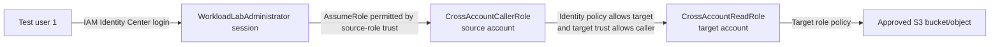
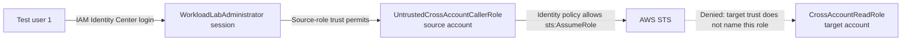

# Week 2 Exercise 1 Setup and Execution

This guide covers Exercise 1 resources, execution, authorization tests,
evidence, and cleanup. Complete the [Week 2 shared setup](../week2-setup.md)
before using this guide. Browser and device-code authentication behavior is
documented in [AWS CLI IAM Identity Center authentication](../../../sso_auth.md).

## Introduction

### Goals

This exercise demonstrates how AWS evaluates a two-stage, cross-account role
chain. The objective is to prove that cross-account access requires compatible
authorization on both sides of the account boundary:

```text
Source-side identity permission
  +
Target-side role trust
  +
Target role's effective permissions
  =
Successful cross-account access
```

You will observe that:

- IAM Identity Center provides short-lived credentials for the initial human
  sessions;
- a source-account role can call `sts:AssumeRole` only for an explicitly named
  target role;
- the target role trusts one approved source role rather than the entire source
  account;
- the assumed target role can read only a selected S3 resource;
- write access and unrelated-resource access remain implicitly denied;
- an identity-side `sts:AssumeRole` allow is insufficient when the target trust
  policy excludes the caller;
- CloudTrail records the principals and role sessions involved in the chain.

### High-level tasks

The exercise proceeds as follows:

1. Authenticate separate test users to the Dev Lab/source and Test Lab/target
   accounts.
2. Configure Terraform inputs, including the IAM Identity Center-provisioned
   source role ARN.
3. Use Terraform to create bounded source roles, a bounded target role, and two
   disposable S3 test resources.
4. Configure AWS CLI role profiles that form an approved chain and an
   intentionally untrusted chain.
5. Test successful role assumption and selected S3 reads.
6. Test denied writes, denied unrelated-resource reads, and denied role
   assumption by an untrusted caller.
7. Inspect CloudTrail and explain each result using IAM policy-evaluation logic.
8. Destroy only the disposable Exercise 1 resources.

The persistent `WorkloadLabRoleBoundary` policies are prerequisites owned by
`terraform/lab/week2/baseline`; they are not Exercise 1 resources and must not
be destroyed during exercise cleanup.

## Configure Exercise 1 inputs

Open a terminal and source the global project environment:

```bash
source ~/.env/aws-security/terraform/.env
```

The Exercise 1 Terraform root is:

```text
terraform/lab/week2/exercise1
```

Create its local environment file:

```bash
cp terraform/lab/week2/exercise1/.env.example \
  terraform/lab/week2/exercise1/.env
```

Replace every placeholder in the copied file. Configure:

- the Dev Lab/source and Test Lab/target account IDs;
- `week2-source` and `week2-target` as the AWS profiles;
- the source account's IAM Identity Center-provisioned role ARN;
- two globally unique bucket names beginning with `aws-security-week2-`.

The exercise `.env` is a shell script. Every assignment must use `export` and
must not contain spaces around `=`:

```bash
export TF_VAR_source_aws_profile="week2-source"
```

Source the completed file:

```bash
source terraform/lab/week2/exercise1/.env
```

### Purpose of `AWSReservedSSO_WorkloadLabAdministrator_<SUFFIX>`

IAM Identity Center creates an IAM role in an AWS account when a permission set
is provisioned through an account assignment. For the
`WorkloadLabAdministrator` permission set, the generated role name is:

```text
AWSReservedSSO_WorkloadLabAdministrator_<SUFFIX>
```

`<SUFFIX>` is an IAM Identity Center-generated unique value. It distinguishes
the provisioned role and is not selected by this project. IAM Identity Center,
not the exercise Terraform root, creates and maintains this role.

#### What "provisioned IAM role" means

The permission set, provisioned role, and role session are three separate
objects:

```text
1. Permission set
   WorkloadLabAdministrator
   Central configuration maintained in IAM Identity Center

2. Provisioned IAM role
   AWSReservedSSO_WorkloadLabAdministrator_<SUFFIX>
   Account-local IAM role created from the permission set

3. Assumed-role session
   Short-lived STS credentials issued to an assigned, authenticated user
```

A permission set is a central template describing policies, session duration,
and related access settings. It is not an IAM principal and cannot itself call
AWS APIs. An account assignment combines a user or group, a permission set, and
a target AWS account. IAM Identity Center then **provisions** the permission
set by materializing it as an actual `AWSReservedSSO_*` IAM role inside that
account.

The account-local role receives the effective policies defined by the
permission set and the federation configuration needed for assigned users to
obtain sessions. AWS services authorize requests from the resulting IAM role
session—not directly from the central permission-set object. This account-local
role is therefore the bridge between an Identity Center login and AWS IAM
authorization.

The role connects the human Identity Center login to AWS IAM:

```text
Test user 1
  → IAM Identity Center account assignment
  → WorkloadLabAdministrator permission set
  → AWSReservedSSO_WorkloadLabAdministrator_<SUFFIX>
  → temporary AWS role session in the source account
```

The IAM role and its sessions have different lifecycles:

- **Provisioned IAM role:** persists while IAM Identity Center keeps the
  permission set provisioned in that account. The project keeps the assignment
  available for the Week 2 lab. If all assignments using the permission set are
  removed, Identity Center may delete the role; recreating the assignment can
  produce a new suffix and therefore a new ARN.
- **Assumed role session:** temporary credentials issued when the test user
  signs in. `WorkloadLabAdministrator` is configured for a one-hour session.
- **Test-user group membership:** temporary operational access that should last
  only for the exercise window and be removed after testing.

The provisioned IAM role is therefore not itself a one-hour object. Its STS
sessions are temporary and expire after one hour. Do not delete, import into the
exercise state, or manually modify the `AWSReservedSSO_*` role; IAM Identity
Center owns and reconciles it.

The role ARN identifies the permission-set role, not one specific human. Every
user authorized to obtain that permission-set role in the source account can
produce a session under the same IAM role ARN, subject to group membership,
account assignment, effective policies, and other applicable controls.
CloudTrail records the individual session context needed for human
attribution.

#### Exercise-relevant permissions excerpt

`WorkloadLabAdministrator` has no broad AWS managed policy attached. Its inline
policy grants the operations needed to provision, inspect, test, and remove the
bounded Exercise 1 resources. The authoritative definition is in the
[`terraform/identity_center/workload_access/main.tf` workload-access policy](../../../../terraform/identity_center/workload_access/main.tf).
The following is a condensed excerpt; placeholders represent the two
allowlisted lab accounts and configured lab resource prefixes:

```json
{
  "Version": "2012-10-17",
  "Statement": [
    {
      "Sid": "ReadCurrentIdentity",
      "Effect": "Allow",
      "Action": "sts:GetCallerIdentity",
      "Resource": "*"
    },
    {
      "Sid": "CreateBoundedLabRoles",
      "Effect": "Allow",
      "Action": "iam:CreateRole",
      "Resource": [
        "arn:aws:iam::<TF_LAB_DEV_ACCOUNT_ID>:role/week2/*",
        "arn:aws:iam::<TF_LAB_TEST_ACCOUNT_ID>:role/week2/*"
      ],
      "Condition": {
        "ArnEquals": {
          "iam:PermissionsBoundary": [
            "arn:aws:iam::<TF_LAB_DEV_ACCOUNT_ID>:policy/week2/WorkloadLabRoleBoundary",
            "arn:aws:iam::<TF_LAB_TEST_ACCOUNT_ID>:policy/week2/WorkloadLabRoleBoundary"
          ]
        }
      }
    },
    {
      "Sid": "ManageBoundedLabRoles",
      "Effect": "Allow",
      "Action": [
        "iam:DeleteRole",
        "iam:DeleteRolePolicy",
        "iam:GetRole",
        "iam:GetRolePolicy",
        "iam:ListAttachedRolePolicies",
        "iam:ListInstanceProfilesForRole",
        "iam:ListRolePolicies",
        "iam:ListRoleTags",
        "iam:PutRolePolicy",
        "iam:TagRole",
        "iam:UntagRole",
        "iam:UpdateAssumeRolePolicy",
        "iam:UpdateRole",
        "iam:UpdateRoleDescription"
      ],
      "Resource": [
        "arn:aws:iam::<TF_LAB_DEV_ACCOUNT_ID>:role/week2/*",
        "arn:aws:iam::<TF_LAB_TEST_ACCOUNT_ID>:role/week2/*"
      ]
    },
    {
      "Sid": "AttachOnlyApprovedBoundary",
      "Effect": "Allow",
      "Action": "iam:PutRolePermissionsBoundary",
      "Resource": [
        "arn:aws:iam::<TF_LAB_DEV_ACCOUNT_ID>:role/week2/*",
        "arn:aws:iam::<TF_LAB_TEST_ACCOUNT_ID>:role/week2/*"
      ],
      "Condition": {
        "ArnEquals": {
          "iam:PermissionsBoundary": [
            "arn:aws:iam::<TF_LAB_DEV_ACCOUNT_ID>:policy/week2/WorkloadLabRoleBoundary",
            "arn:aws:iam::<TF_LAB_TEST_ACCOUNT_ID>:policy/week2/WorkloadLabRoleBoundary"
          ]
        }
      }
    },
    {
      "Sid": "ReadApprovedBoundary",
      "Effect": "Allow",
      "Action": [
        "iam:GetPolicy",
        "iam:GetPolicyVersion",
        "iam:ListPolicyVersions"
      ],
      "Resource": [
        "arn:aws:iam::<TF_LAB_DEV_ACCOUNT_ID>:policy/week2/WorkloadLabRoleBoundary",
        "arn:aws:iam::<TF_LAB_TEST_ACCOUNT_ID>:policy/week2/WorkloadLabRoleBoundary"
      ]
    },
    {
      "Sid": "AssumeOnlyLabRoles",
      "Effect": "Allow",
      "Action": "sts:AssumeRole",
      "Resource": [
        "arn:aws:iam::<TF_LAB_DEV_ACCOUNT_ID>:role/week2/*",
        "arn:aws:iam::<TF_LAB_TEST_ACCOUNT_ID>:role/week2/*"
      ]
    },
    {
      "Sid": "ManageNamedLabBuckets",
      "Effect": "Allow",
      "Action": [
        "s3:CreateBucket",
        "s3:DeleteBucket",
        "s3:GetBucketLocation",
        "s3:GetBucketTagging",
        "s3:PutBucketTagging",
        "s3:GetBucketVersioning",
        "s3:PutBucketVersioning",
        "s3:GetEncryptionConfiguration",
        "s3:PutEncryptionConfiguration",
        "s3:GetBucketPublicAccessBlock",
        "s3:PutBucketPublicAccessBlock",
        "s3:GetBucketOwnershipControls",
        "s3:PutBucketOwnershipControls",
        "s3:GetLifecycleConfiguration",
        "s3:PutLifecycleConfiguration",
        "s3:ListBucket",
        "s3:ListBucketVersions",
        "s3:GetObject",
        "s3:PutObject",
        "s3:DeleteObject",
        "s3:DeleteObjectVersion",
        "s3:GetObjectTagging",
        "s3:PutObjectTagging"
      ],
      "Resource": [
        "arn:aws:s3:::aws-security-week2-*",
        "arn:aws:s3:::aws-security-week2-*/*"
      ]
    },
    {
      "Sid": "ReadLabAuditEvidence",
      "Effect": "Allow",
      "Action": "cloudtrail:LookupEvents",
      "Resource": "*"
    }
  ]
}
```

The excerpt omits some repetitive S3 read-back and cleanup actions. Deep-dive
into the linked Terraform definition above for the complete policy structure,
its explicit denies, resource construction, and action list.

These permissions prevent common provider-time `AccessDenied` failures:

- Terraform can create roles only when the approved boundary is supplied;
- role-policy, trust-policy, tag, and read-back APIs allow Terraform to
  reconcile role state;
- `iam:GetPolicyVersion` lets Terraform inspect the pre-existing boundary;
- S3 create, configuration, read-back, object, and cleanup APIs support the two
  disposable buckets;
- `sts:AssumeRole` enables the later approved and intentionally untrusted role
  chains;
- `cloudtrail:LookupEvents` supports evidence collection.

The permission set deliberately omits IAM user and access-key administration,
`iam:PassRole`, general managed-policy creation, and access outside the Week 2
role and bucket prefixes. An Allow in this permission set can still be limited
by an SCP, the required role permissions boundary, a resource policy, or an
explicit deny.

### Why `TF_VAR_source_operator_role_arn` is required

Exercise 1 creates `CrossAccountCallerRole` and
`UntrustedCrossAccountCallerRole` in the source account. Their authoritative
Terraform definitions are in
[`terraform/lab/week2/exercise1/main.tf`](../../../../terraform/lab/week2/exercise1/main.tf),
specifically the `aws_iam_role.caller`, `aws_iam_role.untrusted_caller`,
`data.aws_iam_policy_document.source_operator_trust`, and associated inline
role-policy blocks.

#### What an IAM role trust policy is

An IAM role has a **trust policy**, also called its assume-role policy. It is a
resource-based policy attached to the role that identifies which principals
may request a session for that role and which role-assumption operation they
may use. For these roles, the relevant operation is `sts:AssumeRole`.

A trust policy answers:

```text
Who is allowed to become this role?
```

It does not answer:

```text
What may a session do after it becomes this role?
```

The latter is controlled by the role's identity policies, permissions boundary,
applicable SCPs, and other authorization layers. Successful role assumption
normally requires the caller to be permitted to request `sts:AssumeRole` and
the destination role's trust policy to accept that caller. An explicit deny in
an applicable policy still wins.

#### Source trust-policy excerpt

Both source roles intentionally use the same trust-policy document:

```hcl
data "aws_iam_policy_document" "source_operator_trust" {
  provider = aws.source

  statement {
    sid     = "AllowSpecificOperator"
    effect  = "Allow"
    actions = ["sts:AssumeRole"]

    principals {
      type        = "AWS"
      identifiers = [var.source_operator_role_arn]
    }
  }
}
```

The resulting trust relationship is:

```text
AWSReservedSSO_WorkloadLabAdministrator_<SUFFIX>
  → trusted by CrossAccountCallerRole
  → trusted by UntrustedCrossAccountCallerRole
```

Terraform attaches that document through each role's `assume_role_policy` and
also attaches the pre-existing permissions boundary:

```hcl
resource "aws_iam_role" "caller" {
  provider             = aws.source
  name                 = var.caller_role_name
  path                 = local.role_path
  assume_role_policy   = data.aws_iam_policy_document.source_operator_trust.json
  permissions_boundary = data.aws_iam_policy.source_role_boundary.arn
  max_session_duration = 3600
}

resource "aws_iam_role" "untrusted_caller" {
  provider             = aws.source
  name                 = var.untrusted_role_name
  path                 = local.role_path
  assume_role_policy   = data.aws_iam_policy_document.source_operator_trust.json
  permissions_boundary = data.aws_iam_policy.source_role_boundary.arn
  max_session_duration = 3600
}
```

`TF_VAR_source_operator_role_arn` supplies the exact Identity Center-provisioned
IAM role principal inserted into this shared trust policy. Using the exact ARN
prevents either source role from trusting the entire source account. The
variable must contain the underlying `arn:aws:iam::...:role` ARN—not an STS
session ARN and not an IAM Identity Center permission-set ARN.

#### Permissions after assuming the source roles

The two roles also receive separate inline policies, but both inline policies
use the same `assume_target` document:

```hcl
data "aws_iam_policy_document" "assume_target" {
  provider = aws.source

  statement {
    sid       = "AssumeOnlyExerciseTargetRole"
    effect    = "Allow"
    actions   = ["sts:AssumeRole"]
    resources = [
      "arn:<PARTITION>:iam::<TF_LAB_TEST_ACCOUNT_ID>:role/week2/exercise1/CrossAccountReadRole"
    ]
  }
}

resource "aws_iam_role_policy" "caller_assume_target" {
  name   = "AssumeExerciseTargetRole"
  role   = aws_iam_role.caller.id
  policy = data.aws_iam_policy_document.assume_target.json
}

resource "aws_iam_role_policy" "untrusted_caller_assume_target" {
  name   = "AttemptExerciseTargetRole"
  role   = aws_iam_role.untrusted_caller.id
  policy = data.aws_iam_policy_document.assume_target.json
}
```

This deliberate symmetry means both source roles are allowed on the
identity-policy side to request the target role. The role named "untrusted" is
not untrusted by the initial SSO role: its own source trust policy permits the
same SSO principal. It is untrusted only from the target role's perspective.

The target trust policy names only the approved caller:

```hcl
data "aws_iam_policy_document" "target_trust" {
  provider = aws.target

  statement {
    sid     = "TrustOnlyApprovedSourceRole"
    effect  = "Allow"
    actions = ["sts:AssumeRole"]

    principals {
      type        = "AWS"
      identifiers = [aws_iam_role.caller.arn]
    }
  }
}
```

Consequently:

```text
CrossAccountCallerRole
  identity policy allows target
  + target trust policy names caller
  → target assumption can succeed

UntrustedCrossAccountCallerRole
  identity policy allows target
  + target trust policy does not name caller
  → target assumption fails
```

Keeping the source identity policies equivalent isolates the target trust
policy as the reason for the expected failure. Follow the linked Terraform file
to inspect the complete role descriptions, provider assignments, generated
ARNs, boundaries, and target role definition.

The required ARN has this form:

```text
arn:aws:iam::<TF_LAB_DEV_ACCOUNT_ID>:role/aws-reserved/sso.amazonaws.com/us-east-2/AWSReservedSSO_WorkloadLabAdministrator_<SUFFIX>
```

Derive the generated role name from the authenticated source session:

```bash
aws sts get-caller-identity \
  --profile week2-source \
  --query Arn \
  --output text
```

The STS ARN resembles:

```text
arn:aws:sts::<TF_LAB_DEV_ACCOUNT_ID>:assumed-role/AWSReservedSSO_WorkloadLabAdministrator_0123456789abcdef/<SESSION_NAME>
```

Convert the role-name segment to the underlying IAM ARN by using the `iam`
service and the Identity Center reserved role path. Do not use either of these
as `TF_VAR_source_operator_role_arn`:

```text
arn:aws:sts::...:assumed-role/...
arn:aws:sso:::permissionSet/...
```

If the permission-set role is deleted and recreated, obtain its new ARN and
update the environment variable before planning.

### Example environment inputs

```bash
export TF_VAR_source_account_id="${TF_LAB_DEV_ACCOUNT_ID}"
export TF_VAR_target_account_id="${TF_LAB_TEST_ACCOUNT_ID}"
export TF_VAR_source_aws_profile="week2-source"
export TF_VAR_target_aws_profile="week2-target"

export TF_VAR_source_operator_role_arn="arn:aws:iam::${TF_LAB_DEV_ACCOUNT_ID}:role/aws-reserved/sso.amazonaws.com/us-east-2/AWSReservedSSO_WorkloadLabAdministrator_<SUFFIX>"

export TF_VAR_lab_role_boundary_name="WorkloadLabRoleBoundary"
export TF_VAR_lab_role_boundary_path="/week2/"
export TF_VAR_lab_bucket_name_prefix="aws-security-week2-"

export TF_VAR_approved_bucket_name="aws-security-week2-<unique-value>-approved"
export TF_VAR_unrelated_bucket_name="aws-security-week2-<unique-value>-unrelated"
```

These values are not credentials, but the local environment and Terraform
state are uncommitted operator data. Verify `git status` before every commit.

## Initialize, validate, and plan

### Why two SSO logins are required

The Terraform root has two aliased AWS providers:

```text
aws.source → week2-source → Dev Lab/source account
aws.target → week2-target → Test Lab/target account
```

Terraform uses both providers during the same plan. The source provider creates
and reads the two caller roles. The target provider creates and reads the target
role and S3 resources. Each provider therefore needs a current, independently
authorized IAM Identity Center session.

`week2-source` must be authorized by the user configured through
`TF_VAR_test_user1_email`; `week2-target` must be authorized by the user
configured through `TF_VAR_test_user2_email`. They use separate SSO sessions
because they represent different humans. These logins establish the initial
Terraform provisioning sessions; they do not yet execute the exercise's
cross-account role chain.

Authenticate each profile using separate browser contexts:

```bash
aws sso login \
  --profile week2-source \
  --use-device-code \
  --no-browser

aws sso login \
  --profile week2-target \
  --use-device-code \
  --no-browser
```

See [the SSO authentication guide](../../../sso_auth.md) for browser-session
reuse and private-window guidance. Verify the account and permission-set role
before running Terraform:

```bash
aws sts get-caller-identity --profile week2-source
aws sts get-caller-identity --profile week2-target
```

Both ARNs must contain `AWSReservedSSO_WorkloadLabAdministrator_`; the first
account must match `TF_LAB_DEV_ACCOUNT_ID` and the second must match
`TF_LAB_TEST_ACCOUNT_ID`.

Initialize the S3 backend. The backend identity is independent from the two
aliased exercise providers:

```bash
terraform -chdir=terraform/lab/week2/exercise1 init \
  -backend-config="bucket=$TF_STATE_BUCKET" \
  -backend-config="region=$TF_STATE_REGION" \
  -backend-config="profile=${TF_STATE_PROFILE:-ct-bootstrap}"
```

Validate the root:

```bash
terraform -chdir=terraform/lab/week2/exercise1 validate
```

### Resources and trust relationships being created

Before planning, understand the intended account-level changes.

#### Dev Lab/source account

Terraform manages:

- `CrossAccountCallerRole` under `/week2/exercise1/`;
- `UntrustedCrossAccountCallerRole` under `/week2/exercise1/`;
- a permissions boundary on both roles;
- a trust policy on both roles allowing the exact
  `TF_VAR_source_operator_role_arn` principal;
- an inline policy on each role allowing `sts:AssumeRole` only for
  `CrossAccountReadRole` in the target account.

The untrusted role intentionally has the same identity-side `sts:AssumeRole`
permission as the approved caller. This isolates the negative test: its failure
must come from the target trust policy, not from a missing source policy.

#### Test Lab/target account

Terraform manages:

- `CrossAccountReadRole` under `/week2/exercise1/`;
- its required `WorkloadLabRoleBoundary` attachment;
- a trust policy permitting only `CrossAccountCallerRole` from the source
  account;
- an inline policy allowing `s3:ListBucket` and `s3:GetBucketLocation` on the
  approved bucket and `s3:GetObject` on one approved object;
- an approved S3 bucket and object;
- an unrelated S3 bucket and object for a negative resource-scope test;
- public-access blocks, bucket-owner-enforced ownership, SSE-S3 encryption,
  versioning, and seven-day lifecycle cleanup on both buckets.

The persistent boundary policies are read as data sources and are not imported
into or owned by the Exercise 1 state.

#### Why both sides of the trust relationship are configured

For the approved cross-account hop:

1. `CrossAccountCallerRole` has an identity policy allowing
   `sts:AssumeRole` on the exact target role ARN.
2. `CrossAccountReadRole` has a trust policy naming the exact approved source
   role ARN.
3. Applicable boundaries permit the requested STS action.
4. No applicable explicit deny blocks the request.

The source policy answers **what may this caller request?** The target trust
policy answers **which external principal may become this role?** Both must
permit the operation. Trusting one role rather than the source-account root
keeps delegation narrow and makes the negative caller test deterministic.

Generate and review the plan:

```bash
terraform -chdir=terraform/lab/week2/exercise1 plan
```

The plan should affect only the resources listed above in the two lab accounts.
It must not create users, access keys, general managed policies, public bucket
policies, or resources outside the lab accounts. It must not replace or destroy
the persistent baseline boundary. Stop on any unexplained replacement or
deletion.

After review, apply:

```bash
terraform -chdir=terraform/lab/week2/exercise1 apply
```

Record the raw output ARNs when configuring profiles; raw output avoids copying
Terraform display quotation marks:

```bash
terraform -chdir=terraform/lab/week2/exercise1 output
```

## Configure role chaining for tests

### What the approved chain consists of

A role chain occurs when credentials from one role session are used to assume a
second role. The approved path has two role assumptions after the initial SSO
session:



The AWS CLI resolves this chain automatically through `source_profile`:

```text
week2-target-read
  → source_profile week2-approved-caller
  → source_profile week2-source
  → IAM Identity Center credentials
```

### What the intentionally failing chain consists of



The untrusted source role has the necessary identity policy and permissions
boundary allowance. What is deliberately missing is an Allow for that role in
`CrossAccountReadRole`'s target trust policy. Because cross-account role
assumption requires both sides, the final hop must fail.

### Configure the role profiles

Read the Terraform outputs without display quotes:

```bash
EXERCISE_ROOT="terraform/lab/week2/exercise1"

APPROVED_CALLER_ROLE_ARN="$(
  terraform -chdir="$EXERCISE_ROOT" output -raw approved_caller_role_arn
)"
UNTRUSTED_CALLER_ROLE_ARN="$(
  terraform -chdir="$EXERCISE_ROOT" output -raw untrusted_caller_role_arn
)"
TARGET_READ_ROLE_ARN="$(
  terraform -chdir="$EXERCISE_ROOT" output -raw target_read_role_arn
)"
```

Configure these profiles in `~/.aws/config` without quotation marks around the
ARN values:

```ini
[profile week2-approved-caller]
source_profile = week2-source
role_arn = <approved_caller_role_arn>
role_session_name = week2-approved-caller
region = us-east-2

[profile week2-target-read]
source_profile = week2-approved-caller
role_arn = <target_read_role_arn>
role_session_name = week2-target-read
region = us-east-2

[profile week2-untrusted-caller]
source_profile = week2-source
role_arn = <untrusted_caller_role_arn>
role_session_name = week2-untrusted-caller
region = us-east-2

[profile week2-untrusted-target]
source_profile = week2-untrusted-caller
role_arn = <target_read_role_arn>
role_session_name = week2-untrusted-target
region = us-east-2
```

These profiles store role metadata, not credentials. The CLI obtains temporary
credentials at runtime and automatically follows each `source_profile` chain.

## Execute the authorization tests

Run each command, record the actual result, and compare it with the expected
policy-evaluation result below.

### Test 1 — Approved role chain reaches the target role

```bash
aws sts get-caller-identity --profile week2-target-read
```

**Caller and resource:** The initial caller is the `week2-source` SSO session.
It assumes `CrossAccountCallerRole`, which then requests the
`CrossAccountReadRole` resource in the target account.

**Expected: Allow.** The first source role trusts the provisioned
`WorkloadLabAdministrator` role and the lab administrator session may call
`sts:AssumeRole` on the bounded source role. For the cross-account hop, the
approved caller's identity policy permits the exact target ARN and the target
trust policy names the exact approved caller ARN. Both boundaries permit the
STS operation and no explicit deny applies.

The returned identity must be an assumed `CrossAccountReadRole` session in the
target account.

### Test 2 — List the approved bucket

```bash
aws s3api list-objects-v2 \
  --profile week2-target-read \
  --bucket "$TF_VAR_approved_bucket_name"
```

**Caller and resource:** The caller is the assumed `CrossAccountReadRole`
session. The resource is the approved target-account bucket.

**Expected: Allow.** The target role's identity policy grants `s3:ListBucket`
on that exact bucket ARN. The attached permissions boundary includes S3 access
to the authorized Week 2 bucket prefix, so the identity grant remains within
the boundary ceiling.

### Test 3 — Read the approved object

```bash
aws s3 cp \
  "s3://$TF_VAR_approved_bucket_name/exercise-1/allowed.txt" \
  /tmp/week2-allowed.txt \
  --profile week2-target-read
```

**Caller and resource:** The caller is `CrossAccountReadRole`; the resource is
`exercise-1/allowed.txt` in the approved bucket.

**Expected: Allow.** The target role policy grants `s3:GetObject` on that exact
object ARN, and the permissions boundary permits S3 access within the lab
bucket prefix. No bucket policy deny or other explicit deny applies.

### Test 4 — Attempt to write to the approved bucket

```bash
printf 'this write must fail\n' > /tmp/week2-denied.txt
aws s3 cp \
  /tmp/week2-denied.txt \
  "s3://$TF_VAR_approved_bucket_name/exercise-1/denied.txt" \
  --profile week2-target-read
```

**Caller and resource:** The caller is `CrossAccountReadRole`; the resource is
a new object in the approved bucket.

**Expected: Deny.** Writing requires `s3:PutObject`. The target role's identity
policy does not grant `s3:PutObject`. A permissions boundary is only a ceiling
and does not grant the action by itself, even if the boundary permits S3 writes
for another bounded role. The missing identity-policy Allow produces an
implicit deny.

### Test 5 — Attempt to list the unrelated bucket

```bash
aws s3api list-objects-v2 \
  --profile week2-target-read \
  --bucket "$TF_VAR_unrelated_bucket_name"
```

**Caller and resource:** The caller is `CrossAccountReadRole`; the resource is
the unrelated target-account bucket.

**Expected: Deny.** The target role grants `s3:ListBucket` only on the approved
bucket ARN. It has no identity-policy Allow for the unrelated bucket. The
permissions boundary's broader lab-prefix ceiling does not grant access, so the
request is implicitly denied.

### Test 6 — Attempt the untrusted cross-account chain

```bash
aws sts get-caller-identity --profile week2-untrusted-target
```

**Caller and resource:** The CLI first obtains the `week2-source` SSO session
and successfully assumes `UntrustedCrossAccountCallerRole`. That role then
requests `CrossAccountReadRole` in the target account.

**Expected: Deny.** The untrusted caller has an identity policy allowing
`sts:AssumeRole` on the exact target role, and its boundary permits the action.
However, the target role's trust policy names only `CrossAccountCallerRole`.
The missing target-side trust Allow causes STS to deny the final hop. This is
the exercise's proof that an identity-side Allow alone is insufficient for
cross-account role assumption.

Capture expected and actual results without storing credentials, device codes,
or unredacted sensitive data in the repository.

## Inspect CloudTrail evidence

Use the target user's session to locate STS events in the Region where the
request was recorded:

```bash
aws cloudtrail lookup-events \
  --profile week2-target \
  --region us-east-2 \
  --lookup-attributes AttributeKey=EventName,AttributeValue=AssumeRole
```

For each approved and denied attempt, record:

- calling principal ARN;
- requested target role ARN;
- session name;
- source IP and event time;
- resulting assumed-role ARN for successful requests;
- the policy layer inferred to have allowed or blocked the request.

Consult the centralized organization trail if the event is not present in
regional Event History.

## Investigating in the Console

Use the AWS console to visualize the identities, policy layers, trust
relationships, and resources involved in the tests. Console inspection is not a
substitute for the CLI results or CloudTrail evidence; it provides a structured
way to connect those results to the deployed configuration.

### Use the correct account session

Open the IAM Identity Center access portal rather than using an IAM user. The
relevant console sessions are:

| Purpose | Account | Permission set |
|---|---|---|
| Inspect source exercise resources | Dev Lab/source | `WorkloadLabAdministrator` |
| Inspect target exercise resources | Test Lab/target | `WorkloadLabAdministrator` |
| Inspect the persistent boundary | Either lab account | `WorkloadLabBaselineAdmin` or another approved IAM reader |
| Inspect Identity Center assignments | Management account | An approved Identity Center administrative or read session |
| Inspect inherited SCPs | Management account | An approved Organizations administrative or read session |

The two exercise profiles represent different test users. To open both account
consoles without browser-session confusion:

1. Sign in to the access portal as the user configured by
   `TF_VAR_test_user1_email` in one private browser or dedicated browser profile.
2. Select the Dev Lab account and `WorkloadLabAdministrator`.
3. Sign in as the user configured by `TF_VAR_test_user2_email` in a different
   browser, or close every private window before starting a new private session.
4. Select the Test Lab account and `WorkloadLabAdministrator`.
5. In each AWS console, use the account menu in the upper-right corner to verify
   the account ID and permission-set role before inspecting resources.

Do not rely on the console's **Switch Role** feature for the initial access.
Choose the assigned account and permission set in the Identity Center portal so
that the session has the intended human attribution and MFA context. See the
[SSO authentication guide](../../../sso_auth.md) for browser-session isolation.

The lab administrator is one named human with two account assignments. That
user can select Dev Lab or Test Lab from the same access portal session using
`WorkloadLabBaselineAdmin` when boundary inspection is required.

Least-privilege sessions may not support every IAM or S3 list page because AWS
console pages sometimes call broad list APIs. If a page reports
`AccessDenied`, do not add permissions merely to make the console work. Use an
approved read-only administrative session, a direct resource URL, the AWS CLI,
or the retained Terraform and CloudTrail evidence.

### Inspect IAM Identity Center assignments

In an authorized management-account session:

1. Open **IAM Identity Center**.
2. Open **AWS accounts** and select the Dev Lab account.
3. Review the assignments for:
   - `WorkloadLabAdministrators` with `WorkloadLabAdministrator`;
   - `WorkloadLabBaselineAdministrators` with
     `WorkloadLabBaselineAdmin`.
4. Repeat for the Test Lab account.
5. Open **Permission sets** and inspect both permission sets, including their
   one-hour session duration and inline policies.
6. Open **Groups** to confirm the temporary exercise-user membership and the
   dedicated baseline-administrator membership.

This view explains how a human receives the initial `AWSReservedSSO_*` session
in each account. It does not show the trust policies of the exercise roles;
those are inspected in IAM within each workload account.

### Inspect the source-account roles

In the Dev Lab/source console, open **IAM → Access management → Roles**. Search
for roles under the `/week2/exercise1/` path and inspect:

#### `CrossAccountCallerRole`

- **Trust relationships:** the principal should be the exact
  `AWSReservedSSO_WorkloadLabAdministrator_<SUFFIX>` IAM role in the source
  account. This permits the initial SSO session to assume the caller role.
- **Permissions:** the inline `AssumeExerciseTargetRole` policy should allow
  only `sts:AssumeRole` on the target account's `CrossAccountReadRole` ARN.
- **Permissions boundary:** `WorkloadLabRoleBoundary` should be attached. The
  boundary is a ceiling; it does not grant the caller's STS permission by
  itself.
- **Path and session duration:** verify `/week2/exercise1/` and the configured
  one-hour maximum role session.

#### `UntrustedCrossAccountCallerRole`

- **Trust relationships:** the same source Identity Center role can assume it.
- **Permissions:** `AttemptExerciseTargetRole` deliberately allows the same
  target-role ARN as the approved caller.
- **Permissions boundary:** the same `WorkloadLabRoleBoundary` is attached.

The untrusted role is intentionally not missing a source-side permission. Its
failure is caused by its absence from the target role's trust policy.

You may also see the Identity Center-owned role named
`AWSReservedSSO_WorkloadLabAdministrator_<SUFFIX>`. Do not modify it. IAM
Identity Center created it from the permission-set account assignment and owns
its lifecycle.

### Inspect the target-account role

In the Test Lab/target console, open **IAM → Access management → Roles** and
inspect `CrossAccountReadRole` under `/week2/exercise1/`:

- **Trust relationships:** only the source account's
  `CrossAccountCallerRole` ARN should be trusted. The untrusted caller and the
  source account root should not appear.
- **Permissions:** the inline `ReadOnlyApprovedExerciseResource` policy should
  grant:
  - `s3:GetBucketLocation` and `s3:ListBucket` on the approved bucket;
  - `s3:GetObject` on only `exercise-1/allowed.txt` in that bucket.
- **Permissions boundary:** `WorkloadLabRoleBoundary` should be attached.
- **Missing permissions:** there should be no `s3:PutObject` identity grant and
  no permission for the unrelated bucket.

This view shows why the approved cross-account hop and selected reads succeed,
while writes and unrelated-resource reads fail.

### Inspect the permissions boundaries

A separate `WorkloadLabRoleBoundary` customer-managed policy exists in each lab
account. In each account, open **IAM → Access management → Policies**, select
**Customer managed**, and search for:

```text
WorkloadLabRoleBoundary
```

Inspect:

- the policy path `/week2/`;
- the current default policy version;
- the permitted STS role path and the two lab account IDs;
- the permitted S3 lab bucket-name prefix;
- the roles using the policy as a permissions boundary.

The boundary establishes maximum permissions for exercise-created roles. An
action still requires an identity-policy Allow. This is why the target role
cannot write an object merely because the boundary's ceiling permits some S3
write operations.

The boundary is owned by `terraform/lab/week2/baseline`, not the Exercise 1
state. Do not edit it in the console. A console edit would create Terraform
drift and could weaken the privilege-escalation control.

### Inspect the S3 resources

In the Test Lab/target account, open **Amazon S3 → General purpose buckets** and
locate the bucket names returned by:

```bash
terraform -chdir=terraform/lab/week2/exercise1 output
```

Inspect the approved bucket:

- **Objects:** `exercise-1/allowed.txt` should exist.
- **Permissions:** all four Block Public Access settings should be enabled;
  Object Ownership should be **Bucket owner enforced**.
- **Properties:** default encryption should use SSE-S3; versioning should be
  enabled.
- **Management:** the lifecycle rule should expire current and noncurrent lab
  data after seven days and abort incomplete multipart uploads.

Inspect the unrelated bucket and its `exercise-1/unrelated.txt` object. Its
security configuration is intentionally similar to the approved bucket. The
denial occurs because `CrossAccountReadRole` does not name this bucket in its
identity policy, not because the unrelated bucket is public, missing, or
configured with a deny policy.

There is no exercise bucket policy granting the source account direct access.
After successful role assumption, the caller uses credentials for a role in
the target account; the target role's identity policy authorizes the selected
S3 calls.

### Inspect applicable service control policies

Exercise 1 does not create or modify an SCP, but inherited SCPs remain part of
the authorization evaluation. In an authorized Organizations management-account
session:

1. Open **AWS Organizations**.
2. Open **AWS accounts** and select the Dev Lab account.
3. Review the account's parent OU hierarchy and attached or inherited service
   control policies.
4. Repeat for the Test Lab account.
5. Inspect whether any SCP restricts `sts:AssumeRole`, IAM, or the selected S3
   actions.

An SCP does not grant permission. It limits the maximum permissions available
to member-account principals, and an applicable explicit deny overrides the
role policies demonstrated in this exercise. Do not change an SCP merely to
make a test pass; investigate and document any inherited restriction first.
SCPs do not constrain principals in the Organizations management account, which
is another reason not to run the exercise there.

### Inspect CloudTrail role activity

In each lab account, open **CloudTrail → Event history** and filter for:

- **Event source:** `sts.amazonaws.com`;
- **Event name:** `AssumeRole`;
- the approved and untrusted caller role names;
- the target role name.

For successful assumptions, expand the event and inspect
`userIdentity`, `requestParameters.roleArn`, `requestParameters.roleSessionName`,
`sourceIPAddress`, and the resulting assumed-role context. For the failed
untrusted hop, compare the requesting principal with the target trust policy.

Also review S3 events where available. Organization trails do not necessarily
include S3 object-level data events unless those data events are explicitly
configured, so absence of an object event in Event History is not proof that no
request occurred.

## Clean up

After preserving evidence, review a destroy plan and remove only Exercise 1
resources:

```bash
terraform -chdir=terraform/lab/week2/exercise1 plan -destroy
terraform -chdir=terraform/lab/week2/exercise1 destroy
```

Do not destroy the Week 2 baseline. Confirm that `WorkloadLabRoleBoundary`
remains in both accounts for later exercises. Remove the test users' temporary
`WorkloadLabAdministrators` membership when the exercise window ends.

Use `terraform show` to verify that the Exercise 1 state is empty. A normal plan
after destruction will propose recreating the exercise and should be run only
when the exercise is intentionally repeated.
