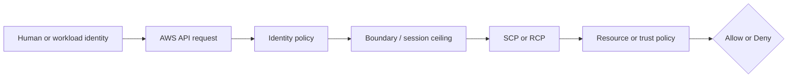
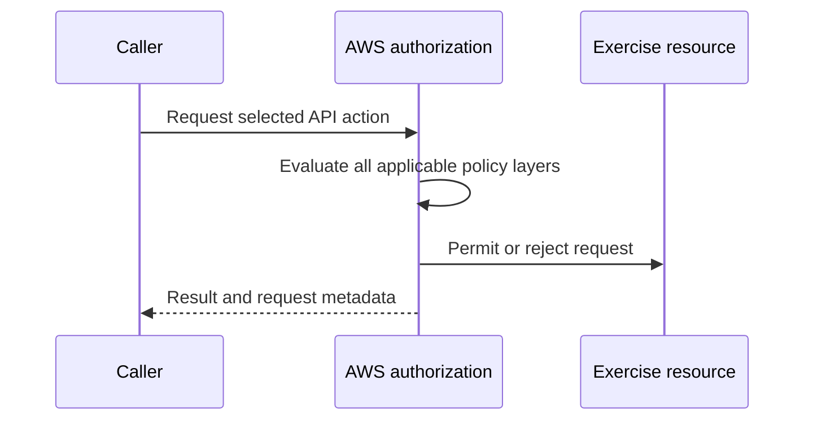

# Week 2 Exercise 10 [Optional] — IAM Access Analyzer external access

This exercise is classified as **Optional** in the Week 2 curriculum.

Complete the [shared Week 2 setup](../week2-setup.md) first. This exercise uses
a disposable lab account and an independent Terraform state key. It follows the
same safety model as Exercises 1 and 2: predict the decision, deploy the
smallest test fixture, run positive and negative tests, capture CloudTrail
evidence, and remove only disposable resources.

## Table of contents

- [Introduction](#introduction).
- [Learning objectives](#learning-objectives).
- [Terraform configuration and ownership](#terraform-configuration-and-ownership).
  - [Policy/resource excerpt](#policyresource-excerpt).
  - [Permissions-boundary excerpt](#permissions-boundary-excerpt).
- [Configure, initialize, and validate](#configure-initialize-and-validate).
- [Execute the experiment](#execute-the-experiment).
- [Investigating in the Console](#investigating-in-the-console).
  - [Inspect the exercise role and its effective ceiling](#inspect-the-exercise-role-and-its-effective-ceiling).
  - [Inspect the S3 fixture configuration and policy](#inspect-the-s3-fixture-configuration-and-policy).
  - [Inspect the Access Analyzer and finding](#inspect-the-access-analyzer-and-finding).
  - [Inspect CloudTrail management events](#inspect-cloudtrail-management-events).
- [Evidence and security analysis](#evidence-and-security-analysis).
- [Clean up](#clean-up).
- [References](#references).

## Introduction

This exercise focuses on **effective external-access detection**. Its objective is to detect an intentionally cross-account S3 policy. An Allow
in one policy is never the whole authorization decision; applicable SCPs,
boundaries, resource policies, trust policies, session context, and explicit
denies must also be considered.



## Learning objectives

- Explain the policy layer being tested and its limits.
- Predict both an allowed and a denied operation before running it.
- Avoid using management, Log Archive, or Security Tooling accounts.
- Attribute the result using CloudTrail and the effective policy set.
- Document residual risk and a production hardening measure.

## Terraform configuration and ownership

The configuration is in [`terraform/lab/week2/exercise10/main.tf`](../../../../terraform/lab/week2/exercise10/main.tf) and the other Terraform files in that directory. It has an
independent encrypted S3 backend key:

```text
lab/week2/exercise10/terraform.tfstate
```

It uses an IAM Identity Center-backed profile and restricts the AWS provider to
the configured disposable account ID with `allowed_account_ids`. The exercise configuration uses a shell environment file. Copy `.env.example`
to `.env`, replace any placeholders or values you want to customize, and keep
the copied file uncommitted. Never place access keys, tokens, or device codes
in the repository.

From the repository root, use this order before running Terraform:

```bash
source ~/.env/aws-security/terraform/.env
cp terraform/lab/week2/exercise10/.env.example terraform/lab/week2/exercise10/.env
# Edit the copied .env and replace placeholders or desired values.
source terraform/lab/week2/exercise10/.env
```

The global environment must be sourced first because the exercise file refers
to shared values such as `TF_LAB_DEV_ACCOUNT_ID`, `TF_LAB_TEST_ACCOUNT_ID`,
`TF_MANAGEMENT_ACCOUNT_ID`, and `TF_HOME_REGION`.

The exercise state owns only resources under `/week2/exercise10/` and the
explicit fixture resources described by the objective. Existing Control Tower,
Identity Center, baseline, and `AWSReservedSSO_*` resources remain outside its
ownership boundary. The exercise role uses the Dev Lab account principal plus
an `aws:PrincipalArn` condition matching the
`AWSReservedSSO_WorkloadLabAdministrator_*` role path. The generated suffix is
wildcarded safely and is not a Terraform input.

### Policy/resource excerpt

The exercise role's trust policy is declared in
[`main.tf`](../../../../terraform/lab/week2/exercise10/main.tf):

```hcl
assume_role_policy = jsonencode({
  Version = "2012-10-17"
  Statement = [{
    Effect    = "Allow"
    Principal = { AWS = "arn:${data.aws_partition.current.partition}:iam::${var.source_account_id}:root" }
    Action    = "sts:AssumeRole"
    Condition = {
      ArnLike = {
        "aws:PrincipalArn" = local.source_operator_role_arn_pattern
      }
    }
  }]
})
```

The `${data.aws_partition.current.partition}` and `${var.source_account_id}`
interpolations render to the AWS partition and the Dev Lab account ID. The
`local.source_operator_role_arn_pattern` local renders to
`arn:<partition>:iam::<Dev-Lab-account-id>:role/aws-reserved/sso.amazonaws.com/<region>/AWSReservedSSO_WorkloadLabAdministrator_*`
(`us-east-1` omits the Region suffix in the Identity Center role path). The
excerpt keeps the original interpolation expressions rather than resolved
example values.

The identity policy created for the exercise is the inline
`Exercise10Policy`, also declared in
[`main.tf`](../../../../terraform/lab/week2/exercise10/main.tf):

```hcl
resource "aws_iam_role_policy" "exercise" {
  role = aws_iam_role.exercise.id
  name = "Exercise10Policy"
  policy = jsonencode({
    Version = "2012-10-17"
    Statement = [{
      Effect = "Allow"
      Action = ["sts:GetCallerIdentity"]
      Resource = "*"
    }]
  })
}
```

The S3 bucket resource policy under detection is declared by the
`external_grant` policy document in
[`main.tf`](../../../../terraform/lab/week2/exercise10/main.tf); its `count`
argument ties the policy's existence to the `external_grant_enabled` variable:

```hcl
data "aws_iam_policy_document" "external_grant" {
  count = var.external_grant_enabled ? 1 : 0

  statement {
    sid    = "IntentionalExternalAccountRead"
    effect = "Allow"

    principals {
      type        = "AWS"
      identifiers = ["arn:${data.aws_partition.current.partition}:iam::${var.external_account_id}:root"]
    }

    actions = [
      "s3:GetBucketLocation",
      "s3:ListBucket",
      "s3:GetObject",
    ]

    resources = [
      aws_s3_bucket.exercise.arn,
      "${aws_s3_bucket.exercise.arn}/*",
    ]
  }
}
```

The `aws_s3_bucket.exercise.arn` references render to the exact bucket ARN
created by this root, and `${var.external_account_id}` renders to the Test
Lab account ID.

A permissions boundary is a maximum, not a grant; a resource policy or trust
policy is not a substitute for an identity Allow.

#### Policy/resource analysis

The trust-policy excerpt defines who may assume the disposable exercise
role: only principals in the Dev Lab account whose ARN matches the
`AWSReservedSSO_WorkloadLabAdministrator_*` Identity Center role pattern,
evaluated through the `ArnLike` condition on `aws:PrincipalArn`. The
authorized action is `sts:AssumeRole`. It intentionally excludes the Test
Lab account, human IAM users, and every other Dev Lab role; the wildcard is
confined to the Identity Center-generated role-name suffix, which is not a
Terraform input. The account-root principal plus the `aws:PrincipalArn`
condition is deliberately specific; without the condition the trust would
cover every principal in the Dev Lab account, so the condition is the
control that keeps the trust narrow. The role's inline policy and boundary
remain the constraints on the resulting session.

The identity-policy excerpt is the policy associated with the exercise role.
Its principal is the role itself, and its only Allow is the harmless
`sts:GetCallerIdentity` action on all resources. It is intended to permit
identity verification, not access to arbitrary workload resources. It does not
trust any principal; trust is defined separately by the role's assume-role
policy. It intentionally contains no explicit Deny, so the absence of an Allow
for other actions produces an implicit deny. The wildcard resource is a weak
point for readability, although this identity-verification action does not
provide a narrower resource scope. Always compare this excerpt with the role
trust policy and the complete declaration in [`main.tf`](../../../../terraform/lab/week2/exercise10/main.tf).

The resource-policy excerpt defines which principals may access the
resource: the Test Lab account root, for `s3:GetBucketLocation`,
`s3:ListBucket`, and `s3:GetObject` on the exercise bucket and its objects.
It is the configuration under detection, not a security control. It
deliberately names an external account principal rather than the public
wildcard `*`, which is why the bucket's `BlockPublicPolicy` setting does not
prevent it. It grants a potential cross-account path only: effective access
still requires an identity-policy Allow for a principal in the Test Lab
account and must survive applicable boundaries, SCPs, and explicit denies.
Its weak points are that account-root delegation extends to every Test Lab
principal that holds a matching identity Allow, and the read-only action
list still includes `s3:GetObject` on every object in the bucket.

### Permissions-boundary excerpt

The authoritative boundary declaration is
[`workload-lab-role-boundary.json.tftpl`](../../../../terraform/lab/week2/baseline/policies/workload-lab-role-boundary.json.tftpl).
The following excerpt is taken from the original policy JSON template; its
`${partition}`, `${dev_lab_account_id}`, `${test_lab_account_id}`, and
`${lab_bucket_name_prefix}` values are rendered by the baseline Terraform root:

```json
{
  "Version": "2012-10-17",
  "Statement": [
    {
      "Sid": "AllowAssumingBoundedWeekTwoRoles",
      "Effect": "Allow",
      "Action": "sts:AssumeRole",
      "Resource": [
        "arn:${partition}:iam::${dev_lab_account_id}:role/week2/*",
        "arn:${partition}:iam::${test_lab_account_id}:role/week2/*"
      ]
    },
    {
      "Sid": "AllowReadCurrentIdentity",
      "Effect": "Allow",
      "Action": "sts:GetCallerIdentity",
      "Resource": "*"
    },
    {
      "Sid": "AllowWeekTwoLabBucketAccess",
      "Effect": "Allow",
      "Action": [
        "s3:GetBucketLocation",
        "s3:ListBucket",
        "s3:ListBucketVersions",
        "s3:GetObject",
        "s3:GetObjectVersion",
        "s3:PutObject",
        "s3:DeleteObject",
        "s3:DeleteObjectVersion"
      ],
      "Resource": [
        "arn:${partition}:s3:::${lab_bucket_name_prefix}*",
        "arn:${partition}:s3:::${lab_bucket_name_prefix}*/*"
      ]
    }
  ]
}
```

This is a permissions boundary, so it defines a maximum-permissions ceiling;
it does not grant these actions by itself. An identity policy must also allow
an operation, and applicable SCPs, session policies, resource policies, trust
policies, and explicit denies remain additional constraints. The policy is
owned by the baseline Terraform root. Do not edit, import, replace, or destroy
it from this exercise.

#### Boundary analysis

This boundary is associated with any role to which the baseline attaches it.
It allows only the listed `sts:AssumeRole`, identity-verification, and Week 2
S3 operations within the two lab accounts and configured bucket prefix. It
intentionally does not allow arbitrary IAM administration, user or access-key
management, managed-policy creation, or unrestricted access to other services.
Its weak point is that the ceiling still permits the listed role and S3 actions
when a separate identity policy grants them; a boundary cannot prevent an
identity policy from granting an action that the boundary allows. The baseline
owner must therefore protect both the boundary and the policies attached to
bounded roles.


## Configure, initialize, and validate

Authenticate the configured IAM Identity Center profile and verify the account. See [`sso_auth.md`](../../../sso_auth.md) for user enablement, MFA, browser isolation, and CLI login guidance. For the Exercise 1 test users, use the **Create the AWS CLI profiles** section of [`exercise1-instructions.md`](../exercise1/exercise1-instructions.md).

```bash
aws sso login --profile "$TF_VAR_source_aws_profile" --use-device-code --no-browser
aws sts get-caller-identity --profile "$TF_VAR_source_aws_profile"
terraform -chdir=terraform/lab/week2/exercise10 init \
  -backend-config="bucket=$TF_STATE_BUCKET" \
  -backend-config="region=$TF_STATE_REGION" \
  -backend-config="profile=$TF_STATE_PROFILE"
terraform -chdir=terraform/lab/week2/exercise10 validate
terraform -chdir=terraform/lab/week2/exercise10 plan
```

Review the plan before applying. It must not modify organizational governance,
Control Tower resources, Identity Center resources, or unrelated accounts.
Stop for unexplained replacements or deletions.

## Execute the experiment

Apply only the reviewed plan:

```bash
terraform -chdir=terraform/lab/week2/exercise10 apply
echo "role_arn: $(terraform -chdir=terraform/lab/week2/exercise10 output -raw role_arn)"
```

Run the exercise-specific positive and negative tests from the objective. Keep
an evidence table with: caller, action, resource, expected result, actual
result, CloudTrail event ID, and the policy layer that explains it.



For Exercise 10, the central comparison is: **Detect an intentionally cross-account s3 policy.** Do
not add permissions until the current policy evaluation and CloudTrail evidence
have been documented.

## Investigating in the Console

Use the IAM Identity Center session for **Dev Lab** with the
`WorkloadLabAdministrator` permission set. Do not use the Test Lab session for
this inspection: the analyzer, bucket, role, and finding all belong to the Dev
Lab account `TF_VAR_source_account_id`. Before every console operation, select
the configured `TF_VAR_aws_region` Region and verify the 12-digit Dev Lab
account ID in the account menu. Do not use an IAM user or long-lived access
keys.

First load the authoritative identifiers from the Exercise 10 Terraform state.
Run this from the repository root; do not reconstruct the bucket ARN or analyzer
ARN manually:

```bash
echo "bucket_name: $(terraform -chdir=terraform/lab/week2/exercise10 output -raw bucket_name)"
echo "bucket_arn: $(terraform -chdir=terraform/lab/week2/exercise10 output -raw bucket_arn)"
echo "analyzer_name: $(terraform -chdir=terraform/lab/week2/exercise10 output -raw analyzer_name)"
echo "analyzer_arn: $(terraform -chdir=terraform/lab/week2/exercise10 output -raw analyzer_arn)"
echo "role_arn: $(terraform -chdir=terraform/lab/week2/exercise10 output -raw role_arn)"
```

Use the displayed values to distinguish the disposable resources from other
Week 2 resources. The expected bucket name ends in `-exercise10`, begins with
`aws-security-week2-`, and has an ARN in the Dev Lab account. The analyzer name
is exactly `Week2Exercise10Analyzer`; its ARN contains
`access-analyzer:<TF_VAR_aws_region>:<Dev-Lab-account-id>:analyzer/Week2Exercise10Analyzer`.
The role ARN ends in `role/week2/exercise10/Week2Exercise10Role`.

### Inspect the exercise role and its effective ceiling

Navigate to **IAM → Roles**. Search for the exact role name
`Week2Exercise10Role`, open it, and confirm the **Path** is
`/week2/exercise10/`. Do not select an `AWSReservedSSO_` role or a role from
another exercise.

On the role's **Permissions** tab, inspect the following fields:

- **Permissions boundary:** Confirm it is the customer-managed policy
  `/week2/WorkloadLabRoleBoundary`. This boundary is owned by
  [`terraform/lab/week2/baseline`](../../../../terraform/lab/week2/baseline/);
  do not edit or remove it. It is a maximum ceiling, not a grant. The role's
  inline policy and the boundary must both permit an action, and explicit
  denies, SCPs, and resource policies still apply.
- **Inline policies → Exercise10Policy:** Open the JSON and confirm the only
  identity Allow is `sts:GetCallerIdentity` on `Resource: "*"`. This policy
  does not grant S3 or Access Analyzer access to the role.
- **Tags:** Confirm the `Project`, `ManagedBy`, `Week`, `Curriculum`, `Exercise`,
  and `Name=Week2Exercise10Role` tags. These identify the fixture but are not an
  authorization control.

Open the **Trust relationships** tab and inspect the trust-policy JSON. Confirm
that it trusts only the Dev Lab account root as the represented principal and
uses an `ArnLike` condition for the
`AWSReservedSSO_WorkloadLabAdministrator_*` role pattern in the configured
Region. This trust policy answers who may assume the disposable role; it does
not grant S3 access after assumption. The role's boundary and its
`sts:GetCallerIdentity` identity policy also explain why this generic role is
not the caller used to administer the fixture.

### Inspect the S3 fixture configuration and policy

Navigate to **S3 → General purpose buckets**, search for the exact
`bucket_name` printed above, and open that bucket. On **Properties**, verify:

- **AWS Region:** Matches `TF_VAR_aws_region`, which must also be the analyzer
  Region.
- **Default encryption:** SSE-S3, shown as `AES256`.
- **Bucket Versioning:** Enabled.
- **Object Ownership:** `Bucket owner enforced`.
- **Lifecycle rules:** The `expire-disposable-lab-data` rule expires current
  and noncurrent data after seven days and aborts incomplete multipart uploads
  after one day.
- **Tags:** `Name` equals the exact bucket name, with the Week 2 Exercise 10
  tags present.

On **Permissions → Block public access (bucket settings)**, confirm all four
settings are enabled: **Block all public access**, or equivalently
`BlockPublicAcls`, `IgnorePublicAcls`, `BlockPublicPolicy`, and
`RestrictPublicBuckets`. `BlockPublicPolicy` does not block this exercise's
account-root principal because the Test Lab account is external but not a
public (`*`) principal.

On **Permissions → Bucket policy**, inspect the JSON and find the statement
with `Sid` `IntentionalExternalAccountRead`. Confirm all of the following:

- `Effect` is `Allow`.
- `Principal.AWS` is
  `arn:<partition>:iam::<Test-Lab-account-id>:root`, where the account ID is
  the value of `TF_VAR_external_account_id` and differs from the Dev Lab ID.
- `Action` contains exactly `s3:GetBucketLocation`, `s3:ListBucket`, and
  `s3:GetObject`.
- `Resource` contains the exact bucket ARN and the bucket ARN followed by
  `/*`.
- There is no public wildcard principal and no unrelated bucket in the policy.

This resource policy is the configuration under detection. It grants the
external Test Lab account a potential cross-account path, but effective access
still depends on an identity Allow in the external account and all other IAM
policy layers. Do not edit the bucket policy in the console; use the
`external_grant_enabled` Terraform variable for the remediation phase.

### Inspect the Access Analyzer and finding

Navigate to **IAM → Access Analyzer → Analyzers**. Select the analyzer whose
name is exactly `Week2Exercise10Analyzer` and whose Region and account match the
Terraform outputs above. On its details page confirm:

- **Analyzer type:** `Account`.
- **Status:** `Active`.
- **Zone of trust:** The Dev Lab account.
- **Tags:** `Name=Week2Exercise10Analyzer` and the standard Exercise 10 tags.

Open the analyzer's **Findings** tab and filter by the exact bucket ARN from
Terraform output. With `external_grant_enabled=true`, wait for the asynchronous
analysis to complete and locate the finding for the S3 bucket. Open it and
record the finding ID, resource ARN, external principal, actions, finding
status, Region, and creation/update timestamps. The expected finding identifies
an external Test Lab principal and the bucket actions from
`IntentionalExternalAccountRead`; it must not be attributed to the
`AWSReservedSSO_WorkloadLabAdministrator_*` role.

For the remediation check, set `TF_VAR_external_grant_enabled="false"` in the
local uncommitted environment file and apply only the reviewed Exercise 10
plan. Return to **IAM → Access Analyzer → Analyzers →
Week2Exercise10Analyzer → Findings** and filter by the same bucket ARN. The
console's **View active findings** list should no longer show an active finding
for the bucket. Do not assume that the console has a separate resolved-findings
list: depending on the console version, it may display only active findings.

Use the Access Analyzer API through the CLI to verify the former finding's
status. This query uses the analyzer ARN and bucket ARN from Terraform rather
than a copied identifier:

```bash
ANALYZER_ARN="$(terraform -chdir=terraform/lab/week2/exercise10 output -raw analyzer_arn)"
BUCKET_ARN="$(terraform -chdir=terraform/lab/week2/exercise10 output -raw bucket_arn)"
aws accessanalyzer list-findings \
  --analyzer-arn "$ANALYZER_ARN" \
  --filter "{\"resource\":{\"eq\":[\"$BUCKET_ARN\"]},\"status\":{\"eq\":[\"RESOLVED\"]}}" \
  --profile "$TF_VAR_source_aws_profile" \
  --region "$TF_VAR_aws_region"
```

Inspect the returned finding's `id`, `status`, `resource`, `principal`,
`action`, `createdAt`, and `updatedAt`. The expected result is the original
bucket finding with `status` equal to `RESOLVED`; allow time for the analyzer
to re-evaluate the changed bucket policy. An empty result means either that
resolution has not completed yet or that the service has stopped returning the
resolved record; confirm independently that the same bucket has no active
finding with:

```bash
aws accessanalyzer list-findings \
  --analyzer-arn "$ANALYZER_ARN" \
  --filter "{\"resource\":{\"eq\":[\"$BUCKET_ARN\"]},\"status\":{\"eq\":[\"ACTIVE\"]}}" \
  --profile "$TF_VAR_source_aws_profile" \
  --region "$TF_VAR_aws_region"
```

Restore the toggle only if you intend to re-run the intentionally vulnerable
phase; do not manually recreate the policy in the console.

### Inspect CloudTrail management events

Navigate to **CloudTrail → Event history** in the Dev Lab account and the same
`TF_VAR_aws_region` Region. Set a time window covering the Terraform apply and
filter **Lookup attributes → Event name** one event at a time for:

- `CreateAnalyzer` — Select the event whose request contains
  `Week2Exercise10Analyzer`. Confirm `eventSource` is
  `access-analyzer.amazonaws.com`, the `userIdentity.arn` identifies the
  `AWSReservedSSO_WorkloadLabAdministrator_*` session, and the response has no
  `errorCode` when creation succeeded. If present, also inspect the related
  `TagResource` event and confirm the analyzer ARN.
- `PutBucketPolicy` — Select the event whose request contains the exact
  `bucket_name`. Confirm `eventSource` is `s3.amazonaws.com`, the request
  policy contains `IntentionalExternalAccountRead` and the Test Lab root
  principal, and the successful event has no `errorCode`.
- `DeleteAnalyzer` and `DeleteBucketPolicy` — Search for these only after the
  remediation or cleanup phase. Match the exact analyzer or bucket ARN and
  record the event ID and outcome; do not confuse them with another exercise's
  destroy operation.

Expand each selected event and record `eventId`, `eventTime`, `awsRegion`,
`recipientAccountId`, `userIdentity.arn`, `eventSource`, `eventName`,
`requestParameters`, `resources`, `errorCode`, and `errorMessage`. An
`AccessDenied` event during an earlier failed apply is evidence of a missing
permission-set grant, not evidence that Access Analyzer rejected the
cross-account policy. CloudTrail Event history covers these management events;
it does not by itself prove that an external principal successfully performed
an S3 object `GetObject`. Object data-event evidence requires an enabled trail
selector or event data store covering this bucket, so document that telemetry
gap rather than inferring object access from a missing Event history entry.

Console list pages may require permissions outside this deliberately narrow lab
persona. If a page returns `AccessDenied`, use the exact Terraform outputs and
AWS CLI evidence commands instead, or use an approved read-only inspection
session. Do not broaden `WorkloadLabAdministrator` merely to make unrelated
console navigation work, and do not modify Control Tower, SCPs, the baseline
boundary, or Identity Center assignments from the console.

## Evidence and security analysis

Exercise 10 tests **external-access detection**, not whether the Test Lab user
successfully reads the object. The Dev Lab account is the analyzer's zone of
trust. The intentional `IntentionalExternalAccountRead` statement names the
Test Lab account root as an external principal, so the expected detection
result is an active finding. After `external_grant_enabled=false` removes the
statement, the expected remediation result is no active finding and, when the
service retains the record, a finding with status `RESOLVED`.

Before each phase, record the prediction in an evidence table. Use one row for
the vulnerable phase and one for the remediated phase:

| Phase | Principal/resource difference | Predicted result | Actual result | Finding status/ID | CloudTrail event ID | Determining control. |
|---|---|---|---|---|---|---|
| External grant enabled | Test Lab account root is named in `IntentionalExternalAccountRead` for the Dev Lab bucket. | Active external-access finding. | Record after polling. | Record `ACTIVE` finding ID. | Record apply event IDs. | S3 resource policy plus analyzer zone of trust. |
| External grant disabled | The cross-account statement is absent from the bucket policy. | No active finding; prior finding resolves asynchronously. | Record after polling. | Record `RESOLVED`, if returned. | Record the policy-removal event ID. | Removal of the resource-policy Allow. |

Explain each result in this order:

```text
Explicit deny → SCP/RCP → identity policy → boundary/session policy
             → resource/trust policy → conditions → effective result
```

For this exercise, the S3 bucket policy is the policy being detected. The
`WorkloadLabAdministrator` identity policy permits the operator to create and
inspect the fixture, but it is not the external principal in the finding. The
role's `Exercise10Policy` only allows `sts:GetCallerIdentity`, and the
`WorkloadLabRoleBoundary` is a maximum ceiling rather than a grant. The
analyzer reports a resource-policy path outside its Dev Lab zone of trust; it
does not prove that the Test Lab account has an identity policy allowing an
actual `GetObject` request. Existing SCPs, identity policies in the Test Lab,
permissions boundaries, and explicit denies could still make effective access
deny the request.

### Establish the exact evidence identifiers

Purpose: Load the analyzer, bucket, and operator-role identifiers from the
Exercise 10 state so every subsequent query targets this exercise only.

```bash
echo "source_account_id: $TF_VAR_source_account_id"
echo "external_account_id: $TF_VAR_external_account_id"
echo "region: $TF_VAR_aws_region"
echo "bucket_arn: $(terraform -chdir=terraform/lab/week2/exercise10 output -raw bucket_arn)"
echo "analyzer_arn: $(terraform -chdir=terraform/lab/week2/exercise10 output -raw analyzer_arn)"
echo "role_arn: $(terraform -chdir=terraform/lab/week2/exercise10 output -raw role_arn)"
```

Confirm that the source account is the Dev Lab account, the external account is
the Test Lab account, and the Region is the same for the bucket and analyzer.
Do not continue if the caller, account, or Region is wrong.

### Verify the operator session

Purpose: Prove that the evidence queries are made from the intended
Dev-Lab `WorkloadLabAdministrator` session rather than a stale or unrelated
profile.

```bash
aws sts get-caller-identity \
  --profile "$TF_VAR_source_aws_profile" \
  --region "$TF_VAR_aws_region"
```

Inspect `Account` and `Arn`. `Account` must equal
`TF_VAR_source_account_id`, and `Arn` must contain
`AWSReservedSSO_WorkloadLabAdministrator_`. An authentication failure or an
unexpected account is not a valid exercise result.

### Retrieve the exercise role and trust policy

Purpose: Capture the exact identity, trust, and boundary configuration attached
to `Week2Exercise10Role`.

```bash
aws iam get-role \
  --role-name Week2Exercise10Role \
  --profile "$TF_VAR_source_aws_profile" \
  --region "$TF_VAR_aws_region"
```

Inspect `Role.Arn`, `Role.Path`, `Role.AssumeRolePolicyDocument`, and
`Role.PermissionsBoundary`. The path must be `/week2/exercise10/`, the trust
policy must use the Dev Lab account root with the
`AWSReservedSSO_WorkloadLabAdministrator_*` `aws:PrincipalArn` condition, and
the boundary ARN must end in `policy/week2/WorkloadLabRoleBoundary`.

### Retrieve the role identity policy

Purpose: Demonstrate that the disposable role is not the identity granting the
external S3 access.

```bash
aws iam get-role-policy \
  --role-name Week2Exercise10Role \
  --policy-name Exercise10Policy \
  --profile "$TF_VAR_source_aws_profile" \
  --region "$TF_VAR_aws_region"
```

Inspect the decoded `PolicyVersionDocument`. Its only Allow must be
`sts:GetCallerIdentity` on `Resource: "*"`; it must contain no S3 or
Access Analyzer Allow. This is an identity-policy observation, not proof that
all requests by the human SSO session are denied.

### Retrieve the permissions-boundary policy version

Purpose: Confirm the maximum ceiling applied to the exercise role without
modifying the boundary owned by the Week 2 baseline root.

```bash
ROLE_JSON="$(aws iam get-role --role-name Week2Exercise10Role --profile "$TF_VAR_source_aws_profile" --region "$TF_VAR_aws_region")"
BOUNDARY_ARN="$(printf '%s' "$ROLE_JSON" | jq -r '.Role.PermissionsBoundary.PolicyArn')"
BOUNDARY_VERSION="$(aws iam get-policy --policy-arn "$BOUNDARY_ARN" --profile "$TF_VAR_source_aws_profile" --region "$TF_VAR_aws_region" --query 'Policy.DefaultVersionId' --output text)"
aws iam get-policy-version \
  --policy-arn "$BOUNDARY_ARN" \
  --version-id "$BOUNDARY_VERSION" \
  --profile "$TF_VAR_source_aws_profile" \
  --region "$TF_VAR_aws_region"
```

Inspect the default policy version and confirm that the boundary is the
pre-provisioned `/week2/WorkloadLabRoleBoundary`. The boundary permits only
the actions listed by the baseline policy and cannot grant the exercise role
S3 access by itself. If `jq` is unavailable, use the `PermissionsBoundary` ARN
from `get-role`, then retrieve the policy and version fields manually.

### Retrieve S3 authorization-relevant settings

Purpose: Capture the exact bucket controls that prevent public access and
identify the resource to which the external statement applies.

```bash
BUCKET_NAME="$(terraform -chdir=terraform/lab/week2/exercise10 output -raw bucket_name)"
aws s3api get-public-access-block --bucket "$BUCKET_NAME" --profile "$TF_VAR_source_aws_profile" --region "$TF_VAR_aws_region"
aws s3api get-bucket-ownership-controls --bucket "$BUCKET_NAME" --profile "$TF_VAR_source_aws_profile" --region "$TF_VAR_aws_region"
aws s3api get-bucket-encryption --bucket "$BUCKET_NAME" --profile "$TF_VAR_source_aws_profile" --region "$TF_VAR_aws_region"
aws s3api get-bucket-versioning --bucket "$BUCKET_NAME" --profile "$TF_VAR_source_aws_profile" --region "$TF_VAR_aws_region"
aws s3api get-bucket-lifecycle-configuration --bucket "$BUCKET_NAME" --profile "$TF_VAR_source_aws_profile" --region "$TF_VAR_aws_region"
```

Inspect the separate responses. All four public-access settings must be true,
ownership must be `BucketOwnerEnforced`, encryption must use `AES256`, and
versioning must be enabled. The lifecycle response must contain
`expire-disposable-lab-data` with seven-day current and noncurrent expiration.
These settings harden disposable data but do not remove a cross-account
resource-policy Allow.

### Retrieve the bucket resource policy

Purpose: Capture the exact statement that should produce the Access Analyzer
finding.

```bash
aws s3api get-bucket-policy \
  --bucket "$BUCKET_NAME" \
  --profile "$TF_VAR_source_aws_profile" \
  --region "$TF_VAR_aws_region"
```

Inspect the decoded `Policy` and locate `Sid=IntentionalExternalAccountRead`.
Record `Effect`, `Principal.AWS`, `Action`, and `Resource`. The principal must
be `arn:<partition>:iam::<TF_VAR_external_account_id>:root`; actions must be
` s3:GetBucketLocation`, `s3:ListBucket`, and `s3:GetObject`; and resources must
be the bucket ARN and its `/*` object form. The principal is an external
account principal, not the public wildcard `*`, which is why S3's public-access
block does not prevent this deliberate policy.

### Retrieve the vulnerable-phase finding

Purpose: Verify the positive detection result and capture stable finding data.

```bash
ANALYZER_ARN="$(terraform -chdir=terraform/lab/week2/exercise10 output -raw analyzer_arn)"
BUCKET_ARN="$(terraform -chdir=terraform/lab/week2/exercise10 output -raw bucket_arn)"
aws accessanalyzer list-findings \
  --analyzer-arn "$ANALYZER_ARN" \
  --filter "{\"resource\":{\"eq\":[\"$BUCKET_ARN\"]},\"status\":{\"eq\":[\"ACTIVE\"]}}" \
  --profile "$TF_VAR_source_aws_profile" \
  --region "$TF_VAR_aws_region"
```

Wait for asynchronous analysis if the result is initially empty. Record each
matching finding's `id`, `status`, `resource`, `principal`, `action`,
`condition`, `createdAt`, and `updatedAt`. The expected positive result is an
`ACTIVE` finding for the exact bucket, with the Test Lab account represented as
the external principal. An empty response before analysis completes is not a
negative security result.

### Retrieve complete finding details

Purpose: Preserve the complete finding record for correlation with the bucket
policy and the remediation result.

```bash
FINDING_ID="<finding-id-from-the-active-list-findings-response>"
aws accessanalyzer get-finding \
  --analyzer-arn "$ANALYZER_ARN" \
  --id "$FINDING_ID" \
  --profile "$TF_VAR_source_aws_profile" \
  --region "$TF_VAR_aws_region"
```

Replace only the placeholder with the returned finding ID; do not copy a
credential into the command. Confirm that `resource` equals `BUCKET_ARN`, the
principal and action match `IntentionalExternalAccountRead`, and the finding
belongs to `Week2Exercise10Analyzer`. This is the authoritative detail record
for the positive path.

### Verify the remediated finding state

Purpose: Confirm that removing the external statement changes the analyzer
result rather than merely hiding the finding in the console.

After setting `external_grant_enabled=false` and applying the reviewed plan,
first confirm that the bucket policy no longer contains
`IntentionalExternalAccountRead`, then poll the analyzer. The service is
asynchronous; repeat the following query after a short wait if necessary:

```bash
aws accessanalyzer list-findings \
  --analyzer-arn "$ANALYZER_ARN" \
  --filter "{\"resource\":{\"eq\":[\"$BUCKET_ARN\"]},\"status\":{\"eq\":[\"RESOLVED\"]}}" \
  --profile "$TF_VAR_source_aws_profile" \
  --region "$TF_VAR_aws_region"
```

If a record is returned, record its `id`, `status`, `resource`, `principal`,
`action`, `createdAt`, and `updatedAt`; `status=RESOLVED` is the expected
remediation result. The console may show only **View active findings**, so a
finding disappearing there is not sufficient evidence of resolution.

### Confirm that no active finding remains

Purpose: Distinguish a resolved finding from a still-active external-access
finding when the service does not return the resolved record in the console or
API response.

```bash
aws accessanalyzer list-findings \
  --analyzer-arn "$ANALYZER_ARN" \
  --filter "{\"resource\":{\"eq\":[\"$BUCKET_ARN\"]},\"status\":{\"eq\":[\"ACTIVE\"]}}" \
  --profile "$TF_VAR_source_aws_profile" \
  --region "$TF_VAR_aws_region"
```

The expected response is an empty `findings` list after re-evaluation. If it is
not empty, inspect the bucket policy again and do not claim remediation. If the
resolved query is empty and the active query is also empty, record that the
service returned no retained resolved record but that no active finding
remained; do not represent that observation as proof of an external access
attempt.

### Retrieve CloudTrail management evidence

Purpose: Correlate the configuration changes with the caller, account, Region,
request, and outcome. These are management events, not S3 object data events.

```bash
aws cloudtrail lookup-events \
  --lookup-attributes AttributeKey=EventName,AttributeValue=PutBucketPolicy \
  --start-time "$(date -u -d '2 hours ago' +%Y-%m-%dT%H:%M:%SZ)" \
  --profile "$TF_VAR_source_aws_profile" \
  --region "$TF_VAR_aws_region" \
  --output json
```

Select the event whose `CloudTrailEvent` contains the exact bucket name and
`IntentionalExternalAccountRead`. Record the outer `EventId`, `EventTime`, and
`Username`, then inspect the embedded `eventSource`, `eventName`,
`userIdentity.arn`, `awsRegion`, `recipientAccountId`, `requestParameters`,
`resources`, `errorCode`, and `errorMessage`. The successful vulnerable-phase
event has no `errorCode`; the remediated-phase event has a request with the
external statement absent. A previous `AccessDenied` caused by missing
permission-set grants is not evidence that the S3 resource policy was denied.

### Retrieve Access Analyzer management evidence

Purpose: Correlate analyzer creation, tagging, and cleanup with the exact
Exercise 10 analyzer rather than unrelated Access Analyzer activity.

```bash
aws cloudtrail lookup-events \
  --lookup-attributes AttributeKey=EventName,AttributeValue=CreateAnalyzer \
  --start-time "$(date -u -d '2 hours ago' +%Y-%m-%dT%H:%M:%SZ)" \
  --profile "$TF_VAR_source_aws_profile" \
  --region "$TF_VAR_aws_region" \
  --output json
```

Select the event whose request contains `Week2Exercise10Analyzer`. Record the
same stable fields as for `PutBucketPolicy`, especially `EventId`,
`userIdentity.arn`, `requestParameters`, `resources`, `errorCode`, and
`errorMessage`. If creation used a separate tag call, repeat the lookup for
`TagResource` and match the analyzer ARN and `Name` tag. Do not use a failed
`CreateAnalyzer` event caused by the missing service-linked-role permission as
the positive detection evidence.

### Check inherited SCPs without modifying governance

Purpose: Record whether an organization-level explicit deny could affect a
future real access attempt, while preserving the exercise's ownership boundary.

Use an approved management-account read-only session to open **AWS
Organizations → Policies → Service control policies**, select the Dev Lab
account, and record the SCPs attached directly or inherited from its OU and the
organization root. Search each displayed policy for `Effect: "Deny"` with
`s3:GetBucketLocation`, `s3:ListBucket`, `s3:GetObject`, or `Action: "*"`.
The exercise creates no SCP. Do not modify, detach, or rename Control Tower or
organization policies. An SCP observation explains a possible effective
request decision; it does not change the Access Analyzer finding's resource
policy analysis.

### Analyze the results and residual risk

The vulnerable phase demonstrates that an account-level analyzer can identify
an external principal named by a resource policy even when the bucket blocks
public access. The remediation phase demonstrates policy-state change and
finding resolution, not successful cross-account data access. The exercise
creates no identity policy in the Test Lab account and therefore intentionally
does not establish that the Test Lab root can read the object.

If the bucket policy were made mutable by an unreviewed operator, the operator
could repeatedly reintroduce external access and generate new findings. If
`block_public_policy` were the only control, it would not stop this account-root
grant. Production hardening should use least-privilege resource policies,
explicit organization/account conditions where appropriate, protected policy
change workflows, continuous Access Analyzer monitoring, CloudTrail management
and S3 data-event coverage appropriate to the data, and alerting on new or
reopened findings. A short observation period with no external `GetObject`
event is not proof that the permission is never used.

## Clean up

Preserve redacted evidence, then review and execute only the exercise destroy:

```bash
terraform -chdir=terraform/lab/week2/exercise10 plan -destroy
terraform -chdir=terraform/lab/week2/exercise10 destroy
```

Never destroy the Week 2 baseline boundary, Control Tower resources, Identity
Center assignments, or another exercise's state. Confirm the state key is
empty, remove temporary access, and verify `git status` before committing.

## References

- [IAM policy evaluation logic](https://docs.aws.amazon.com/IAM/latest/UserGuide/reference_policies_evaluation-logic.html).
- [IAM permissions boundaries](https://docs.aws.amazon.com/IAM/latest/UserGuide/access_policies_boundaries.html).
- [IAM roles and trust policies](https://docs.aws.amazon.com/IAM/latest/UserGuide/id_roles.html).
- [IAM Identity Center](https://docs.aws.amazon.com/singlesignon/latest/userguide/what-is.html).
- [AWS CloudTrail event history](https://docs.aws.amazon.com/awscloudtrail/latest/userguide/view-cloudtrail-events.html).
- [AWS STS](https://docs.aws.amazon.com/STS/latest/APIReference/welcome.html).
- [AWS IAM service authorization reference](https://docs.aws.amazon.com/service-authorization/latest/reference/reference_policies_actions-resources-contextkeys.html).
