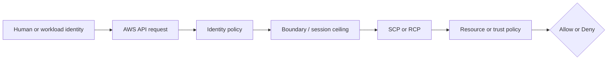
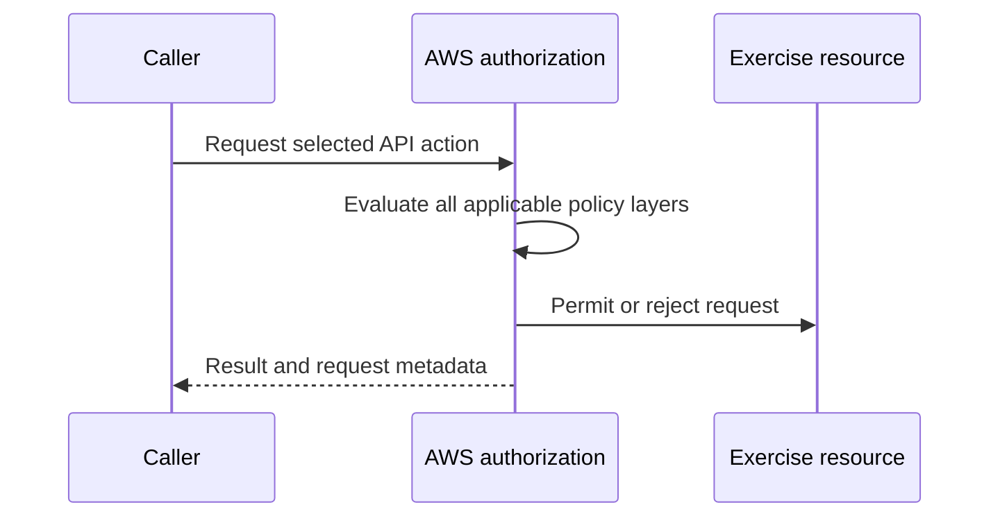

# Week 2 Exercise 11 [Core] — IAM policy validation

This exercise is classified as **Core** in the Week 2 curriculum.

Complete the [shared Week 2 setup](../week2-setup.md) first. This exercise uses
a disposable lab account and an independent Terraform state key. It follows the
same safety model as Exercises 1 and 2: predict the decision, deploy the
smallest test fixture, run positive and negative tests, capture CloudTrail
evidence, and remove only disposable resources.

## Table of contents

- [Introduction](#introduction).
- [Learning objectives](#learning-objectives).
- [Terraform configuration and ownership](#terraform-configuration-and-ownership).
  - [Policy/resource excerpt](#policyresource-excerpt).
  - [Permissions-boundary excerpt](#permissions-boundary-excerpt).
- [Configure, initialize, and validate](#configure-initialize-and-validate).
- [Execute the experiment](#execute-the-experiment).
- [Investigating in the Console](#investigating-in-the-console).
  - [Inspect the deployed exercise role](#inspect-the-deployed-exercise-role).
  - [Inspect the policy-validation permission](#inspect-the-policy-validation-permission).
  - [Inspect ValidatePolicy CloudTrail events](#inspect-validatepolicy-cloudtrail-events).
- [Evidence and security analysis](#evidence-and-security-analysis).
- [Clean up](#clean-up).
- [References](#references).

## Introduction

This exercise focuses on **preventive policy-as-code review**. Its objective is to compare broad, malformed, and least-privilege policies. An Allow
in one policy is never the whole authorization decision; applicable SCPs,
boundaries, resource policies, trust policies, session context, and explicit
denies must also be considered.



## Learning objectives

- Explain the policy layer being tested and its limits.
- Predict both an allowed and a denied operation before running it.
- Avoid using management, Log Archive, or Security Tooling accounts.
- Attribute the result using CloudTrail and the effective policy set.
- Document residual risk and a production hardening measure.

## Terraform configuration and ownership

The configuration is in [`terraform/lab/week2/exercise11/main.tf`](../../../../terraform/lab/week2/exercise11/main.tf) and the other Terraform files in that directory. It has an
independent encrypted S3 backend key:

```text
lab/week2/exercise11/terraform.tfstate
```

It uses an IAM Identity Center-backed profile and restricts the AWS provider to
the configured disposable account ID with `allowed_account_ids`. The exercise configuration uses a shell environment file. Copy `.env.example`
to `.env`, replace any placeholders or values you want to customize, and keep
the copied file uncommitted. Never place access keys, tokens, or device codes
in the repository.

From the repository root, use this order before running Terraform:

```bash
source ~/.env/aws-security/terraform/.env
cp terraform/lab/week2/exercise11/.env.example terraform/lab/week2/exercise11/.env
# Edit the copied .env and replace placeholders or desired values.
source terraform/lab/week2/exercise11/.env
```

The global environment must be sourced first because the exercise file refers
to shared values such as `TF_LAB_DEV_ACCOUNT_ID`, `TF_LAB_TEST_ACCOUNT_ID`,
`TF_MANAGEMENT_ACCOUNT_ID`, and `TF_HOME_REGION`.

The exercise state owns only resources under `/week2/exercise11/` and the
explicit fixture resources described by the objective. Existing Control Tower,
Identity Center, baseline, and `AWSReservedSSO_*` resources remain outside its
ownership boundary. The exercise role uses the Dev Lab account principal plus
an `aws:PrincipalArn` condition matching the
`AWSReservedSSO_WorkloadLabAdministrator_*` role path. The generated suffix is
wildcarded safely and is not a Terraform input.

### Policy/resource excerpt

The exercise role's trust policy is declared in
[`main.tf`](../../../../terraform/lab/week2/exercise11/main.tf):

```hcl
assume_role_policy = jsonencode({
  Version = "2012-10-17"
  Statement = [{
    Effect    = "Allow"
    Principal = { AWS = "arn:${data.aws_partition.current.partition}:iam::${var.source_account_id}:root" }
    Action    = "sts:AssumeRole"
    Condition = {
      ArnLike = {
        "aws:PrincipalArn" = local.source_operator_role_arn_pattern
      }
    }
  }]
})
```

The `${data.aws_partition.current.partition}` and `${var.source_account_id}`
interpolations render to the AWS partition and the Dev Lab account ID. The
`local.source_operator_role_arn_pattern` local renders to
`arn:<partition>:iam::<Dev-Lab-account-id>:role/aws-reserved/sso.amazonaws.com/<region>/AWSReservedSSO_WorkloadLabAdministrator_*`
(`us-east-1` omits the Region suffix in the Identity Center role path). The
excerpt keeps the original interpolation expressions rather than resolved
example values.

The identity policy created for the exercise is the inline
`Exercise11Policy`, also declared in
[`main.tf`](../../../../terraform/lab/week2/exercise11/main.tf):

```hcl
resource "aws_iam_role_policy" "exercise" {
  role = aws_iam_role.exercise.id
  name = "Exercise11Policy"
  policy = jsonencode({
    Version = "2012-10-17"
    Statement = [{
      Effect = "Allow"
      Action = ["sts:GetCallerIdentity"]
      Resource = "*"
    }]
  })
}
```

The four policy fixtures created for this exercise are committed files under
[`terraform/lab/week2/exercise11/policies/`](../../../../terraform/lab/week2/exercise11/policies/).
They are unattached policy documents supplied to `access-analyzer:ValidatePolicy`;
none of them is deployed as an IAM policy. Each file is small, so it is
reproduced in full.

[`overly-broad.json`](../../../../terraform/lab/week2/exercise11/policies/overly-broad.json) —
wildcard action on all resources:

```json
{
  "Version": "2012-10-17",
  "Statement": [
    {
      "Effect": "Allow",
      "Action": "*",
      "Resource": "*"
    }
  ]
}
```

[`malformed.json`](../../../../terraform/lab/week2/exercise11/policies/malformed.json) —
lowercase `Effect` and an unsupported top-level element:

```json
{
  "Version": "2012-10-17",
  "Statement": [
    {
      "Effect": "allow",
      "Action": "s3:*",
      "Resource": "arn:aws:s3:::aws-security-week2-lab-*"
    }
  ],
  "MisspelledElement": "value"
}
```

[`questionable-condition.json`](../../../../terraform/lab/week2/exercise11/policies/questionable-condition.json) —
allow condition permitting non-HTTPS transport:

```json
{
  "Version": "2012-10-17",
  "Statement": [
    {
      "Effect": "Allow",
      "Action": "s3:GetObject",
      "Resource": "arn:aws:s3:::aws-security-week2-lab-*/*",
      "Condition": {
        "Bool": {
          "aws:SecureTransport": "false"
        }
      }
    }
  ]
}
```

[`least-privilege.json`](../../../../terraform/lab/week2/exercise11/policies/least-privilege.json) —
narrow S3 actions and resources restricted to HTTPS:

```json
{
  "Version": "2012-10-17",
  "Statement": [
    {
      "Effect": "Allow",
      "Action": [
        "s3:GetObject",
        "s3:ListBucket"
      ],
      "Resource": [
        "arn:aws:s3:::aws-security-week2-lab-*",
        "arn:aws:s3:::aws-security-week2-lab-*/*"
      ],
      "Condition": {
        "Bool": {
          "aws:SecureTransport": "true"
        }
      }
    }
  ]
}
```

A permissions boundary is a maximum, not a grant; a resource policy or trust
policy is not a substitute for an identity Allow. None of the four fixtures
is attached to `Week2Exercise11Role` or any other identity.

#### Policy/resource analysis

The trust-policy excerpt defines who may assume the disposable exercise
role: only principals in the Dev Lab account whose ARN matches the
`AWSReservedSSO_WorkloadLabAdministrator_*` Identity Center role pattern,
evaluated through the `ArnLike` condition on `aws:PrincipalArn`. The
authorized action is `sts:AssumeRole`. It intentionally excludes the Test
Lab account, human IAM users, and every other Dev Lab role; the wildcard is
confined to the Identity Center-generated role-name suffix, which is not a
Terraform input. The account-root principal plus the `aws:PrincipalArn`
condition is deliberately specific; without the condition the trust would
cover every principal in the Dev Lab account, so the condition is the
control that keeps the trust narrow. The role's inline policy and boundary
remain the constraints on the resulting session.

The identity-policy excerpt is the policy associated with the exercise role.
Its principal is the role itself, and its only Allow is the harmless
`sts:GetCallerIdentity` action on all resources. It is intended to permit
identity verification, not access to arbitrary workload resources. It does not
trust any principal; trust is defined separately by the role's assume-role
policy. It intentionally contains no explicit Deny, so the absence of an Allow
for other actions produces an implicit deny. The wildcard resource is a weak
point for readability, although this identity-verification action does not
provide a narrower resource scope. Always compare this excerpt with the role
trust policy and the complete declaration in [`main.tf`](../../../../terraform/lab/week2/exercise11/main.tf).

The four fixture excerpts are the policies created for the exercise and are
the subject of every validation test. `overly-broad.json` grants
`Action: "*"` on `Resource: "*"` and should produce security warnings for
wildcard access. `malformed.json` uses a lowercase `Effect` and an
unsupported `MisspelledElement` and should be rejected as invalid or produce
error findings. `questionable-condition.json` allows `s3:GetObject` only
when `aws:SecureTransport` is `false`, deliberately permitting non-HTTPS
access, and should produce a security warning. `least-privilege.json` allows
narrow S3 read actions on the lab bucket pattern only over HTTPS and should
produce no findings. Because none of these documents is attached to an
identity, none of them grants any permission: `ValidatePolicy` performs a
static semantic and best-practice analysis, not a runtime authorization
decision. A clean validation of `least-privilege.json` is not an Allow, and
the findings on the other three documents are not denials of a live request.

### Permissions-boundary excerpt

The authoritative boundary declaration is
[`workload-lab-role-boundary.json.tftpl`](../../../../terraform/lab/week2/baseline/policies/workload-lab-role-boundary.json.tftpl).
The following excerpt is taken from the original policy JSON template; its
`${partition}`, `${dev_lab_account_id}`, `${test_lab_account_id}`, and
`${lab_bucket_name_prefix}` values are rendered by the baseline Terraform root:

```json
{
  "Version": "2012-10-17",
  "Statement": [
    {
      "Sid": "AllowAssumingBoundedWeekTwoRoles",
      "Effect": "Allow",
      "Action": "sts:AssumeRole",
      "Resource": [
        "arn:${partition}:iam::${dev_lab_account_id}:role/week2/*",
        "arn:${partition}:iam::${test_lab_account_id}:role/week2/*"
      ]
    },
    {
      "Sid": "AllowReadCurrentIdentity",
      "Effect": "Allow",
      "Action": "sts:GetCallerIdentity",
      "Resource": "*"
    },
    {
      "Sid": "AllowWeekTwoLabBucketAccess",
      "Effect": "Allow",
      "Action": [
        "s3:GetBucketLocation",
        "s3:ListBucket",
        "s3:ListBucketVersions",
        "s3:GetObject",
        "s3:GetObjectVersion",
        "s3:PutObject",
        "s3:DeleteObject",
        "s3:DeleteObjectVersion"
      ],
      "Resource": [
        "arn:${partition}:s3:::${lab_bucket_name_prefix}*",
        "arn:${partition}:s3:::${lab_bucket_name_prefix}*/*"
      ]
    }
  ]
}
```

This is a permissions boundary, so it defines a maximum-permissions ceiling;
it does not grant these actions by itself. An identity policy must also allow
an operation, and applicable SCPs, session policies, resource policies, trust
policies, and explicit denies remain additional constraints. The policy is
owned by the baseline Terraform root. Do not edit, import, replace, or destroy
it from this exercise.

#### Boundary analysis

This boundary is associated with any role to which the baseline attaches it.
It allows only the listed `sts:AssumeRole`, identity-verification, and Week 2
S3 operations within the two lab accounts and configured bucket prefix. It
intentionally does not allow arbitrary IAM administration, user or access-key
management, managed-policy creation, or unrestricted access to other services.
Its weak point is that the ceiling still permits the listed role and S3 actions
when a separate identity policy grants them; a boundary cannot prevent an
identity policy from granting an action that the boundary allows. The baseline
owner must therefore protect both the boundary and the policies attached to
bounded roles.


## Configure, initialize, and validate

Authenticate the configured IAM Identity Center profile and verify the account. See [`sso_auth.md`](../../../sso_auth.md) for user enablement, MFA, browser isolation, and CLI login guidance. For the Exercise 1 test users, use the **Create the AWS CLI profiles** section of [`exercise1-instructions.md`](../exercise1/exercise1-instructions.md).

```bash
aws sso login --profile "$TF_VAR_source_aws_profile" --use-device-code --no-browser
aws sts get-caller-identity --profile "$TF_VAR_source_aws_profile"
terraform -chdir=terraform/lab/week2/exercise11 init \
  -backend-config="bucket=$TF_STATE_BUCKET" \
  -backend-config="region=$TF_STATE_REGION" \
  -backend-config="profile=$TF_STATE_PROFILE"
terraform -chdir=terraform/lab/week2/exercise11 validate
terraform -chdir=terraform/lab/week2/exercise11 plan
```

Review the plan before applying. It must not modify organizational governance,
Control Tower resources, Identity Center resources, or unrelated accounts.
Stop for unexplained replacements or deletions.

## Execute the experiment

Apply only the reviewed plan:

```bash
terraform -chdir=terraform/lab/week2/exercise11 apply
echo "role_arn: $(terraform -chdir=terraform/lab/week2/exercise11 output -raw role_arn)"
```

Run the exercise-specific positive and negative tests from the objective. Keep
an evidence table with: caller, action, resource, expected result, actual
result, CloudTrail event ID, and the policy layer that explains it.



For Exercise 11, the central comparison is: **Compare broad, malformed, and least-privilege policies.** Do
not add permissions until the current policy evaluation and CloudTrail evidence
have been documented.

## Investigating in the Console

Exercise 11 validates **unattached policy documents** supplied to the
`access-analyzer:ValidatePolicy` API. The four JSON fixtures are committed
files under [`terraform/lab/week2/exercise11/policies/`](../../../../terraform/lab/week2/exercise11/policies/);
they are not IAM policies attached to a role or managed-policy resource. The
malformed fixture cannot be created through IAM, and the broad and
questionable fixtures must not be deployed. Therefore, do not search the IAM
console for these four documents as attached policies. Inspect the fixture
content locally and use the Access Analyzer API output as the authoritative
validation result.

Use the IAM Identity Center access-portal session for **Dev Lab** with the
`WorkloadLabAdministrator` permission set for the exercise-account inspection.
Verify the selected Region is `TF_VAR_aws_region` and the account menu shows
`TF_VAR_source_account_id` before each console operation. Do not use an IAM
user or long-lived access keys. Load the exact deployed identifiers first:

```bash
echo "source_account_id: $TF_VAR_source_account_id"
echo "region: $TF_VAR_aws_region"
echo "role_arn: $(terraform -chdir=terraform/lab/week2/exercise11 output -raw role_arn)"
echo "boundary_arn: $(terraform -chdir=terraform/lab/week2/exercise11 output -raw boundary_arn)"
```

### Inspect the deployed exercise role

Navigate to **IAM → Roles**, search for the exact role name
`Week2Exercise11Role`, and open the role whose path is
`/week2/exercise11/`. On **Permissions**, expand the inline policy
`Exercise11Policy` and inspect its JSON. Confirm that its only Allow is
`sts:GetCallerIdentity` on `Resource: "*"`; it does not grant
`access-analyzer:ValidatePolicy` and it does not contain any of the four
fixture documents.

On the same **Permissions** tab, confirm that the permissions boundary is the
customer-managed policy `/week2/WorkloadLabRoleBoundary`. Open the boundary
link only to inspect its ARN and default policy version; do not edit or remove
it because it is owned by the Week 2 baseline configuration at
[`terraform/lab/week2/baseline/`](../../../../terraform/lab/week2/baseline/).
The boundary is a maximum-permissions ceiling, not a grant. On **Tags**, verify
`Name=Week2Exercise11Role`, `Exercise=11`, `Curriculum=Core`, `Week=2`, and the
standard `Project` and `ManagedBy` tags. On **Trust relationships**, confirm
that the represented principal is the Dev Lab account root and that the
`aws:PrincipalArn` condition is restricted to
`AWSReservedSSO_WorkloadLabAdministrator_*` in the configured Region.

This role is only a harmless disposable fixture. It is not the principal that
runs policy validation; do not assume it or use its `Exercise11Policy` to run
the tests.

### Inspect the policy-validation permission

The `ValidatePolicy` permission is on the IAM Identity Center permission set,
not on `Week2Exercise11Role`. Using an approved management-account read-only
session, navigate to **IAM Identity Center → Permission sets**, open the
Identity Center instance, and select `WorkloadLabAdministrator`. Open the
inline policy and locate the statement with `Sid` `ValidateIamPolicies`.
Confirm its values are:

- `Effect`: `Allow`.
- `Action`: `access-analyzer:ValidatePolicy`.
- `Resource`: `*`.

This permission authorizes analysis of a caller-supplied policy document and
has no analyzer resource ARN to scope. It does not attach or deploy the
fixtures, and it does not grant the exercise role additional permissions. If
the permission set is not visible in the management-account session, use the
authoritative declaration in
[`terraform/identity_center/workload_access/main.tf`](../../../../terraform/identity_center/workload_access/main.tf)
and do not broaden the Dev Lab role merely to make this console page
available.

### Inspect ValidatePolicy CloudTrail events

Navigate to **CloudTrail → Event history** in the account and Region where the
validation command was executed. Filter **Lookup attributes → Event name** for
`ValidatePolicy`, then set a time window covering the four validation calls.
Select events whose `eventSource` is `access-analyzer.amazonaws.com` and whose
`userIdentity.arn` identifies the expected
`AWSReservedSSO_WorkloadLabAdministrator_*` session. Do not confuse these with
`CreateAnalyzer`, `ListFindings`, or Exercise 10 Access Analyzer events.

For each fixture, expand the event and record `eventId`, `eventTime`,
`awsRegion`, `recipientAccountId`, `userIdentity.arn`, `requestParameters`,
and `errorCode`/`errorMessage` when present. Match the event to the fixture by
the validation request and its timestamp; do not record the local filename as
proof unless the request details identify the corresponding policy document.
The expected results are an API validation response containing findings for
`overly-broad.json`, `malformed.json`, and `questionable-condition.json`, and
no findings for `least-privilege.json` (subject to the service's current
finding rules). A malformed-policy API error is also an expected rejection;
record its AWS error code and message rather than treating it as an
authentication or console failure.

CloudTrail Event history records the `ValidatePolicy` management call, not the
full local fixture contents or the policy findings as a separate resource.
Correlate the event with the CLI JSON response captured during the test. If no
event appears, verify the time window, account, Region, caller, and CloudTrail
management-event coverage before claiming a telemetry gap. Do not modify a
trail, SCP, permission set, or policy to make an event appear.

The IAM console's policy editor may validate an attached policy, but it is not
the execution path for these standalone fixtures. Use the CLI command and the
[`policy_fixture_paths` Terraform output](../../../../terraform/lab/week2/exercise11/main.tf)
for the actual test, and use the console only for the deployed role, the
permission-set grant, and the CloudTrail audit trail. Console list pages may
require permissions outside this deliberately narrow lab role; use an approved
read-only inspection session or the CLI instead of broadening the exercise
policy.

## Evidence and security analysis

Exercise 11 demonstrates **policy validation before deployment**, not runtime
authorization. The subject of the test is the policy document supplied to
`access-analyzer:ValidatePolicy`; none of the four fixtures is attached to
`Week2Exercise11Role` or any other identity. Record a prediction before each
call, then compare the prediction with the returned finding types and the
CloudTrail event for that call.

Use the following test identities and controls in every evidence record:

- **Caller:** The IAM Identity Center `WorkloadLabAdministrator` session in
  the Dev Lab account, verified with `aws sts get-caller-identity`.
- **API:** `access-analyzer:ValidatePolicy` with
  `--policy-type IDENTITY_POLICY`.
- **Inputs:** The four committed files in
  [`terraform/lab/week2/exercise11/policies/`](../../../../terraform/lab/week2/exercise11/policies/).
- **Permission grant:** The `ValidateIamPolicies` statement in the
  `WorkloadLabAdministrator` permission set, declared in
  [`terraform/identity_center/workload_access/main.tf`](../../../../terraform/identity_center/workload_access/main.tf).
- **Runtime fixture:** `Week2Exercise11Role` and its `Exercise11Policy`, which
  only allow `sts:GetCallerIdentity` and are not used to perform validation.

### Establish the caller, account, Region, and fixture paths

Purpose: Ensure that the validation calls and evidence are associated with the
Dev Lab account and the intended Exercise 11 files rather than another
profile, Region, or exercise.

```bash
aws sts get-caller-identity \
  --profile "$TF_VAR_source_aws_profile" \
  --region "$TF_VAR_aws_region"
echo "source_account_id: $TF_VAR_source_account_id"
echo "region: $TF_VAR_aws_region"
echo "policy_fixture_paths:"
terraform -chdir=terraform/lab/week2/exercise11 output policy_fixture_paths
```

Inspect `Account` and `Arn`. The account must equal
`TF_VAR_source_account_id`, and the ARN must identify the
`AWSReservedSSO_WorkloadLabAdministrator_*` session. Confirm that the output
contains exactly `overly_broad`, `malformed`, `questionable_condition`, and
`least_privilege`, with paths under the Exercise 11 `policies/` directory. An
authentication failure, wrong account, wrong Region, or missing Terraform
output is not a valid validation result.

### Capture the local policy documents before validation

Purpose: Preserve the exact JSON inputs and identify the policy properties that
should produce each result. These are local evidence files, not deployed IAM
policies.

```bash
for policy_file in terraform/lab/week2/exercise11/policies/*.json; do
  echo "===== $policy_file ====="
  jq '{Version, Statement}' "$policy_file"
done
```

Record the file name, SHA-256 checksum, `Version`, statement count, `Effect`,
`Action`, `Resource`, and `Condition` values. Predict the result before running
the API: `overly-broad.json` should produce security findings for wildcard
access; `malformed.json` should produce validation errors or error findings;
`questionable-condition.json` should produce a security warning for permitting
non-HTTPS access; and `least-privilege.json` should produce no findings. The
exact finding codes and messages are service-controlled and may change, so
record the returned values rather than asserting a particular code in advance.

### Run and record each ValidatePolicy result

Purpose: Test both the unhappy path (policies with errors or security findings)
and the happy path (the least-privilege policy with no findings).

Run each command separately and save only the validation response, never
credentials or temporary session data:

```bash
for policy_file in terraform/lab/week2/exercise11/policies/*.json; do
  echo "===== $(basename "$policy_file") ====="
  aws accessanalyzer validate-policy \
    --policy-type IDENTITY_POLICY \
    --policy-document "file://$policy_file" \
    --profile "$TF_VAR_source_aws_profile" \
    --region "$TF_VAR_aws_region" \
    --output json
 done
```

For each response, record `findings[].findingType`, `findingDetails`,
`issueCode`, `learnMoreLink`, and the statement or location identified by the
service. The negative validation outcomes are the expected findings for the
broad, malformed, and questionable-condition fixtures; they do not mean that
AWS created or attached those policies. The positive outcome is an empty
`findings` array for `least-privilege.json`, subject to the service's current
validation rules. If the command itself fails, record the AWS error code and
message and first rule out expired SSO authentication, an incorrect account or
Region, a missing file, and insufficient `ValidatePolicy` permission.

The `ValidatePolicy` response is a static semantic/security analysis. It does
not prove that a request would succeed: identity policies, permissions
boundaries, resource policies, SCPs, session policies, and explicit denies are
not evaluated as a runtime authorization decision for these unattached files.
A clean validation result therefore means only that the submitted document
passed the current Access Analyzer checks; it is not an approval to deploy the
policy without review.

### Retrieve the permission-set grant used by the caller

Purpose: Prove that the caller was authorized to submit policy documents and
that the grant was not placed on the disposable exercise role.

Using an approved management-account inspection profile, retrieve the
`WorkloadLabAdministrator` permission-set inline policy through the IAM Identity
Center configuration or inspect the authoritative declaration:

```bash
rg -n -A8 -B3 'ValidateIamPolicies|access-analyzer:ValidatePolicy' \
  terraform/identity_center/workload_access/main.tf
```

Confirm the statement has `Sid=ValidateIamPolicies`,
`Effect=Allow`, `Action=access-analyzer:ValidatePolicy`, and
`Resource="*"`. The permission-set grant explains why the operator can call
the API. It does not attach or deploy any of the four fixture documents.

Purpose: Confirm separately that the disposable role is not the validation
principal and is not carrying any fixture policy.

```bash
aws iam get-role \
  --role-name Week2Exercise11Role \
  --profile "$TF_VAR_source_aws_profile" \
  --region "$TF_VAR_aws_region"
aws iam get-role-policy \
  --role-name Week2Exercise11Role \
  --policy-name Exercise11Policy \
  --profile "$TF_VAR_source_aws_profile" \
  --region "$TF_VAR_aws_region"
```

Inspect `Role.Arn`, `Role.Path`, `Role.AssumeRolePolicyDocument`, and
`Role.PermissionsBoundary` from `get-role`. The path must be
`/week2/exercise11/`, and the boundary ARN must end in
`policy/week2/WorkloadLabRoleBoundary`. In `PolicyVersionDocument`, confirm
that `Exercise11Policy` contains only `sts:GetCallerIdentity`. The role policy
and boundary explain why the role is not the validation principal or a policy
under test.

### Correlate ValidatePolicy calls in CloudTrail

Purpose: Correlate each validation attempt with the authenticated principal,
account, Region, API event, request, and outcome.

After running the four calls, search CloudTrail management events in the Dev Lab
account and `TF_VAR_aws_region`:

```bash
aws cloudtrail lookup-events \
  --lookup-attributes AttributeKey=EventName,AttributeValue=ValidatePolicy \
  --start-time "$(date -u -d '2 hours ago' +%Y-%m-%dT%H:%M:%SZ)" \
  --profile "$TF_VAR_source_aws_profile" \
  --region "$TF_VAR_aws_region" \
  --output json
```

For each event, inspect `EventId`, `EventTime`, and `CloudTrailEvent`. Decode
the embedded event and record `eventSource`, `eventName`, `awsRegion`,
`recipientAccountId`, `userIdentity.arn`, `requestParameters`,
`responseElements`, `errorCode`, and `errorMessage`. Select only events with
`eventSource=access-analyzer.amazonaws.com`, `eventName=ValidatePolicy`, the
expected caller, and timestamps matching the four CLI calls. Match each event
to its fixture using the request timestamp and policy-document request data;
CloudTrail does not necessarily preserve the local filename. A successful
management event has no `errorCode`; a service rejection has an AWS error code
and must be distinguished from an expired login or missing permission.

`ValidatePolicy` is a management event. It does not generate an Access Analyzer
analyzer finding, and `list-findings` for the Exercise 10 analyzer is unrelated
to this exercise. If no event appears, verify the event-history time window,
account, Region, caller, and management-event coverage, then document the
telemetry gap rather than inferring that validation did not occur.

### Analyze findings and residual risk

Complete one row per fixture in the following correlation table:

| Fixture | Caller/account/Region | Policy difference tested | Predicted result | Actual finding types/details | CloudTrail event ID | Determining control or limitation |
|---|---|---|---|---|---|---|
| `overly-broad.json` | Record the verified Dev Lab SSO session. | `Action: "*"` and `Resource: "*"`. | Security warning(s). | Record the returned findings. | Record `ValidatePolicy` event ID. | Access Analyzer policy validation. |
| `malformed.json` | Record the verified Dev Lab SSO session. | Invalid `Effect` and unsupported element. | Validation error finding or API rejection. | Record the returned error/findings. | Record `ValidatePolicy` event ID, if emitted. | Policy syntax/semantic validation. |
| `questionable-condition.json` | Record the verified Dev Lab SSO session. | Allow condition sets `aws:SecureTransport` to `false`. | Security warning. | Record the returned findings. | Record `ValidatePolicy` event ID. | Access Analyzer security analysis. |
| `least-privilege.json` | Record the verified Dev Lab SSO session. | Narrow S3 actions/resources with SecureTransport `true`. | Empty findings array. | Record the empty result. | Record `ValidatePolicy` event ID. | Validation passed; runtime authorization not proven. |

Explain the results using the validation-specific sequence:

```text
Authenticated caller and ValidatePolicy permission
  → policy document parsing
  → IAM policy semantic analysis
  → security best-practice findings
  → recorded response and CloudTrail event
```

The threat demonstrated is promotion of an overbroad, malformed, or insecure
policy into an identity policy before review. A CI quality can reject unexpected
`ERROR` and `SECURITY_WARNING` findings, but its allowlist for intentionally bad
teaching fixtures must not become a production exception. Residual risk remains
because validation is not complete runtime authorization analysis and because a
clean document can still be attached by the wrong principal, scoped to the wrong
resource, or constrained by other policy layers. Production hardening should validate
policies before deployment, require human review for wildcard actions/resources and
sensitive conditions, protect policy attachment permissions, keep boundaries and SCPs
managed by separate owners, and monitor policy changes with CloudTrail.

## Clean up

Preserve redacted evidence, then review and execute only the exercise destroy:

```bash
terraform -chdir=terraform/lab/week2/exercise11 plan -destroy
terraform -chdir=terraform/lab/week2/exercise11 destroy
```

Never destroy the Week 2 baseline boundary, Control Tower resources, Identity
Center assignments, or another exercise's state. Confirm the state key is
empty, remove temporary access, and verify `git status` before committing.

## References

- [IAM policy evaluation logic](https://docs.aws.amazon.com/IAM/latest/UserGuide/reference_policies_evaluation-logic.html).
- [IAM permissions boundaries](https://docs.aws.amazon.com/IAM/latest/UserGuide/access_policies_boundaries.html).
- [IAM roles and trust policies](https://docs.aws.amazon.com/IAM/latest/UserGuide/id_roles.html).
- [IAM Identity Center](https://docs.aws.amazon.com/singlesignon/latest/userguide/what-is.html).
- [AWS CloudTrail event history](https://docs.aws.amazon.com/awscloudtrail/latest/userguide/view-cloudtrail-events.html).
- [AWS STS](https://docs.aws.amazon.com/STS/latest/APIReference/welcome.html).
- [AWS IAM service authorization reference](https://docs.aws.amazon.com/service-authorization/latest/reference/reference_policies_actions-resources-contextkeys.html).
