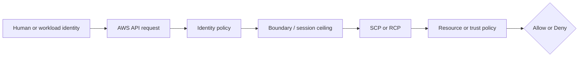
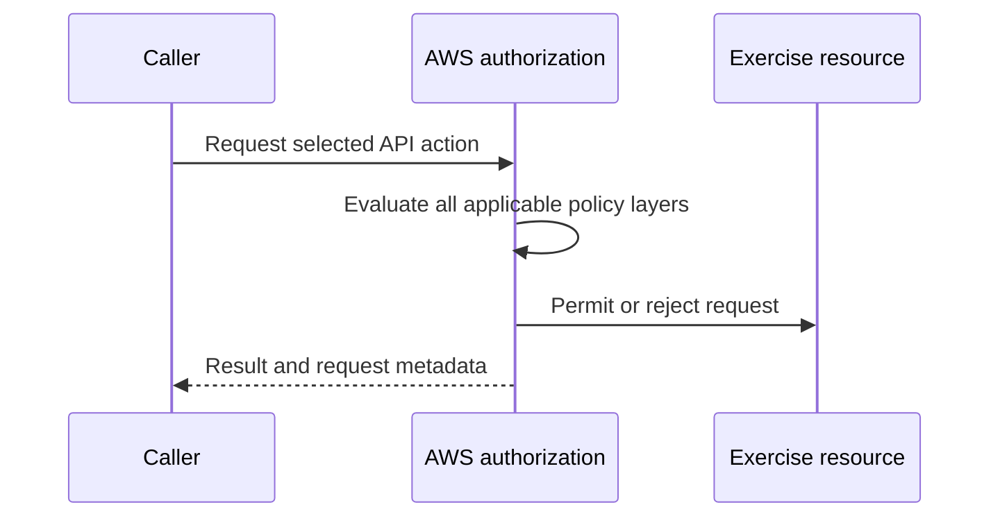

# Week 2 Exercise 12 [Optional] — Unused access analysis

This exercise is classified as **Optional** in the Week 2 curriculum.

Complete the [shared Week 2 setup](../week2-setup.md) first. This exercise uses
a disposable lab account and an independent Terraform state key. It follows the
same safety model as Exercises 1 and 2: predict the decision, deploy the
smallest test fixture, run positive and negative tests, capture CloudTrail
evidence, and remove only disposable resources.

## Table of contents

- [Introduction](#introduction).
- [Learning objectives](#learning-objectives).
- [Terraform configuration and ownership](#terraform-configuration-and-ownership).
  - [Policy/resource excerpt](#policyresource-excerpt).
  - [Permissions-boundary excerpt](#permissions-boundary-excerpt).
- [Configure, initialize, and validate](#configure-initialize-and-validate).
- [Execute the experiment](#execute-the-experiment).
- [Investigating in the Console](#investigating-in-the-console).
- [Evidence and security analysis](#evidence-and-security-analysis).
- [Clean up](#clean-up).
- [References](#references).

## Introduction

This exercise introduces **IAM Access Analyzer unused-access analysis**. You
will create an account-level unused-access analyzer, examine a role with
intentionally broader permissions than the workflow uses, and inspect the
resulting findings. You will then compare Access Analyzer results with the
role's identity policy, permissions boundary, and CloudTrail activity.

The exercise demonstrates how unused-access evidence can support a
least-privilege review. It does not treat Access Analyzer as an automatic
least-privilege decision or as proof that a permission should be removed. A
permission unused during a short observation period may still be required for
infrequent, emergency, or future operations. An Allow in one policy is never
the whole authorization decision; applicable SCPs, boundaries, resource
policies, trust policies, session context, and explicit denies must also be
considered.

It is possible to see no unused-access findings even when the role appears to
have unused permissions. The analyzer may not have completed its first scan or
daily evaluation, the role or policy may be newer than the analyzer's current
observation history, the configured period may not have elapsed, or the
permissions may have been used during that period. Findings can also be
resolved or archived after access or configuration changes. Therefore, an empty
result must be interpreted with the analyzer status, scan timestamps, role
creation and policy-change times, CloudTrail coverage, and the configured
tracking period; it is not by itself proof that every permission is necessary
or that no unused access exists.

The `unused_access_age` Terraform variable sets the number of days an IAM
permission or entity must remain unused before the analyzer reports it. This
exercise defaults it to `1` to make the observation window suitable for a lab,
but AWS still evaluates unused access asynchronously and findings may take
roughly 24–48 hours to appear. A shorter value does not force an immediate
scan. Production environments should normally use a longer, reviewed period
(such as the AWS default of 90 days) so infrequent but legitimate operations
are not mistaken for unnecessary access.



## Learning objectives

- Explain the purpose and limitations of IAM Access Analyzer unused-access analysis.
- Configure an account-level unused-access analyzer and understand its tracking period and asynchronous evaluation.
- Interpret `UnusedIAMRole` and `UnusedPermission` findings.
- Compare unused-access findings with identity policies, permissions boundaries, and CloudTrail evidence.
- Predict both an allowed and a denied operation before running it.
- Explain why “not used during the tracking period” does not mean “never required.”
- Identify production practices such as longer observation periods, exclusions, review workflows, and break-glass handling.
- Avoid using management, Log Archive, or Security Tooling accounts.

## Terraform configuration and ownership

The configuration is in [`terraform/lab/week2/exercise12/main.tf`](../../../../terraform/lab/week2/exercise12/main.tf) and the other Terraform files in that directory. It has an
independent encrypted S3 backend key:

```text
lab/week2/exercise12/terraform.tfstate
```

It uses an IAM Identity Center-backed profile and restricts the AWS provider to
the configured disposable account ID with `allowed_account_ids`. The exercise configuration uses a shell environment file. Copy `.env.example`
to `.env`, replace any placeholders or values you want to customize, and keep
the copied file uncommitted. Never place access keys, tokens, or device codes
in the repository.

From the repository root, use this order before running Terraform:

```bash
source ~/.env/aws-security/terraform/.env
cp terraform/lab/week2/exercise12/.env.example terraform/lab/week2/exercise12/.env
# Edit the copied .env and replace placeholders or desired values.
source terraform/lab/week2/exercise12/.env
```

The global environment must be sourced first because the exercise file refers
to shared values such as `TF_LAB_DEV_ACCOUNT_ID`, `TF_LAB_TEST_ACCOUNT_ID`,
`TF_MANAGEMENT_ACCOUNT_ID`, and `TF_HOME_REGION`.

The exercise state owns only resources under `/week2/exercise12/` and the
explicit fixture resources described by the objective. Existing Control Tower,
Identity Center, baseline, and `AWSReservedSSO_*` resources remain outside its
ownership boundary. The exercise role uses the Dev Lab account principal plus
an `aws:PrincipalArn` condition matching the
`AWSReservedSSO_WorkloadLabAdministrator_*` role path. The generated suffix is
wildcarded safely and is not a Terraform input.

### Policy/resource excerpt

The exercise-specific identity policy is declared in
[`main.tf`](../../../../terraform/lab/week2/exercise12/main.tf):

```hcl
resource "aws_iam_role_policy" "exercise" {
  role = aws_iam_role.exercise.id
  name = "Exercise12Policy"
  policy = jsonencode({
    Version = "2012-10-17"
    Statement = [
      {
        Sid      = "IdentityVerification"
        Effect   = "Allow"
        Action   = ["sts:GetCallerIdentity"]
        Resource = "*"
      },
      {
        Sid    = "IntentionallyOvergrantedLabBucketAccess"
        Effect = "Allow"
        Action = [
          "s3:GetBucketLocation", "s3:ListBucket", "s3:ListBucketVersions",
          "s3:GetObject", "s3:GetObjectVersion", "s3:PutObject",
          "s3:DeleteObject", "s3:DeleteObjectVersion"
        ]
        Resource = [
          "arn:<partition>:s3:::aws-security-week2-*",
          "arn:<partition>:s3:::aws-security-week2-*/*"
        ]
      }
    ]
  })
}
```

The role is deliberately over-granted relative to the workflow: the learner
uses `sts:GetCallerIdentity`, while the bucket-scoped S3 actions remain
available to the identity policy for observation as unused access. The S3
resources are prefix-scoped rather than global. The policy has no explicit
Deny, so `s3:ListAllMyBuckets` is implicitly denied because it has no Allow.
It does not trust any principal; trust is defined separately by the role's
assume-role policy. A permissions boundary is a maximum, not a grant; a
resource policy or trust policy is not a substitute for an identity Allow.

### Permissions-boundary excerpt

The authoritative boundary declaration is
[`workload-lab-role-boundary.json.tftpl`](../../../../terraform/lab/week2/baseline/policies/workload-lab-role-boundary.json.tftpl).
The following excerpt is taken from the original policy JSON template; its
`${partition}`, `${dev_lab_account_id}`, `${test_lab_account_id}`, and
`${lab_bucket_name_prefix}` values are rendered by the baseline Terraform root:

```json
{
  "Version": "2012-10-17",
  "Statement": [
    {
      "Sid": "AllowAssumingBoundedWeekTwoRoles",
      "Effect": "Allow",
      "Action": "sts:AssumeRole",
      "Resource": [
        "arn:${partition}:iam::${dev_lab_account_id}:role/week2/*",
        "arn:${partition}:iam::${test_lab_account_id}:role/week2/*"
      ]
    },
    {
      "Sid": "AllowReadCurrentIdentity",
      "Effect": "Allow",
      "Action": "sts:GetCallerIdentity",
      "Resource": "*"
    },
    {
      "Sid": "AllowWeekTwoLabBucketAccess",
      "Effect": "Allow",
      "Action": [
        "s3:GetBucketLocation",
        "s3:ListBucket",
        "s3:ListBucketVersions",
        "s3:GetObject",
        "s3:GetObjectVersion",
        "s3:PutObject",
        "s3:DeleteObject",
        "s3:DeleteObjectVersion"
      ],
      "Resource": [
        "arn:${partition}:s3:::${lab_bucket_name_prefix}*",
        "arn:${partition}:s3:::${lab_bucket_name_prefix}*/*"
      ]
    }
  ]
}
```

This is a permissions boundary, so it defines a maximum-permissions ceiling;
it does not grant these actions by itself. An identity policy must also allow
an operation, and applicable SCPs, session policies, resource policies, trust
policies, and explicit denies remain additional constraints. The policy is
owned by the baseline Terraform root. Do not edit, import, replace, or destroy
it from this exercise.

#### Boundary analysis

This boundary is associated with any role to which the baseline attaches it.
It allows only the listed `sts:AssumeRole`, identity-verification, and Week 2
S3 operations within the two lab accounts and configured bucket prefix. It
intentionally does not allow arbitrary IAM administration, user or access-key
management, managed-policy creation, or unrestricted access to other services.
Its weak point is that the ceiling still permits the listed role and S3 actions
when a separate identity policy grants them; a boundary cannot prevent an
identity policy from granting an action that the boundary allows. The baseline
owner must therefore protect both the boundary and the policies attached to
bounded roles.


## Configure, initialize, and validate

Authenticate the configured IAM Identity Center profile and verify the account. See [`sso_auth.md`](../../../sso_auth.md) for user enablement, MFA, browser isolation, and CLI login guidance. For the Exercise 1 test users, use the **Create the AWS CLI profiles** section of [`exercise1-instructions.md`](../exercise1/exercise1-instructions.md).

```bash
aws sso login --profile "$TF_VAR_source_aws_profile" --use-device-code --no-browser
aws sts get-caller-identity --profile "$TF_VAR_source_aws_profile"
terraform -chdir=terraform/lab/week2/exercise12 init \
  -backend-config="bucket=$TF_STATE_BUCKET" \
  -backend-config="region=$TF_STATE_REGION" \
  -backend-config="profile=$TF_STATE_PROFILE"
terraform -chdir=terraform/lab/week2/exercise12 validate
terraform -chdir=terraform/lab/week2/exercise12 plan
```

Review the plan before applying. It must not modify organizational governance,
Control Tower resources, Identity Center resources, or unrelated accounts.
Stop for unexplained replacements or deletions.

## Execute the experiment

Apply only the reviewed plan:

```bash
terraform -chdir=terraform/lab/week2/exercise12 apply
echo "role_arn: $(terraform -chdir=terraform/lab/week2/exercise12 output -raw role_arn)"
```

Run the exercise-specific positive and negative tests from the objective. Keep
an evidence table with: caller, action, resource, expected result, actual
result, CloudTrail event ID, and the policy layer that explains it.



For Exercise 12, the central comparison is: **Compare granted permissions with observed use without overclaiming.** Do
not add permissions until the current policy evaluation and CloudTrail evidence
have been documented.

## Investigating in the Console

Use the Dev Lab account session provisioned for the
`WorkloadLabAdministrator` permission set. Do not use the exercise role itself
for inspection: `Week2Exercise12Role` is deliberately narrow and is intended
only to be assumed and tested. If the lab administrator cannot open a console
list page, use a separately approved read-only inspection session; do not add
list or read permissions to the exercise role. Select the configured home
Region (`TF_VAR_aws_region`, normally `us-east-2`) and confirm the Dev Lab
account ID in the account menu before inspecting resources.

### Load the exact identifiers first

The console names below are deterministic, but use the Terraform outputs to
confirm the account, role, and analyzer you deployed rather than relying on a
copied ARN. From the repository root, run:

```bash
EXERCISE_ROOT=terraform/lab/week2/exercise12
echo "account_id: $(aws sts get-caller-identity --profile $TF_VAR_source_aws_profile --query Account --output text)"
echo "role_arn: $(terraform -chdir=$EXERCISE_ROOT output -raw role_arn)"
echo "analyzer_arn: $(terraform -chdir=$EXERCISE_ROOT output -raw analyzer_arn)"
echo "analyzer_name: $(terraform -chdir=$EXERCISE_ROOT output -raw analyzer_name)"
```

The expected role suffix is `role/week2/exercise12/Week2Exercise12Role`; the
expected analyzer name is `Week2Exercise12Analyzer`. If the account or Region
is different, stop and correct the session before using the console.

### Inspect the role and its policies

1. Open **IAM → Roles**. Search for `Week2Exercise12Role`, open the role, and
   confirm its path is `/week2/exercise12/`. Do not select a similarly named
   `AWSReservedSSO_*` role; that is the caller, not the exercise role.
2. On **Summary**, record the role ARN and inspect **Tags**. The role must have
   `Name=Week2Exercise12Role`, `Exercise=12`, `Week=2`, and the project tags.
3. On **Trust relationships**, inspect the JSON. Confirm that `Principal.AWS`
   is the Dev Lab account root ARN, the action is `sts:AssumeRole`, and the
   `aws:PrincipalArn` `ArnLike` condition matches
   `role/aws-reserved/sso.amazonaws.com/<home-region>/AWSReservedSSO_WorkloadLabAdministrator_*`
   (the path omits the Region segment when the home Region is `us-east-1`).
   This condition limits who may assume the role; it does not grant the role's
   S3 or STS permissions.
4. Open **Permissions → Permissions policies** and expand the inline
   `Exercise12Policy`. In the policy JSON, find the `IdentityVerification`
   statement allowing only `sts:GetCallerIdentity` and the
   `IntentionallyOvergrantedLabBucketAccess` statement. Record all eight S3
   actions and confirm its resources are the two
   `arn:<partition>:s3:::aws-security-week2-*` bucket and object patterns,
   rather than `Resource: "*"`. These are identity-policy grants, not proof
   that the actions were used or that they will be needed in the future.
5. In the same **Permissions** view, locate the permissions boundary link
   `/week2/WorkloadLabRoleBoundary`. Open it only for viewing and confirm that
   its `AllowWeekTwoLabBucketAccess` statement contains the same S3 action set
   and bucket-prefix resources. The boundary is owned by
   `terraform/lab/week2/baseline`; it is a maximum-permissions ceiling and
   grants nothing by itself. Do not edit, detach, replace, or delete it.

### Inspect the unused-access analyzer and finding

1. Open **IAM → Access Analyzer → Analyzers** and select
   `Week2Exercise12Analyzer`. Confirm that its analyzer type/scope is
   **Unused access / Account**, its status is **Active**, and its tracking
   period is the value printed by:

   ```bash
   terraform -chdir=terraform/lab/week2/exercise12 output -raw unused_access_age
   ```

   This is the Exercise 12 analyzer, not the `Week2Exercise10Analyzer` external
   access analyzer. The analyzer is account-scoped and reports principals in
   the Dev Lab account; it does not evaluate only this exercise role.
2. Select **Findings** for `Week2Exercise12Analyzer`. Filter the principal or
   resource column for the exact role ARN from `role_arn` (or the suffix
   `role/week2/exercise12/Week2Exercise12Role`) instead of reviewing the noisy
   Control Tower and `AWSReservedSSO_*` findings. Findings are asynchronous:
   with a one-day tracking period, wait for the daily evaluation cycle before
   treating an empty result as meaningful.
3. Open the finding for the exercise role and record its finding ID, status,
   principal ARN, unused action/resource details, first and last observed
   access, and finding creation/update timestamps. After only
   `sts:GetCallerIdentity` has been exercised, the S3 actions should be the
   unused portion; an action that was exercised may move out of the unused
   list after Access Analyzer reevaluates it. Do not interpret a missing
   finding before the evaluation cycle as evidence that all access was used.
4. Compare the finding's action/resource details with the Terraform output
   `exercise_policy_actions` and the `IntentionallyOvergrantedLabBucketAccess`
   statement. A finding demonstrates unused access during this observation
   period; it does not demonstrate that the permission is permanently
   unnecessary. A break-glass delete permission can be required even when it
   is rarely or never used.

### Correlate the tests in CloudTrail

Open **CloudTrail → Event history** in the Dev Lab account and keep the Region
set to the exercise Region. Event history covers management events for a
limited retention period, so set a time range containing the test and use the
following filters separately:

- For the role assumption, filter **Lookup attributes → Event name** to
  `AssumeRole`. Open the event whose request parameters contain the exact
  `Week2Exercise12Role` ARN and session name `Exercise12`. Confirm the caller
  is the `AWSReservedSSO_WorkloadLabAdministrator_*` role, the request was in
  the Dev Lab account, and the event has no `errorCode`.
- For the positive identity test, filter **Event name** to
  `GetCallerIdentity`. Select the event at the test time and inspect
  `userIdentity.arn`, `userIdentity.sessionContext`, `eventTime`, `eventID`,
  `requestID`, and the absence of `errorCode`. The response identity should
  correspond to the assumed `Week2Exercise12Role` session.
- If the optional S3 contrast was performed, do not expect an S3 object event
  in ordinary Event history unless an enabled CloudTrail data-event selector
  covers the exact bucket and object. Verify the selector in **CloudTrail →
  Trails → [approved lab evidence trail] → Event selectors**. Use the
  approved evidence-bucket retrieval procedure in
  [`cloud-trail-logs.md`](../../../cloud-trail-logs.md) for data events; do not change
  the Control Tower trail or infer a denial from a missing event.

For every event, record the event ID, event time, account, Region, caller ARN,
API event name, target resource or request parameters, error code/message, and
request ID. A console `AccessDenied` while loading a list page is an inspection
permission problem, not the negative authorization test. Likewise, an absent
S3 data event without verified selector coverage is a telemetry gap. Correlate
the successful `GetCallerIdentity` event and the later Access Analyzer finding
with the role's inline identity policy and boundary; the identity policy
allows the request, while the boundary merely permits the ceiling.

### Check inherited organization controls without changing them

Only if a separately approved management-account or Organizations read-only
session is available, open **AWS Organizations → Policies → Service control
policies**, select the Dev Lab account, and inspect the SCPs inherited from the
account's OU, parent OUs, and organization root. Record the displayed policy
names and search their JSON for an explicit `Deny` on `sts:GetCallerIdentity`,
`s3:*`, or the specific S3 actions/resources. This exercise creates no SCP and
does not authorize modifying Control Tower or organization policies. An
inherited explicit deny would override the role identity Allow and boundary;
absence of a displayed deny is only meaningful if the correct account and
inheritance levels were inspected.

Console list pages can require permissions outside a deliberately narrow lab
role. An `AccessDenied` from a page is not evidence that the security policy
should be broadened; use the exact Terraform outputs and an approved read-only
inspection session or the CLI instead.

## Evidence and security analysis

Perform the evidence collection with the approved Dev Lab
`WorkloadLabAdministrator` session and the configured home Region. Do not use
management-account, Log Archive, or Security Tooling access for this exercise.
Never print or save access keys, secret keys, session tokens, passwords, or
browser-session artifacts. Before interpreting any result, run:

```bash
export AWS_PROFILE="$TF_VAR_source_aws_profile"
export AWS_REGION="$TF_VAR_aws_region"
export ROLE_ARN="$(terraform -chdir=terraform/lab/week2/exercise12 output -raw role_arn)"
export ANALYZER_ARN="$(terraform -chdir=terraform/lab/week2/exercise12 output -raw analyzer_arn)"
export ANALYZER_NAME="$(terraform -chdir=terraform/lab/week2/exercise12 output -raw analyzer_name)"
export ACCOUNT_ID="$(aws sts get-caller-identity --query Account --output text)"
echo "account_id: $ACCOUNT_ID"
echo "role_arn: $ROLE_ARN"
echo "analyzer_arn: $ANALYZER_ARN"
```

The expected account is `TF_VAR_source_account_id`, the role ARN must end in
`role/week2/exercise12/Week2Exercise12Role`, and the analyzer ARN must identify
`Week2Exercise12Analyzer`. If the identity or Region is wrong, reauthenticate
or correct the profile; that is not an authorization result.

Record one row for each test in an evidence table with the caller ARN, account,
Region, operation, exact resource or request parameters, predicted result,
actual result and exit status, CloudTrail event ID/request ID, Access Analyzer
finding ID where applicable, and the policy layer responsible. Explain each
result using this order:

```text
Explicit deny → SCP/RCP → identity policy → boundary/session policy
             → resource/trust policy → conditions → effective result
```

### Test 1 — Successful role assumption and identity verification

**Prediction.** The Dev Lab `AWSReservedSSO_WorkloadLabAdministrator_*` role is
allowed to assume `Week2Exercise12Role` because the trust policy names the Dev
Lab account root as the AWS principal and constrains `aws:PrincipalArn` to the
WorkloadLabAdministrator role path. Once assumed, `sts:GetCallerIdentity`
succeeds because `Exercise12Policy` contains the `IdentityVerification` Allow
and the boundary contains `AllowReadCurrentIdentity`. The S3 permissions are
not involved in this request.

Use the role-assumption and `GetCallerIdentity` commands from **Execute the
experiment** and retain only the non-secret result fields. The successful
identity response should identify an assumed role session whose ARN contains
`assumed-role/Week2Exercise12Role/Exercise12`; do not copy temporary
credentials into this document or a file.

### Test 2 — Denied ungranted S3 operation

**Prediction.** From that same assumed `Week2Exercise12Role` session, run the
safe read-only operation below. `s3:ListAllMyBuckets` is not in
`Exercise12Policy`, so the request should fail with `AccessDenied` even though
the policy grants several bucket-scoped S3 actions. This is the negative
authorization test: the caller, account, and role stay constant while the
requested action is outside the identity-policy Allow. An expired session,
wrong account, missing AWS CLI configuration, or network failure is not a valid
negative result.

```bash
aws s3api list-buckets --query 'Buckets[].Name' --output json
status=$?
if [ "$status" -eq 0 ]; then
  echo "UNEXPECTED SUCCESS: s3:ListAllMyBuckets was not denied" >&2
  exit 1
fi
echo "expected denial exit_status: $status"
```

Record the exact AWS error code/message. Do not infer that the S3 actions in
`IntentionallyOvergrantedLabBucketAccess` are denied: they are inside the
boundary ceiling and may be authorized when a matching bucket exists. The
negative test demonstrates the identity-policy implicit deny for a different
S3 action.

### Retrieve the exercise role and trust policy

Use this command to retrieve the authoritative role configuration after the
positive and negative tests:

```bash
aws iam get-role --role-name Week2Exercise12Role --query 'Role.{Arn:Arn,Path:Path,RoleName:RoleName,PermissionsBoundary:PermissionsBoundary.Arn,AssumeRolePolicy:AssumeRolePolicy}' --output json
```

Inspect `Path`, `Arn`, and `PermissionsBoundary`. URL-decode the displayed
`AssumeRolePolicyDocument` if necessary and record `Principal.AWS` as the Dev
Lab account root, `Action` as `sts:AssumeRole`, and the
`aws:PrincipalArn` `ArnLike` value matching
`AWSReservedSSO_WorkloadLabAdministrator_*`. This explains the successful
assumption and excludes other principals; it does not grant permissions after
assumption.

Retrieve the role tags separately:

```bash
aws iam list-role-tags --role-name Week2Exercise12Role --query 'Tags[?Key==`Name` || Key==`Exercise` || Key==`Week` || Key==`Project` || Key==`ManagedBy`]' --output table
```

Record `Name=Week2Exercise12Role`, `Exercise=12`, and the expected project and
Week 2 values. Tags identify the fixture but are not authorization controls
for this role.

### Retrieve the exact identity policy

Retrieve the inline policy that grants the tested operations:

```bash
aws iam get-role-policy --role-name Week2Exercise12Role --policy-name Exercise12Policy --output json
```

Record both statement SIDs. `IdentityVerification` must allow only
`sts:GetCallerIdentity` on `*`. `IntentionallyOvergrantedLabBucketAccess` must
contain the eight S3 actions (`GetBucketLocation`, `ListBucket`,
`ListBucketVersions`, `GetObject`, `GetObjectVersion`, `PutObject`,
`DeleteObject`, and `DeleteObjectVersion`) and the bucket/object resources
under `aws-security-week2-*`. This identity policy answers what the role may
request; it does not establish trust and does not prove that any action was
used. The expected negative test is explained by the absence of
`s3:ListAllMyBuckets`.

### Retrieve the permissions boundary ceiling

The boundary is owned by the separate baseline root. Retrieve it read-only and
record its default policy version:

```bash
export BOUNDARY_ARN="arn:${AWS_PARTITION:-aws}:iam::$ACCOUNT_ID:policy/week2/WorkloadLabRoleBoundary"
export BOUNDARY_VERSION="$(aws iam get-policy --policy-arn "$BOUNDARY_ARN" --query 'Policy.DefaultVersionId' --output text)"
aws iam get-policy --policy-arn "$BOUNDARY_ARN" --query 'Policy.{Arn:Arn,Path:Path,DefaultVersionId:DefaultVersionId}' --output json
aws iam get-policy-version --policy-arn "$BOUNDARY_ARN" --version-id "$BOUNDARY_VERSION" --output json
```

If the partition is not `aws`, set `AWS_PARTITION` from the account ARN before
running the command. Confirm the `AllowWeekTwoLabBucketAccess` statement and
its eight S3 actions/resources, plus `AllowReadCurrentIdentity`. The boundary
is a maximum-permissions ceiling, not a grant: the identity policy must also
allow the request, and SCPs, session policies, resource policies, and explicit
denies remain applicable. Do not alter this policy or detach it from the role.

### Retrieve the analyzer configuration and findings

Confirm that Terraform created the correct analyzer rather than the
Exercise 10 external-access analyzer:

```bash
aws accessanalyzer get-analyzer --profile "$TF_VAR_source_aws_profile" --analyzer-name "$(terraform -chdir=terraform/lab/week2/exercise12 output -raw analyzer_name)" --query 'analyzer.{Arn:arn,Name:name,Type:type,Status:status,Configuration:configuration,CreatedAt:createdAt,UpdatedAt:updatedAt}' --output json
```

Record `Type=ACCOUNT_UNUSED_ACCESS`, `Status=ACTIVE`, the configured
`unused_access_age`, and the analyzer ARN/account. Configuration is account
scoped; this analyzer also reports unrelated Control Tower and
`AWSReservedSSO_*` principals, so filter to the exact exercise role.

After the tracking period and daily evaluation cycle, retrieve the role's
findings:

```bash
aws accessanalyzer list-findings-v2 --profile "$TF_VAR_source_aws_profile" --analyzer-arn "$ANALYZER_ARN" --filter "{\"resource\":{\"eq\":[\"$ROLE_ARN\"]}}" --query 'findings[].{Id:id,Status:status,Resource:resource,ResourceType:resourceType,FindingType:findingType,CreatedAt:createdAt,AnalyzedAt:analyzedAt,UpdatedAt:updatedAt}' --output table
```

Record the finding ID, status, resource role ARN, resource type, finding type,
and creation/analysis/update timestamps. For each returned ID, retrieve the complete finding
because the table view can hide nested access details:

```bash
FINDING_ID="<copy-the-finding-id-from-the-previous-command>"
aws accessanalyzer get-finding-v2 --profile "$TF_VAR_source_aws_profile" --analyzer-arn "$ANALYZER_ARN" --id "$FINDING_ID" --output json
```

Do not put credentials or session tokens in `FINDING_ID`; it is only the
non-secret finding identifier. Record `findingType`, `status`, `resource`,
`findingDetails`, `analyzedAt`, `createdAt`, and `updatedAt`. For an
unused-permission finding, inspect the localized `findingDetails` content and
record the unused actions/resources reported there. After only
`sts:GetCallerIdentity` was exercised, the S3 grants should appear in those
finding details once Access Analyzer has reevaluated the role. If an S3 action was optionally exercised, compare the
finding after reevaluation and record which action/resource remains unused.
An empty result before the evaluation cycle is an asynchronous telemetry state,
not proof that no unused access exists. A finding means **unused during this
observation period**, never **will never be required**; for example, a
break-glass delete operation can be necessary despite having no recent use.

#### If the exercise role has no finding yet

An empty filtered result is expected until all of the following are true:

1. The console or CLI is operating in the Dev Lab account named by
   `TF_VAR_source_account_id`, not the management account or another lab
   account.
2. The selected Region is the analyzer's home Region and `get-analyzer`
   reports `Type=ACCOUNT_UNUSED_ACCESS` and `Status=ACTIVE`.
3. The analyzer was created at least `unused_access_age` days ago and AWS's
   daily unused-access evaluation has completed. With the default age of one
   day, allow roughly 24–48 hours after analyzer creation and role use; the
   one-day value does not cause an immediate scan.
4. The role was actually assumed as `Week2Exercise12Role` and the successful
   `GetCallerIdentity` test was run. Confirm the role ARN in CloudTrail rather
   than treating an expired or wrong-profile session as use.

Run these checks before changing Terraform:

```bash
aws sts get-caller-identity --query '{Account:Account,Arn:Arn}' --output json
aws accessanalyzer get-analyzer --profile "$TF_VAR_source_aws_profile" --analyzer-name "$ANALYZER_NAME" --query 'analyzer.{Arn:arn,Name:name,Type:type,Status:status,CreatedAt:createdAt,UpdatedAt:updatedAt,Configuration:configuration}' --output json
aws accessanalyzer list-findings-v2 --profile "$TF_VAR_source_aws_profile" --analyzer-arn "$ANALYZER_ARN" --query 'findings[].{Id:id,Type:findingType,Resource:resource,ResourceType:resourceType,AnalyzedAt:analyzedAt,UpdatedAt:updatedAt}' --output json
```

The unfiltered command distinguishes “no finding exists yet” from an
incorrect resource filter. For V2 unused-access findings, the role ARN is in
`resource`; the summary does not expose the V1 `principal` or
`unusedPermissions` fields. Use the account statistics as another check:

```bash
aws accessanalyzer get-findings-statistics --profile "$TF_VAR_source_aws_profile" --analyzer-arn "$ANALYZER_ARN" --output json
```

If it returns findings for other resources but not the
`Week2Exercise12Role` ARN, verify the exact role ARN returned by `get-role` and
wait for the next evaluation cycle. If the statistics report zero unused
findings while IAM **Last accessed** says **Not accessed in the tracking
period**, do not treat those console labels as contradictory: IAM Last Accessed
is Access Advisor telemetry, while Access Analyzer publishes discrete finding
records only after its unused-access scan. Confirm the analyzer's creation and
last-update times and allow the full tracking period plus the daily scan. If
the analyzer is not `ACTIVE`, or its type/name/account is wrong, stop and
correct the session or Terraform configuration rather than recreating
analyzers. The account permits
only one unused-access analyzer, and deleting/recreating it resets the
observation window and deletes its findings.

### Retrieve CloudTrail evidence for the tests

The role assumption and STS calls are management events. Query the Dev Lab
account's Event history for the test window:

```bash
aws cloudtrail lookup-events --lookup-attributes AttributeKey=EventName,AttributeValue=AssumeRole --max-results 50 --output json
```

Inspect each returned `CloudTrailEvent` and select the event whose
`requestParameters.roleArn` is exactly `$ROLE_ARN` and whose
`requestParameters.roleSessionName` is `Exercise12`. Record `eventID`,
`eventTime`, `eventSource=sts.amazonaws.com`, `eventName=AssumeRole`,
`userIdentity.arn`, `recipientAccountId`, `requestID`, and the absence of
`errorCode`. Ignore unrelated role assumptions with similar names.

Retrieve the successful identity call:

```bash
aws cloudtrail lookup-events --lookup-attributes AttributeKey=EventName,AttributeValue=GetCallerIdentity --max-results 50 --output json
```

Select the event at the test time whose `userIdentity.arn` identifies the
`Week2Exercise12Role` assumed-role session. Record `eventID`, `eventTime`,
`awsRegion`, `userIdentity.sessionContext`, `requestID`, and the absence of an
`errorCode`. This management event corroborates the successful positive test;
it does not show that the uncalled S3 actions were needed or unnecessary.

Retrieve the denied operation separately:

```bash
aws cloudtrail lookup-events --lookup-attributes AttributeKey=EventName,AttributeValue=ListBuckets --max-results 50 --output json
```

Select the event for the same assumed-role session and inspect
`userIdentity.arn`, `eventTime`, `eventSource=s3.amazonaws.com`,
`eventName=ListBuckets`, `errorCode=AccessDenied`, `errorMessage`, and
`requestID`. If no matching event exists, record a telemetry gap rather than
claiming the denial from the missing event; verify that the event was run in
the configured account and that CloudTrail management-event history covered
its timestamp.

An optional S3 bucket operation is a data event, not a normal management event.
Do not use a missing Event history entry as evidence for it. Before relying on
that evidence, verify the approved lab evidence trail's **Event selectors**
cover the exact existing `aws-security-week2-*` bucket in **CloudTrail →
Trails**. Retrieve matching delivered records using the commands in
[`cloud-trail-logs.md`](../../../cloud-trail-logs.md), filtering for the exact assumed
role ARN, S3 action, bucket/object ARN, timestamp, and event ID. Do not modify
the Control Tower-managed trail or the evidence configuration for this
exercise.

### Correlation and security conclusion

Complete a table like this, with one row for the positive test, negative test,
and each observed finding:

| Test or observation | Principal/account/Region | Action and resource | Prediction | Actual result | CloudTrail/finding ID | Determining policy layer |
| --- | --- | --- | --- | --- | --- | --- |
| Assume role and `GetCallerIdentity` | `AWSReservedSSO_WorkloadLabAdministrator_*` → Dev Lab role | `sts:AssumeRole`, `sts:GetCallerIdentity` | Allowed | Record result | Record event IDs | Trust policy, identity policy, boundary |
| Unapproved S3 API | Assumed `Week2Exercise12Role` in Dev Lab | `s3:ListAllMyBuckets` | Denied | Record `AccessDenied` | Record event ID | Identity-policy implicit deny |
| Unused-access finding | `Week2Exercise12Role` in Dev Lab | Unused S3 grants | Finding after evaluation | Record finding | Record finding ID | Access Analyzer observation |

Conclude by comparing `exercise_policy_actions` with the actions in the
finding and with the CloudTrail events. The role was intentionally granted
more than the observed workflow used, while the boundary kept those grants
within the approved ceiling. A permissions boundary cannot remediate unused
grants; it only limits what the identity policy can grant. In production,
retain the 90-day default unless a reviewed shorter period is justified, use
archive/exclusion rules for known slow or break-glass principals, and combine
findings with business context, break-glass requirements, CloudTrail coverage,
and a longer observation period before removing access. CloudTrail and Access
Analyzer are evidence sources with coverage and latency limits, not proof that
an unused permission can never be required.

## Clean up

Preserve redacted evidence, then review and execute only the exercise destroy:

```bash
terraform -chdir=terraform/lab/week2/exercise12 plan -destroy
terraform -chdir=terraform/lab/week2/exercise12 destroy
```

Never destroy the Week 2 baseline boundary, Control Tower resources, Identity
Center assignments, or another exercise's state. Confirm the state key is
empty, remove temporary access, and verify `git status` before committing.

## References

- [IAM policy evaluation logic](https://docs.aws.amazon.com/IAM/latest/UserGuide/reference_policies_evaluation-logic.html).
- [IAM permissions boundaries](https://docs.aws.amazon.com/IAM/latest/UserGuide/access_policies_boundaries.html).
- [IAM roles and trust policies](https://docs.aws.amazon.com/IAM/latest/UserGuide/id_roles.html).
- [IAM Identity Center](https://docs.aws.amazon.com/singlesignon/latest/userguide/what-is.html).
- [AWS CloudTrail event history](https://docs.aws.amazon.com/awscloudtrail/latest/userguide/view-cloudtrail-events.html).
- [AWS STS](https://docs.aws.amazon.com/STS/latest/APIReference/welcome.html).
- [IAM Access Analyzer unused access analysis](https://docs.aws.amazon.com/IAM/latest/UserGuide/access-analyzer-findings.html).
- [AWS CLI Access Analyzer commands](https://docs.aws.amazon.com/cli/latest/reference/accessanalyzer/index.html).
- [AWS IAM service authorization reference](https://docs.aws.amazon.com/service-authorization/latest/reference/reference_policies_actions-resources-contextkeys.html).
