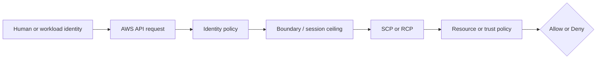
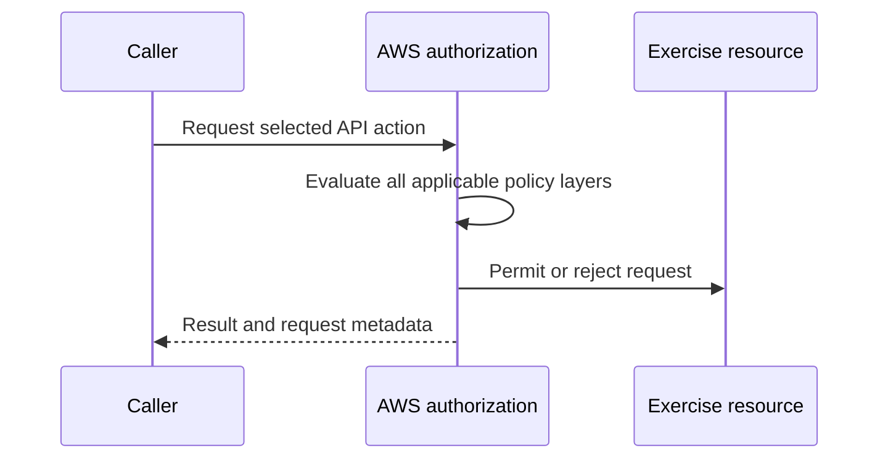

# Week 2 Exercise 13 [Optional] — IAM Allow versus SCP Deny

This exercise is classified as **Optional** in the Week 2 curriculum.

Complete the [shared Week 2 setup](../week2-setup.md) first. This exercise uses
a disposable lab account and an independent Terraform state key. It follows the
same safety model as Exercises 1 and 2: predict the decision, deploy the
smallest test fixture, run positive and negative tests, capture CloudTrail
evidence, and remove only disposable resources.

## Table of contents

- [Introduction](#introduction).
- [Learning objectives](#learning-objectives).
- [Terraform configuration and ownership](#terraform-configuration-and-ownership).
  - [Policy/resource excerpt](#policyresource-excerpt).
  - [Permissions-boundary excerpt](#permissions-boundary-excerpt).
- [Configure, initialize, and validate](#configure-initialize-and-validate).
- [Execute the experiment](#execute-the-experiment).
- [Investigating in the Console](#investigating-in-the-console).
- [Evidence and security analysis](#evidence-and-security-analysis).
- [Clean up](#clean-up).
- [References](#references).

## Introduction

This exercise focuses on **Organizations policy evaluation**. Its objective is to show an SCP explicit deny overriding an identity Allow. An Allow
in one policy is never the whole authorization decision; applicable SCPs,
boundaries, resource policies, trust policies, session context, and explicit
denies must also be considered.



## Learning objectives

- Explain the policy layer being tested and its limits.
- Predict both an allowed and a denied operation before running it.
- Avoid using management, Log Archive, or Security Tooling accounts.
- Attribute the result using CloudTrail and the effective policy set.
- Document residual risk and a production hardening measure.

## Terraform configuration and ownership

The configuration is in [`terraform/lab/week2/exercise13/main.tf`](../../../../terraform/lab/week2/exercise13/main.tf) and the other Terraform files in that directory. It has an
independent encrypted S3 backend key:

```text
lab/week2/exercise13/terraform.tfstate
```

It uses an IAM Identity Center-backed profile and restricts the AWS provider to
the configured disposable account ID with `allowed_account_ids`. The exercise configuration uses a shell environment file. Copy `.env.example`
to `.env`, replace any placeholders or values you want to customize, and keep
the copied file uncommitted. Never place access keys, tokens, or device codes
in the repository.

From the repository root, use this order before running Terraform:

```bash
source ~/.env/aws-security/terraform/.env
cp terraform/lab/week2/exercise13/.env.example terraform/lab/week2/exercise13/.env
# Edit the copied .env and replace placeholders or desired values.
source terraform/lab/week2/exercise13/.env
```

The global environment must be sourced first because the exercise file refers
to shared values such as `TF_LAB_DEV_ACCOUNT_ID`, `TF_LAB_TEST_ACCOUNT_ID`,
`TF_MANAGEMENT_ACCOUNT_ID`, and `TF_HOME_REGION`.

The exercise state owns only resources under `/week2/exercise13/` and the
explicit fixture resources described by the objective. Existing Control Tower,
Identity Center, baseline, and `AWSReservedSSO_*` resources remain outside its
ownership boundary. The exercise role uses the Dev Lab account principal plus
an `aws:PrincipalArn` condition matching the
`AWSReservedSSO_WorkloadLabAdministrator_*` role path. This suffix-resilient
trust remains separate from the SCP policy layer under test.

### Policy/resource excerpt

The exercise role's inline policy contains the identity Allow tested by this
exercise:

```hcl
resource "aws_iam_role_policy" "exercise" {
  role = aws_iam_role.exercise.id
  name = "Exercise13Policy"
  policy = jsonencode({
    Version = "2012-10-17"
    Statement = [
      {
        Sid      = "IdentityVerification"
        Effect   = "Allow"
        Action   = ["sts:GetCallerIdentity"]
        Resource = "*"
      },
      {
        Sid    = "AllowExercise13BucketAccess"
        Effect = "Allow"
        Action = [
          "s3:GetBucketLocation",
          "s3:ListBucket",
          "s3:GetObject",
          "s3:PutObject",
        ]
        Resource = [
          aws_s3_bucket.exercise.arn,
          "${aws_s3_bucket.exercise.arn}/*",
        ]
      },
    ]
  })
}
```

The role itself is trusted separately by an account-root principal constrained
with `aws:PrincipalArn` to the `AWSReservedSSO_WorkloadLabAdministrator_*`
role path. The policy has no explicit Deny: `s3:PutObject` is intentionally
allowed here so that the account-level SCP can provide the contrasting deny.
A permissions boundary is a maximum, not a grant; a resource policy or trust
policy is not a substitute for an identity Allow.

#### Policy/resource analysis

The inline policy is attached to the exercise role, so its principal is that
role's session. It allows identity verification and four S3 actions only on the
exercise bucket and its objects. The bucket actions are deliberately narrower
than the full boundary ceiling. In particular, the identity policy continues
to allow `s3:PutObject` when the SCP is enabled; the SCP is the policy layer
that changes the result. Always compare this excerpt with the role trust
policy, permissions boundary, and the complete declaration in
[`main.tf`](../../../../terraform/lab/week2/exercise13/main.tf).

### Permissions-boundary excerpt

The authoritative boundary declaration is
[`workload-lab-role-boundary.json.tftpl`](../../../../terraform/lab/week2/baseline/policies/workload-lab-role-boundary.json.tftpl).
The following excerpt is taken from the original policy JSON template; its
`${partition}`, `${dev_lab_account_id}`, `${test_lab_account_id}`, and
`${lab_bucket_name_prefix}` values are rendered by the baseline Terraform root:

```json
{
  "Version": "2012-10-17",
  "Statement": [
    {
      "Sid": "AllowAssumingBoundedWeekTwoRoles",
      "Effect": "Allow",
      "Action": "sts:AssumeRole",
      "Resource": [
        "arn:${partition}:iam::${dev_lab_account_id}:role/week2/*",
        "arn:${partition}:iam::${test_lab_account_id}:role/week2/*"
      ]
    },
    {
      "Sid": "AllowReadCurrentIdentity",
      "Effect": "Allow",
      "Action": "sts:GetCallerIdentity",
      "Resource": "*"
    },
    {
      "Sid": "AllowWeekTwoLabBucketAccess",
      "Effect": "Allow",
      "Action": [
        "s3:GetBucketLocation",
        "s3:ListBucket",
        "s3:ListBucketVersions",
        "s3:GetObject",
        "s3:GetObjectVersion",
        "s3:PutObject",
        "s3:DeleteObject",
        "s3:DeleteObjectVersion"
      ],
      "Resource": [
        "arn:${partition}:s3:::${lab_bucket_name_prefix}*",
        "arn:${partition}:s3:::${lab_bucket_name_prefix}*/*"
      ]
    }
  ]
}
```

This is a permissions boundary, so it defines a maximum-permissions ceiling;
it does not grant these actions by itself. An identity policy must also allow
an operation, and applicable SCPs, session policies, resource policies, trust
policies, and explicit denies remain additional constraints. The policy is
owned by the baseline Terraform root. Do not edit, import, replace, or destroy
it from this exercise.

#### Boundary analysis

This boundary is associated with any role to which the baseline attaches it.
It allows only the listed `sts:AssumeRole`, identity-verification, and Week 2
S3 operations within the two lab accounts and configured bucket prefix. It
intentionally does not allow arbitrary IAM administration, user or access-key
management, managed-policy creation, or unrestricted access to other services.
Its weak point is that the ceiling still permits the listed role and S3 actions
when a separate identity policy grants them; a boundary cannot prevent an
identity policy from granting an action that the boundary allows. The baseline
owner must therefore protect both the boundary and the policies attached to
bounded roles.


## Configure, initialize, and validate

Authenticate both the configured Dev Lab IAM Identity Center profile and the approved Organizations management-account profile. The source session creates the role and bucket; the management session is required to read and manage the exercise SCP. See [`sso_auth.md`](../../../sso_auth.md) for user enablement, MFA, browser isolation, and CLI login guidance. Never use the bounded lab permission set for Organizations administration.

If the management profile is IAM Identity Center-backed, log it in separately;
if it is the approved temporary `ct-bootstrap` profile, use its already
configured short-lived or otherwise approved credentials instead. Never copy
credentials into this exercise or use the source profile for Organizations
administration.

```bash
aws sso login --profile "$TF_VAR_source_aws_profile" --use-device-code --no-browser
# Run this too when the management profile uses IAM Identity Center:
# aws sso login --profile "$TF_VAR_management_aws_profile" --use-device-code --no-browser
aws sts get-caller-identity --profile "$TF_VAR_source_aws_profile"
aws sts get-caller-identity --profile "$TF_VAR_management_aws_profile"
test "$(aws sts get-caller-identity --profile "$TF_VAR_source_aws_profile" --query Account --output text)" = "$TF_VAR_source_account_id"
test "$(aws sts get-caller-identity --profile "$TF_VAR_management_aws_profile" --query Account --output text)" = "$TF_VAR_management_account_id"
terraform -chdir=terraform/lab/week2/exercise13 init \
  -backend-config="bucket=$TF_STATE_BUCKET" \
  -backend-config="region=$TF_STATE_REGION" \
  -backend-config="profile=$TF_STATE_PROFILE"
terraform -chdir=terraform/lab/week2/exercise13 validate
terraform -chdir=terraform/lab/week2/exercise13 plan
```

Keep `TF_VAR_scp_deny_enabled=false` for the initial apply and positive test. After recording that result, set it to `true`, source `.env` again, and apply the reviewed plan to attach the named account-level SCP. Repeat the exact request and record `AccessDenied`, then set it back to `false` (or narrow `TF_VAR_scp_deny_actions`) and apply to prove recovery. Each toggle plan must contain only the exercise SCP and attachment changes; it must not modify Control Tower or other organizational resources.

Review the plan before applying. It must not modify organizational governance,
Control Tower resources, Identity Center resources, or unrelated accounts.
Stop for unexplained replacements or deletions.

## Execute the experiment

Apply only the reviewed plan:

```bash
terraform -chdir=terraform/lab/week2/exercise13 apply
echo "role_arn: $(terraform -chdir=terraform/lab/week2/exercise13 output -raw role_arn)"
```

Run the exercise-specific positive and negative tests from the objective. Keep
an evidence table with: caller, action, resource, expected result, actual
result, CloudTrail event ID, and the policy layer that explains it.



For Exercise 13, the central comparison is: **Show an scp explicit deny overriding an identity allow.** Do
not add permissions until the current policy evaluation and CloudTrail evidence
have been documented.

## Detailed test procedure

### Load the exact identifiers first

The commands below use the fixture names defined in
[`main.tf`](../../../../terraform/lab/week2/exercise13/main.tf). Load the
authoritative identifiers from Terraform outputs instead of copying example
ARNs; if an output is unavailable, the exercise root has not been applied yet.
From the repository root, run:

```bash
export EXERCISE_ROOT=terraform/lab/week2/exercise13
export EXERCISE13_ROLE_ARN="$(terraform -chdir=$EXERCISE_ROOT output -raw role_arn)"
export EXERCISE13_BUCKET_NAME="$(terraform -chdir=$EXERCISE_ROOT output -raw bucket_name)"
export EXERCISE13_BUCKET_ARN="$(terraform -chdir=$EXERCISE_ROOT output -raw bucket_arn)"
echo "account_id: $(aws sts get-caller-identity --profile $TF_VAR_source_aws_profile --query Account --output text)"
echo "scp_deny_enabled: $(terraform -chdir=$EXERCISE_ROOT output -raw scp_deny_enabled)"
```

The account must equal `TF_VAR_source_account_id`, the role ARN must end in
`role/week2/exercise13/Week2Exercise13Role`, the bucket name must match the
`aws-security-week2-*` exercise bucket, and `scp_deny_enabled` reports whether
the SCP deny is currently attached (`false` at the start of the exercise). If
the account is different, stop and correct the session; that is not an
authorization result.

### Configure the exercise-role test session

Assume the exercise role through a CLI role-chain profile rooted in the
authenticated `week2-source` SSO session, following the pattern of the
Exercise 1 role profiles. Add this entry to `~/.aws/config`; it holds no
credentials:

```ini
[profile week2-exercise13]
source_profile = week2-source
role_arn = <role_arn printed above corresponding to EXERCISE13_ROLE_ARN>
role_session_name = Exercise13
region = us-east-2
```

Verify the session before testing:

```bash
aws sts get-caller-identity --profile week2-exercise13
```

The expected ARN ends in
`assumed-role/Week2Exercise13Role/Exercise13` inside the Dev Lab account.
This request is allowed by the role trust policy and the operator permission
set; it is not the layer under test.

### Test 1 — Allowed object write with no SCP deny

**Prediction.** With `TF_VAR_scp_deny_enabled=false`, `s3:PutObject` on the
exercise bucket is **allowed**: the `AllowExercise13BucketAccess` statement in
the role's inline identity policy grants it, the
`/week2/WorkloadLabRoleBoundary` ceiling permits it, no resource policy blocks
it, and no SCP explicit deny is attached.

```bash
export EXERCISE13_TMP="$(mktemp -d)"
chmod 700 "$EXERCISE13_TMP"
printf 'Week 2 Exercise 13 SCP-deny fixture object.\n' > "$EXERCISE13_TMP/test.txt"
aws s3api put-object \
  --profile week2-exercise13 \
  --bucket "$EXERCISE13_BUCKET_NAME" \
  --key "exercise13/test.txt" \
  --body "$EXERCISE13_TMP/test.txt" \
  --no-cli-pager
```

Expected result: exit status `0` and an `ETag` response. Record it as the
positive baseline: the same caller, account, bucket, key, and command will be
repeated unchanged in Test 2, so the only difference under test is the SCP
attachment.

### Test 2 — Denied object write under the SCP explicit deny

First attach the deny. In the copied `.env`, set
`TF_VAR_scp_deny_enabled="true"`, source the file again, and apply only the
reviewed change:

```bash
source "$EXERCISE_ROOT/.env"
terraform -chdir=$EXERCISE_ROOT plan
terraform -chdir=$EXERCISE_ROOT apply
```

The plan must show only the creation of
`Week2Exercise13DenyS3ObjectWrites` and its attachment to the Dev Lab account.
Any other Organizations, OU, or Control Tower change is a stop condition.

**Prediction.** The same `s3:PutObject` request is now **denied**: the identity
policy still allows it, the boundary still permits it, but the SCP explicitly
denies `s3:PutObject` on the bucket's objects, and an explicit deny overrides
every applicable Allow.

```bash
if aws s3api put-object \
  --profile week2-exercise13 \
  --bucket "$EXERCISE13_BUCKET_NAME" \
  --key "exercise13/test.txt" \
  --body "$EXERCISE13_TMP/test.txt" \
  --no-cli-pager; then
  echo "UNEXPECTED SUCCESS: the SCP explicit deny did not block s3:PutObject." >&2
fi
```

Expected result: the CLI takes the `then`-failure path with
`AccessDenied` when calling the `PutObject` operation; the snippet above
reports an unexpected success loudly instead. Before attributing the denial
to the SCP, confirm with `aws sts get-caller-identity --profile week2-exercise13`
that the session is still valid, and use the SCP retrieval below to confirm the
policy is attached. Record the exact error code and message.

### Test 3 — Unrelated action on the same bucket while the deny is attached

**Prediction.** While the deny is attached, a *different* action on the same
bucket is still **allowed**: `s3:ListBucket` is granted by the identity
policy, permitted by the boundary, and the SCP denies only the actions listed
in `scp_deny_actions`. This proves the deny is action-scoped rather than a
bucket-wide or account-wide lockout.

```bash
aws s3api list-objects-v2 \
  --profile week2-exercise13 \
  --bucket "$EXERCISE13_BUCKET_NAME" \
  --query 'Contents[].{Key:Key,Size:Size}' \
  --output table \
  --no-cli-pager
```

Expected result: exit status `0` and the `exercise13/test.txt` object from
Test 1. If this also fails, the denial is broader than intended; stop and
inspect the effective SCP set before continuing.

### Test 4 — Access returns after removing or narrowing the deny

**Prediction.** After the SCP deny is removed, the original `s3:PutObject`
request is **allowed** again with no identity-policy or boundary change.

In the copied `.env`, set `TF_VAR_scp_deny_enabled="false"` (removal) or
narrow the deny, for example `TF_VAR_scp_deny_actions='["s3:GetObject"]'`
(narrowing). Source the file again, review the plan — it must change only the
SCP content, the attachment, or both — apply, and repeat the exact Test 1
command. Expected result: exit status `0` with an `ETag` response under
removal, and the same success under narrowing because `s3:PutObject` is no
longer in the denied set. Record which recovery variant was used.

## Investigating in the Console

Use IAM Identity Center access-portal sessions, not IAM user keys, and keep
separate browser contexts for the two sessions this exercise needs:

| Purpose | Account | Permission set |
|---|---|---|
| Inspect the exercise role, bucket, and CloudTrail events | Dev Lab/source | `WorkloadLabAdministrator` |
| Inspect the exercise SCP and inherited organization policies | Management account | An approved Organizations administrative or read session |

Do not use the exercise role's own session for console inspection:
`Week2Exercise13Role` is deliberately narrow and intended only to be assumed
and tested. In each console, select the configured home Region
(`TF_VAR_aws_region`, defaulting to `us-east-2`) and verify the account ID and
permission-set role in the account menu before inspecting anything. For the
management-account session, the account ID must equal
`TF_MANAGEMENT_ACCOUNT_ID`; stop if it does not.

### Load the exact identifiers first

The console names below are deterministic, but use the Terraform outputs to
confirm the account, role, and bucket you deployed rather than relying on a
copied ARN. From the repository root, run:

```bash
EXERCISE_ROOT=terraform/lab/week2/exercise13
echo "account_id: $(aws sts get-caller-identity --profile $TF_VAR_source_aws_profile --query Account --output text)"
echo "role_arn: $(terraform -chdir=$EXERCISE_ROOT output -raw role_arn)"
echo "bucket_name: $(terraform -chdir=$EXERCISE_ROOT output -raw bucket_name)"
echo "scp_deny_enabled: $(terraform -chdir=$EXERCISE_ROOT output -raw scp_deny_enabled)"
```

The expected account is `TF_VAR_source_account_id`, the role suffix is
`role/week2/exercise13/Week2Exercise13Role`, the bucket is the
`aws-security-week2-*` exercise bucket, and `scp_deny_enabled` reports whether
the SCP deny is currently attached. If the account or Region is different,
stop and correct the session before using the console.

### Inspect the exercise role and its policies

In the Dev Lab console, open **IAM → Access management → Roles**:

1. Search for `Week2Exercise13Role` and confirm its path is
   `/week2/exercise13/`. Do not select a similarly named `AWSReservedSSO_*`
   role; that is the caller, not the exercise role.
2. On **Summary**, record the role ARN and inspect **Tags**. The role must
   have `Name=Week2Exercise13Role`, `Exercise=13`, `Week=2`, and the project
   tags.
3. On **Trust relationships**, inspect the JSON. Confirm that `Principal.AWS`
   is the Dev Lab account root ARN, the action is `sts:AssumeRole`, and the
   `aws:PrincipalArn` `ArnLike` condition matches
   `role/aws-reserved/sso.amazonaws.com/<home-region>/AWSReservedSSO_WorkloadLabAdministrator_*`
   (the path omits the Region segment when the home Region is `us-east-1`).
   This condition limits who may assume the role; it does not grant the
   role's S3 or STS permissions.
4. Open **Permissions → Permissions policies** and expand the inline
   `Exercise13Policy`. Find the `IdentityVerification` statement allowing only
   `sts:GetCallerIdentity` on `*`, and the `AllowExercise13BucketAccess`
   statement with its four S3 actions (`GetBucketLocation`, `ListBucket`,
   `GetObject`, `PutObject`) and the exercise bucket/object ARNs rather than
   `Resource: "*"`. This identity policy still **allows** `s3:PutObject` even
   while the write test is denied; inspecting it here proves the denial did
   not come from this layer.
5. In the same **Permissions** view, locate the permissions boundary link
   `/week2/WorkloadLabRoleBoundary`. Open it only for viewing and confirm
   that its `AllowWeekTwoLabBucketAccess` statement contains `s3:PutObject`
   for the `aws-security-week2-*` resources. The boundary is owned by
   `terraform/lab/week2/baseline`; it is a maximum-permissions ceiling and
   grants nothing by itself. It permitted the write in both the allowed and
   the denied tests, so it did not determine the denial. Do not edit, detach,
   replace, or delete it.

### Inspect the exercise bucket

In the Dev Lab console, open **Amazon S3 → General purpose buckets** and
select the bucket name printed above. Distinguish it from other
`aws-security-week2-*` lab buckets by the `exercise13` name suffix.

- **Objects:** confirm `exercise13/test.txt` exists; it was written by the
  allowed write test and remained readable by the contrast test while the
  SCP deny was attached.
- **Permissions:** all four Block Public Access settings must be enabled and
  Object Ownership must be **Bucket owner enforced**. Confirm there is no
  bucket-policy statement denying the tested operations; this exercise uses
  no resource-policy allow or deny, so the bucket policy is not the layer
  under test.
- **Properties:** default encryption must use SSE-S3 (`AES256`).

These settings are constant across the allowed and denied tests. They rule
out bucket absence, public-access controls, or a resource policy as the
reason the outcome changed; only the SCP attachment differed.

### Inspect the exercise SCP and inherited organization policies

Unlike other Week 2 exercises, this exercise creates one SCP of its own:
`Week2Exercise13DenyS3ObjectWrites`, attached directly to the Dev Lab
account. Every other displayed SCP is pre-existing or Control Tower-generated.
In an approved management-account Organizations session (separate browser
context), open **AWS Organizations**:

1. Open **Policies → Service control policies** and locate
   `Week2Exercise13DenyS3ObjectWrites`. It is listed only while
   `scp_deny_enabled` is `true`. Open its JSON and find the
   `ExplicitDenyExercise13BucketObjectWrites` statement: `Effect: "Deny"`,
   the action from `scp_deny_actions` (by default `s3:PutObject`), and the
   exercise bucket's object ARN as its resource. Record the policy ID and
   the statement verbatim.
2. Open **AWS accounts** and select the Dev Lab account (`TF_VAR_source_account_id`),
   then open its **Policies** view for service control policies. It shows the
   policies attached **directly** to the account and the policies
   **inherited** from its OU, each parent OU, and the organization root.
3. For each displayed policy, record its name and its attachment or
   inheritance level. Expect `FullAWSAccess` inherited from the organization
   root, Control Tower preventive-control SCPs whose generated names vary by
   environment, and the exercise SCP attached directly to the account. Do not
   invent stable names for Control Tower-managed policies; record what is
   displayed.
4. Confirm the inheritance chain that produces the effective SCP set for the
   Dev Lab account: organization root → parent OUs → the account's own
   attachment. The effective policy is the union of statements across those
   levels, and an explicit `Deny` at any level overrides the identity-policy
   Allow demonstrated by this exercise. If the account were moved between
   OUs, this inherited set would change; that is the documented extension of
   the exercise, not a required step.
5. Do not modify any SCP from the console. The only SCP this exercise owns
   is the named fixture above, and it is managed by the exercise Terraform
   root; an unexplained console change would desynchronize the state. SCPs do
   not constrain principals in the management account, which is another
   reason the tested role lives in the Dev Lab account.

### Correlate the tests in CloudTrail

In the Dev Lab console, open **CloudTrail → Event history**, keep the Region
set to the exercise Region, and set a time range covering the tests. Then
filter separately:

- For the role assumption, filter **Lookup attributes → Event name** to
  `AssumeRole`. Open the event whose `requestParameters.roleArn` is the exact
  `Week2Exercise13Role` ARN and whose `requestParameters.roleSessionName` is
  `Exercise13`. Confirm the caller is the
  `AWSReservedSSO_WorkloadLabAdministrator_*` role, the request was in the
  Dev Lab account, and the event has no `errorCode`. Record `eventID`,
  `eventTime`, `requestID`, and the resulting assumed-role ARN.
- For the object-write tests, do **not** expect `PutObject` in Event history:
  S3 object-level operations are **data events**, and standard Event history
  returns only management events. An absent object event is not evidence
  about either test. Retrieve the data events with the evidence-bucket
  procedure in [Evidence and security analysis](#evidence-and-security-analysis)
  and in [`cloud-trail-logs.md`](../../../cloud-trail-logs.md).

From the management-account console, open **CloudTrail → Event history** and
filter **Event name** to `AttachPolicy`, then `DetachPolicy`. Select the events
whose `requestParameters.policyId` is the exercise SCP ID and whose
`requestParameters.targetId` is the Dev Lab account ID; record `eventID`,
`eventTime`, and `userIdentity.arn`. These two events timestamp exactly when
the deny became effective and when it was removed, and they correlate the
management-account change with the Dev Lab authorization outcomes. Event
history retains only a limited window, so record the events soon after the
tests.

Console list pages can require permissions outside a deliberately narrow lab
role. An `AccessDenied` from a page is not evidence that the security policy
should be broadened; use a read-only inspection session or the CLI instead.

## Evidence and security analysis

This exercise tests one authorization layer against another: the exercise
role's identity policy *allows* `s3:PutObject` on the exercise bucket, while
the SCP `Week2Exercise13DenyS3ObjectWrites`, attached to the Dev Lab account,
*explicitly denies* it. The central comparison is:

```text
Identity policy = Allow
SCP             = Deny
----------------------
Result          = Deny
```

Perform the Dev Lab evidence collection with the approved
`WorkloadLabAdministrator` session (`week2-source`). Retrieving the SCP
fixture and its attachment requires the separately approved management-account
profile named by `TF_VAR_management_aws_profile`, because Organizations APIs
run only in the management account and the lab permission set deliberately
denies `organizations:*`. Never print or save access keys, secret keys, session
tokens, passwords, or browser-session artifacts, and never broaden a lab
policy merely to make an evidence command work.

Record the exact expected decision before each test, and explain each result
using this order:

```text
Explicit deny → SCP/RCP → identity policy → boundary/session policy
             → resource/trust policy → conditions → effective result
```

Keep one evidence-table row per test with the caller ARN, account, Region,
operation, exact resource or request parameters, predicted result, actual
result and exit status, CloudTrail event ID, and the policy layer responsible.
A failure caused by an expired login, wrong account or Region, a missing
bucket, malformed input, or a network error is not a valid negative result;
re-verify the session before attributing a denial to the SCP.

### Retrieve the exercise role and identity policy

Retrieve the authoritative role configuration after the tests:

```bash
aws iam get-role \
  --profile "$TF_VAR_source_aws_profile" \
  --role-name Week2Exercise13Role \
  --query 'Role.{Arn:Arn,Path:Path,PermissionsBoundary:PermissionsBoundary.Arn,AssumeRolePolicy:AssumeRolePolicyDocument}' \
  --output json
```

Inspect `Path`, `Arn`, and `PermissionsBoundary`. Confirm the boundary is
`/week2/WorkloadLabRoleBoundary` and the trust policy names the Dev Lab account
root with the `aws:PrincipalArn` `ArnLike` condition matching
`AWSReservedSSO_WorkloadLabAdministrator_*`. Retrieve the inline policy:

```bash
aws iam get-role-policy \
  --profile "$TF_VAR_source_aws_profile" \
  --role-name Week2Exercise13Role \
  --policy-name Exercise13Policy \
  --output json
```

Record the `IdentityVerification` and `AllowExercise13BucketAccess`
statements, including their exact actions and bucket/object resources. The key
evidence: this identity policy still **allows** `s3:PutObject` on the exercise
bucket in both the allowed and the denied tests. Because the identity policy,
trust policy, and boundary were unchanged across Tests 1, 2, and 4, the layer
that changed the outcome is the SCP, not the IAM configuration.

### Retrieve the permissions boundary ceiling

The boundary is owned by the separate baseline root; retrieve it read-only and
record its default version:

```bash
export EXERCISE13_ACCOUNT_ID="$(aws sts get-caller-identity --profile $TF_VAR_source_aws_profile --query Account --output text)"
export BOUNDARY_ARN="arn:${AWS_PARTITION:-aws}:iam::$EXERCISE13_ACCOUNT_ID:policy/week2/WorkloadLabRoleBoundary"
export BOUNDARY_VERSION="$(aws iam get-policy --profile $TF_VAR_source_aws_profile --policy-arn $BOUNDARY_ARN --query 'Policy.DefaultVersionId' --output text)"
aws iam get-policy-version \
  --profile "$TF_VAR_source_aws_profile" \
  --policy-arn $BOUNDARY_ARN \
  --version-id "$BOUNDARY_VERSION" \
  --output json
```

If the partition is not `aws`, set `AWS_PARTITION` from the role ARN first.
Confirm the `AllowWeekTwoLabBucketAccess` statement contains `s3:PutObject`
among its S3 actions for the `aws-security-week2-*` resources. The boundary is
a maximum-permissions ceiling, not a grant; it permitted the write during
both the allowed and the denied tests and therefore did not determine the
denial. Do not alter this policy or detach it from the role.

### Retrieve the SCP and its attachment

Run this subsection while `scp_deny_enabled` is `true`; the output is empty
after removal. SCPs are owned by the management account, so use the approved
management-account profile, not the Dev Lab session:

```bash
export EXERCISE13_SCP_ARN="$(terraform -chdir=$EXERCISE_ROOT output -raw scp_policy_arn)"
export EXERCISE13_SCP_ID="${EXERCISE13_SCP_ARN##*/}"
aws organizations describe-policy \
  --profile "$TF_VAR_management_aws_profile" \
  --policy-id "$EXERCISE13_SCP_ID" \
  --query 'Policy.{Id:PolicySummary.Id,Arn:PolicySummary.Arn,Name:PolicySummary.Name,Type:PolicySummary.Type,Content:Content}' \
  --output json
```

Record the policy ID and parse the `Content` JSON: the
`ExplicitDenyExercise13BucketObjectWrites` statement must have
`Effect: "Deny"`, the actions from `scp_deny_actions` (by default
`s3:PutObject`), and the exercise bucket's object ARN as its resource. Confirm
the attachment target:

```bash
aws organizations list-targets-for-policy \
  --profile "$TF_VAR_management_aws_profile" \
  --policy-id "$EXERCISE13_SCP_ID" \
  --query 'Targets[].{TargetId:TargetId,Name:Name,Type:Type}' \
  --output table
```

The only target must be the Dev Lab account (`TF_VAR_source_account_id`, type
`ACCOUNT`). An attachment to an OU or the organization root would affect other
accounts and is outside this exercise's ownership boundary.

### Retrieve the inherited organization policies

The effective SCP set for the Dev Lab account combines policies attached
along the organization-root, parent-OU, and account levels. List the policies
attached directly to the account, then walk each ancestor:

```bash
aws organizations list-policies-for-target \
  --profile "$TF_VAR_management_aws_profile" \
  --target-id "$TF_VAR_source_account_id" \
  --filter SERVICE_CONTROL_POLICY \
  --query 'Policies[].{Id:Id,Name:Name}' \
  --output table
```

```bash
export EXERCISE13_PARENT_ID="$(aws organizations list-parents \
  --profile "$TF_VAR_management_aws_profile" \
  --child-id "$TF_VAR_source_account_id" \
  --query 'Parents[0].Id' \
  --output text)"
aws organizations list-policies-for-target \
  --profile "$TF_VAR_management_aws_profile" \
  --target-id "$EXERCISE13_PARENT_ID" \
  --filter SERVICE_CONTROL_POLICY \
  --query 'Policies[].{Id:Id,Name:Name}' \
  --output table
```

Repeat the parent lookup for each ancestor up to the organization root.
Record the policy names and the attachment level of each: expect `FullAWSAccess`
and Control Tower preventive-control SCPs inherited from the OUs and root, plus
the exercise SCP attached directly to the account. Inspect these read-only; the
inherited set explains why the effective decision for the Dev Lab account is
the *union* of statements across levels, with any explicit `Deny` winning over
all Allows. Do not modify Control Tower or organization policies to complete
this exercise; the only SCP this exercise owns is the named fixture above. If
the account were moved between OUs, this inherited set would change — that is
the documented extension, not a required step.

### Retrieve CloudTrail management events for the role assumption

The role assumption is a management event; Event history in the Dev Lab
account covers it. The operator permission set grants
`cloudtrail:LookupEvents`:

```bash
aws cloudtrail lookup-events \
  --profile "$TF_VAR_source_aws_profile" \
  --lookup-attributes AttributeKey=EventName,AttributeValue=AssumeRole \
  --max-results 50 \
  --output json
```

Select the event whose `requestParameters.roleArn` is exactly
`$EXERCISE13_ROLE_ARN` and whose `requestParameters.roleSessionName` is
`Exercise13`, within the test window. Record `eventID`, `eventTime`,
`eventSource=sts.amazonaws.com`, `userIdentity.arn`, `recipientAccountId`,
`requestID`, and the absence of `errorCode`. This event identifies the session
used by every S3 test; ignore unrelated role assumptions with similar names.

### Retrieve CloudTrail events for the SCP attach and detach

`AttachPolicy` and `DetachPolicy` are management events recorded in the
management account. They timestamp exactly when the deny became effective and
when it was removed, and identify who changed it:

```bash
aws cloudtrail lookup-events \
  --profile "$TF_VAR_management_aws_profile" \
  --lookup-attributes AttributeKey=EventName,AttributeValue=AttachPolicy \
  --max-results 50 \
  --output json
```

Select the event whose `requestParameters.policyId` is `$EXERCISE13_SCP_ID`
and whose `requestParameters.targetId` is the Dev Lab account ID. Record
`eventID`, `eventTime`, `userIdentity.arn`, and the absence of `errorCode`.
Repeat the command with `AttributeValue=DetachPolicy` after Test 4. In
production, these are the exact events an organization should alert on for
unexpected guardrail changes.

### Retrieve the S3 data events for the object-write tests

`s3:PutObject` is an S3 object **data event**; it never appears in standard
Event history, so `lookup-events` cannot retrieve the write tests. The shared
lab evidence trail (`aws-security-lab-s3-data-events`) records S3 object data
events for `aws-security-week2-*` buckets and delivers them to the dedicated
evidence bucket. Verify the selector coverage before relying on the records;
the architecture is described in
[`cloud-trail-logs.md`](../../../cloud-trail-logs.md):

```bash
export EXERCISE13_TRAIL_ARN="$(terraform -chdir=terraform/lab/evidence output -raw trail_arn)"
aws cloudtrail get-event-selectors \
  --profile "$TF_VAR_management_aws_profile" \
  --trail-name "$EXERCISE13_TRAIL_ARN" \
  --output json
```

Confirm the advanced event selector records the `Data` event category for
`AWS::S3::Object` resources under the `aws-security-week2-` prefix. If it does
not, record a telemetry gap rather than inferring the tests from missing
events, and do not change the trail without approval.

Load the evidence bucket and the Dev Lab account prefix; do not construct the
path from the workstation date:

```bash
export EXERCISE13_EVIDENCE_BUCKET="$(terraform -chdir=terraform/lab/evidence output -raw evidence_bucket_name)"
export EXERCISE13_ORGANIZATION_ID="$(terraform -chdir=terraform/lab/evidence output -raw organization_id)"
export EXERCISE13_ACCOUNT_EVIDENCE_PREFIX="AWSLogs/$EXERCISE13_ORGANIZATION_ID/$EXERCISE13_ACCOUNT_ID/CloudTrail/"
aws s3api list-objects-v2 \
  --profile "$TF_VAR_source_aws_profile" \
  --bucket "$EXERCISE13_EVIDENCE_BUCKET" \
  --prefix "$EXERCISE13_ACCOUNT_EVIDENCE_PREFIX" \
  --query 'Contents[].{Key:Key,LastModified:LastModified,Size:Size}' \
  --output table \
  --no-cli-pager
```

Select the latest delivered directory, create a protected temporary
directory for the compressed CloudTrail objects, and download them:

```bash
export EXERCISE13_LATEST_LOG_KEY="$(aws s3api list-objects-v2 \
  --profile "$TF_VAR_source_aws_profile" \
  --bucket "$EXERCISE13_EVIDENCE_BUCKET" \
  --prefix "$EXERCISE13_ACCOUNT_EVIDENCE_PREFIX" \
  --query 'sort_by(Contents,&LastModified)[-1].Key' \
  --output text \
  --no-cli-pager)"
test -n "$EXERCISE13_LATEST_LOG_KEY"
test "$EXERCISE13_LATEST_LOG_KEY" != "None"
export EXERCISE13_EVIDENCE_PREFIX="${EXERCISE13_LATEST_LOG_KEY%/*}/"
export EXERCISE13_EVIDENCE_TMP="$(mktemp -d)"
chmod 700 "$EXERCISE13_EVIDENCE_TMP"
aws s3 cp \
  "s3://$EXERCISE13_EVIDENCE_BUCKET/$EXERCISE13_EVIDENCE_PREFIX" \
  "$EXERCISE13_EVIDENCE_TMP/" \
  --profile "$TF_VAR_source_aws_profile" \
  --recursive \
  --exclude '*' \
  --include '*.json.gz' \
  --no-cli-pager
```

Filter the downloaded events for the exact tests:

```bash
find "$EXERCISE13_EVIDENCE_TMP" -type f -name '*.json.gz' -print0 |
  xargs -0 gzip -cd |
  jq -c --arg bucket "$EXERCISE13_BUCKET_NAME" '
    .Records[]
    | select(.eventSource == "s3.amazonaws.com"
        and .eventName == "PutObject"
        and .requestParameters.bucketName == $bucket
        and .requestParameters.key == "exercise13/test.txt")
    | {eventTime,eventID,principal:.userIdentity.arn,bucket:.requestParameters.bucketName,key:.requestParameters.key,errorCode,errorMessage}
  '
```

The Test 1 and Test 4 events must show the same principal ARN (the
`assumed-role/Week2Exercise13Role/Exercise13` session) with no `errorCode`.
The Test 2 event must show the same principal, bucket, and key with
`errorCode=AccessDenied` and an `errorMessage` referencing the denied
operation: that record is the data-event proof that the denial was an
authorization decision rather than a client or network failure. Match each
event to its test by timestamp and correlate with the `AttachPolicy` and
`DetachPolicy` event times. Delivery is asynchronous, so wait and retry the
listing if an event has not arrived. Remove local copies after preserving
redacted evidence:

```bash
find "$EXERCISE13_EVIDENCE_TMP" -type f -delete
find "$EXERCISE13_EVIDENCE_TMP" -depth -type d -empty -delete
rm -f "$EXERCISE13_TMP/test.txt"
unset EXERCISE13_EVIDENCE_TMP EXERCISE13_EVIDENCE_BUCKET EXERCISE13_ORGANIZATION_ID
unset EXERCISE13_ACCOUNT_EVIDENCE_PREFIX EXERCISE13_LATEST_LOG_KEY EXERCISE13_EVIDENCE_PREFIX
unset EXERCISE13_TRAIL_ARN EXERCISE13_TMP
```

### Correlation and security conclusion

Complete a table like this, with one row per test and observation:

| Test or observation | Principal/account/Region | Action and resource | Prediction | Actual result | CloudTrail evidence | Determining policy layer |
| --- | --- | --- | --- | --- | --- | --- |
| Allowed write | `Week2Exercise13Role` session in Dev Lab | `s3:PutObject` on the exercise bucket | Allowed | Record result | Record data-event ID | Identity policy and boundary; no deny |
| Denied write | Same session | Same action and resource | Denied | Record `AccessDenied` | Record data-event ID | SCP explicit deny overriding the identity Allow |
| Unrelated action | Same session | `s3:ListBucket` on the exercise bucket | Allowed | Record result | Record data-event ID | Identity policy; SCP deny is action-scoped |
| Recovered write | Same session | Same action and resource | Allowed | Record result | Record data-event ID | SCP deny removed or narrowed |
| SCP change | Operator in management account | `AttachPolicy`/`DetachPolicy` on the Dev Lab account | Applied | Record result | Record event IDs | Organizations administration |

Conclude with the central explanation: the identity policy granted the write,
the boundary permitted it, and the request still failed because an explicit
deny in an SCP attached to the account overrides every applicable Allow — an
Allow in one policy is never the whole authorization decision. Verify the
attribution by the retrieval commands above: the identity policy and boundary
were byte-identical in the allowed and denied tests, so only the SCP layer
changed.

The attack and failure mode tested is guardrail bypass through policy-layer
blind spots: a principal (or an auditor) who reads only the identity policy and
boundary would conclude the write is authorized, yet the organization-level
deny still blocks it. Conversely, if the SCP or its attachment were mutable by
the constrained workload principals, the guardrail would be removable by the
very identities it constrains, and an attacker with an IAM-only view could
also cause an unexplained outage. Production compensating controls are:
restrict `organizations:AttachPolicy`, `DetachPolicy`, and policy management
to a separately reviewed administrative role with change control; alert on
`AttachPolicy`/`DetachPolicy` events for SCPs affecting workload accounts;
scope explicit denies by action, resource, and condition; and document the OU
inheritance chain so an account move cannot silently change the effective SCP
set.

Residual risk and limits: the exercised deny is scoped to one action on one
disposable bucket, so it proves the precedence rule, not the completeness of
the organization's guardrails; SCP changes are near-immediate but eventually
consistent, so retry once before concluding a test failed; data-event delivery
is asynchronous; and CloudTrail evidence is historical — the recorded denial
and recovery prove what happened during the test window, never that a future
request will be decided the same way.

## Clean up

Preserve redacted evidence, then review and execute only the exercise destroy:

```bash
terraform -chdir=terraform/lab/week2/exercise13 plan -destroy
terraform -chdir=terraform/lab/week2/exercise13 destroy
```

Never destroy the Week 2 baseline boundary, Control Tower resources, Identity
Center assignments, or another exercise's state. Confirm the state key is
empty, remove temporary access, and verify `git status` before committing.

## References

- [IAM policy evaluation logic](https://docs.aws.amazon.com/IAM/latest/UserGuide/reference_policies_evaluation-logic.html).
- [IAM permissions boundaries](https://docs.aws.amazon.com/IAM/latest/UserGuide/access_policies_boundaries.html).
- [IAM roles and trust policies](https://docs.aws.amazon.com/IAM/latest/UserGuide/id_roles.html).
- [IAM Identity Center](https://docs.aws.amazon.com/singlesignon/latest/userguide/what-is.html).
- [AWS CloudTrail event history](https://docs.aws.amazon.com/awscloudtrail/latest/userguide/view-cloudtrail-events.html).
- [AWS STS](https://docs.aws.amazon.com/STS/latest/APIReference/welcome.html).
- [AWS IAM service authorization reference](https://docs.aws.amazon.com/service-authorization/latest/reference/reference_policies_actions-resources-contextkeys.html).
