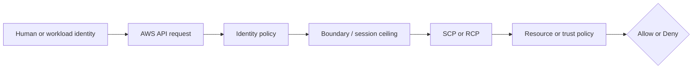
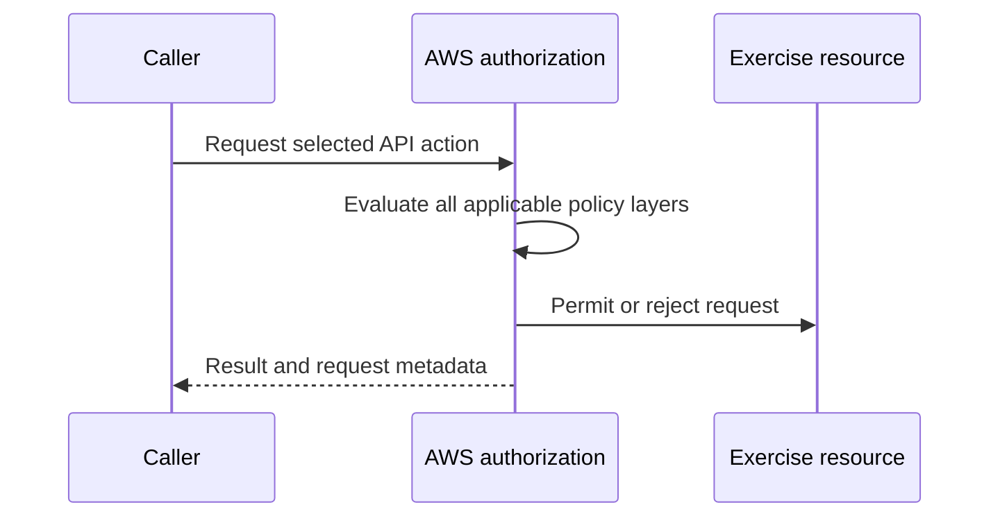

# Week 2 Exercise 14 [Optional] — Administrator policy constrained by a boundary

This exercise is classified as **Optional** in the Week 2 curriculum.

Complete the [shared Week 2 setup](../week2-setup.md) first. This exercise uses
a disposable lab account and an independent Terraform state key. It follows the
same safety model as Exercises 1 and 2: predict the decision, deploy the
smallest test fixture, run positive and negative tests, capture CloudTrail
evidence, and remove only disposable resources.

## Table of contents

- [Introduction](#introduction).
- [Learning objectives](#learning-objectives).
- [Terraform configuration and ownership](#terraform-configuration-and-ownership).
  - [Policy/resource excerpt](#policyresource-excerpt).
  - [Permissions-boundary excerpt](#permissions-boundary-excerpt).
- [Configure, initialize, and validate](#configure-initialize-and-validate).
- [Execute the experiment](#execute-the-experiment).
- [Investigating in the Console](#investigating-in-the-console).
- [Evidence and security analysis](#evidence-and-security-analysis).
- [Clean up](#clean-up).
- [References](#references).

## Introduction

This exercise focuses on **boundary-deny diagnosis**. Its objective is to show AdministratorAccess cannot exceed its boundary. An Allow
in one policy is never the whole authorization decision; applicable SCPs,
boundaries, resource policies, trust policies, session context, and explicit
denies must also be considered.



## Learning objectives

- Explain the policy layer being tested and its limits.
- Predict both an allowed and a denied operation before running it.
- Avoid using management, Log Archive, or Security Tooling accounts.
- Attribute the result using CloudTrail and the effective policy set.
- Document residual risk and a production hardening measure.

## Terraform configuration and ownership

The configuration is in [`terraform/lab/week2/exercise14/main.tf`](../../../../terraform/lab/week2/exercise14/main.tf) and the other Terraform files in that directory. It has an
independent encrypted S3 backend key:

```text
lab/week2/exercise14/terraform.tfstate
```

It uses an IAM Identity Center-backed profile and restricts the AWS provider to
the configured disposable account ID with `allowed_account_ids`. The exercise configuration uses a shell environment file. Copy `.env.example`
to `.env`, replace any placeholders or values you want to customize, and keep
the copied file uncommitted. Never place access keys, tokens, or device codes
in the repository.

From the repository root, use this order before running Terraform:

```bash
source ~/.env/aws-security/terraform/.env
cp terraform/lab/week2/exercise14/.env.example terraform/lab/week2/exercise14/.env
# Edit the copied .env and replace placeholders or desired values.
source terraform/lab/week2/exercise14/.env
```

The global environment must be sourced first because the exercise file refers
to shared values such as `TF_LAB_DEV_ACCOUNT_ID`, `TF_LAB_TEST_ACCOUNT_ID`,
`TF_MANAGEMENT_ACCOUNT_ID`, and `TF_HOME_REGION`.

The exercise state owns only resources under `/week2/exercise14/` and the
explicit fixture resources described by the objective. Existing Control Tower,
Identity Center, baseline, and `AWSReservedSSO_*` resources remain outside its
ownership boundary. The exercise role uses the Dev Lab account principal plus
an `aws:PrincipalArn` condition matching the
`AWSReservedSSO_WorkloadLabAdministrator_*` role path. The suffix-resilient
trust does not alter the permissions-boundary decision under test.

### Policy/resource excerpt

The generic fixture illustrates the intentionally narrow starting point:

```hcl
resource "aws_iam_role_policy" "exercise" {
  role = aws_iam_role.exercise.id
  name = "Exercise14Policy"
  policy = jsonencode({
    Version = "2012-10-17"
    Statement = [{
      Effect = "Allow"
      Action = ["sts:GetCallerIdentity"]
      Resource = "*"
    }]
  })
}
```

For the exercise-specific policy, inspect [`main.tf`](../../../../terraform/lab/week2/exercise14/main.tf) before applying and record
its principal, actions, resources, conditions, and any explicit denies. A
permissions boundary is a maximum, not a grant; a resource policy or trust
policy is not a substitute for an identity Allow.

#### Policy/resource analysis

This excerpt is the identity policy associated with the exercise role. Its
principal is the role itself, and its only Allow is the harmless
`sts:GetCallerIdentity` action on all resources. It is intended to permit
identity verification, not access to arbitrary workload resources. It does not
trust any principal; trust is defined separately by the role's assume-role
policy. It intentionally contains no explicit Deny, so the absence of an Allow
for other actions produces an implicit deny. The wildcard resource is a weak
point for readability, although this identity-verification action does not
provide a narrower resource scope. Always compare this excerpt with the role
trust policy and the complete declaration in [`main.tf`](../../../../terraform/lab/week2/exercise14/main.tf).

### Permissions-boundary excerpt

The authoritative boundary declaration is
[`workload-lab-role-boundary.json.tftpl`](../../../../terraform/lab/week2/baseline/policies/workload-lab-role-boundary.json.tftpl).
The following excerpt is taken from the original policy JSON template; its
`${partition}`, `${dev_lab_account_id}`, `${test_lab_account_id}`, and
`${lab_bucket_name_prefix}` values are rendered by the baseline Terraform root:

```json
{
  "Version": "2012-10-17",
  "Statement": [
    {
      "Sid": "AllowAssumingBoundedWeekTwoRoles",
      "Effect": "Allow",
      "Action": "sts:AssumeRole",
      "Resource": [
        "arn:${partition}:iam::${dev_lab_account_id}:role/week2/*",
        "arn:${partition}:iam::${test_lab_account_id}:role/week2/*"
      ]
    },
    {
      "Sid": "AllowReadCurrentIdentity",
      "Effect": "Allow",
      "Action": "sts:GetCallerIdentity",
      "Resource": "*"
    },
    {
      "Sid": "AllowWeekTwoLabBucketAccess",
      "Effect": "Allow",
      "Action": [
        "s3:GetBucketLocation",
        "s3:ListBucket",
        "s3:ListBucketVersions",
        "s3:GetObject",
        "s3:GetObjectVersion",
        "s3:PutObject",
        "s3:DeleteObject",
        "s3:DeleteObjectVersion"
      ],
      "Resource": [
        "arn:${partition}:s3:::${lab_bucket_name_prefix}*",
        "arn:${partition}:s3:::${lab_bucket_name_prefix}*/*"
      ]
    }
  ]
}
```

This is a permissions boundary, so it defines a maximum-permissions ceiling;
it does not grant these actions by itself. An identity policy must also allow
an operation, and applicable SCPs, session policies, resource policies, trust
policies, and explicit denies remain additional constraints. The policy is
owned by the baseline Terraform root. Do not edit, import, replace, or destroy
it from this exercise.

#### Boundary analysis

This boundary is associated with any role to which the baseline attaches it.
It allows only the listed `sts:AssumeRole`, identity-verification, and Week 2
S3 operations within the two lab accounts and configured bucket prefix. It
intentionally does not allow arbitrary IAM administration, user or access-key
management, managed-policy creation, or unrestricted access to other services.
Its weak point is that the ceiling still permits the listed role and S3 actions
when a separate identity policy grants them; a boundary cannot prevent an
identity policy from granting an action that the boundary allows. The baseline
owner must therefore protect both the boundary and the policies attached to
bounded roles.


## Configure, initialize, and validate

Authenticate the configured IAM Identity Center profile and verify the account. See [`sso_auth.md`](../../../sso_auth.md) for user enablement, MFA, browser isolation, and CLI login guidance. For the Exercise 1 test users, use the **Create the AWS CLI profiles** section of [`exercise1-instructions.md`](../exercise1/exercise1-instructions.md).

```bash
aws sso login --profile "$TF_VAR_source_aws_profile" --use-device-code --no-browser
aws sts get-caller-identity --profile "$TF_VAR_source_aws_profile"
terraform -chdir=terraform/lab/week2/exercise14 init \
  -backend-config="bucket=$TF_STATE_BUCKET" \
  -backend-config="region=$TF_STATE_REGION" \
  -backend-config="profile=$TF_STATE_PROFILE"
terraform -chdir=terraform/lab/week2/exercise14 validate
terraform -chdir=terraform/lab/week2/exercise14 plan
```

Review the plan before applying. It must not modify organizational governance,
Control Tower resources, Identity Center resources, or unrelated accounts.
Stop for unexplained replacements or deletions.

## Execute the experiment

Apply only the reviewed plan:

```bash
terraform -chdir=terraform/lab/week2/exercise14 apply
echo "role_arn: $(terraform -chdir=terraform/lab/week2/exercise14 output -raw role_arn)"
```

Run the following positive and negative tests from the assumed Exercise 14
role. Keep an evidence table with: caller, action, resource, expected result,
actual result, CloudTrail event ID, and the policy layer that explains it.

### Configure the Exercise 14 test session

The operator profile is used to provision and inspect the fixture. The tests
must run as `Week2Exercise14Role`, because that role has the AdministratorAccess-
equivalent identity policy and the baseline permissions boundary under test.
Add a role-chain profile to `~/.aws/config`; this contains no credentials:

```ini
[profile week2-exercise14]
source_profile = week2-source
role_arn = <role_arn printed above>
role_session_name = Exercise14
region = us-east-2
```

Replace `<role_arn printed above>` with the value of `EXERCISE14_ROLE_ARN`,
then verify the caller:

```bash
aws sts get-caller-identity --profile week2-exercise14
```

The ARN must end in `assumed-role/Week2Exercise14Role/Exercise14` and the
account must be `TF_VAR_source_account_id`. If either check fails, stop and
correct the session before interpreting any authorization result.

### Test 1 — Positive probe inside the boundary

**Prediction:** `sts:GetCallerIdentity` is **allowed**. The Exercise 14 inline
policy allows `*`, and the boundary explicitly allows this STS action.

```bash
aws sts get-caller-identity \
  --profile week2-exercise14 \
  --no-cli-pager
```

Record the successful result and the CloudTrail event ID. This proves the
boundary is a ceiling rather than a blanket deny.

### Test 2 — Negative administrator probe outside the boundary

**Prediction:** `iam:CreateRole` is **denied** with `AccessDenied`. The inline
policy allows the action, but the permissions boundary has no applicable IAM
role-creation Allow. Do not use the operator profile for this test, because
that profile is allowed to create bounded lab roles and would test the wrong
principal.

Create only a temporary trust-policy document for the harmless probe:

```bash
export EXERCISE14_TMP="$(mktemp -d)"
chmod 700 "$EXERCISE14_TMP"
cat > "$EXERCISE14_TMP/probe-trust.json" <<'JSON'
{
  "Version": "2012-10-17",
  "Statement": [{
    "Effect": "Allow",
    "Principal": {"AWS": "arn:aws:iam::000000000000:root"},
    "Action": "sts:AssumeRole"
  }]
}
JSON

if aws iam create-role \
  --profile week2-exercise14 \
  --role-name Week2Exercise14ProbeRole \
  --path /week2/exercise14/ \
  --assume-role-policy-document "file://$EXERCISE14_TMP/probe-trust.json" \
  --no-cli-pager; then
  echo "UNEXPECTED SUCCESS: the boundary did not block iam:CreateRole." >&2
else
  echo "Expected AccessDenied: the permissions boundary caps iam:CreateRole."
fi
```

The placeholder account in the trust document is never contacted because the
role creation request must be denied. Record the exact error and CloudTrail
event ID. If the command unexpectedly succeeds, stop immediately and remove
the created probe role with the approved operator session before continuing;
the boundary or permission-set state is not what this exercise expects.

### Test 3 — Negative read-only probe outside the boundary

**Prediction:** `iam:ListUsers` is also **denied**. This confirms the boundary
limits read-only IAM access as well as administrative mutation.

```bash
if aws iam list-users \
  --profile week2-exercise14 \
  --no-cli-pager; then
  echo "UNEXPECTED SUCCESS: the boundary did not block iam:ListUsers." >&2
else
  echo "Expected AccessDenied: the permissions boundary caps iam:ListUsers."
fi
```

Record the error and CloudTrail event ID. A failed request caused by an expired
SSO session, wrong account, wrong Region, or malformed input is not valid
Exercise 14 evidence; re-check the caller identity before attributing it to the
boundary. Remove the temporary document after collecting evidence:

```bash
rm -f "$EXERCISE14_TMP/probe-trust.json"
rmdir "$EXERCISE14_TMP"
unset EXERCISE14_TMP
```

The expected comparison is:

```text
sts:GetCallerIdentity  → Allow  (identity Allow ∩ boundary Allow)
iam:CreateRole         → Deny   (identity Allow, no boundary Allow)
iam:ListUsers          → Deny   (identity Allow, no boundary Allow)
```



For Exercise 14, the central comparison is: **Show administratoraccess cannot exceed its boundary.** Do
not add permissions until the current policy evaluation and CloudTrail evidence
have been documented.

## Investigating in the Console

Use the Dev Lab IAM Identity Center access-portal session for inspection, not
IAM user keys. The exercise role is a test subject, not an inspection persona:
use the `WorkloadLabAdministrator` session (`$TF_VAR_source_aws_profile`) to
inspect IAM and CloudTrail, and use the assumed `Week2Exercise14Role` session
only for the API probes. Verify that the console account ID equals
`TF_VAR_source_account_id` and that the selected Region equals
`TF_VAR_aws_region` before inspecting anything.

This exercise has no bucket, EC2 instance, Organizations policy, or
management-account fixture. Do not look for a resource-policy allow or an SCP
created by this root. The evidence must show that the inline identity policy
allows `*`, while the baseline-owned permissions boundary has no applicable
Allow for the denied IAM operation.

### Load the exact identifiers first

Use Terraform outputs rather than a copied ARN:

```bash
export EXERCISE_ROOT=terraform/lab/week2/exercise14
export EXERCISE14_ROLE_ARN="$(terraform -chdir=$EXERCISE_ROOT output -raw role_arn)"
echo "account_id: $(aws sts get-caller-identity --profile "$TF_VAR_source_aws_profile" --query Account --output text)"
echo "role_arn: $EXERCISE14_ROLE_ARN"
```

The role ARN must end in
`role/week2/exercise14/Week2Exercise14Role`. If the account or role differs,
stop and correct the session; that is not an authorization result.

### Inspect the exercise role and its identity policy

In the Dev Lab console, open **IAM → Access management → Roles**:

1. Search for `Week2Exercise14Role` and confirm its path is
   `/week2/exercise14/`. Do not select an `AWSReservedSSO_*` role; that is the
   operator session, not the exercise subject.
2. On **Summary**, confirm the role ARN and inspect its tags. The role must
   have `Name=Week2Exercise14Role`, `Exercise=14`, `Week=2`, and the project
   tags.
3. Open **Trust relationships**. Confirm that the trust policy names the Dev
   Lab account root as the AWS principal, allows only `sts:AssumeRole`, and
   constrains `aws:PrincipalArn` to the
   `AWSReservedSSO_WorkloadLabAdministrator_*` role path. This controls who
   may assume the role; it does not grant the role administrator permissions.
4. Open **Permissions → Permissions policies** and expand the inline
   `Exercise14Policy`. Confirm that its sole statement is
   `AdministratorAccessEquivalent`, with `Effect=Allow`, `Action=["*"]`, and
   `Resource=["*"]`. There must be no exercise-policy explicit Deny. This is
   the identity-policy Allow that appears to authorize both the positive and
   negative probes.
5. In the same **Permissions** view, locate the permissions boundary
   `/week2/WorkloadLabRoleBoundary`. Open it read-only and inspect its default
   version. Confirm that it includes `sts:GetCallerIdentity` but has no
   applicable Allow for `iam:CreateRole` or `iam:ListUsers`. The boundary is
   owned by `terraform/lab/week2/baseline`; do not edit, detach, replace, or
   delete it from this exercise.

The key comparison is not “AdministratorAccess versus an IAM Deny.” It is an
identity Allow intersected with a boundary ceiling: `sts:GetCallerIdentity`
is allowed because both layers allow it, while the IAM probes are denied
because the boundary does not allow them. The boundary is a maximum, not a
standalone grant.

### Correlate the probes in CloudTrail

Open **CloudTrail → Event history** in the Dev Lab account and set the Region
to `TF_VAR_aws_region`. Filter by **Event name** for each operation:

- `AssumeRole`: select the event whose `requestParameters.roleArn` is exactly
  `$EXERCISE14_ROLE_ARN` and whose session name is `Exercise14`. Confirm the
  caller is the expected `AWSReservedSSO_WorkloadLabAdministrator_*` role and
  that the event has no `errorCode`.
- `GetCallerIdentity`: select the successful event generated by the assumed
  `Week2Exercise14Role` session.
- `CreateRole`: select the failed event for the attempted probe and record
  `errorCode=AccessDenied`, the requested role name, principal ARN, event ID,
  and request parameters. Do not create a real workload role as part of the
  probe; use only the harmless placeholder request selected for the experiment.
- `ListUsers`: if this optional second negative probe was run, select its
  failed event and record the same fields. It demonstrates that the boundary
  caps read-only IAM access as well as mutation.

For each event, compare `userIdentity.arn`, `recipientAccountId`,
`eventTime`, `eventID`, `requestID`, `eventName`, and `errorCode` with the
terminal result. The failed IAM events are management events and should be
available in Event history; they are not S3 data events and do not require the
separate lab evidence trail.

Do not interpret a failed CloudTrail console list operation as evidence about
the exercise. Console pages may request additional APIs not covered by the
bounded operator session. If a page returns `AccessDenied`, use the exact
CloudTrail event and the read-only operator session or CLI commands instead.
Do not inspect or modify management-account SCPs for this exercise: the
objective is an implicit boundary deny, and no Organizations resource belongs
to this state.

## Evidence and security analysis

This exercise tests the permissions-boundary ceiling in the Dev Lab account.
The central comparison is:

```text
Identity policy       = Allow * on *
Permissions boundary  = Allows only the bounded Week 2 actions
Effective result      = Allow only where both layers allow
```

There is no SCP, resource-policy deny, or exercise-policy explicit Deny in this
scenario. `sts:GetCallerIdentity` succeeds because the identity policy and the
boundary both allow it. `iam:CreateRole` and `iam:ListUsers` fail because the
identity policy's wildcard Allow cannot grant actions that the boundary does
not allow. This is an implicit deny at the permissions ceiling, not an SCP
explicit deny.

Record the expected decision before each probe and explain results using this
order:

```text
Explicit deny → SCP/RCP → identity policy → boundary/session policy
             → resource/trust policy → conditions → effective result
```

### Retrieve the exercise role and identity policy

Use the approved `WorkloadLabAdministrator` session for read-only inspection:

```bash
export EXERCISE_ROOT=terraform/lab/week2/exercise14
export EXERCISE14_ACCOUNT_ID="$(aws sts get-caller-identity \
  --profile "$TF_VAR_source_aws_profile" \
  --query Account --output text)"
aws iam get-role \
  --profile "$TF_VAR_source_aws_profile" \
  --role-name Week2Exercise14Role \
  --query 'Role.{Arn:Arn,Path:Path,PermissionsBoundary:PermissionsBoundary.Arn,AssumeRolePolicy:AssumeRolePolicyDocument}' \
  --output json
aws iam get-role-policy \
  --profile "$TF_VAR_source_aws_profile" \
  --role-name Week2Exercise14Role \
  --policy-name Exercise14Policy \
  --output json
```

Confirm that the role path is `/week2/exercise14/`, its boundary is
`/week2/WorkloadLabRoleBoundary`, and its inline policy contains exactly one
statement: `AdministratorAccessEquivalent` with `Effect=Allow`,
`Action=["*"]`, and `Resource=["*"]`. Confirm that no exercise inline-policy
Deny was added. The trust policy's `sts:AssumeRole` condition identifies who
may obtain the session; it does not explain the later IAM authorization
results.

### Retrieve the permissions-boundary ceiling

The boundary is owned by `terraform/lab/week2/baseline`, not this exercise.
Retrieve it without changing it:

```bash
export AWS_PARTITION="${AWS_PARTITION:-aws}"
export EXERCISE14_BOUNDARY_ARN="arn:${AWS_PARTITION}:iam::${EXERCISE14_ACCOUNT_ID}:policy/week2/WorkloadLabRoleBoundary"
export EXERCISE14_BOUNDARY_VERSION="$(aws iam get-policy \
  --profile "$TF_VAR_source_aws_profile" \
  --policy-arn "$EXERCISE14_BOUNDARY_ARN" \
  --query 'Policy.DefaultVersionId' --output text)"
aws iam get-policy-version \
  --profile "$TF_VAR_source_aws_profile" \
  --policy-arn "$EXERCISE14_BOUNDARY_ARN" \
  --version-id "$EXERCISE14_BOUNDARY_VERSION" \
  --output json
```

Record the boundary's `AllowReadCurrentIdentity` statement and its bounded
Week 2 S3 actions. Confirm that it contains no applicable Allow for
`iam:CreateRole` or `iam:ListUsers`. Do not add either action to the boundary
as part of this exercise. Any boundary-extension retest belongs to the
baseline root and the separately protected baseline-administrator persona.

### Retrieve CloudTrail evidence

The role assumption and IAM probes are management events in the Dev Lab
account. Retrieve them from the source profile and select events matching the
exercise session and test window:

```bash
aws cloudtrail lookup-events \
  --profile "$TF_VAR_source_aws_profile" \
  --lookup-attributes AttributeKey=EventName,AttributeValue=AssumeRole \
  --max-results 50 --output json

aws cloudtrail lookup-events \
  --profile "$TF_VAR_source_aws_profile" \
  --lookup-attributes AttributeKey=EventName,AttributeValue=CreateRole \
  --max-results 50 --output json

aws cloudtrail lookup-events \
  --profile "$TF_VAR_source_aws_profile" \
  --lookup-attributes AttributeKey=EventName,AttributeValue=ListUsers \
  --max-results 50 --output json
```

For `AssumeRole`, identify the event whose `requestParameters.roleArn` is
exactly the Exercise 14 role ARN and whose session name is `Exercise14`; it
should have no `errorCode`. For `CreateRole` and optional `ListUsers` probes,
record the event ID, event time, request ID, principal ARN, request parameters,
and `errorCode=AccessDenied`. Confirm that the failed events came from the
assumed `Week2Exercise14Role` session in the Dev Lab account. A CloudTrail
`AccessDenied` event identifies the failed request, while the IAM policy and
boundary inspection explains why it failed.

Do not infer an authorization result from a missing event: verify the Region,
lookback window, event name, account, and session first. CloudTrail evidence
is historical and does not prove that a future request will have the same
inputs or effective policy set.

### Evidence table and security conclusion

Keep one row per probe with the caller ARN, account, Region, action, exact
request parameters, predicted result, actual result and exit status, CloudTrail
event ID, and determining policy layer:

| Test | Action | Prediction | Determining layer |
| --- | --- | --- | --- |
| Identity check | `sts:GetCallerIdentity` | Allowed | Identity Allow intersects boundary Allow |
| Administrator probe | `iam:CreateRole` | Denied | Boundary has no applicable Allow |
| Read-only probe | `iam:ListUsers` | Denied | Boundary has no applicable Allow |

The conclusion should state that the identity policy appears to grant
administrator access, but effective permissions are the intersection of the
identity policy and permissions boundary. The boundary therefore prevents
administrator-level IAM operations without modifying the identity policy. The
positive STS result demonstrates that the boundary is not a blanket deny.

The production risk is boundary bypass or boundary detachment. If the bounded
principal could call `iam:DeleteRolePermissionsBoundary`,
`iam:PutRolePermissionsBoundary`, or otherwise mutate the boundary or role
policy, it could remove the ceiling and turn the wildcard identity policy into
administrator access. Compensating controls are a separately owned and
protected boundary, explicit denies on boundary mutation for workload
identities, least-privilege role-management conditions, independent review of
boundary changes, and CloudTrail alerting for boundary detach, replacement,
and privileged role-policy changes. The exercise operator must not be granted
Organizations administration or access to the management account.

## Clean up

Preserve redacted evidence, then review and execute only the exercise destroy:

```bash
terraform -chdir=terraform/lab/week2/exercise14 plan -destroy
terraform -chdir=terraform/lab/week2/exercise14 destroy
```

Never destroy the Week 2 baseline boundary, Control Tower resources, Identity
Center assignments, or another exercise's state. Confirm the state key is
empty, remove temporary access, and verify `git status` before committing.

## References

- [IAM policy evaluation logic](https://docs.aws.amazon.com/IAM/latest/UserGuide/reference_policies_evaluation-logic.html).
- [IAM permissions boundaries](https://docs.aws.amazon.com/IAM/latest/UserGuide/access_policies_boundaries.html).
- [IAM roles and trust policies](https://docs.aws.amazon.com/IAM/latest/UserGuide/id_roles.html).
- [IAM Identity Center](https://docs.aws.amazon.com/singlesignon/latest/userguide/what-is.html).
- [AWS CloudTrail event history](https://docs.aws.amazon.com/awscloudtrail/latest/userguide/view-cloudtrail-events.html).
- [AWS STS](https://docs.aws.amazon.com/STS/latest/APIReference/welcome.html).
- [AWS IAM service authorization reference](https://docs.aws.amazon.com/service-authorization/latest/reference/reference_policies_actions-resources-contextkeys.html).
