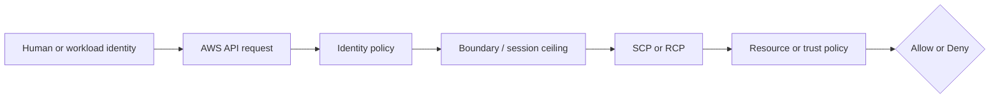
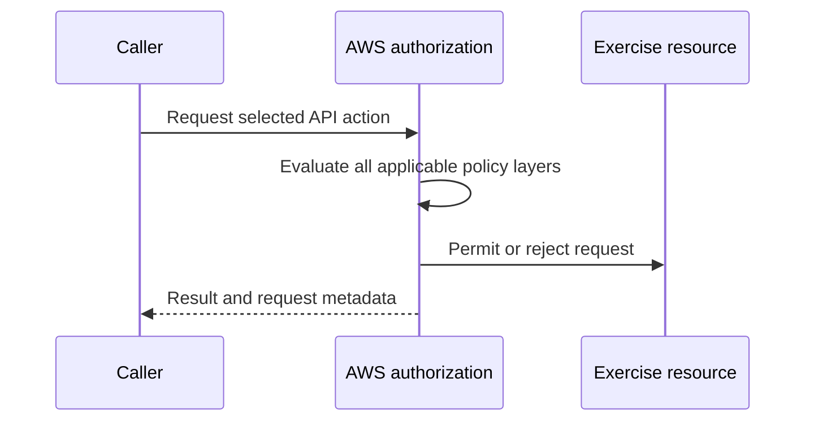

# Week 2 Exercise 15 [Core] — Systematic AssumeRole troubleshooting

This exercise is classified as **Core** in the Week 2 curriculum.

Complete the [shared Week 2 setup](../week2-setup.md) first. This exercise uses
a disposable lab account and an independent Terraform state key. It follows the
same safety model as Exercises 1 and 2: predict the decision, deploy the
smallest test fixture, run positive and negative tests, capture CloudTrail
evidence, and remove only disposable resources.

## Table of contents

- [Introduction](#introduction).
- [Learning objectives](#learning-objectives).
- [Terraform configuration and ownership](#terraform-configuration-and-ownership).
  - [Policy/resource excerpt](#policyresource-excerpt).
  - [Permissions-boundary excerpt](#permissions-boundary-excerpt).
- [Configure, initialize, and validate](#configure-initialize-and-validate).
- [Execute the experiment](#execute-the-experiment).
- [Investigating in the Console](#investigating-in-the-console).
- [Evidence and security analysis](#evidence-and-security-analysis).
- [Clean up](#clean-up).
- [References](#references).

## Introduction

This exercise focuses on **layered authorization diagnosis**. Its objective is to isolate source, trust, SCP, and condition failures. An Allow
in one policy is never the whole authorization decision; applicable SCPs,
boundaries, resource policies, trust policies, session context, and explicit
denies must also be considered.



## Learning objectives

- Explain the policy layer being tested and its limits.
- Predict both an allowed and a denied operation before running it.
- Avoid using management, Log Archive, or Security Tooling accounts.
- Attribute the result using CloudTrail and the effective policy set.
- Document residual risk and a production hardening measure.

## Terraform configuration and ownership

The configuration is in [`terraform/lab/week2/exercise15/main.tf`](../../../../terraform/lab/week2/exercise15/main.tf) and the other Terraform files in that directory. It has an
independent encrypted S3 backend key:

```text
lab/week2/exercise15/terraform.tfstate
```

It uses an IAM Identity Center-backed profile and restricts the AWS provider to
the configured disposable account ID with `allowed_account_ids`. The exercise configuration uses a shell environment file. Copy `.env.example`
to `.env`, replace any placeholders or values you want to customize, and keep
the copied file uncommitted. Never place access keys, tokens, or device codes
in the repository.

From the repository root, use this order before running Terraform:

```bash
source ~/.env/aws-security/terraform/.env
cp terraform/lab/week2/exercise15/.env.example terraform/lab/week2/exercise15/.env
# Edit the copied .env and replace placeholders or desired values.
source terraform/lab/week2/exercise15/.env
```

The global environment must be sourced first because the exercise file refers
to shared values such as `TF_LAB_DEV_ACCOUNT_ID`, `TF_LAB_TEST_ACCOUNT_ID`,
`TF_MANAGEMENT_ACCOUNT_ID`, and `TF_HOME_REGION`.

The exercise state owns only resources under `/week2/exercise15/` and the
explicit fixture resources described by the objective. Existing Control Tower,
Identity Center, baseline, and `AWSReservedSSO_*` resources remain outside its
ownership boundary. The working baseline trust uses the Dev Lab account
principal plus an `aws:PrincipalArn` condition matching the
`AWSReservedSSO_WorkloadLabAdministrator_*` role path. This avoids accidental
failure from an obsolete generated suffix while deliberate trust-condition
failures remain part of the troubleshooting exercise.

### Policy/resource excerpt

The generic fixture illustrates the intentionally narrow starting point:

```hcl
resource "aws_iam_role_policy" "exercise" {
  role = aws_iam_role.exercise.id
  name = "Exercise15Policy"
  policy = jsonencode({
    Version = "2012-10-17"
    Statement = [{
      Effect = "Allow"
      Action = ["sts:GetCallerIdentity"]
      Resource = "*"
    }]
  })
}
```

For the exercise-specific policy, inspect [`main.tf`](../../../../terraform/lab/week2/exercise15/main.tf) before applying and record
its principal, actions, resources, conditions, and any explicit denies. A
permissions boundary is a maximum, not a grant; a resource policy or trust
policy is not a substitute for an identity Allow.

#### Policy/resource analysis

This excerpt is the identity policy associated with the exercise role. Its
principal is the role itself, and its only Allow is the harmless
`sts:GetCallerIdentity` action on all resources. It is intended to permit
identity verification, not access to arbitrary workload resources. It does not
trust any principal; trust is defined separately by the role's assume-role
policy. It intentionally contains no explicit Deny, so the absence of an Allow
for other actions produces an implicit deny. The wildcard resource is a weak
point for readability, although this identity-verification action does not
provide a narrower resource scope. Always compare this excerpt with the role
trust policy and the complete declaration in [`main.tf`](../../../../terraform/lab/week2/exercise15/main.tf).

### Permissions-boundary excerpt

The authoritative boundary declaration is
[`workload-lab-role-boundary.json.tftpl`](../../../../terraform/lab/week2/baseline/policies/workload-lab-role-boundary.json.tftpl).
The following excerpt is taken from the original policy JSON template; its
`${partition}`, `${dev_lab_account_id}`, `${test_lab_account_id}`, and
`${lab_bucket_name_prefix}` values are rendered by the baseline Terraform root:

```json
{
  "Version": "2012-10-17",
  "Statement": [
    {
      "Sid": "AllowAssumingBoundedWeekTwoRoles",
      "Effect": "Allow",
      "Action": "sts:AssumeRole",
      "Resource": [
        "arn:${partition}:iam::${dev_lab_account_id}:role/week2/*",
        "arn:${partition}:iam::${test_lab_account_id}:role/week2/*"
      ]
    },
    {
      "Sid": "AllowReadCurrentIdentity",
      "Effect": "Allow",
      "Action": "sts:GetCallerIdentity",
      "Resource": "*"
    },
    {
      "Sid": "AllowWeekTwoLabBucketAccess",
      "Effect": "Allow",
      "Action": [
        "s3:GetBucketLocation",
        "s3:ListBucket",
        "s3:ListBucketVersions",
        "s3:GetObject",
        "s3:GetObjectVersion",
        "s3:PutObject",
        "s3:DeleteObject",
        "s3:DeleteObjectVersion"
      ],
      "Resource": [
        "arn:${partition}:s3:::${lab_bucket_name_prefix}*",
        "arn:${partition}:s3:::${lab_bucket_name_prefix}*/*"
      ]
    }
  ]
}
```

This is a permissions boundary, so it defines a maximum-permissions ceiling;
it does not grant these actions by itself. An identity policy must also allow
an operation, and applicable SCPs, session policies, resource policies, trust
policies, and explicit denies remain additional constraints. The policy is
owned by the baseline Terraform root. Do not edit, import, replace, or destroy
it from this exercise.

#### Boundary analysis

This boundary is associated with any role to which the baseline attaches it.
It allows only the listed `sts:AssumeRole`, identity-verification, and Week 2
S3 operations within the two lab accounts and configured bucket prefix. It
intentionally does not allow arbitrary IAM administration, user or access-key
management, managed-policy creation, or unrestricted access to other services.
Its weak point is that the ceiling still permits the listed role and S3 actions
when a separate identity policy grants them; a boundary cannot prevent an
identity policy from granting an action that the boundary allows. The baseline
owner must therefore protect both the boundary and the policies attached to
bounded roles.


## Configure, initialize, and validate

Authenticate the configured IAM Identity Center profile and verify the account. See [`sso_auth.md`](../../../sso_auth.md) for user enablement, MFA, browser isolation, and CLI login guidance. For the Exercise 1 test users, use the **Create the AWS CLI profiles** section of [`exercise1-instructions.md`](../exercise1/exercise1-instructions.md).

```bash
aws sso login --profile "$TF_VAR_source_aws_profile" --use-device-code --no-browser
aws sts get-caller-identity --profile "$TF_VAR_source_aws_profile"
terraform -chdir=terraform/lab/week2/exercise15 init \
  -backend-config="bucket=$TF_STATE_BUCKET" \
  -backend-config="region=$TF_STATE_REGION" \
  -backend-config="profile=$TF_STATE_PROFILE"
terraform -chdir=terraform/lab/week2/exercise15 validate
terraform -chdir=terraform/lab/week2/exercise15 plan
```

Review the plan before applying. It must not modify organizational governance,
Control Tower resources, Identity Center resources, or unrelated accounts.
Stop for unexplained replacements or deletions.

## Execute the experiment

Apply only the reviewed plan:

```bash
terraform -chdir=terraform/lab/week2/exercise15 apply
echo "role_arn: $(terraform -chdir=terraform/lab/week2/exercise15 output -raw role_arn)"
```

Run the following tests in order. Record the expected result before each
command, then capture the actual result, caller ARN, target ARN, session name,
and CloudTrail event ID in the evidence table. An expected denial is a
successful test; do not change a policy to make it pass.

First, load the fixture ARNs and define a helper that obtains a fresh source
caller session. The helper deliberately starts from the operator's SSO
profile, so each test follows the documented role chain:

```bash
ROOT=terraform/lab/week2/exercise15
CALLER_ROLE_ARN=$(terraform -chdir="$ROOT" output -raw caller_role_arn)
CALLER_WITHOUT_ASSUME_ROLE_ARN=$(terraform -chdir="$ROOT" output -raw caller_without_assume_role_arn)
UNTRUSTED_CALLER_ROLE_ARN=$(terraform -chdir="$ROOT" output -raw untrusted_caller_role_arn)
TARGET_ROLE_ARN=$(terraform -chdir="$ROOT" output -raw target_role_arn)
TARGET_EXTERNAL_ID_ROLE_ARN=$(terraform -chdir="$ROOT" output -raw target_external_id_role_arn)
TARGET_CONDITION_ROLE_ARN=$(terraform -chdir="$ROOT" output -raw target_condition_role_arn)
EXTERNAL_ID=$(terraform -chdir="$ROOT" output -raw external_id)

assume_caller() {
  read -r AWS_ACCESS_KEY_ID AWS_SECRET_ACCESS_KEY AWS_SESSION_TOKEN < <(
    aws sts assume-role \
      --profile "$TF_VAR_source_aws_profile" \
      --role-arn "$1" \
      --role-session-name "$2" \
      --query 'Credentials.[AccessKeyId,SecretAccessKey,SessionToken]' \
      --output text
  )
  export AWS_ACCESS_KEY_ID AWS_SECRET_ACCESS_KEY AWS_SESSION_TOKEN
}

assume_caller "$CALLER_ROLE_ARN" Ex15BaselineCaller
aws sts get-caller-identity
```

### Baseline positive test — identity Allow, trust Allow, no SCP deny

The caller role has an identity-policy Allow for all three target roles and
`Ex15TargetRole` trusts that specific caller role. This command should succeed
and the returned identity should be in the target account:

```bash
aws sts assume-role \
  --role-arn "$TARGET_ROLE_ARN" \
  --role-session-name Ex15BaselineTarget
```

### Failure A — source identity policy has no AssumeRole Allow

Start a fresh caller session using the role that has only
`sts:GetCallerIdentity`. The following command should fail with
`AccessDenied` at the source identity-policy layer:

```bash
assume_caller "$CALLER_WITHOUT_ASSUME_ROLE_ARN" Ex15FailureACaller
if aws sts assume-role --role-arn "$TARGET_ROLE_ARN" --role-session-name Ex15FailureA; then
  echo "UNEXPECTED: Failure A was allowed"
else
  echo "Expected AccessDenied: source identity policy has no sts:AssumeRole Allow"
fi
```

### Failure B — target trust policy rejects the caller

The untrusted caller has the same source-side AssumeRole Allow as the working
caller, but no target role trusts it. This should fail at the target trust
policy layer:

```bash
assume_caller "$UNTRUSTED_CALLER_ROLE_ARN" Ex15FailureBCaller
if aws sts assume-role --role-arn "$TARGET_ROLE_ARN" --role-session-name Ex15FailureB; then
  echo "UNEXPECTED: Failure B was allowed"
else
  echo "Expected AccessDenied: target trust policy does not name this caller"
fi
```

### Failure C — source-account SCP explicitly denies AssumeRole

Return to the working caller and verify the baseline succeeds before enabling
the optional SCP. Then apply only the toggle change. The first command should
fail despite both identity and trust Allows; the second apply removes the deny
and the recovery command should succeed again:

```bash
assume_caller "$CALLER_ROLE_ARN" Ex15FailureCCaller
aws sts assume-role --role-arn "$TARGET_ROLE_ARN" --role-session-name Ex15FailureCBeforeSCP

terraform -chdir="$ROOT" apply -var='scp_deny_enabled=true'
assume_caller "$CALLER_ROLE_ARN" Ex15FailureCBlockedCaller
if aws sts assume-role --role-arn "$TARGET_ROLE_ARN" --role-session-name Ex15FailureC; then
  echo "UNEXPECTED: Failure C was allowed"
else
  echo "Expected AccessDenied: source-account SCP explicitly denies sts:AssumeRole"
fi

terraform -chdir="$ROOT" apply -var='scp_deny_enabled=false'
assume_caller "$CALLER_ROLE_ARN" Ex15FailureCRecoveryCaller
aws sts assume-role --role-arn "$TARGET_ROLE_ARN" --role-session-name Ex15FailureCRecovery
```

### Failure D — ExternalId condition mismatch, then recovery

Use the working caller and omit the ExternalId (or deliberately provide a
wrong one). The first command should fail because the target trust condition
is unsatisfied. Supplying the configured identifier should succeed:

```bash
assume_caller "$CALLER_ROLE_ARN" Ex15FailureDCaller
if aws sts assume-role \
    --role-arn "$TARGET_EXTERNAL_ID_ROLE_ARN" \
    --role-session-name Ex15FailureDWrong \
    --external-id wrong-exercise15-value; then
  echo "UNEXPECTED: Failure D was allowed with the wrong ExternalId"
else
  echo "Expected AccessDenied: sts:ExternalId condition did not match"
fi

aws sts assume-role \
  --role-arn "$TARGET_EXTERNAL_ID_ROLE_ARN" \
  --role-session-name Ex15FailureDCorrect \
  --external-id "$EXTERNAL_ID"
```

### Failure E — trust-policy PrincipalArn condition mismatch

The target trust policy names the working caller but requires an intentionally
unmatched `aws:PrincipalArn` pattern. Identity permission and the trust
principal therefore pass, while only the condition fails:

```bash
assume_caller "$CALLER_ROLE_ARN" Ex15FailureECaller
if aws sts assume-role --role-arn "$TARGET_CONDITION_ROLE_ARN" --role-session-name Ex15FailureE; then
  echo "UNEXPECTED: Failure E was allowed"
else
  echo "Expected AccessDenied: trust aws:PrincipalArn condition did not match"
fi
```

For each denial, inspect the corresponding STS CloudTrail event in the source
and target accounts before proceeding. Keep the evidence table fields:
caller, action, resource, expected result, actual result, CloudTrail event ID,
and the policy layer that explains it.



For Exercise 15, the central comparison is: **Isolate source, trust, scp, and condition failures.** Do
not add permissions until the current policy evaluation and CloudTrail evidence
have been documented.

## Investigating in the Console

Use IAM Identity Center access-portal sessions, not IAM user keys. Verify the
account ID in the console account menu before inspecting anything. This
exercise uses three sessions/accounts: the Dev Lab source account, the Test
Lab target account, and the Organizations management account for the optional
SCP only.

### Dev Lab source account

1. In **IAM → Roles**, search for the three roles under
   `/week2/exercise15/`: `Ex15CallerRole`,
   `Ex15CallerWithoutAssumeRole`, and `Ex15UntrustedCallerRole`.
2. For `Ex15CallerRole` and `Ex15UntrustedCallerRole`, confirm the inline
   `Exercise15AssumeTargets` policy allows only `sts:AssumeRole` on the three
   Test Lab target-role ARNs and `sts:GetCallerIdentity`.
3. For `Ex15CallerWithoutAssumeRole`, confirm `Exercise15Policy` contains no
   `sts:AssumeRole` Allow. This is the evidence for Failure A.
4. For each source role, confirm the trust relationship allows the
   `AWSReservedSSO_WorkloadLabAdministrator_*` operator pattern and that the
   `/week2/WorkloadLabRoleBoundary` permissions boundary is attached.

### Test Lab target account

1. Inspect `Ex15TargetRole`, `Ex15ExternalIdTargetRole`, and
   `Ex15ConditionTargetRole` under `/week2/exercise15/`.
2. Compare their trust relationships: the baseline target trusts only
   `Ex15CallerRole`; the ExternalId target adds
   `StringEquals sts:ExternalId`; and the condition target adds the
   intentionally unmatched `aws:PrincipalArn` pattern.
3. Confirm all three target roles have the target-account
   `/week2/WorkloadLabRoleBoundary` and the minimal
   `sts:GetCallerIdentity` probe policy.
4. In **CloudTrail → Event history**, filter for `AssumeRole`, select the
   failure's time range, and compare the principal ARN, target role ARN,
   `externalId` request parameter when applicable, and error code. Failure B,
   D, and E should be investigated against the target trust configuration.

### Organizations management account

When testing Failure C, inspect **AWS Organizations → Policies → Service
control policies** from the management-account session. Confirm
`Week2Exercise15DenyAssumeRole` is attached directly to the Dev Lab
`source_account_id`, contains only `sts:AssumeRole`, and is resource-scoped to
the three Exercise 15 target-role ARNs. Do not edit any existing SCP or attach
the fixture to the target, management, or an OU. After the recovery apply,
confirm the fixture policy and attachment are gone.

For every test, correlate the console view with the Terraform outputs and the
CloudTrail event. Source-account STS events are the primary place to inspect a
source identity-policy denial (Failure A); target-account events are the
primary place to inspect trust and condition denials (Failures B, D, and E).
The management account records the Organizations policy and attachment changes
for Failure C, while the blocked AssumeRole request itself should be checked in
both lab accounts.

Console list pages can require permissions outside a deliberately narrow lab
role. An `AccessDenied` from a page is not evidence that the Exercise 15
security policy should be broadened; use a read-only inspection session or the
CLI instead.

## Evidence and security analysis

Before each Exercise 15 command, record the predicted matrix values:
`source identity Allow`, `target trust Allow`, `SCP permits`, `trust conditions
satisfied`, and the resulting Allow or Deny. Use this expected matrix before
running the commands:

| Test | Source identity Allow | Target trusts caller | SCP permits | Conditions satisfied | Expected result | Isolated layer |
|---|---:|---:|---:|---:|---|---|
| Baseline → `Ex15TargetRole` | Yes | Yes | Yes | Yes | Allow | None; positive control |
| Failure A → `Ex15CallerWithoutAssumeRole` | No | Yes | Yes | Yes | Deny | Source identity policy |
| Failure B → `Ex15UntrustedCallerRole` | Yes | No | Yes | N/A | Deny | Target trust principal |
| Failure C → `Ex15TargetRole` with SCP enabled | Yes | Yes | No | Yes | Deny | Source-account SCP |
| Failure D → `Ex15ExternalIdTargetRole` with wrong/missing value | Yes | Yes | Yes | No | Deny | `sts:ExternalId` condition |
| Failure D recovery → same role with correct value | Yes | Yes | Yes | Yes | Allow | Positive control for ExternalId |
| Failure E → `Ex15ConditionTargetRole` | Yes | Yes | Yes | No | Deny | `aws:PrincipalArn` condition |

Then record the actual caller ARN, target role ARN, session name, request
parameters (including whether an ExternalId was supplied), error code, and
CloudTrail event ID. The target role's `sts:GetCallerIdentity` policy is only
relevant after a successful assumption; it does not make a denied
`sts:AssumeRole` request succeed.

Explain each result using this order:

```text
Explicit deny → SCP/RCP → identity policy → boundary/session policy
             → resource/trust policy → conditions → effective result
```

Use the following attribution when the evidence supports it: Failure A is the
source identity-policy layer; Failure B is the target trust principal layer;
Failure C is the source-account SCP explicit-deny layer; Failure D is the
`sts:ExternalId` trust condition; and Failure E is the target
`aws:PrincipalArn` trust condition. Compare every failure with the baseline so
that only the intended matrix input changes. In particular, do not attribute
Failure B to the source policy—the untrusted caller has the same
`sts:AssumeRole` Allow as the working caller—and do not attribute Failure E to
role naming alone—the caller role is already the trusted principal, but fails
the additional condition.

For the security analysis, explain the production control demonstrated by each
fixture: least-privilege identity policies for Failure A, precise role
principals instead of broad account trust for Failure B, narrowly scoped SCP
or other organization guardrails for Failure C, mandatory ExternalId values
for third-party trust for Failure D, and reviewed condition changes for
Failure E. Note that the SCP is intentionally attached only to the Dev Lab
source account and resource-scoped to these three target roles; confirm that
recovery removes it. Redact credentials and avoid recording ExternalId values
as secrets, since this exercise treats the configured value as an identifier.
CloudTrail evidence is historical and must not be treated as proof that an
unused permission can never be needed.

## Clean up

Preserve redacted evidence, then review and execute only the exercise destroy:

```bash
terraform -chdir=terraform/lab/week2/exercise15 plan -destroy
terraform -chdir=terraform/lab/week2/exercise15 destroy
```

Never destroy the Week 2 baseline boundary, Control Tower resources, Identity
Center assignments, or another exercise's state. Confirm the state key is
empty, remove temporary access, and verify `git status` before committing.

## References

- [IAM policy evaluation logic](https://docs.aws.amazon.com/IAM/latest/UserGuide/reference_policies_evaluation-logic.html).
- [IAM permissions boundaries](https://docs.aws.amazon.com/IAM/latest/UserGuide/access_policies_boundaries.html).
- [IAM roles and trust policies](https://docs.aws.amazon.com/IAM/latest/UserGuide/id_roles.html).
- [IAM Identity Center](https://docs.aws.amazon.com/singlesignon/latest/userguide/what-is.html).
- [AWS CloudTrail event history](https://docs.aws.amazon.com/awscloudtrail/latest/userguide/view-cloudtrail-events.html).
- [AWS STS](https://docs.aws.amazon.com/STS/latest/APIReference/welcome.html).
- [AWS IAM service authorization reference](https://docs.aws.amazon.com/service-authorization/latest/reference/reference_policies_actions-resources-contextkeys.html).
