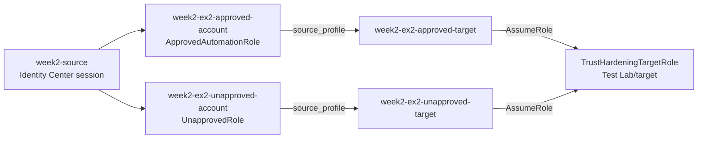
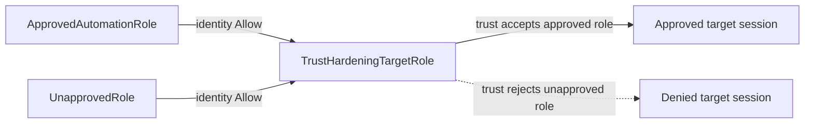
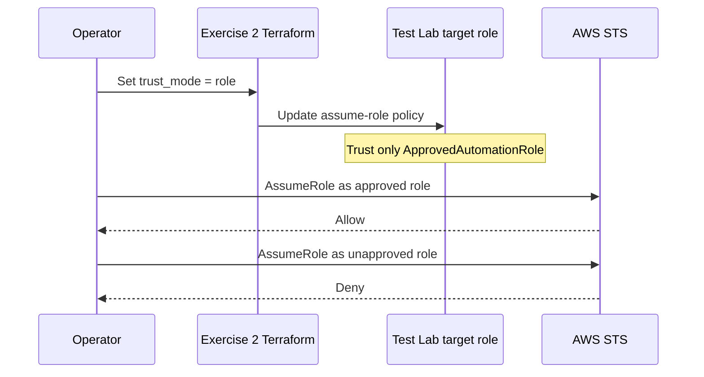

# Week 2 Exercise 2 [Core] — Trust-policy hardening

This exercise is classified as **Core** in the Week 2 curriculum.

This exercise builds on [Exercise 1](../exercise1/exercise1-instructions.md)
and the [shared Week 2 setup](../week2-setup.md). It is intentionally
disposable: it uses only the two workload lab accounts and a separate
Terraform state key. Complete the shared setup before beginning, including the
persistent `WorkloadLabRoleBoundary` in both accounts.

## Table of contents

- [Introduction](#introduction).
- [Learning objectives](#learning-objectives).
- [Resources and ownership boundary](#resources-and-ownership-boundary).
- [Configure inputs](#configure-inputs).
- [Authenticate and verify both accounts](#authenticate-and-verify-both-accounts).
- [Initialize, validate, and inspect the Terraform root](#initialize-validate-and-inspect-the-terraform-root).
- [Policy, resource, and boundary excerpts](#policy-resource-and-boundary-excerpts).
  - [Source-role trust policy](#source-role-trust-policy).
  - [Source-role identity policy](#source-role-identity-policy).
  - [Target trust policy — phase 1](#target-trust-policy---phase-1).
  - [Target trust policy — phase 2](#target-trust-policy---phase-2).
  - [Permissions-boundary attachment](#permissions-boundary-attachment).
  - [Permissions-boundary excerpt](#permissions-boundary-excerpt).
- [Phase 1 — Account-level trust](#phase-1---account-level-trust).
  - [Phase 1 tests](#phase-1-tests).
- [Phase 2 — Explicit role trust hardening](#phase-2---explicit-role-trust-hardening).
  - [Phase 2 tests](#phase-2-tests).
- [Authorization decision matrix](#authorization-decision-matrix).
- [Inspect CloudTrail evidence](#inspect-cloudtrail-evidence).
- [Investigating in the Console](#investigating-in-the-console).
  - [Inspect IAM Identity Center access](#inspect-iam-identity-center-access).
  - [Inspect the source-account roles](#inspect-the-source-account-roles).
  - [Inspect the target role after each phase](#inspect-the-target-role-after-each-phase).
  - [Inspect the permissions boundary](#inspect-the-permissions-boundary).
  - [Inspect CloudTrail and SCP context](#inspect-cloudtrail-and-scp-context).
- [Security analysis and production hardening](#security-analysis-and-production-hardening).
- [Clean up](#clean-up).
- [References](#references).

## Introduction

A cross-account role trust policy can name either a specific principal or the
root principal of an AWS account. Those forms have materially different
security meanings. The following statement:

```json
"Principal": {"AWS": "arn:aws:iam::<SOURCE_ACCOUNT>:root"}
```

does not mean that every principal in the source account can immediately assume
the role. The caller still needs an identity-policy Allow for
`sts:AssumeRole`. It does mean that the target account is delegating the trust
decision to the source account: any source-account principal that is otherwise
permitted to assume the role can use that trust relationship.

This exercise makes that distinction observable. Two source roles receive the
same source-side permissions and the same mandatory permissions boundary. In
the first phase, the target role trusts the source account root, so both roles
can assume it. In the second phase, the target role trusts only
`ApprovedAutomationRole`; the same request from `UnapprovedRole` then fails.
The only intended change between the phases is the target trust principal.

The authorization model is:

```text
Source role identity policy allows sts:AssumeRole on target ARN
                         +
Target role trust policy accepts the source principal
                         +
Permissions boundaries and SCPs do not block the request
                         =
Successful cross-account role assumption
```

The two role-assumption hops and their corresponding CLI profiles can be
visualized as follows:



The `*-account` profiles test the first hop only. Their caller identity is the
source-account role. The `*-target` profiles add a second `source_profile`, so
the AWS CLI first obtains the source role session and then uses that temporary
session to request `TrustHardeningTargetRole` in the target account. Therefore,
only the `*-target` profiles can show `TrustHardeningTargetRole` in their
successful `get-caller-identity` response.

In phase 1, the target trust accepts the source account root, so both target
profiles can complete the second hop. In phase 2, the trust edge from
`UnapprovedRole` is removed:



The source-side permissions are deliberately unchanged between phases. The
change in the final result is caused by the target role's trust policy.
You will learn to distinguish **account-level delegation** from **explicit
principal trust**, inspect both sides of the authorization decision, and make a
small hardening change without changing the source roles or their permissions.
No IAM users, access keys, SCPs, or Control Tower resources are created by this
exercise.

## Learning objectives

By the end of the exercise, you should be able to:

- Explain why a source identity Allow and a target trust Allow are both needed.
- Distinguish an account-root principal in a trust policy from a specific role
  principal.
- Demonstrate that two roles in a trusted account can both use account-level
  delegation when their identity policies allow it.
- Harden the target trust policy to one explicit role ARN.
- Identify an implicit cross-account denial without adding permissions
  speculatively.
- Explain why a permissions boundary limits a role but does not grant
  `sts:AssumeRole`; and.
- Use CloudTrail to attribute successful and failed `AssumeRole` requests.

## Resources and ownership boundary

Terraform creates the following disposable resources:

| Account | Resource | Purpose |
|---|---|---|
| Dev Lab/source | `/week2/exercise2/ApprovedAutomationRole` | Approved source principal |
| Dev Lab/source | `/week2/exercise2/UnapprovedRole` | Negative-test source principal |
| Test Lab/target | `/week2/exercise2/TrustHardeningTargetRole` | Target role whose trust changes |

Both source roles:

- Trust the exact Identity Center-provisioned `WorkloadLabAdministrator` role.
- Have a one-hour maximum session duration.
- Use the pre-existing `WorkloadLabRoleBoundary`; and.
- Allow `sts:AssumeRole` only on the target role ARN.

The target role also uses the pre-existing boundary. The exercise state does
not create, import, modify, or delete that boundary, and it does not manage the
`AWSReservedSSO_*` role. The boundary remains owned by
`terraform/lab/week2/baseline`. Do not destroy the baseline when cleaning up.

The source role names and target role name are intentionally different from
Exercise 1 so that the exercises can be planned independently. Do not reuse an
Exercise 1 state file or manually modify its roles.

## Configure inputs

Source the global environment first, then create a local, uncommitted shell
environment file:

```bash
source "${TF_ENV_FILE:-$HOME/.env/aws-security/terraform/.env}"
cp terraform/lab/week2/exercise2/.env.example terraform/lab/week2/exercise2/.env
```

Replace all placeholders in `.env`, then source it:

```bash
source terraform/lab/week2/exercise2/.env
```

The required values are:

- The Dev Lab/source and Test Lab/target account IDs.
- `week2-source` and `week2-target`, or equivalent Identity Center-backed
  profiles;
- The exact IAM ARN of the source account's provisioned
  `AWSReservedSSO_WorkloadLabAdministrator_<SUFFIX>` role; and.
- `TF_VAR_trust_mode=account` for the first phase.

The source operator ARN is derived from the AWS CLI configuration created for
the `week2-source` and `week2-target` profiles in Exercise 1. Before continuing,
review [Create the AWS CLI profiles](../exercise1/exercise1-instructions.md#create-the-aws-cli-profiles)
and [Configure the provisioned IAM role ARN](../exercise1/exercise1-instructions.md#configure-the-provisioned-iam-role-arn)
in the Exercise 1 instructions. Those sections explain the profile purpose,
Identity Center role-session verification, and conversion from the temporary
STS session ARN to the underlying IAM role ARN.

The source operator ARN must be an IAM role ARN, not an STS session ARN and
not an IAM Identity Center permission-set ARN. Obtain the role name from the
source session if necessary:

```bash
aws sts get-caller-identity --profile week2-source --query Arn --output text
```

Convert the `assumed-role/...` result to the underlying IAM role ARN using the
Identity Center reserved-role path, as described in Exercise 1. Never put
credentials, access tokens, or copied session credentials in `.env`.

The exercise-specific `.env.example` is the only configuration template
maintained for this root. Terraform does not load `.env` automatically; source
the global environment first, copy the example to `.env`, replace any desired
values, and source the copied file:

```bash
source ~/.env/aws-security/terraform/.env
cp terraform/lab/week2/exercise2/.env.example terraform/lab/week2/exercise2/.env
# Edit terraform/lab/week2/exercise2/.env as needed.
source terraform/lab/week2/exercise2/.env
```

Do not commit the copied `.env` file or place credentials in either
environment file.

## Authenticate and verify both accounts

Terraform uses two aliased providers in one plan:

```text
aws.source → week2-source → Dev Lab/source
aws.target → week2-target → Test Lab/target
```

Authenticate the profiles with separate Identity Center sessions and browser
contexts. The two profiles represent the two lab operators; do not use static
credentials:

```bash
aws sso login --profile week2-source --use-device-code --no-browser
aws sso login --profile week2-target --use-device-code --no-browser

aws sts get-caller-identity --profile week2-source
aws sts get-caller-identity --profile week2-target
```

Confirm that the first account is the Dev Lab account, the second is the Test
Lab account, and both role names contain
`AWSReservedSSO_WorkloadLabAdministrator_`. The Terraform provider also sets
`allowed_account_ids`, and its plan-time checks repeat this account assertion.
These are deliberate safety controls against applying the source and target
configuration to the wrong accounts.

## Initialize, validate, and inspect the Terraform root

Initialize this root with its independent remote state key:

```bash
terraform -chdir=terraform/lab/week2/exercise2 init \
  -backend-config="bucket=$TF_STATE_BUCKET" \
  -backend-config="region=$TF_STATE_REGION" \
  -backend-config="profile=$TF_STATE_PROFILE"
```

Then format and validate before planning:

```bash
terraform -chdir=terraform/lab/week2/exercise2 validate
```

The state key is `lab/week2/exercise2/terraform.tfstate`; it is separate from
both the baseline and Exercise 1 state. State contains role policy and identity
metadata and must be protected as sensitive operational data.

The plan should contain only three IAM roles, their inline STS policies, and
read-only data-source lookups of the pre-existing boundaries. It must not show
users, access keys, managed-policy creation, S3 resources, Control Tower
resources, or changes outside the two lab accounts. Stop for unexplained
replacement, deletion, or resource adoption.

## Policy, resource, and boundary excerpts

The following excerpts show the complete authorization-relevant shape without
requiring readers to infer it from the Terraform files. The authoritative
configuration is in
[`terraform/lab/week2/exercise2/main.tf`](../../../../terraform/lab/week2/exercise2/main.tf).

### Source-role trust policy

Both source roles use the same trust policy. It permits only the exact
Identity Center-provisioned role to obtain a source-role session:

```hcl
data "aws_iam_policy_document" "operator_trust" {
  statement {
    sid     = "AllowSpecificLabOperator"
    effect  = "Allow"
    actions = ["sts:AssumeRole"]

    principals {
      type        = "AWS"
      identifiers = [var.source_operator_role_arn]
    }
  }
}
```

This policy answers **who may become the source role**. It does not grant the
source role permission to assume the target role. That second decision comes
from the source role's identity policy.

### Source-role identity policy

The two source roles deliberately receive equivalent policies:

```hcl
data "aws_iam_policy_document" "assume_target" {
  statement {
    sid       = "AssumeOnlyHardeningTarget"
    effect    = "Allow"
    actions   = ["sts:AssumeRole"]
    resources = [local.target_role_arn]
  }
}
```

The policy's exact target ARN is the only identity-side grant. Giving both
roles this same grant is important: it prevents the negative result from being
caused by a missing source permission.

### Target trust policy — phase 1

When `trust_mode = "account"`, Terraform generates the equivalent of:

```json
{
  "Version": "2012-10-17",
  "Statement": [{
    "Sid": "TrustConfiguredSourcePrincipal",
    "Effect": "Allow",
    "Action": "sts:AssumeRole",
    "Principal": {
      "AWS": "arn:aws:iam::<SOURCE_ACCOUNT_ID>:root"
    }
  }]
}
```

The account-root principal represents delegation to the source account. It is
not a grant to an arbitrary external account, but it permits source-account
principals that have their own identity-policy Allow to use the trust.

### Target trust policy — phase 2

When `trust_mode = "role"`, the only principal becomes:

```json
{
  "Principal": {
    "AWS": "arn:aws:iam::<SOURCE_ACCOUNT_ID>:role/week2/exercise2/ApprovedAutomationRole"
  }
}
```

The source account, role path, and role name are generated by Terraform. The
unapproved role has the same source-side identity permission, but it is no
longer a matching principal in the target resource-based trust policy.

### Permissions-boundary attachment

Every exercise role is created with the pre-existing boundary:

```hcl
resource "aws_iam_role" "approved" {
  name                 = var.approved_role_name
  path                 = local.role_path
  assume_role_policy   = data.aws_iam_policy_document.operator_trust.json
  permissions_boundary = data.aws_iam_policy.source_boundary.arn
  max_session_duration = 3600
}
```

The target role uses the corresponding boundary in the Test Lab account. The
boundary is a maximum-permissions ceiling; it does not itself grant
`sts:AssumeRole`. The identity policy must still provide the Allow, and any
applicable SCP or explicit deny can still block the request. The boundary is
owned by `terraform/lab/week2/baseline`, not this exercise state.

### Permissions-boundary excerpt

The authoritative boundary declaration is
[`workload-lab-role-boundary.json.tftpl`](../../../../terraform/lab/week2/baseline/policies/workload-lab-role-boundary.json.tftpl).
The following excerpt is taken from the original policy JSON template; its
`${partition}`, `${dev_lab_account_id}`, `${test_lab_account_id}`, and
`${lab_bucket_name_prefix}` values are rendered by the baseline Terraform root:

```json
{
  "Version": "2012-10-17",
  "Statement": [
    {
      "Sid": "AllowAssumingBoundedWeekTwoRoles",
      "Effect": "Allow",
      "Action": "sts:AssumeRole",
      "Resource": [
        "arn:${partition}:iam::${dev_lab_account_id}:role/week2/*",
        "arn:${partition}:iam::${test_lab_account_id}:role/week2/*"
      ]
    },
    {
      "Sid": "AllowReadCurrentIdentity",
      "Effect": "Allow",
      "Action": "sts:GetCallerIdentity",
      "Resource": "*"
    },
    {
      "Sid": "AllowWeekTwoLabBucketAccess",
      "Effect": "Allow",
      "Action": [
        "s3:GetBucketLocation",
        "s3:ListBucket",
        "s3:ListBucketVersions",
        "s3:GetObject",
        "s3:GetObjectVersion",
        "s3:PutObject",
        "s3:DeleteObject",
        "s3:DeleteObjectVersion"
      ],
      "Resource": [
        "arn:${partition}:s3:::${lab_bucket_name_prefix}*",
        "arn:${partition}:s3:::${lab_bucket_name_prefix}*/*"
      ]
    }
  ]
}
```

This is a permissions boundary, so it defines a maximum-permissions ceiling;
it does not grant these actions by itself. An identity policy must also allow
an operation, and applicable SCPs, session policies, resource policies, trust
policies, and explicit denies remain additional constraints. The policy is
owned by the baseline Terraform root. Do not edit, import, replace, or destroy
it from this exercise.

#### Boundary analysis

This boundary is associated with bounded exercise roles in the allowlisted lab
accounts. It permits only the listed Week 2 role-assumption, identity-
verification, and lab-bucket operations. It does not grant permissions by
itself; each operation also requires an identity-policy Allow. Its weak point is
that any attached role policy can use every action the boundary permits, so the
boundary and the policies on bounded roles must both be protected. The
baseline Terraform root owns this policy and Exercise 2 must treat it as
read-only.

## Phase 1 — Account-level trust

Set or retain:

```bash
export TF_VAR_trust_mode="account"
```

Plan and review:

```bash
terraform -chdir=terraform/lab/week2/exercise2 plan
```

The target trust policy should contain exactly the source account root ARN:

```text
arn:aws:iam::<SOURCE_ACCOUNT>:root
```

This is a resource-based trust statement. It does not grant the source roles
any permissions by itself. Each source role has a separate identity policy
allowing `sts:AssumeRole` on exactly
`TrustHardeningTargetRole`. Because both source roles are in the trusted
account and both have that identity Allow, both are expected to succeed.

Apply only after reviewing the plan:

```bash
terraform -chdir=terraform/lab/week2/exercise2 apply
```

Record the role ARNs without display quotes:

```bash
export EXERCISE_ROOT="terraform/lab/week2/exercise2"
echo "approved_role_arn: $(terraform -chdir=$EXERCISE_ROOT output -raw approved_role_arn)"
echo "unapproved_role_arn: $(terraform -chdir=$EXERCISE_ROOT output -raw unapproved_role_arn)"
echo "target_role_arn: $(terraform -chdir=$EXERCISE_ROOT output -raw target_role_arn)"
```

Configure temporary AWS CLI role profiles in `~/.aws/config` using the
`source_profile` chain from Exercise 1. The relevant profiles are:

```ini
[profile week2-ex2-approved-account]
source_profile = week2-source
role_arn = <approved_role_arn>
role_session_name = week2-ex2-approved-account
region = us-east-2

[profile week2-ex2-unapproved-account]
source_profile = week2-source
role_arn = <unapproved_role_arn>
role_session_name = week2-ex2-unapproved-account
region = us-east-2

[profile week2-ex2-approved-target]
source_profile = week2-ex2-approved-account
role_arn = <target_role_arn>
role_session_name = week2-ex2-approved-target
region = us-east-2

[profile week2-ex2-unapproved-target]
source_profile = week2-ex2-unapproved-account
role_arn = <target_role_arn>
role_session_name = week2-ex2-unapproved-target
region = us-east-2
```

These entries contain role metadata only. The AWS CLI obtains temporary
credentials from the Identity Center source profile at runtime. The
`source_profile` relationship is the role chain: a target profile first
obtains credentials for its source profile, then uses those credentials for the
second `AssumeRole` request. The chain is evaluated at command execution time;
no intermediate credentials are copied into the configuration.

### Phase 1 tests

First verify the two source-role profiles:

```bash
aws sts get-caller-identity --profile week2-ex2-approved-account
aws sts get-caller-identity --profile week2-ex2-unapproved-account
```

These commands should return `ApprovedAutomationRole` and `UnapprovedRole`,
respectively, in the Dev Lab/source account. They verify the first hop only.

Now verify the two chained target profiles:

```bash
aws sts get-caller-identity --profile week2-ex2-approved-target
aws sts get-caller-identity --profile week2-ex2-unapproved-target
```

**Expected result: Allow for both target profiles.** The initial SSO session may
assume either source role because both source-role trust policies name the exact
operator role. Each source role may then request the target role because its
identity policy names the exact target ARN. The phase-1 target trust policy
accepts the source account root, so AWS permits delegation by either source
role. The successful responses must identify an assumed
`TrustHardeningTargetRole` session in the Test Lab/target account.

This result does not mean that the target role trusts every principal in the
world. The trust is limited to principals from one account, and those
principals still require a source-side Allow. It is nevertheless broader than
trusting only one known automation role.

## Phase 2 — Explicit role trust hardening

The state transition is intentionally small:



Now change only the trust mode:

```bash
export TF_VAR_trust_mode="role"
```

Plan again before applying:

```bash
terraform -chdir=terraform/lab/week2/exercise2 plan
```

The plan should update the target role's trust policy so that its only trusted
principal is the ARN of `ApprovedAutomationRole`. It should not replace either
source role, change either source inline policy, change the permissions
boundary, or alter the target role's identity permissions.

Apply the reviewed trust-only change:

```bash
terraform -chdir=terraform/lab/week2/exercise2 apply
```

### Phase 2 tests

The source-role profiles should still return the same source-account roles:

```bash
aws sts get-caller-identity --profile week2-ex2-approved-account
aws sts get-caller-identity --profile week2-ex2-unapproved-account
```

Before testing the final hop again, change the role session names. This
forces the AWS CLI to request fresh temporary credentials instead of reusing a
phase-1 cached target-role session. Changing the trust policy does not revoke
an already-issued STS session.

```bash
aws configure set role_session_name week2-ex2-approved-target-phase2 \
  --profile week2-ex2-approved-target
aws configure set role_session_name week2-ex2-unapproved-target-phase2 \
  --profile week2-ex2-unapproved-target
```

Test the final hop with the chained profiles:

```bash
aws sts get-caller-identity --profile week2-ex2-approved-target
aws sts get-caller-identity --profile week2-ex2-unapproved-target
```

**Approved role — Expected: Allow.** The source identity policy still allows
the exact target ARN, and the target trust now explicitly names the approved
role ARN. Both sides of the cross-account authorization are compatible.

**Unapproved role — Expected: Deny.** Its source identity policy still allows
the exact target ARN, and its boundary still permits that operation. However,
the target trust policy no longer names `UnapprovedRole`. The cross-account
resource-policy side therefore supplies no matching Allow. This is an implicit
deny caused by the target trust relationship, not by a missing source
permission.

Do not “fix” the negative test by adding the unapproved role to the hardened
trust policy. The denial is the security result being demonstrated.

## Authorization decision matrix

Record the actual result and CloudTrail event identifiers in your evidence
notes. The expected matrix is:

| Caller | Source identity policy | Target trust | Expected result |
|---|---|---|---|
| `ApprovedAutomationRole` | Allows exact target ARN | Source account root | Allow |
| `UnapprovedRole` | Allows exact target ARN | Source account root | Allow |
| `ApprovedAutomationRole` | Allows exact target ARN | Approved role ARN | Allow |
| `UnapprovedRole` | Allows exact target ARN | Approved role ARN | Deny |

The matrix isolates one variable at a time. Both source roles have the same
operator trust, boundary, and target-assumption policy. The target role's
identity policy is unchanged and is not the lesson of this exercise. The
observed difference in the final row is the target trust principal.

A permissions boundary is part of the evaluation, but it is not a grant. The
source identity policy must allow `sts:AssumeRole`, and the boundary must not
remove that capability. An inherited SCP or another explicit deny can still
make any row fail. If the environment has an unexpected SCP restriction,
record it rather than changing organizational policy to force the test result.

## Inspect CloudTrail evidence

Use the target-account operator profile to search for STS events in the home
Region:

```bash
aws cloudtrail lookup-events \
  --profile week2-target \
  --region us-east-2 \
  --lookup-attributes AttributeKey=EventName,AttributeValue=AssumeRole
```

For each phase and caller, preserve redacted evidence containing:

- Event time and event ID.
- The calling principal and its account.
- `requestParameters.roleArn`;
- `requestParameters.roleSessionName`;
- Source IP address where appropriate; and.
- The resulting assumed-role ARN for successful requests.

Compare the successful and failed events with the Terraform trust policy. A
failed event may not state “the trust policy was the problem” in plain
language; reach that conclusion by enumerating the source identity Allow, the
boundary, inherited SCPs, and the target trust relationship. The phase-2
unapproved request has all the same source-side conditions as the approved
request but lacks a matching target-side principal.

Use the organization trail if Event History does not contain the event. Do not
store credentials, device codes, or unredacted sensitive event data in the
repository.

## Investigating in the Console

Use IAM Identity Center access-portal sessions, not IAM user access keys. Keep
separate browser contexts for the source and target operators, and verify the
account ID in the console account menu before inspecting resources. Console
pages may call list APIs outside the exercise permissions; use the CLI tests
and CloudTrail as the authoritative authorization evidence rather than
broadening the exercise roles to make a page load.

### Inspect IAM Identity Center access

In the management account, open **IAM Identity Center → AWS accounts** and
verify that the temporary exercise users can obtain
`WorkloadLabAdministrator` in the intended lab accounts. Confirm that the
permission-set assignment exists, and inspect the generated
`AWSReservedSSO_WorkloadLabAdministrator_<SUFFIX>` role name if the source
operator ARN must be reconstructed. Do not modify that Identity Center-owned
role or its permission set from this exercise.

### Inspect the source-account roles

In the Dev Lab account, open **IAM → Roles** and search under the
`/week2/exercise2/` path. For both roles verify:

- **Trust relationships** contain only `TF_VAR_source_operator_role_arn`.
- The inline policy grants `sts:AssumeRole` only on the target role ARN.
- `WorkloadLabRoleBoundary` is attached; and
- The maximum session duration is one hour.

The policies should be equivalent. In particular, do not expect the
unapproved role to have a missing source-side permission; its phase-2 failure
must be attributable to the target trust policy.

### Inspect the target role after each phase

In the Test Lab account, open `TrustHardeningTargetRole` under
`/week2/exercise2/` and inspect **Trust relationships**:

- After phase 1, the trusted principal is
  `arn:aws:iam::<SOURCE_ACCOUNT_ID>:root`.
- After phase 2, the trusted principal is only
  `ApprovedAutomationRole`; and.
- Neither phase trusts `*`, the whole organization, or an unrelated account.

Inspect **Permissions** and confirm the role has the expected boundary. The
exercise target role does not need broad application permissions: successful
`sts get-caller-identity` proves that the role session was issued, while the
trust relationship explains whether issuance was authorized.

### Inspect the permissions boundary

In each lab account, open **IAM → Policies → Customer managed** and select
`/week2/WorkloadLabRoleBoundary`. Confirm that it is the policy used as a
boundary by the three exercise roles and that it is the baseline-owned policy.
A boundary is a ceiling, not an identity-policy grant. Do not edit, delete, or
replace it in the console; such a change would create drift and weaken the
control being demonstrated.

### Inspect CloudTrail and SCP context

In **CloudTrail → Event history**, filter for `sts.amazonaws.com` and
`AssumeRole`. Compare the principal, requested role ARN, session name, and
time for the four matrix tests. From an approved management-account session,
inspect the source and target accounts' inherited SCPs as well. An unexpected
SCP deny must be recorded as an environmental condition, not removed to force
the expected exercise result.

Use the CLI and CloudTrail records together to determine whether the request
was blocked by source identity authorization, target trust, a boundary, an SCP,
or another explicit deny.

The role-level inspection above should also confirm:

- The exact operator role in each trust policy.
- Confirm that both inline policies allow only `sts:AssumeRole` on the target
  role ARN; and.
- Confirm that `WorkloadLabRoleBoundary` is attached.

In the Test Lab account inspect `TrustHardeningTargetRole` after each phase:

- Phase 1 must show the source account root as the trusted principal.
- Phase 2 must show only `ApprovedAutomationRole`; and.
- Neither phase should trust the entire organization, `*`, or the unapproved
  role explicitly.

Use IAM policy simulation or the CLI tests as the authorization evidence. The
console may call list APIs that a least-privilege role cannot use, so an
`AccessDenied` from a console page is not a reason to broaden the exercise
policies. The trusted baseline administrator can inspect the boundary, but
must not edit it for this exercise.

Also review the applicable Organizations hierarchy and SCPs from an approved
management-account session. SCPs limit the maximum permissions of member
account principals; they do not grant the missing target trust. Do not modify
an SCP to make a test pass.

## Security analysis and production hardening

Account-root trust can be appropriate when the target account intentionally
allows a source account to delegate access, particularly when the source
account has strong independent governance. It is not equivalent to a
least-privilege trust boundary. Any source-account role that is granted the
matching identity permission may become a caller, including a role added
later by another administrator.

Explicit role trust is narrower and documents the intended delegation in the
target account. It reduces accidental expansion when new roles are created in
the source account. It must still be maintained when the approved role is
replaced, and its security depends on protecting the approved role's trust
policy, identity policies, permissions boundary, and administrative path.

In production:

- Prefer exact role principals where the delegation set is known.
- Use paths and naming conventions as organization aids, not as the sole
  security control.
- Require a mandatory permissions boundary for delegated role creation.
- Monitor `AssumeRole`, role-policy, trust-policy, and boundary changes.
- Review inherited SCPs and target resource policies.
- Separate source-account role administration from target-account trust
  administration where practical; and.
- Use short-lived federated human access and workload roles rather than IAM
  user keys.

The exercise does not prove that role trust alone solves privilege escalation.
A user able to modify the approved source role, its trust policy, or its
identity policy may still influence the delegation. Trust hardening is one
layer of a broader account-boundary design.

## Clean up

After preserving the matrix, plans, and CloudTrail evidence, switch back to the
initial state representation only if you intentionally want to leave the
account-root phase. For normal cleanup, destroy the three disposable roles:

```bash
terraform -chdir=terraform/lab/week2/exercise2 plan -destroy
terraform -chdir=terraform/lab/week2/exercise2 destroy
```

The destroy plan must contain only the Exercise 2 roles and their inline
policies. It must not destroy or modify:

- `/week2/WorkloadLabRoleBoundary`;
- The Identity Center-provisioned `AWSReservedSSO_*` role.
- Test users or their temporary group membership.
- Exercise 1 resources; or.
- Control Tower or Organizations resources.

Remove temporary CLI profile entries if they are no longer needed. Remove the
exercise users' temporary `WorkloadLabAdministrators` membership through the
reviewed Identity Center workflow after all Week 2 exercises are complete.
Verify the independent state and run `git status`; `.env`, Terraform state,
plans, and evidence containing sensitive data must not be committed.

## References

- [AWS cross-account policy evaluation](https://docs.aws.amazon.com/IAM/latest/UserGuide/reference_policies_evaluation-logic-cross-account.html).
- [AWS cross-account resource access](https://docs.aws.amazon.com/IAM/latest/UserGuide/access_policies-cross-account-resource-access.html).
- [IAM role trust policies](https://docs.aws.amazon.com/IAM/latest/UserGuide/id_roles_manage_modify.html).
- [IAM permissions boundaries](https://docs.aws.amazon.com/IAM/latest/UserGuide/access_policies_boundaries.html).
- [AWS CLI role configuration](https://docs.aws.amazon.com/cli/latest/userguide/cli-configure-role.html).
- [AWS STS `AssumeRole`](https://docs.aws.amazon.com/STS/latest/APIReference/API_AssumeRole.html).
