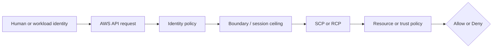
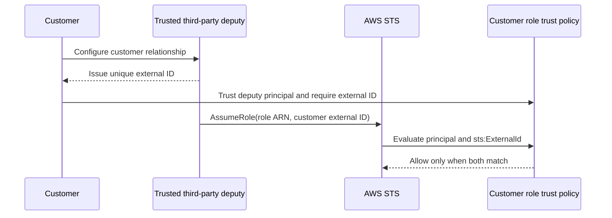
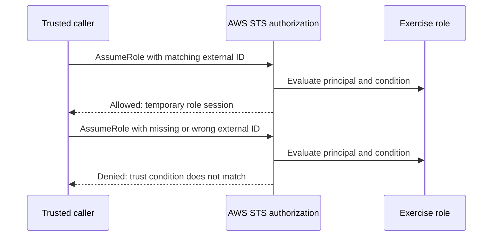

# Week 2 Exercise 3 [Core] — Third-party roles and ExternalId

This exercise is classified as **Core** in the Week 2 curriculum.

Complete the [shared Week 2 setup](../week2-setup.md) first. This exercise uses
a disposable lab account and an independent Terraform state key. It follows the
same safety model as Exercises 1 and 2: predict the decision, deploy the
smallest test fixture, run positive and negative tests, capture CloudTrail
evidence, and remove only disposable resources.

## Table of contents

- [Introduction](#introduction).
  - [External IDs and the confused-deputy problem](#external-ids-and-the-confused-deputy-problem).
    - [Example: multi-tenant cloud-security scanner](#example-multi-tenant-cloud-security-scanner).
- [Learning objectives](#learning-objectives).
- [Terraform configuration and ownership](#terraform-configuration-and-ownership).
  - [Policy/resource excerpt](#policyresource-excerpt).
  - [Trust-policy excerpt](#trust-policy-excerpt).
  - [Permissions-boundary excerpt](#permissions-boundary-excerpt).
- [Configure, initialize, and validate](#configure-initialize-and-validate).
- [Execute the experiment](#execute-the-experiment).
  - [Happy path: correct external ID](#happy-path-correct-external-id).
  - [Unhappy path: missing external ID](#unhappy-path-missing-external-id).
  - [Unhappy path: incorrect external ID](#unhappy-path-incorrect-external-id).
- [Investigating in the Console](#investigating-in-the-console).
- [Evidence and security analysis](#evidence-and-security-analysis).
- [Clean up](#clean-up).
- [References](#references).

## Introduction

This exercise focuses on **confused-deputy prevention**. Its objective is to require sts:ExternalId in a third-party trust policy. An Allow
in one policy is never the whole authorization decision; applicable SCPs,
boundaries, resource policies, trust policies, session context, and explicit
denies must also be considered.



### External IDs and the confused-deputy problem

An external ID is a value that a trusted third party includes in an
`sts:AssumeRole` request. The role owner places the expected value in the
role's trust policy as a condition on `sts:ExternalId`. AWS STS allows the
request only when the caller is the trusted principal **and** the supplied
external ID matches the condition.

External IDs address the cross-account confused-deputy problem. A deputy is a
service provider or automation system that legitimately has permission to
assume roles for multiple customers. Without a customer-specific condition, an
attacker who is also a customer of that provider could try to make the provider
use its valid AWS identity to assume another customer's role. AWS sees the same
trusted provider principal in both cases and, without another condition, cannot
infer which customer authorized the request.

In a production integration, the third party normally generates a unique
external ID for each customer and gives it to the customer. The
customer configures that value in the role trust policy. When acting for that
customer, the third party passes the same value to AWS STS in its `AssumeRole`
request. A request made for another customer has a different external ID and
fails the victim role's condition, even though the deputy's AWS principal is
otherwise trusted.

#### Example: multi-tenant cloud-security scanner

Consider a cloud-security SaaS provider that scans AWS configurations for many
customers. The provider operates an IAM role named `ScannerServiceRole` in its
own AWS account. Each customer creates a read-only role in its AWS account that
trusts that same provider role:

| Actor | Role in the scenario |
|---|---|
| Customer A | Owns AWS account `111111111111` and the role the provider should scan. |
| Customer B | Owns AWS account `222222222222` and is also a legitimate provider customer. |
| Security SaaS | Runs the trusted `ScannerServiceRole` deputy for both customers. |

Customer A gives the provider its role ARN. If Customer A's trust policy checks
only the provider's principal, any request made by `ScannerServiceRole` can
satisfy that trust. Suppose Customer B learns Customer A's role ARN and submits
it to a vulnerable provider workflow as the role to scan. If the provider does
not correctly bind the requested role ARN to the authenticated customer, it
may call `AssumeRole` for Customer A while acting on Customer B's request. The
provider is the **confused deputy**: it has legitimate authority, but Customer
B has induced it to use that authority against Customer A's account.

To mitigate this, the provider issues different external IDs for the two
customer relationships, for example:

```text
Customer A external ID: tenant-a-7f6d2c
Customer B external ID: tenant-b-91a4e8
```

Customer A configures its role to require `tenant-a-7f6d2c`. The provider
stores that value with Customer A's tenant record and includes it only when
processing an authorized Customer A operation. A legitimate scan for Customer
A therefore supplies the matching value and can proceed. A request made in
Customer B's context supplies `tenant-b-91a4e8`; even if the provider is
tricked into targeting Customer A's role ARN, AWS STS rejects the request
because Customer A's `sts:ExternalId` condition does not match.

The external ID is not valuable because it is secret—it is valuable because it
is unique to the provider-customer relationship and because the provider binds
it to the correct tenant context. The provider must still authenticate its
customers, authorize which role belongs to each customer, protect its AWS
principal, and avoid accepting a customer-chosen external ID that could collide
with another customer's value.

In this exercise, you supply the lab value through `TF_VAR_external_id` to
represent the value issued by a third party. Terraform puts it in the role's
trust-policy condition, and the AWS CLI passes it to STS with `--external-id`.
The external ID is an authorization context value, not a password or an AWS
credential. Do not use a password, access key, session token, or other secret as
its value. It does not authenticate the third party, replace the trusted
principal, or grant `sts:AssumeRole` by itself; all applicable identity-policy,
trust-policy, boundary, SCP, and explicit-deny checks still apply.



## Learning objectives

- Explain the policy layer being tested and its limits.
- Predict both an allowed and a denied operation before running it.
- Avoid using management, Log Archive, or Security Tooling accounts.
- Attribute the result using CloudTrail and the effective policy set.
- Document residual risk and a production hardening measure.

## Terraform configuration and ownership

The configuration is in [`terraform/lab/week2/exercise3/main.tf`](../../../../terraform/lab/week2/exercise3/main.tf) and the other Terraform files in that directory. It has an
independent encrypted S3 backend key:

```text
lab/week2/exercise3/terraform.tfstate
```

It uses an IAM Identity Center-backed profile and restricts the AWS provider to
the configured disposable account ID with `allowed_account_ids`. The exercise configuration uses a shell environment file. Copy `.env.example`
to `.env`, replace any placeholders or values you want to customize, and keep
the copied file uncommitted. Never place access keys, tokens, or device codes
in the repository.

From the repository root, use this order before running Terraform:

```bash
source ~/.env/aws-security/terraform/.env
cp terraform/lab/week2/exercise3/.env.example terraform/lab/week2/exercise3/.env
# Edit the copied .env and replace placeholders or desired values.
source terraform/lab/week2/exercise3/.env
```

The global environment must be sourced first because the exercise file refers
to shared values such as `TF_LAB_DEV_ACCOUNT_ID`, `TF_LAB_TEST_ACCOUNT_ID`,
`TF_MANAGEMENT_ACCOUNT_ID`, and `TF_HOME_REGION`. For this exercise, replace
the `<SUFFIX>` and `<unique-customer-id>` placeholders and retain these
exercise-specific values:

```bash
export TF_VAR_source_aws_profile="week2-source"
export TF_VAR_external_id="aws-security-exercise3-<unique-customer-id>"
```

Use a stable value that is unique to this simulated customer relationship. The
[external-ID explanation](#external-ids-and-the-confused-deputy-problem)
describes who supplies this value, how STS evaluates it, and why it mitigates
the confused-deputy problem.

The exercise state owns only resources under `/week2/exercise3/` and the
explicit fixture resources described by the objective. Existing Control Tower,
Identity Center, baseline, and `AWSReservedSSO_*` resources remain outside its
ownership boundary. The configuration reads the existing
`/week2/WorkloadLabRoleBoundary` as an `aws_iam_policy` data source and attaches
it to the exercise role; reading and attaching the boundary does not transfer
ownership of the policy to this state.

### Policy/resource excerpt

The generic fixture illustrates the intentionally narrow starting point:

```hcl
resource "aws_iam_role_policy" "exercise" {
  role = aws_iam_role.exercise.id
  name = "Exercise3Policy"
  policy = jsonencode({
    Version = "2012-10-17"
    Statement = [{
      Effect = "Allow"
      Action = ["sts:GetCallerIdentity"]
      Resource = "*"
    }]
  })
}
```

For the exercise-specific policy, inspect [`main.tf`](../../../../terraform/lab/week2/exercise3/main.tf) before applying and record
its principal, actions, resources, conditions, and any explicit denies. A
permissions boundary is a maximum, not a grant; a resource policy or trust
policy is not a substitute for an identity Allow.

#### Policy/resource analysis

This excerpt is the identity policy associated with the exercise role. Its
principal is the role itself, and its only Allow is the harmless
`sts:GetCallerIdentity` action on all resources. It is intended to permit
identity verification, not access to arbitrary workload resources. It does not
trust any principal; trust is defined separately by the role's assume-role
policy. It intentionally contains no explicit Deny, so the absence of an Allow
for other actions produces an implicit deny. The wildcard resource is a weak
point for readability, although this identity-verification action does not
provide a narrower resource scope. Always compare this excerpt with the role
trust policy and the complete declaration in [`main.tf`](../../../../terraform/lab/week2/exercise3/main.tf).

### Trust-policy excerpt

The exercise role's trust policy names the Identity Center-provisioned
`WorkloadLabAdministrator` role supplied through `source_operator_role_arn` and
requires the configured external ID:

```hcl
assume_role_policy = jsonencode({
  Version = "2012-10-17"
  Statement = [{
    Effect    = "Allow"
    Principal = { AWS = var.source_operator_role_arn }
    Action    = "sts:AssumeRole"
    Condition = {
      StringEquals = {
        "sts:ExternalId" = var.external_id
      }
    }
  }]
})
```

The trusted principal may request `sts:AssumeRole`, but the Allow applies only
when the request context contains an exactly matching `sts:ExternalId`. Other
principals are excluded because they are not named in `Principal`; requests
from the named principal with a missing or incorrect external ID are excluded
by `StringEquals`. Broader account-level trust would allow more principals to
attempt assumption and would weaken attribution and containment. This trust
policy does not grant the caller identity permission to invoke `AssumeRole`,
and the external ID does not identify or authenticate a human. The caller's
identity policy, its permissions boundary, applicable SCPs, and explicit denies
must independently permit the request.

### Permissions-boundary excerpt

The authoritative boundary declaration is
[`workload-lab-role-boundary.json.tftpl`](../../../../terraform/lab/week2/baseline/policies/workload-lab-role-boundary.json.tftpl).
The following excerpt is taken from the original policy JSON template; its
`${partition}`, `${dev_lab_account_id}`, `${test_lab_account_id}`, and
`${lab_bucket_name_prefix}` values are rendered by the baseline Terraform root:

```json
{
  "Version": "2012-10-17",
  "Statement": [
    {
      "Sid": "AllowAssumingBoundedWeekTwoRoles",
      "Effect": "Allow",
      "Action": "sts:AssumeRole",
      "Resource": [
        "arn:${partition}:iam::${dev_lab_account_id}:role/week2/*",
        "arn:${partition}:iam::${test_lab_account_id}:role/week2/*"
      ]
    },
    {
      "Sid": "AllowReadCurrentIdentity",
      "Effect": "Allow",
      "Action": "sts:GetCallerIdentity",
      "Resource": "*"
    },
    {
      "Sid": "AllowWeekTwoLabBucketAccess",
      "Effect": "Allow",
      "Action": [
        "s3:GetBucketLocation",
        "s3:ListBucket",
        "s3:ListBucketVersions",
        "s3:GetObject",
        "s3:GetObjectVersion",
        "s3:PutObject",
        "s3:DeleteObject",
        "s3:DeleteObjectVersion"
      ],
      "Resource": [
        "arn:${partition}:s3:::${lab_bucket_name_prefix}*",
        "arn:${partition}:s3:::${lab_bucket_name_prefix}*/*"
      ]
    }
  ]
}
```

This is a permissions boundary, so it defines a maximum-permissions ceiling;
it does not grant these actions by itself. An identity policy must also allow
an operation, and applicable SCPs, session policies, resource policies, trust
policies, and explicit denies remain additional constraints. The policy is
owned by the baseline Terraform root. Do not edit, import, replace, or destroy
it from this exercise.

The exercise configuration constructs the boundary ARN from the current AWS
partition, `source_account_id`, `lab_role_boundary_path`, and
`lab_role_boundary_name`. The variables default to `/week2/` and
`WorkloadLabRoleBoundary`. It then reads the existing policy and supplies its
ARN when IAM creates the role:

```hcl
data "aws_iam_policy" "lab_role_boundary" {
  arn = local.boundary_arn
}

resource "aws_iam_role" "exercise" {
  name                 = "Week2Exercise3Role"
  path                 = "/week2/exercise3/"
  permissions_boundary = data.aws_iam_policy.lab_role_boundary.arn
  # Trust policy omitted from this excerpt.
}
```

`WorkloadLabAdministrator` permits `iam:CreateRole` for the Week 2 role path
only when the request includes this approved boundary. Omitting or changing
`permissions_boundary` causes `iam:CreateRole` to be denied because the
permission set's boundary condition no longer matches.

#### Boundary analysis

The exercise root attaches this baseline-owned boundary to the role during
creation. It allows only the listed `sts:AssumeRole`, identity-verification,
and Week 2 S3 operations within the two lab accounts and configured bucket
prefix. It intentionally does not allow arbitrary IAM administration, user or
access-key management, managed-policy creation, or unrestricted access to
other services. Its weak point is that the ceiling still permits the listed
role and S3 actions when a separate identity policy grants them; a boundary
cannot prevent an identity policy from granting an action that the boundary
allows. The baseline owner must therefore protect the boundary, while the
exercise must keep the approved boundary attached to every role it creates.


## Configure, initialize, and validate

Authenticate the configured IAM Identity Center profile and verify the account. See [`sso_auth.md`](../../../sso_auth.md) for user enablement, MFA, browser isolation, and CLI login guidance. For the Exercise 1 test users, use the **Create the AWS CLI profiles** section of [`exercise1-instructions.md`](../exercise1/exercise1-instructions.md).

```bash
aws sso login --profile "$TF_VAR_source_aws_profile" --use-device-code --no-browser
aws sts get-caller-identity --profile "$TF_VAR_source_aws_profile"
terraform -chdir=terraform/lab/week2/exercise3 init \
  -backend-config="bucket=$TF_STATE_BUCKET" \
  -backend-config="region=$TF_STATE_REGION" \
  -backend-config="profile=$TF_STATE_PROFILE"
terraform -chdir=terraform/lab/week2/exercise3 validate
terraform -chdir=terraform/lab/week2/exercise3 plan
```

Review the plan before applying. Confirm that `Week2Exercise3Role` is created
under `/week2/exercise3/` with the existing
`/week2/WorkloadLabRoleBoundary` attached. The plan must read rather than create
or modify the boundary, and it must not modify organizational governance,
Control Tower resources, Identity Center resources, or unrelated accounts.
Stop for unexplained replacements or deletions.

## Execute the experiment

Apply only the reviewed plan and capture the role ARN without placing temporary
AWS credentials in a file or shell variable:

```bash
terraform -chdir=terraform/lab/week2/exercise3 apply
export EXERCISE3_ROLE_ARN="$(terraform -chdir=terraform/lab/week2/exercise3 output -raw role_arn)"
echo "role_arn: $EXERCISE3_ROLE_ARN"
```

The operation under test is `sts:AssumeRole`. The commands query only the
resulting assumed-role ARN, so successful responses do not print the returned
access key, secret key, or session token. Record the caller, role ARN, supplied
external-ID case, expected result, actual result, CLI request ID or CloudTrail
event ID, and policy layer that explains each result.

### Happy path: correct external ID

Predict the result before running the command. The request should succeed
because the caller matches `source_operator_role_arn`, its identity policy and
boundary permit assumption of the Week 2 role, and the supplied external ID
matches the role trust-policy condition.

```bash
aws sts assume-role \
  --profile "$TF_VAR_source_aws_profile" \
  --role-arn "$EXERCISE3_ROLE_ARN" \
  --role-session-name exercise3-happy \
  --external-id "$TF_VAR_external_id" \
  --query 'AssumedRoleUser.Arn' \
  --output text \
  --no-cli-pager
```

Expected result: exit status `0` and an ARN resembling:

```text
arn:aws:sts::<SOURCE_ACCOUNT_ID>:assumed-role/Week2Exercise3Role/exercise3-happy
```

### Unhappy path: missing external ID

This request uses the same trusted principal and role but omits
`--external-id`. It should fail because the `sts:ExternalId` condition is
absent from the request context.

```bash
if aws sts assume-role \
  --profile "$TF_VAR_source_aws_profile" \
  --role-arn "$EXERCISE3_ROLE_ARN" \
  --role-session-name exercise3-missing-external-id \
  --query 'AssumedRoleUser.Arn' \
  --output text \
  --no-cli-pager; then
  echo "UNEXPECTED: AssumeRole succeeded without an external ID." >&2
else
  echo "Missing external ID was denied as expected."
fi
```

Expected result: STS returns `AccessDenied`, the AWS CLI takes the `else`
branch, and the expected-denial message is printed. Confirm that the failure is
an STS authorization denial, not an expired SSO login, wrong account, malformed
role ARN, or network error. If the `assume-role` command succeeds, stop: the
trust policy is not enforcing the expected condition.

### Unhappy path: incorrect external ID

This request supplies an external ID, but not the value configured in the trust
policy. It should also fail the `StringEquals` condition.

```bash
if aws sts assume-role \
  --profile "$TF_VAR_source_aws_profile" \
  --role-arn "$EXERCISE3_ROLE_ARN" \
  --role-session-name exercise3-incorrect-external-id \
  --external-id "incorrect-external-id" \
  --query 'AssumedRoleUser.Arn' \
  --output text \
  --no-cli-pager; then
  echo "UNEXPECTED: AssumeRole succeeded with an incorrect external ID." >&2
else
  echo "Incorrect external ID was denied as expected."
fi
```

Expected result: STS returns `AccessDenied`, the AWS CLI takes the `else`
branch, and the expected-denial message is printed. Confirm that the failure is
an STS authorization denial rather than an authentication, configuration, or
network failure. Together, the three tests isolate the external-ID condition:
the principal and target role remain constant while only the condition value
changes.



Do not weaken the trust policy or add permissions to make a denied test pass.
Use CloudTrail to correlate each request with the effective authorization
decision.

## Investigating in the Console

Use IAM Identity Center access-portal sessions, not IAM user keys. Verify the
account ID in the console account menu before inspecting anything.

1. Open **IAM** and inspect the exercise role under `/week2/exercise3/`.
2. Review its trust relationship, identity policies, tags, and attached
   `/week2/WorkloadLabRoleBoundary`.
3. Open the relevant resource service and verify the resource ARN, tags,
   ownership controls, or resource policy.
4. In **CloudTrail → Event history**, filter for the API action under test and
   compare the principal, resource, request parameters, and error code.
5. From an approved management-account session, inspect inherited SCPs without
   modifying them.

Console list pages can require permissions outside a deliberately narrow lab
role. An `AccessDenied` from a page is not evidence that the security policy
should be broadened; use a read-only inspection session or the CLI instead.

## Evidence and security analysis

Record the exact expected decision before each test. Explain the result using
this order:

```text
Explicit deny → SCP/RCP → identity policy → boundary/session policy
             → resource/trust policy → conditions → effective result
```

Discuss the attack or failure mode tested, what would happen if a security
attribute or policy were mutable, and the compensating control required in
production. CloudTrail evidence is historical and must not be treated as proof
that an unused permission can never be needed.

## Clean up

Preserve redacted evidence, then review and execute only the exercise destroy:

```bash
terraform -chdir=terraform/lab/week2/exercise3 plan -destroy
terraform -chdir=terraform/lab/week2/exercise3 destroy
```

Never destroy the Week 2 baseline boundary, Control Tower resources, Identity
Center assignments, or another exercise's state. Confirm the state key is
empty, remove temporary access, and verify `git status` before committing.

## References

- [IAM policy evaluation logic](https://docs.aws.amazon.com/IAM/latest/UserGuide/reference_policies_evaluation-logic.html).
- [IAM permissions boundaries](https://docs.aws.amazon.com/IAM/latest/UserGuide/access_policies_boundaries.html).
- [IAM roles and trust policies](https://docs.aws.amazon.com/IAM/latest/UserGuide/id_roles.html).
- [How to use an external ID when granting access to a third party](https://docs.aws.amazon.com/IAM/latest/UserGuide/id_roles_common-scenarios_third-party.html).
- [AWS STS `AssumeRole` API](https://docs.aws.amazon.com/STS/latest/APIReference/API_AssumeRole.html).
- [IAM Identity Center](https://docs.aws.amazon.com/singlesignon/latest/userguide/what-is.html).
- [AWS CloudTrail event history](https://docs.aws.amazon.com/awscloudtrail/latest/userguide/view-cloudtrail-events.html).
- [AWS STS](https://docs.aws.amazon.com/STS/latest/APIReference/welcome.html).
- [AWS IAM service authorization reference](https://docs.aws.amazon.com/service-authorization/latest/reference/reference_policies_actions-resources-contextkeys.html).
