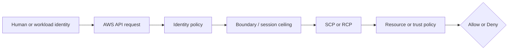

# Week 2 Exercise 4 [Optional] — Permissions boundaries versus an administrator-like grant

This exercise is classified as **Optional** in the Week 2 curriculum.

Complete the [shared Week 2 setup](../week2-setup.md) first. This exercise uses
a disposable lab account and an independent Terraform state key. It follows the
same safety model as Exercises 1 and 2: predict the decision, deploy the
smallest test fixture, run positive and negative tests, capture CloudTrail
evidence, and remove only disposable resources.

## Table of contents

- [Introduction](#introduction).
- [Learning objectives](#learning-objectives).
- [Terraform configuration and ownership](#terraform-configuration-and-ownership).
  - [Policy/resource excerpt](#policyresource-excerpt).
  - [Permissions-boundary excerpt](#permissions-boundary-excerpt).
- [Configure, initialize, and validate](#configure-initialize-and-validate).
- [Execute the experiment](#execute-the-experiment).
  - [Happy path: boundary-approved S3 access](#happy-path-boundary-approved-s3-access).
  - [Unhappy path: IAM administration outside the boundary](#unhappy-path-iam-administration-outside-the-boundary).
- [Investigating in the Console](#investigating-in-the-console).
- [Evidence and security analysis](#evidence-and-security-analysis).
- [Clean up](#clean-up).
- [References](#references).

## Introduction

This exercise focuses on **permissions ceilings**. Its objective is to prove
that an administrator-like identity policy is limited by a boundary. The role
has an inline `Action: "*"`, `Resource: "*"` grant rather than the AWS-managed
`AdministratorAccess` policy because the delegated lab administrator is
intentionally prohibited from attaching managed policies. The authorization
semantics under test are the same: an apparently unrestricted identity Allow
cannot exceed the role's permissions boundary. An Allow
in one policy is never the whole authorization decision; applicable SCPs,
boundaries, resource policies, trust policies, session context, and explicit
denies must also be considered.



## Learning objectives

- Explain the policy layer being tested and its limits.
- Predict both an allowed and a denied operation before running it.
- Avoid using management, Log Archive, or Security Tooling accounts.
- Attribute the result using CloudTrail and the effective policy set.
- Document residual risk and a production hardening measure.

## Terraform configuration and ownership

The configuration is in [`terraform/lab/week2/exercise4/main.tf`](../../../../terraform/lab/week2/exercise4/main.tf) and the other Terraform files in that directory. It has an
independent encrypted S3 backend key:

```text
lab/week2/exercise4/terraform.tfstate
```

It uses an IAM Identity Center-backed profile and restricts the AWS provider to
the configured disposable account ID with `allowed_account_ids`. The exercise configuration uses a shell environment file. Copy `.env.example`
to `.env`, replace any placeholders or values you want to customize, and keep
the copied file uncommitted. Never place access keys, tokens, or device codes
in the repository.

From the repository root, use this order before running Terraform:

```bash
source ~/.env/aws-security/terraform/.env
cp terraform/lab/week2/exercise4/.env.example terraform/lab/week2/exercise4/.env
# Edit the copied .env and replace placeholders or desired values.
source terraform/lab/week2/exercise4/.env
```

The global environment must be sourced first because the exercise file refers
to shared values such as `TF_LAB_DEV_ACCOUNT_ID`, `TF_LAB_TEST_ACCOUNT_ID`,
`TF_MANAGEMENT_ACCOUNT_ID`, and `TF_HOME_REGION`.

The exercise state owns `Week2Exercise4Role`, its deliberately broad inline
policy, one disposable S3 bucket, and one test object. Existing Control Tower,
Identity Center, baseline, and `AWSReservedSSO_*` resources remain outside its
ownership boundary. The root reads and attaches the existing
`/week2/WorkloadLabRoleBoundary`; it does not own or modify that policy.

### Policy/resource excerpt

The role's inline policy is deliberately unrestricted:

```hcl
resource "aws_iam_role_policy" "administrator_like" {
  role = aws_iam_role.exercise.id
  name = "Exercise4AdministratorLikePolicy"

  policy = jsonencode({
    Version = "2012-10-17"
    Statement = [{
      Sid      = "DeliberatelyBroadAdministratorLikeGrant"
      Effect   = "Allow"
      Action   = "*"
      Resource = "*"
    }]
  })
}
```

#### Policy/resource analysis

This identity policy grants every action on every resource syntactically, which
would be administrator-equivalent without another limiting layer. It contains
no condition or explicit Deny. The role's effective identity permissions are
the intersection of this grant and `WorkloadLabRoleBoundary`: approved
Week 2-prefix S3 data access remains possible, while IAM administration and
other actions absent from the boundary remain implicitly denied. This broad
policy is deliberately unsafe outside the isolated exercise and must not be
copied into production.

### Permissions-boundary excerpt

The authoritative boundary declaration is
[`workload-lab-role-boundary.json.tftpl`](../../../../terraform/lab/week2/baseline/policies/workload-lab-role-boundary.json.tftpl).
The following excerpt is taken from the original policy JSON template; its
`${partition}`, `${dev_lab_account_id}`, `${test_lab_account_id}`, and
`${lab_bucket_name_prefix}` values are rendered by the baseline Terraform root:

```json
{
  "Version": "2012-10-17",
  "Statement": [
    {
      "Sid": "AllowAssumingBoundedWeekTwoRoles",
      "Effect": "Allow",
      "Action": "sts:AssumeRole",
      "Resource": [
        "arn:${partition}:iam::${dev_lab_account_id}:role/week2/*",
        "arn:${partition}:iam::${test_lab_account_id}:role/week2/*"
      ]
    },
    {
      "Sid": "AllowReadCurrentIdentity",
      "Effect": "Allow",
      "Action": "sts:GetCallerIdentity",
      "Resource": "*"
    },
    {
      "Sid": "AllowWeekTwoLabBucketAccess",
      "Effect": "Allow",
      "Action": [
        "s3:GetBucketLocation",
        "s3:ListBucket",
        "s3:ListBucketVersions",
        "s3:GetObject",
        "s3:GetObjectVersion",
        "s3:PutObject",
        "s3:DeleteObject",
        "s3:DeleteObjectVersion"
      ],
      "Resource": [
        "arn:${partition}:s3:::${lab_bucket_name_prefix}*",
        "arn:${partition}:s3:::${lab_bucket_name_prefix}*/*"
      ]
    }
  ]
}
```

This is a permissions boundary, so it defines a maximum-permissions ceiling;
it does not grant these actions by itself. An identity policy must also allow
an operation, and applicable SCPs, session policies, resource policies, trust
policies, and explicit denies remain additional constraints. The policy is
owned by the baseline Terraform root. Do not edit, import, replace, or destroy
it from this exercise.

#### Boundary analysis

The exercise attaches this baseline-owned boundary to
`Week2Exercise4Role`. It permits `s3:GetObject` for the configured Week 2 bucket
prefix but contains no IAM administration Allow. It is a maximum ceiling rather
than a grant: S3 succeeds only because both the broad identity policy and the
boundary allow it, while `iam:ListRoles` is denied because only the identity
policy allows it. Applicable SCPs and explicit denies remain additional
constraints.


## Configure, initialize, and validate

Authenticate the configured IAM Identity Center profile and verify the account. See [`sso_auth.md`](../../../sso_auth.md) for user enablement, MFA, browser isolation, and CLI login guidance. For the Exercise 1 test users, use the **Create the AWS CLI profiles** section of [`exercise1-instructions.md`](../exercise1/exercise1-instructions.md).

```bash
aws sso login --profile "$TF_VAR_source_aws_profile" --use-device-code --no-browser
aws sts get-caller-identity --profile "$TF_VAR_source_aws_profile"
terraform -chdir=terraform/lab/week2/exercise4 init \
  -backend-config="bucket=$TF_STATE_BUCKET" \
  -backend-config="region=$TF_STATE_REGION" \
  -backend-config="profile=$TF_STATE_PROFILE"
terraform -chdir=terraform/lab/week2/exercise4 validate
terraform -chdir=terraform/lab/week2/exercise4 plan
```

Review the plan before applying. It should create the bounded
`Week2Exercise4Role`, the inline `Exercise4AdministratorLikePolicy`, one bucket
under `lab_bucket_name_prefix`, and one test object. It must not attach
`AdministratorAccess`, modify the baseline boundary, or change organizational
governance, Control Tower, Identity Center, or unrelated resources. Stop for
unexplained replacements or deletions.

## Execute the experiment

Apply the reviewed plan and create a temporary assumed-role profile. The AWS CLI
obtains and refreshes temporary credentials without printing or storing them in
the exercise environment:

```bash
terraform -chdir=terraform/lab/week2/exercise4 apply
export EXERCISE4_ROLE_ARN="$(terraform -chdir=terraform/lab/week2/exercise4 output -raw role_arn)"
export EXERCISE4_OBJECT_URI="$(terraform -chdir=terraform/lab/week2/exercise4 output -raw allowed_object_uri)"
export EXERCISE4_AWS_CONFIG="$(mktemp)"
cp "${AWS_CONFIG_FILE:-$HOME/.aws/config}" "$EXERCISE4_AWS_CONFIG"
chmod 600 "$EXERCISE4_AWS_CONFIG"
cat >>"$EXERCISE4_AWS_CONFIG" <<EOF

[profile week2-exercise4-bounded-admin]
role_arn = $EXERCISE4_ROLE_ARN
source_profile = $TF_VAR_source_aws_profile
role_session_name = exercise4-bounded-admin
EOF
AWS_CONFIG_FILE="$EXERCISE4_AWS_CONFIG" aws sts get-caller-identity \
  --profile week2-exercise4-bounded-admin \
  --no-cli-pager
```

Confirm the ARN contains
`assumed-role/Week2Exercise4Role/exercise4-bounded-admin` in the Dev Lab
account.

### Happy path: boundary-approved S3 access

Prediction: `s3:GetObject` succeeds because both the administrator-like identity
policy and the boundary allow the action on the approved bucket prefix.

```bash
AWS_CONFIG_FILE="$EXERCISE4_AWS_CONFIG" aws s3 cp \
  "$EXERCISE4_OBJECT_URI" - \
  --profile week2-exercise4-bounded-admin \
  --no-cli-pager
```

Expected result: exit status `0` and the exercise object text.

### Unhappy path: IAM administration outside the boundary

Prediction: `iam:ListRoles` is denied. The broad identity policy allows it, but
the boundary has no corresponding IAM Allow, so it is outside the maximum
permissions.

```bash
if result="$(AWS_CONFIG_FILE="$EXERCISE4_AWS_CONFIG" aws iam list-roles \
  --profile week2-exercise4-bounded-admin \
  --max-items 1 \
  --no-cli-pager 2>&1)"; then
  echo "UNEXPECTED: the bounded role listed IAM roles: $result" >&2
else
  echo "$result"
  case "$result" in
    *AccessDenied*) echo "IAM administration was denied by the effective boundary as expected." ;;
    *) echo "UNEXPECTED: failure was not AccessDenied." >&2 ;;
  esac
fi
```

Do not count an expired SSO login, wrong account, or network error as a valid
negative test. Remove the temporary profile after testing:

```bash
rm -f "$EXERCISE4_AWS_CONFIG"
unset EXERCISE4_AWS_CONFIG EXERCISE4_ROLE_ARN EXERCISE4_OBJECT_URI
```

## Investigating in the Console

Use the Dev Lab `WorkloadLabAdministrator` access-portal session and verify the
console account ID equals `TF_VAR_source_account_id`.

1. Go to **IAM → Access management → Roles**, search for
   `Week2Exercise4Role`, and open it. Verify the path is
   `/week2/exercise4/`.
2. On **Permissions**, expand the inline policy
   `Exercise4AdministratorLikePolicy` and select **JSON**. Find
   `DeliberatelyBroadAdministratorLikeGrant`; confirm `Effect` is `Allow` and
   both `Action` and `Resource` are `"*"`. This is the deliberately broad
   identity grant, not proof of effective administrator access.
3. On the same tab, open **Permissions boundary →
   WorkloadLabRoleBoundary**. Its ARN must end with
   `:policy/week2/WorkloadLabRoleBoundary`. In its JSON, find
   `AllowWeekTwoLabBucketAccess`: `s3:GetObject` is allowed only for the
   configured Week 2 bucket prefix. Confirm there is no IAM administration
   statement allowing `iam:ListRoles`. The missing boundary Allow explains the
   negative test.
4. Open **Trust relationships** and verify `Principal.AWS` is the Dev Lab
   account root, `Action` is `sts:AssumeRole`, and
   `Condition.ArnLike.aws:PrincipalArn` matches only the
   `AWSReservedSSO_WorkloadLabAdministrator_*` role path. The suffix wildcard
   survives Identity Center role recreation without trusting unrelated account
   roles. Trust permits the matching source operator to become this role; it
   does not bypass the boundary.
5. Obtain the bucket name with
   `terraform -chdir=terraform/lab/week2/exercise4 output -raw bucket_name`.
   Go to **S3 → Buckets**, open that exact bucket, and select
   `exercise4/allowed.txt`. Verify versioning and default encryption are enabled
   on the bucket and all four Block Public Access settings are on. This is the
   boundary-approved resource used by the happy path.
6. Exercise 4 creates no SCP. If either result is unexpected, use an approved
   management-account read-only session and go to **AWS Organizations → AWS
   accounts → Dev Lab → Policies → Service control policies**. Inspect every
   policy attached directly or inherited through Dev, Workloads, and the root.
   `FullAWSAccess` does not explain a denial. In other SCPs, search for
   `Effect: "Deny"` with `s3:GetObject`, `iam:ListRoles`, `s3:*`, `iam:*`, or
   `Action: "*"`; record the real policy name, scope, and inheritance source.
   Do not modify Control Tower preventive-control SCPs.
7. Go to **CloudTrail → Event history**. Search **Event name = AssumeRole** and
   open the event whose `requestParameters.roleArn` ends in
   `role/week2/exercise4/Week2Exercise4Role` and session name is
   `exercise4-bounded-admin`; it should have no `errorCode`. Search **Event name
   = ListRoles** in `us-east-1`, where IAM global-service events are recorded,
   and find the same role session with `errorCode=AccessDenied`.
8. `GetObject` is a data event and is not available in standard Event history.
   In an approved management session, open **CloudTrail → Trails →
   aws-security-lab-s3-data-events** and verify its S3 destination and
   `LabS3ObjectDataEvents` selector. Use the read-only S3 evidence procedure
   below to inspect the delivered event for `exercise4/allowed.txt`; do not
   modify the Control Tower-managed trail.

Do not broaden the bounded role to make console pages work. Use the approved
inspection session or CLI when list permissions are unavailable.

## Evidence and security analysis

Reload the exact resource identifiers before collecting evidence:

```bash
export EXERCISE4_ROLE_ARN="$(terraform -chdir=terraform/lab/week2/exercise4 output -raw role_arn)"
export EXERCISE4_BUCKET_NAME="$(terraform -chdir=terraform/lab/week2/exercise4 output -raw bucket_name)"
export EXERCISE4_BOUNDARY_ARN="$(aws iam get-role \
  --profile "$TF_VAR_source_aws_profile" \
  --role-name Week2Exercise4Role \
  --query 'Role.PermissionsBoundary.PermissionsBoundaryArn' \
  --output text \
  --no-cli-pager)"
```

Look for the role path `/week2/exercise4/`, the exact exercise bucket, and the
boundary suffix `policy/week2/WorkloadLabRoleBoundary`.

Retrieve the role's broad identity grant. This command proves why both tested
actions have an identity-policy Allow:

```bash
aws iam get-role-policy \
  --profile "$TF_VAR_source_aws_profile" \
  --role-name Week2Exercise4Role \
  --policy-name Exercise4AdministratorLikePolicy \
  --query 'PolicyDocument.Statement' \
  --output json \
  --no-cli-pager
```

Find `DeliberatelyBroadAdministratorLikeGrant` with `Action="*"` and
`Resource="*"`.

Retrieve the active boundary version. This command shows why `s3:GetObject` is
inside the maximum while `iam:ListRoles` is outside it:

```bash
export EXERCISE4_BOUNDARY_VERSION="$(aws iam get-policy \
  --profile "$TF_VAR_source_aws_profile" \
  --policy-arn "$EXERCISE4_BOUNDARY_ARN" \
  --query 'Policy.DefaultVersionId' \
  --output text \
  --no-cli-pager)"
aws iam get-policy-version \
  --profile "$TF_VAR_source_aws_profile" \
  --policy-arn "$EXERCISE4_BOUNDARY_ARN" \
  --version-id "$EXERCISE4_BOUNDARY_VERSION" \
  --query 'PolicyVersion.Document.Statement' \
  --output json \
  --no-cli-pager
```

Find `s3:GetObject` under `AllowWeekTwoLabBucketAccess` and verify its resource
prefix includes the exercise bucket. Confirm no statement grants
`iam:ListRoles`.

Retrieve the happy-path object's configuration:

```bash
aws s3api head-object \
  --profile "$TF_VAR_source_aws_profile" \
  --bucket "$EXERCISE4_BUCKET_NAME" \
  --key exercise4/allowed.txt \
  --output json \
  --no-cli-pager
```

Look for the expected key metadata, version ID, and server-side encryption. The
object exists under the boundary-approved prefix, ruling out a missing resource
as the reason for either test outcome.

Retrieve the successful role-assumption event from the Control Tower home
Region configured by the shared environment:

```bash
aws cloudtrail lookup-events \
  --profile "$TF_VAR_source_aws_profile" \
  --region "$TF_HOME_REGION" \
  --lookup-attributes AttributeKey=EventName,AttributeValue=AssumeRole \
  --query "Events[?contains(CloudTrailEvent, 'Week2Exercise4Role')].[EventTime,EventId,CloudTrailEvent]" \
  --output json \
  --no-cli-pager
```

Find `roleSessionName=exercise4-bounded-admin`, the expected role ARN, and no
`errorCode`. Record its event ID and time.

Retrieve the negative `ListRoles` event. IAM is a global service, so query
`us-east-1`:

```bash
aws cloudtrail lookup-events \
  --profile "$TF_VAR_source_aws_profile" \
  --region us-east-1 \
  --lookup-attributes AttributeKey=EventName,AttributeValue=ListRoles \
  --query "Events[?contains(CloudTrailEvent, 'exercise4-bounded-admin')].[EventTime,EventId,CloudTrailEvent]" \
  --output json \
  --no-cli-pager
```

Verify the caller is the Exercise 4 role session and `errorCode` is
`AccessDenied`. An event from another role or a failed SSO login is not evidence
for this boundary test.

For the happy-path S3 data event, load the shared evidence destination and list
the stable account-level prefix. Do not derive the log directory from the
workstation clock:

```bash
export EXERCISE4_EVIDENCE_BUCKET="$(terraform -chdir=terraform/lab/evidence output -raw evidence_bucket_name)"
export EXERCISE4_ORGANIZATION_ID="$(terraform -chdir=terraform/lab/evidence output -raw organization_id)"
export EXERCISE4_ACCOUNT_EVIDENCE_PREFIX="AWSLogs/$EXERCISE4_ORGANIZATION_ID/$TF_VAR_source_account_id/CloudTrail/"
aws s3api list-objects-v2 \
  --profile "$TF_VAR_source_aws_profile" \
  --bucket "$EXERCISE4_EVIDENCE_BUCKET" \
  --prefix "$EXERCISE4_ACCOUNT_EVIDENCE_PREFIX" \
  --query 'Contents[].{Key:Key,LastModified:LastModified,Size:Size}' \
  --output table \
  --no-cli-pager
```

Choose the latest delivered object's authoritative Region/date directory:

```bash
export EXERCISE4_LATEST_LOG_KEY="$(aws s3api list-objects-v2 \
  --profile "$TF_VAR_source_aws_profile" \
  --bucket "$EXERCISE4_EVIDENCE_BUCKET" \
  --prefix "$EXERCISE4_ACCOUNT_EVIDENCE_PREFIX" \
  --query 'sort_by(Contents,&LastModified)[-1].Key' \
  --output text \
  --no-cli-pager)"
test -n "$EXERCISE4_LATEST_LOG_KEY"
test "$EXERCISE4_LATEST_LOG_KEY" != "None"
export EXERCISE4_EVIDENCE_PREFIX="${EXERCISE4_LATEST_LOG_KEY%/*}/"
```

If unrelated activity produced a newer file, select the directory from the
preceding table whose timestamps correspond to the test. Download that
directory and filter the records:

```bash
export EXERCISE4_EVIDENCE_TMP="$(mktemp -d)"
chmod 700 "$EXERCISE4_EVIDENCE_TMP"
aws s3 cp \
  "s3://$EXERCISE4_EVIDENCE_BUCKET/$EXERCISE4_EVIDENCE_PREFIX" \
  "$EXERCISE4_EVIDENCE_TMP/" \
  --profile "$TF_VAR_source_aws_profile" \
  --recursive --exclude '*' --include '*.json.gz' --no-cli-pager
find "$EXERCISE4_EVIDENCE_TMP" -type f -name '*.json.gz' -print0 |
  xargs -0 gzip -cd |
  jq -c --arg bucket "$EXERCISE4_BUCKET_NAME" '
    .Records[]
    | select(.eventSource == "s3.amazonaws.com"
        and .eventName == "GetObject"
        and .requestParameters.bucketName == $bucket
        and .requestParameters.key == "exercise4/allowed.txt")
    | {eventTime,eventID,principal:.userIdentity.arn,errorCode,errorMessage}
  '
```

Look for the `exercise4-bounded-admin` session and no error code. Delivery is
asynchronous; wait and retry if no new log object has arrived. Remove local
copies afterward:

```bash
find "$EXERCISE4_EVIDENCE_TMP" -type f -delete
find "$EXERCISE4_EVIDENCE_TMP" -depth -type d -empty -delete
unset EXERCISE4_EVIDENCE_TMP EXERCISE4_EVIDENCE_BUCKET
unset EXERCISE4_ACCOUNT_EVIDENCE_PREFIX EXERCISE4_EVIDENCE_PREFIX
unset EXERCISE4_LATEST_LOG_KEY EXERCISE4_ORGANIZATION_ID
```

Correlate the evidence:

| Test | Identity policy | Boundary | Expected result | Expected trace | Determining layer |
|---|---|---|---|---|---|
| `s3:GetObject` | Broad Allow | Allows approved-prefix object reads | Success | S3 data event without `errorCode` | Intersection permits the request. |
| `iam:ListRoles` | Broad Allow | No IAM Allow | `AccessDenied` | IAM management event with `AccessDenied` | Boundary excludes the action. |

Explain the result as the intersection of the identity grant and boundary, then
consider applicable SCPs and explicit denies. The broad policy is not safe by
itself, and the boundary must remain protected from the role and its operator.

## Clean up

Preserve redacted evidence, then review and execute only the exercise destroy:

```bash
terraform -chdir=terraform/lab/week2/exercise4 plan -destroy
terraform -chdir=terraform/lab/week2/exercise4 destroy
```

Never destroy the Week 2 baseline boundary, Control Tower resources, Identity
Center assignments, or another exercise's state. Confirm the state key is
empty, remove temporary access, and verify `git status` before committing.

## References

- [IAM policy evaluation logic](https://docs.aws.amazon.com/IAM/latest/UserGuide/reference_policies_evaluation-logic.html).
- [IAM permissions boundaries](https://docs.aws.amazon.com/IAM/latest/UserGuide/access_policies_boundaries.html).
- [IAM roles and trust policies](https://docs.aws.amazon.com/IAM/latest/UserGuide/id_roles.html).
- [IAM Identity Center](https://docs.aws.amazon.com/singlesignon/latest/userguide/what-is.html).
- [AWS CloudTrail event history](https://docs.aws.amazon.com/awscloudtrail/latest/userguide/view-cloudtrail-events.html).
- [AWS STS](https://docs.aws.amazon.com/STS/latest/APIReference/welcome.html).
- [AWS IAM service authorization reference](https://docs.aws.amazon.com/service-authorization/latest/reference/reference_policies_actions-resources-contextkeys.html).
