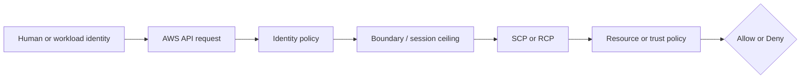
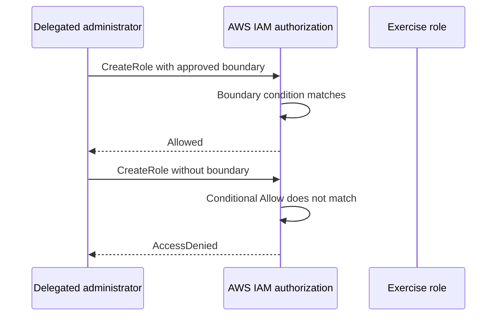

# Week 2 Exercise 5 [Core] — Delegated IAM administration

This exercise is classified as **Core** in the Week 2 curriculum.

Complete the [shared Week 2 setup](../week2-setup.md) first. This exercise uses
a disposable lab account and an independent Terraform state key. It follows the
same safety model as Exercises 1 and 2: predict the decision, deploy the
smallest test fixture, run positive and negative tests, capture CloudTrail
evidence, and remove only disposable resources.

## Table of contents

- [Introduction](#introduction).
- [Learning objectives](#learning-objectives).
- [Terraform configuration and ownership](#terraform-configuration-and-ownership).
  - [Policy/resource excerpt](#policyresource-excerpt).
  - [Permissions-boundary excerpt](#permissions-boundary-excerpt).
- [Configure, initialize, and validate](#configure-initialize-and-validate).
- [Execute the experiment](#execute-the-experiment).
  - [Prepare the test inputs](#prepare-the-test-inputs).
  - [Happy path: create a role with the approved boundary](#happy-path-create-a-role-with-the-approved-boundary).
  - [Unhappy path: create a role without the boundary](#unhappy-path-create-a-role-without-the-boundary).
  - [Remove the CLI test fixture](#remove-the-cli-test-fixture).
- [Investigating in the Console](#investigating-in-the-console).
- [Evidence and security analysis](#evidence-and-security-analysis).
- [Clean up](#clean-up).
- [References](#references).

## Introduction

This exercise focuses on **privilege-escalation-resistant delegation**. Its objective is to require an approved boundary when creating application roles. An Allow
in one policy is never the whole authorization decision; applicable SCPs,
boundaries, resource policies, trust policies, session context, and explicit
denies must also be considered.



## Learning objectives

- Explain the policy layer being tested and its limits.
- Predict both an allowed and a denied operation before running it.
- Avoid using management, Log Archive, or Security Tooling accounts.
- Attribute the result using CloudTrail and the effective policy set.
- Document residual risk and a production hardening measure.

## Terraform configuration and ownership

The configuration is in [`terraform/lab/week2/exercise5/main.tf`](../../../../terraform/lab/week2/exercise5/main.tf) and the other Terraform files in that directory. It has an
independent encrypted S3 backend key:

```text
lab/week2/exercise5/terraform.tfstate
```

It uses an IAM Identity Center-backed profile and restricts the AWS provider to
the configured disposable account ID with `allowed_account_ids`. The exercise configuration uses a shell environment file. Copy `.env.example`
to `.env`, replace any placeholders or values you want to customize, and keep
the copied file uncommitted. Never place access keys, tokens, or device codes
in the repository.

From the repository root, use this order before running Terraform:

```bash
source ~/.env/aws-security/terraform/.env
cp terraform/lab/week2/exercise5/.env.example terraform/lab/week2/exercise5/.env
# Edit the copied .env and replace placeholders or desired values.
source terraform/lab/week2/exercise5/.env
```

The global environment must be sourced first because the exercise file refers
to shared values such as `TF_LAB_DEV_ACCOUNT_ID`, `TF_LAB_TEST_ACCOUNT_ID`,
`TF_MANAGEMENT_ACCOUNT_ID`, and `TF_HOME_REGION`.

The exercise state owns only resources under `/week2/exercise5/` and the
explicit fixture resources described by the objective. Existing Control Tower,
Identity Center, baseline, and `AWSReservedSSO_*` resources remain outside its
ownership boundary. The configuration reads the existing
`/week2/WorkloadLabRoleBoundary` as a data source and attaches it to
`Week2Exercise5Role`; it does not take ownership of the boundary policy.

### Policy/resource excerpt

The generic fixture illustrates the intentionally narrow starting point:

```hcl
resource "aws_iam_role_policy" "exercise" {
  role = aws_iam_role.exercise.id
  name = "Exercise5Policy"
  policy = jsonencode({
    Version = "2012-10-17"
    Statement = [{
      Effect = "Allow"
      Action = ["sts:GetCallerIdentity"]
      Resource = "*"
    }]
  })
}
```

For the exercise-specific policy, inspect [`main.tf`](../../../../terraform/lab/week2/exercise5/main.tf) before applying and record
its principal, actions, resources, conditions, and any explicit denies. A
permissions boundary is a maximum, not a grant; a resource policy or trust
policy is not a substitute for an identity Allow.

#### Policy/resource analysis

This excerpt is the identity policy associated with the exercise role. Its
principal is the role itself, and its only Allow is the harmless
`sts:GetCallerIdentity` action on all resources. It is intended to permit
identity verification, not access to arbitrary workload resources. It does not
trust any principal; trust is defined separately by the role's assume-role
policy. It intentionally contains no explicit Deny, so the absence of an Allow
for other actions produces an implicit deny. The wildcard resource is a weak
point for readability, although this identity-verification action does not
provide a narrower resource scope. Always compare this excerpt with the role
trust policy and the complete declaration in [`main.tf`](../../../../terraform/lab/week2/exercise5/main.tf).

### Permissions-boundary excerpt

The authoritative boundary declaration is
[`workload-lab-role-boundary.json.tftpl`](../../../../terraform/lab/week2/baseline/policies/workload-lab-role-boundary.json.tftpl).
The following excerpt is taken from the original policy JSON template; its
`${partition}`, `${dev_lab_account_id}`, `${test_lab_account_id}`, and
`${lab_bucket_name_prefix}` values are rendered by the baseline Terraform root:

```json
{
  "Version": "2012-10-17",
  "Statement": [
    {
      "Sid": "AllowAssumingBoundedWeekTwoRoles",
      "Effect": "Allow",
      "Action": "sts:AssumeRole",
      "Resource": [
        "arn:${partition}:iam::${dev_lab_account_id}:role/week2/*",
        "arn:${partition}:iam::${test_lab_account_id}:role/week2/*"
      ]
    },
    {
      "Sid": "AllowReadCurrentIdentity",
      "Effect": "Allow",
      "Action": "sts:GetCallerIdentity",
      "Resource": "*"
    },
    {
      "Sid": "AllowWeekTwoLabBucketAccess",
      "Effect": "Allow",
      "Action": [
        "s3:GetBucketLocation",
        "s3:ListBucket",
        "s3:ListBucketVersions",
        "s3:GetObject",
        "s3:GetObjectVersion",
        "s3:PutObject",
        "s3:DeleteObject",
        "s3:DeleteObjectVersion"
      ],
      "Resource": [
        "arn:${partition}:s3:::${lab_bucket_name_prefix}*",
        "arn:${partition}:s3:::${lab_bucket_name_prefix}*/*"
      ]
    }
  ]
}
```

This is a permissions boundary, so it defines a maximum-permissions ceiling;
it does not grant these actions by itself. An identity policy must also allow
an operation, and applicable SCPs, session policies, resource policies, trust
policies, and explicit denies remain additional constraints. The policy is
owned by the baseline Terraform root. Do not edit, import, replace, or destroy
it from this exercise.

#### Boundary analysis

The exercise root attaches this baseline-owned boundary whenever it creates its
role. It allows only the listed `sts:AssumeRole`, identity-verification, and
Week 2 S3 operations within the two lab accounts and configured bucket prefix.
It intentionally does not allow arbitrary IAM administration, user or
access-key management, managed-policy creation, or unrestricted access to
other services. Its weak point is that the ceiling still permits the listed
role and S3 actions when a separate identity policy grants them; a boundary
cannot prevent an identity policy from granting an action that the boundary
allows. The baseline owner must therefore protect the boundary, while delegated
role creators must be prevented from omitting, replacing, or removing it.


## Configure, initialize, and validate

Authenticate the configured IAM Identity Center profile and verify the account. See [`sso_auth.md`](../../../sso_auth.md) for user enablement, MFA, browser isolation, and CLI login guidance. For the Exercise 1 test users, use the **Create the AWS CLI profiles** section of [`exercise1-instructions.md`](../exercise1/exercise1-instructions.md).

```bash
aws sso login --profile "$TF_VAR_source_aws_profile" --use-device-code --no-browser
aws sts get-caller-identity --profile "$TF_VAR_source_aws_profile"
terraform -chdir=terraform/lab/week2/exercise5 init \
  -backend-config="bucket=$TF_STATE_BUCKET" \
  -backend-config="region=$TF_STATE_REGION" \
  -backend-config="profile=$TF_STATE_PROFILE"
terraform -chdir=terraform/lab/week2/exercise5 validate
terraform -chdir=terraform/lab/week2/exercise5 plan
```

Review the plan before applying. Confirm that `Week2Exercise5Role` is created
under `/week2/exercise5/` with the existing
`/week2/WorkloadLabRoleBoundary` attached. The plan must read rather than create
or modify the boundary, and it must not modify organizational governance,
Control Tower resources, Identity Center resources, or unrelated accounts.
Stop for unexplained replacements or deletions.

## Execute the experiment

Apply only the reviewed plan:

```bash
terraform -chdir=terraform/lab/week2/exercise5 apply
echo "role_arn: $(terraform -chdir=terraform/lab/week2/exercise5 output -raw role_arn)"
```

The Terraform apply is an initial happy-path observation: the delegated
`WorkloadLabAdministrator` session can create `Week2Exercise5Role` because the
request includes the approved boundary. The following CLI tests repeat the
same `iam:CreateRole` operation while changing only whether that boundary is
present. Do not use a management-account session or a broader administrator
for these tests.

Keep an evidence table with the caller, account, action, role ARN, boundary
request parameter, predicted result, actual result, CLI exit status, CloudTrail
event ID, and policy layer that explains the result.

### Prepare the test inputs

Read the approved boundary ARN from the Terraform-created role and construct a
trust policy for two short-lived CLI test roles. The trust policy names the
persistent Identity Center-provisioned operator role, not temporary session
credentials.

```bash
export EXERCISE5_BOUNDARY_ARN="$(aws iam get-role \
  --profile "$TF_VAR_source_aws_profile" \
  --role-name Week2Exercise5Role \
  --query 'Role.PermissionsBoundary.PermissionsBoundaryArn' \
  --output text \
  --no-cli-pager)"

test -n "$EXERCISE5_BOUNDARY_ARN"
test "$EXERCISE5_BOUNDARY_ARN" != "None"

export EXERCISE5_TEST_ID="$(date +%s)-$RANDOM"
export EXERCISE5_BOUNDED_ROLE="Week2Exercise5Bounded-$EXERCISE5_TEST_ID"
export EXERCISE5_UNBOUNDED_ROLE="Week2Exercise5Unbounded-$EXERCISE5_TEST_ID"
export EXERCISE5_TRUST_POLICY="$(cat <<EOF
{"Version":"2012-10-17","Statement":[{"Effect":"Allow","Principal":{"AWS":"$TF_VAR_source_operator_role_arn"},"Action":"sts:AssumeRole"}]}
EOF
)"
```

The timestamp and shell-random suffix avoid stale-name collisions. If either
role name already exists, choose a new `EXERCISE5_TEST_ID`; do not treat
`EntityAlreadyExists` as authorization evidence.

### Happy path: create a role with the approved boundary

Prediction: `iam:CreateRole` succeeds because the role is under `/week2/` and
the request's `PermissionsBoundary` value exactly matches the boundary allowed
by the `WorkloadLabAdministrator` permission set.

```bash
aws iam create-role \
  --profile "$TF_VAR_source_aws_profile" \
  --role-name "$EXERCISE5_BOUNDED_ROLE" \
  --path "/week2/exercise5/" \
  --permissions-boundary "$EXERCISE5_BOUNDARY_ARN" \
  --assume-role-policy-document "$EXERCISE5_TRUST_POLICY" \
  --query 'Role.Arn' \
  --output text \
  --no-cli-pager

actual_boundary_arn="$(aws iam get-role \
  --profile "$TF_VAR_source_aws_profile" \
  --role-name "$EXERCISE5_BOUNDED_ROLE" \
  --query 'Role.PermissionsBoundary.PermissionsBoundaryArn' \
  --output text \
  --no-cli-pager)"

if [ "$actual_boundary_arn" = "$EXERCISE5_BOUNDARY_ARN" ]; then
  echo "Bounded role creation succeeded with the approved boundary."
else
  echo "UNEXPECTED: created role does not have the approved boundary." >&2
fi
```

Expected result: both commands exit with status `0`, the returned role ARN uses
`/week2/exercise5/`, and the final boundary comparison succeeds. The boundary
is a required ceiling, not the source of the caller's `iam:CreateRole` grant.

### Unhappy path: create a role without the boundary

Prediction: the same `iam:CreateRole` action is denied because this request
omits `--permissions-boundary`. The conditional Allow in
`WorkloadLabAdministrator` therefore does not match.

```bash
if unbounded_result="$(aws iam create-role \
  --profile "$TF_VAR_source_aws_profile" \
  --role-name "$EXERCISE5_UNBOUNDED_ROLE" \
  --path "/week2/exercise5/" \
  --assume-role-policy-document "$EXERCISE5_TRUST_POLICY" \
  --query 'Role.Arn' \
  --output text \
  --no-cli-pager 2>&1)"; then
  echo "UNEXPECTED: unbounded role creation succeeded: $unbounded_result" >&2
  aws iam delete-role \
    --profile "$TF_VAR_source_aws_profile" \
    --role-name "$EXERCISE5_UNBOUNDED_ROLE"
else
  echo "$unbounded_result"
  case "$unbounded_result" in
    *AccessDenied*) echo "Unbounded role creation was denied as expected." ;;
    *) echo "UNEXPECTED: failure was not AccessDenied; do not count this as a valid negative test." >&2 ;;
  esac
fi
```

Expected result: IAM returns `AccessDenied`, the AWS CLI takes the `else`
branch, and no unbounded role exists. An expired SSO login, malformed trust
policy, wrong account, existing role name, or network failure is not a valid
negative result. If creation succeeds, stop and investigate the live permission
set and applicable policies before continuing.

### Remove the CLI test fixture

The successful CLI test role is not owned by Terraform state. Delete it after
collecting evidence:

```bash
aws iam delete-role \
  --profile "$TF_VAR_source_aws_profile" \
  --role-name "$EXERCISE5_BOUNDED_ROLE"

unset EXERCISE5_BOUNDARY_ARN EXERCISE5_TEST_ID EXERCISE5_BOUNDED_ROLE
unset EXERCISE5_UNBOUNDED_ROLE EXERCISE5_TRUST_POLICY
```



Do not add a broader `iam:CreateRole` Allow to make the denied test pass. The
security control is the conditional delegation that requires the approved
boundary on every new role.

## Investigating in the Console

Use IAM Identity Center access-portal sessions, not IAM user keys. Verify the
account ID in the console account menu before inspecting anything.

1. Open **IAM** and inspect the exercise role under `/week2/exercise5/`.
2. Review its trust relationship, identity policies, tags, and attached
   `/week2/WorkloadLabRoleBoundary`.
3. Open the relevant resource service and verify the resource ARN, tags,
   ownership controls, or resource policy.
4. In **CloudTrail → Event history**, filter for the API action under test and
   compare the principal, resource, request parameters, and error code.
5. From an approved management-account session, inspect inherited SCPs without
   modifying them.

Console list pages can require permissions outside a deliberately narrow lab
role. An `AccessDenied` from a page is not evidence that the security policy
should be broadened; use a read-only inspection session or the CLI instead.

## Evidence and security analysis

Record the exact expected decision before each test. Explain the result using
this order:

```text
Explicit deny → SCP/RCP → identity policy → boundary/session policy
             → resource/trust policy → conditions → effective result
```

Discuss the attack or failure mode tested, what would happen if a security
attribute or policy were mutable, and the compensating control required in
production. CloudTrail evidence is historical and must not be treated as proof
that an unused permission can never be needed.

## Clean up

Preserve redacted evidence and complete
[Remove the CLI test fixture](#remove-the-cli-test-fixture) before destroying
the Terraform-managed fixture. Terraform does not track the role created by
the happy-path CLI test. Then review and execute only the exercise destroy:

```bash
terraform -chdir=terraform/lab/week2/exercise5 plan -destroy
terraform -chdir=terraform/lab/week2/exercise5 destroy
```

Never destroy the Week 2 baseline boundary, Control Tower resources, Identity
Center assignments, or another exercise's state. Confirm the state key is
empty, remove temporary access, and verify `git status` before committing.

## References

- [IAM policy evaluation logic](https://docs.aws.amazon.com/IAM/latest/UserGuide/reference_policies_evaluation-logic.html).
- [IAM permissions boundaries](https://docs.aws.amazon.com/IAM/latest/UserGuide/access_policies_boundaries.html).
- [IAM roles and trust policies](https://docs.aws.amazon.com/IAM/latest/UserGuide/id_roles.html).
- [IAM Identity Center](https://docs.aws.amazon.com/singlesignon/latest/userguide/what-is.html).
- [AWS CloudTrail event history](https://docs.aws.amazon.com/awscloudtrail/latest/userguide/view-cloudtrail-events.html).
- [AWS STS](https://docs.aws.amazon.com/STS/latest/APIReference/welcome.html).
- [AWS IAM service authorization reference](https://docs.aws.amazon.com/service-authorization/latest/reference/reference_policies_actions-resources-contextkeys.html).
