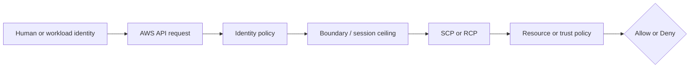
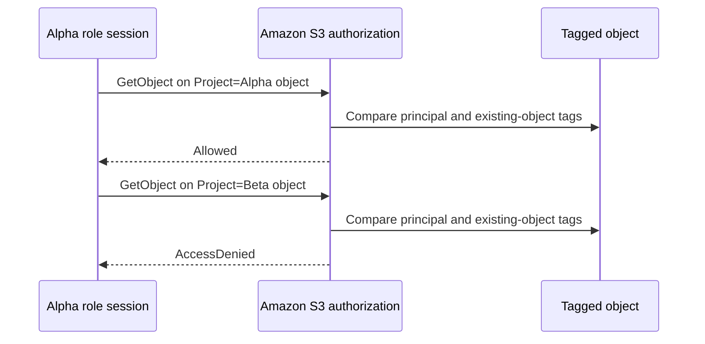

# Week 2 Exercise 6 [Core] — Project-based ABAC

This exercise is classified as **Core** in the Week 2 curriculum.

Complete the [shared Week 2 setup](../week2-setup.md) first. This exercise uses
a disposable lab account and an independent Terraform state key. It follows the
same safety model as Exercises 1 and 2: predict the decision, deploy the
smallest test fixture, run positive and negative tests, capture CloudTrail
evidence, and remove only disposable resources.

## Table of contents

- [Introduction](#introduction).
- [Learning objectives](#learning-objectives).
- [Terraform configuration and ownership](#terraform-configuration-and-ownership).
  - [Policy/resource excerpt](#policyresource-excerpt).
  - [Trust policy excerpt](#trust-policy-excerpt).
  - [Permissions-boundary excerpt](#permissions-boundary-excerpt).
- [Configure, initialize, and validate](#configure-initialize-and-validate).
- [Execute the experiment](#execute-the-experiment).
  - [Prepare an assumed-role CLI profile](#prepare-an-assumed-role-cli-profile).
  - [Happy path: Alpha principal reads the Alpha object](#happy-path-alpha-principal-reads-the-alpha-object).
  - [Unhappy path: Alpha principal reads the Beta object](#unhappy-path-alpha-principal-reads-the-beta-object).
  - [Remove the temporary CLI profile](#remove-the-temporary-cli-profile).
- [Investigating in the Console](#investigating-in-the-console).
- [Evidence and security analysis](#evidence-and-security-analysis).
- [Clean up](#clean-up).
- [References](#references).

## Introduction

This exercise focuses on **tag-based authorization**. Its objective is to allow access when principal and resource Project attributes match. An Allow
in one policy is never the whole authorization decision; applicable SCPs,
boundaries, resource policies, trust policies, session context, and explicit
denies must also be considered.



## Learning objectives

- Explain the policy layer being tested and its limits.
- Predict both an allowed and a denied operation before running it.
- Avoid using management, Log Archive, or Security Tooling accounts.
- Attribute the result using CloudTrail and the effective policy set.
- Document residual risk and a production hardening measure.

## Terraform configuration and ownership

The configuration is in [`terraform/lab/week2/exercise6/main.tf`](../../../../terraform/lab/week2/exercise6/main.tf) and the other Terraform files in that directory. It has an
independent encrypted S3 backend key:

```text
lab/week2/exercise6/terraform.tfstate
```

It uses an IAM Identity Center-backed profile and restricts the AWS provider to
the configured disposable account ID with `allowed_account_ids`. The exercise configuration uses a shell environment file. Copy `.env.example`
to `.env`, replace any placeholders or values you want to customize, and keep
the copied file uncommitted. Never place access keys, tokens, or device codes
in the repository.

From the repository root, use this order before running Terraform:

```bash
source ~/.env/aws-security/terraform/.env
cp terraform/lab/week2/exercise6/.env.example terraform/lab/week2/exercise6/.env
# Edit the copied .env and replace placeholders or desired values.
source terraform/lab/week2/exercise6/.env
```

The global environment must be sourced first because the exercise file refers
to shared values such as `TF_LAB_DEV_ACCOUNT_ID`, `TF_LAB_TEST_ACCOUNT_ID`,
`TF_MANAGEMENT_ACCOUNT_ID`, and `TF_HOME_REGION`. The exercise also consumes
`TF_VAR_lab_bucket_name_prefix`, which must be identical to the prefix used when
`WorkloadLabAdministrator` was deployed. The permission set authorizes
`s3:CreateBucket` only for bucket ARNs under that configured prefix.

The exercise state owns `Week2Exercise6Role`, one disposable S3 bucket, and
two tagged test objects. The role has `Project=Alpha`; the objects have
`Project=Alpha` and `Project=Beta`. Existing Control Tower, Identity Center,
baseline, and `AWSReservedSSO_*` resources remain outside its ownership
boundary. The root reads and attaches the existing
`/week2/WorkloadLabRoleBoundary` without taking ownership of that policy.

### Policy/resource excerpt

The role policy `Exercise6ProjectAbacPolicy` contains two statements: an
identity-verification Allow and the project-matching Allow for S3 objects:

```hcl
Statement = [
  {
    Sid      = "ReadCurrentIdentity"
    Effect   = "Allow"
    Action   = "sts:GetCallerIdentity"
    Resource = "*"
  },
  {
    Sid      = "ReadObjectsForMatchingProject"
    Effect   = "Allow"
    Action   = "s3:GetObject"
    Resource = "${aws_s3_bucket.exercise.arn}/*"
    Condition = {
      StringEquals = {
        "s3:ExistingObjectTag/Project" = "$${aws:PrincipalTag/Project}"
      }
    }
  },
]
```

Inspect the complete declaration in
[`main.tf`](../../../../terraform/lab/week2/exercise6/main.tf) before applying.
The doubled dollar sign is Terraform escaping; the rendered IAM policy contains
`${aws:PrincipalTag/Project}`, which IAM resolves from the role session.

#### Policy/resource analysis

The identity policy is associated with `Week2Exercise6Role`. Its
`ReadCurrentIdentity` statement permits only harmless identity verification on
all resources. Its `ReadObjectsForMatchingProject` statement allows
`s3:GetObject` only for objects in the exercise bucket and only when the
object's existing `Project` tag equals the principal's `Project` tag. The role
tag becomes a principal tag in its role sessions, so this fixture compares
`Alpha` from the role with `Alpha` or `Beta` on each object. There is no
explicit Deny: a mismatch means this conditional Allow does not apply, leaving
an implicit deny. The policy does not allow changing principal or object tags.
Tag-governance permissions remain security-sensitive because a principal able
to rewrite either authorization attribute could bypass the intended project
separation.

### Trust policy excerpt

`Week2Exercise6Role` is assumable only through the trust policy declared in
[`main.tf`](../../../../terraform/lab/week2/exercise6/main.tf). The excerpt
below is taken from the role's `assume_role_policy`. The
`local.source_operator_role_arn_pattern` value it references resolves to
`arn:<partition>:iam::<source_account_id>:role/aws-reserved/sso.amazonaws.com/[<region>/]AWSReservedSSO_WorkloadLabAdministrator_*`,
where the Region segment is present only outside `us-east-1`:

```hcl
assume_role_policy = jsonencode({
  Version = "2012-10-17"
  Statement = [{
    Effect    = "Allow"
    Principal = { AWS = "arn:${data.aws_partition.current.partition}:iam::${var.source_account_id}:root" }
    Action    = "sts:AssumeRole"
    Condition = {
      ArnLike = {
        "aws:PrincipalArn" = local.source_operator_role_arn_pattern
      }
    }
  }]
})
```

#### Trust policy analysis

This trust policy answers who may become `Week2Exercise6Role`. The trusted
principal is the Dev Lab (`source_account_id`) account root, and the only
authorized action is `sts:AssumeRole`. An account-root principal alone would
trust every principal in the account, so the `ArnLike` condition on
`aws:PrincipalArn` restricts trust to the IAM role path that IAM Identity
Center provisions for the `WorkloadLabAdministrator` permission set. The
policy intentionally distrusts principals in every other account and Dev Lab
principals whose ARN falls outside that reserved path, including ordinary IAM
roles, IAM users, and temporary session ARNs. Assuming the role is also how
the tested session receives the role's `Project=Alpha` value as
`aws:PrincipalTag/Project`, which the ABAC identity policy then compares with
each object's tag. The trailing `*` tolerates IAM Identity Center recreating
its generated role but trusts any role name sharing that prefix, which is
slightly broader than a single exact ARN. The trust decision grants no S3
access by itself; the identity policy Allow, the permissions boundary, and any
applicable SCP or explicit deny still govern the resulting session.

### Permissions-boundary excerpt

The authoritative boundary declaration is
[`workload-lab-role-boundary.json.tftpl`](../../../../terraform/lab/week2/baseline/policies/workload-lab-role-boundary.json.tftpl).
The following excerpt is taken from the original policy JSON template; its
`${partition}`, `${dev_lab_account_id}`, `${test_lab_account_id}`, and
`${lab_bucket_name_prefix}` values are rendered by the baseline Terraform root:

```json
{
  "Version": "2012-10-17",
  "Statement": [
    {
      "Sid": "AllowAssumingBoundedWeekTwoRoles",
      "Effect": "Allow",
      "Action": "sts:AssumeRole",
      "Resource": [
        "arn:${partition}:iam::${dev_lab_account_id}:role/week2/*",
        "arn:${partition}:iam::${test_lab_account_id}:role/week2/*"
      ]
    },
    {
      "Sid": "AllowReadCurrentIdentity",
      "Effect": "Allow",
      "Action": "sts:GetCallerIdentity",
      "Resource": "*"
    },
    {
      "Sid": "AllowWeekTwoLabBucketAccess",
      "Effect": "Allow",
      "Action": [
        "s3:GetBucketLocation",
        "s3:ListBucket",
        "s3:ListBucketVersions",
        "s3:GetObject",
        "s3:GetObjectVersion",
        "s3:PutObject",
        "s3:DeleteObject",
        "s3:DeleteObjectVersion"
      ],
      "Resource": [
        "arn:${partition}:s3:::${lab_bucket_name_prefix}*",
        "arn:${partition}:s3:::${lab_bucket_name_prefix}*/*"
      ]
    }
  ]
}
```

This is a permissions boundary, so it defines a maximum-permissions ceiling;
it does not grant these actions by itself. An identity policy must also allow
an operation, and applicable SCPs, session policies, resource policies, trust
policies, and explicit denies remain additional constraints. The policy is
owned by the baseline Terraform root. Do not edit, import, replace, or destroy
it from this exercise.

#### Boundary analysis

The exercise root attaches this baseline-owned boundary to the Alpha role. It
allows only the listed `sts:AssumeRole`, identity-verification, and Week 2 S3
operations within the two lab accounts and configured bucket prefix. It does
not allow arbitrary IAM administration, user or access-key management,
managed-policy creation, or unrestricted access to other services. The
boundary permits `s3:GetObject`, but that ceiling does not grant object access;
the role's ABAC identity policy must also allow the request. The baseline owner
protects the boundary while this exercise owns the narrower ABAC grant.


## Configure, initialize, and validate

Authenticate the configured IAM Identity Center profile and verify the account. See [`sso_auth.md`](../../../sso_auth.md) for user enablement, MFA, browser isolation, and CLI login guidance. For the Exercise 1 test users, use the **Create the AWS CLI profiles** section of [`exercise1-instructions.md`](../exercise1/exercise1-instructions.md).

```bash
aws sso login --profile "$TF_VAR_source_aws_profile" --use-device-code --no-browser
aws sts get-caller-identity --profile "$TF_VAR_source_aws_profile"
terraform -chdir=terraform/lab/week2/exercise6 init \
  -backend-config="bucket=$TF_STATE_BUCKET" \
  -backend-config="region=$TF_STATE_REGION" \
  -backend-config="profile=$TF_STATE_PROFILE"
terraform -chdir=terraform/lab/week2/exercise6 validate
terraform -chdir=terraform/lab/week2/exercise6 plan
```

Review the plan before applying. It should create one bounded `Project=Alpha`
role, one bucket named with the configured `lab_bucket_name_prefix`, and two
objects tagged `Project=Alpha` and `Project=Beta`. Confirm that the planned
bucket name begins with the exact prefix configured in the central workload
access root. It must not modify
organizational governance, Control Tower resources, Identity Center resources,
or unrelated accounts. Stop for unexplained replacements or deletions.

## Execute the experiment

Apply only the reviewed plan and capture its nonsensitive outputs:

```bash
terraform -chdir=terraform/lab/week2/exercise6 apply
export EXERCISE6_ROLE_ARN="$(terraform -chdir=terraform/lab/week2/exercise6 output -raw role_arn)"
export EXERCISE6_BUCKET_NAME="$(terraform -chdir=terraform/lab/week2/exercise6 output -raw bucket_name)"
```

Keep an evidence table with the role-session ARN, principal tag, object URI,
object tag, expected result, actual result, CLI exit status, CloudTrail event
ID, and determining policy condition.

### Prepare an assumed-role CLI profile

Create a temporary AWS config containing an assumed-role profile. It delegates
credential acquisition to the AWS CLI and does not print or persist the
temporary STS access key, secret key, or session token. Copying the existing
config preserves the SSO-session definition used by `source_profile`.

```bash
export EXERCISE6_AWS_CONFIG="$(mktemp)"
chmod 600 "$EXERCISE6_AWS_CONFIG"
cp "${AWS_CONFIG_FILE:-$HOME/.aws/config}" "$EXERCISE6_AWS_CONFIG"
cat >>"$EXERCISE6_AWS_CONFIG" <<EOF

[profile week2-exercise6-alpha]
role_arn = $EXERCISE6_ROLE_ARN
source_profile = $TF_VAR_source_aws_profile
role_session_name = exercise6-alpha
EOF

AWS_CONFIG_FILE="$EXERCISE6_AWS_CONFIG" aws sts get-caller-identity \
  --profile week2-exercise6-alpha \
  --no-cli-pager
```

Confirm that the returned ARN contains
`assumed-role/Week2Exercise6Role/exercise6-alpha`. Stop if it shows the wrong
account or role. The resulting role session has the role's `Project=Alpha`
principal tag.

### Happy path: Alpha principal reads the Alpha object

Prediction: `s3:GetObject` succeeds because the principal and object both have
`Project=Alpha`, the identity-policy condition matches, and the permissions
boundary also allows `s3:GetObject` within the approved bucket prefix.

```bash
export EXERCISE6_ALPHA_OUTPUT="$(mktemp)"
if AWS_CONFIG_FILE="$EXERCISE6_AWS_CONFIG" aws s3api get-object \
  --profile week2-exercise6-alpha \
  --bucket "$EXERCISE6_BUCKET_NAME" \
  --key exercise6/alpha.txt \
  "$EXERCISE6_ALPHA_OUTPUT" \
  --no-cli-pager; then
  cat "$EXERCISE6_ALPHA_OUTPUT"
else
  echo "UNEXPECTED: Alpha GetObject was denied." >&2
fi
rm -f "$EXERCISE6_ALPHA_OUTPUT"
unset EXERCISE6_ALPHA_OUTPUT
```

Expected result: the direct `GetObject` command exits with status `0` and prints
`Project Alpha test object.`. Using `s3api get-object` avoids the preliminary
`HeadObject` request that the high-level `s3 cp` command may issue.

### Unhappy path: Alpha principal reads the Beta object

Prediction: the same role session and `s3:GetObject` action are denied for the
Beta object. The object's `Project=Beta` value does not equal the session's
`Project=Alpha` principal tag, so the conditional Allow does not apply.

```bash
export EXERCISE6_BETA_OUTPUT="$(mktemp)"
if beta_result="$(AWS_CONFIG_FILE="$EXERCISE6_AWS_CONFIG" aws s3api get-object \
  --profile week2-exercise6-alpha \
  --bucket "$EXERCISE6_BUCKET_NAME" \
  --key exercise6/beta.txt \
  "$EXERCISE6_BETA_OUTPUT" \
  --no-cli-pager 2>&1)"; then
  echo "UNEXPECTED: Alpha principal read the Beta object: $beta_result" >&2
else
  echo "$beta_result"
  case "$beta_result" in
    *AccessDenied*|*Forbidden*) echo "Project tag mismatch was denied as expected." ;;
    *) echo "UNEXPECTED: failure was not an S3 authorization denial." >&2 ;;
  esac
fi
rm -f "$EXERCISE6_BETA_OUTPUT"
unset EXERCISE6_BETA_OUTPUT
```

Expected result: the direct `GetObject` request returns `AccessDenied` or an
HTTP 403 `Forbidden` authorization response, and no object content is returned.
An expired SSO login, missing object, wrong account, malformed input, or network
error is not a valid negative result. The caller, action, bucket, and role
policy remain constant; only the object's `Project` tag differs.

### Remove the temporary CLI profile

The temporary file contains profile configuration but no static or copied AWS
credentials. Remove it and clear the exercise variables after collecting
evidence:

```bash
rm -f "$EXERCISE6_AWS_CONFIG"
unset EXERCISE6_AWS_CONFIG EXERCISE6_ROLE_ARN EXERCISE6_BUCKET_NAME
```



Do not grant tag-mutation permissions to the exercise role or weaken the
condition to make the denied test pass.

## Investigating in the Console

Use IAM Identity Center access-portal sessions, not IAM user keys. Verify the
account ID in the console account menu before inspecting anything.

1. Open **IAM** and inspect the exercise role under `/week2/exercise6/`.
2. Review its `Project=Alpha` tag, ABAC identity policy, and attached
   `/week2/WorkloadLabRoleBoundary`. In **Trust relationships**, verify the Dev
   Lab account root is constrained by `aws:PrincipalArn` to the
   `AWSReservedSSO_WorkloadLabAdministrator_*` role path.
3. Open the S3 bucket and verify the Alpha and Beta object tags, encryption,
   versioning, and public-access block.
4. In **CloudTrail → Event history**, filter for the API action under test and
   compare the principal, resource, request parameters, and error code.
5. From an approved management-account session, inspect inherited SCPs without
   modifying them.

Console list pages can require permissions outside a deliberately narrow lab
role. An `AccessDenied` from a page is not evidence that the security policy
should be broadened; use a read-only inspection session or the CLI instead.

## Evidence and security analysis

Reload the exact role and bucket identifiers:

```bash
export EXERCISE6_ROLE_ARN="$(terraform -chdir=terraform/lab/week2/exercise6 output -raw role_arn)"
export EXERCISE6_BUCKET_NAME="$(terraform -chdir=terraform/lab/week2/exercise6 output -raw bucket_name)"
```

Confirm the role ARN ends in
`role/week2/exercise6/Week2Exercise6Role` and the bucket starts with the
centrally configured Week 2 prefix.

Retrieve the role tags, trust policy, and boundary:

```bash
aws iam get-role \
  --profile "$TF_VAR_source_aws_profile" \
  --role-name Week2Exercise6Role \
  --query 'Role.{Arn:Arn,Path:Path,Tags:Tags,Boundary:PermissionsBoundary.PermissionsBoundaryArn,Trust:AssumeRolePolicyDocument}' \
  --output json \
  --no-cli-pager
```

Look for `Project=Alpha`, path `/week2/exercise6/`, the
`WorkloadLabRoleBoundary` ARN, and trust that combines the Dev Lab account root
with an `aws:PrincipalArn` condition matching only the
`AWSReservedSSO_WorkloadLabAdministrator_*` role path.

Retrieve the ABAC identity policy:

```bash
aws iam get-role-policy \
  --profile "$TF_VAR_source_aws_profile" \
  --role-name Week2Exercise6Role \
  --policy-name Exercise6ProjectAbacPolicy \
  --query PolicyDocument.Statement \
  --output json \
  --no-cli-pager
```

Find `ReadObjectsForMatchingProject`. Verify it allows `s3:GetObject` only in
the exercise bucket and compares `s3:ExistingObjectTag/Project` with
`${aws:PrincipalTag/Project}`. There is no explicit Deny; a mismatch prevents
this conditional Allow from applying.

Retrieve the two resource-tag values evaluated by the happy and unhappy paths:

```bash
aws s3api get-object-tagging \
  --profile "$TF_VAR_source_aws_profile" \
  --bucket "$EXERCISE6_BUCKET_NAME" \
  --key exercise6/alpha.txt \
  --query TagSet \
  --output json \
  --no-cli-pager
aws s3api get-object-tagging \
  --profile "$TF_VAR_source_aws_profile" \
  --bucket "$EXERCISE6_BUCKET_NAME" \
  --key exercise6/beta.txt \
  --query TagSet \
  --output json \
  --no-cli-pager
```

The Alpha object must show `Project=Alpha`, matching the principal. The Beta
object must show `Project=Beta`, isolating the one attribute that causes the
negative result.

Retrieve the successful role-assumption management event:

```bash
aws cloudtrail lookup-events \
  --profile "$TF_VAR_source_aws_profile" \
  --region "$TF_HOME_REGION" \
  --lookup-attributes AttributeKey=EventName,AttributeValue=AssumeRole \
  --query "Events[?contains(CloudTrailEvent, 'Week2Exercise6Role')].[EventTime,EventId,CloudTrailEvent]" \
  --output json \
  --no-cli-pager
```

Look for session name `exercise6-alpha`, the expected role ARN, and no
`errorCode`. Record the event ID and time.

`GetObject` is an S3 data event. Load the project-owned evidence destination
and list the stable account-level prefix rather than deriving a directory from
the workstation clock:

```bash
export EXERCISE6_EVIDENCE_BUCKET="$(terraform -chdir=terraform/lab/evidence output -raw evidence_bucket_name)"
export EXERCISE6_ORGANIZATION_ID="$(terraform -chdir=terraform/lab/evidence output -raw organization_id)"
export EXERCISE6_ACCOUNT_EVIDENCE_PREFIX="AWSLogs/$EXERCISE6_ORGANIZATION_ID/$TF_VAR_source_account_id/CloudTrail/"
aws s3api list-objects-v2 \
  --profile "$TF_VAR_source_aws_profile" \
  --bucket "$EXERCISE6_EVIDENCE_BUCKET" \
  --prefix "$EXERCISE6_ACCOUNT_EVIDENCE_PREFIX" \
  --query 'Contents[].{Key:Key,LastModified:LastModified,Size:Size}' \
  --output table \
  --no-cli-pager
```

Derive the Region/date directory from the latest delivered S3 key:

```bash
export EXERCISE6_LATEST_LOG_KEY="$(aws s3api list-objects-v2 \
  --profile "$TF_VAR_source_aws_profile" \
  --bucket "$EXERCISE6_EVIDENCE_BUCKET" \
  --prefix "$EXERCISE6_ACCOUNT_EVIDENCE_PREFIX" \
  --query 'sort_by(Contents,&LastModified)[-1].Key' \
  --output text \
  --no-cli-pager)"
test -n "$EXERCISE6_LATEST_LOG_KEY"
test "$EXERCISE6_LATEST_LOG_KEY" != "None"
export EXERCISE6_EVIDENCE_PREFIX="${EXERCISE6_LATEST_LOG_KEY%/*}/"
```

If unrelated activity produced a newer file, choose the directory from the
preceding table that corresponds to the test timestamps. Download that
directory and filter the records:

```bash
export EXERCISE6_EVIDENCE_TMP="$(mktemp -d)"
chmod 700 "$EXERCISE6_EVIDENCE_TMP"
aws s3 cp \
  "s3://$EXERCISE6_EVIDENCE_BUCKET/$EXERCISE6_EVIDENCE_PREFIX" \
  "$EXERCISE6_EVIDENCE_TMP/" \
  --profile "$TF_VAR_source_aws_profile" \
  --recursive --exclude '*' --include '*.json.gz' --no-cli-pager
find "$EXERCISE6_EVIDENCE_TMP" -type f -name '*.json.gz' -print0 |
  xargs -0 gzip -cd |
  jq -c --arg bucket "$EXERCISE6_BUCKET_NAME" '
    .Records[]
    | select(.eventSource == "s3.amazonaws.com"
        and .eventName == "GetObject"
        and .requestParameters.bucketName == $bucket
        and (.requestParameters.key == "exercise6/alpha.txt"
          or .requestParameters.key == "exercise6/beta.txt"))
    | {eventTime,eventID,principal:.userIdentity.arn,key:.requestParameters.key,errorCode,errorMessage}
  '
```

Look for `exercise6/alpha.txt` without an error code and
`exercise6/beta.txt` with `AccessDenied`, both from the same
`Week2Exercise6Role/exercise6-alpha` session. Delivery is asynchronous; wait and
retry if no file follows the test timestamps. Remove local evidence copies
after preserving approved redacted records:

```bash
find "$EXERCISE6_EVIDENCE_TMP" -type f -delete
find "$EXERCISE6_EVIDENCE_TMP" -depth -type d -empty -delete
unset EXERCISE6_EVIDENCE_TMP EXERCISE6_EVIDENCE_BUCKET
unset EXERCISE6_ACCOUNT_EVIDENCE_PREFIX EXERCISE6_EVIDENCE_PREFIX
unset EXERCISE6_LATEST_LOG_KEY EXERCISE6_ORGANIZATION_ID
```

| Test | Principal tag | Object tag | Expected outcome | Determining layer |
|---|---|---|---|---|
| Alpha object | `Project=Alpha` | `Project=Alpha` | Success | ABAC comparison matches. |
| Beta object | `Project=Alpha` | `Project=Beta` | `AccessDenied` | Conditional Allow does not apply. |

Explain why tag-mutation permissions are part of the security boundary. A
principal that can alter its own authorization tags or the object's `Project`
tag could defeat the intended project separation.

## Clean up

Preserve redacted evidence, then review and execute only the exercise destroy:

```bash
terraform -chdir=terraform/lab/week2/exercise6 plan -destroy
terraform -chdir=terraform/lab/week2/exercise6 destroy
```

Never destroy the Week 2 baseline boundary, Control Tower resources, Identity
Center assignments, or another exercise's state. Confirm the state key is
empty, remove temporary access, and verify `git status` before committing.

## References

- [IAM policy evaluation logic](https://docs.aws.amazon.com/IAM/latest/UserGuide/reference_policies_evaluation-logic.html).
- [IAM permissions boundaries](https://docs.aws.amazon.com/IAM/latest/UserGuide/access_policies_boundaries.html).
- [IAM roles and trust policies](https://docs.aws.amazon.com/IAM/latest/UserGuide/id_roles.html).
- [IAM Identity Center](https://docs.aws.amazon.com/singlesignon/latest/userguide/what-is.html).
- [Attribute-based access control with IAM](https://docs.aws.amazon.com/IAM/latest/UserGuide/introduction_attribute-based-access-control.html).
- [AWS global condition context keys](https://docs.aws.amazon.com/IAM/latest/UserGuide/reference_policies_condition-keys.html).
- [Amazon S3 policy condition keys](https://docs.aws.amazon.com/AmazonS3/latest/userguide/amazon-s3-policy-keys.html).
- [AWS CloudTrail event history](https://docs.aws.amazon.com/awscloudtrail/latest/userguide/view-cloudtrail-events.html).
- [AWS STS](https://docs.aws.amazon.com/STS/latest/APIReference/welcome.html).
- [AWS IAM service authorization reference](https://docs.aws.amazon.com/service-authorization/latest/reference/reference_policies_actions-resources-contextkeys.html).
