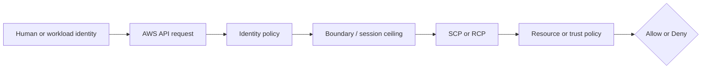

# Week 2 Exercise 7 [Optional] — Environment-sensitive ABAC

This exercise is classified as **Optional** in the Week 2 curriculum.

Complete the [shared Week 2 setup](../week2-setup.md) first. This exercise uses
a disposable lab account and an independent Terraform state key. It follows the
same safety model as Exercises 1 and 2: predict the decision, deploy the
smallest test fixture, run positive and negative tests, capture CloudTrail
evidence, and remove only disposable resources.

## Table of contents

- [Introduction](#introduction).
- [Learning objectives](#learning-objectives).
- [Terraform configuration and ownership](#terraform-configuration-and-ownership).
  - [Policy/resource excerpt](#policyresource-excerpt).
  - [Permissions-boundary excerpt](#permissions-boundary-excerpt).
- [Configure, initialize, and validate](#configure-initialize-and-validate).
- [Execute the experiment](#execute-the-experiment).
  - [Happy path: both attributes match](#happy-path-both-attributes-match).
  - [Unhappy path: Environment differs](#unhappy-path-environment-differs).
  - [Unhappy path: Project differs](#unhappy-path-project-differs).
- [Investigating in the Console](#investigating-in-the-console).
- [Evidence and security analysis](#evidence-and-security-analysis).
  - [Prepare evidence identifiers](#prepare-evidence-identifiers).
  - [Retrieve the authorization configuration](#retrieve-the-authorization-configuration).
  - [Retrieve the role-assumption event](#retrieve-the-role-assumption-event).
  - [Retrieve the S3 test events](#retrieve-the-s3-test-events).
  - [Correlate evidence with each test](#correlate-evidence-with-each-test).
- [Clean up](#clean-up).
- [References](#references).

## Introduction

This exercise focuses on **two-dimensional tag governance**. Its objective is to require both Project and Environment attributes to match. An Allow
in one policy is never the whole authorization decision; applicable SCPs,
boundaries, resource policies, trust policies, session context, and explicit
denies must also be considered.



## Learning objectives

- Explain the policy layer being tested and its limits.
- Predict both an allowed and a denied operation before running it.
- Avoid using management, Log Archive, or Security Tooling accounts.
- Attribute the result using CloudTrail and the effective policy set.
- Document residual risk and a production hardening measure.

## Terraform configuration and ownership

The configuration is in [`terraform/lab/week2/exercise7/main.tf`](../../../../terraform/lab/week2/exercise7/main.tf) and the other Terraform files in that directory. It has an
independent encrypted S3 backend key:

```text
lab/week2/exercise7/terraform.tfstate
```

It uses an IAM Identity Center-backed profile and restricts the AWS provider to
the configured disposable account ID with `allowed_account_ids`. The exercise configuration uses a shell environment file. Copy `.env.example`
to `.env`, replace any placeholders or values you want to customize, and keep
the copied file uncommitted. Never place access keys, tokens, or device codes
in the repository.

From the repository root, use this order before running Terraform:

```bash
source ~/.env/aws-security/terraform/.env
cp terraform/lab/week2/exercise7/.env.example terraform/lab/week2/exercise7/.env
# Edit the copied .env and replace placeholders or desired values.
source terraform/lab/week2/exercise7/.env
```

The global environment must be sourced first because the exercise file refers
to shared values such as `TF_LAB_DEV_ACCOUNT_ID`, `TF_LAB_TEST_ACCOUNT_ID`,
`TF_MANAGEMENT_ACCOUNT_ID`, and `TF_HOME_REGION`. It also consumes
`TF_VAR_lab_bucket_name_prefix`, which must match the prefix configured in the
central `WorkloadLabAdministrator` permission set.

The exercise state owns `Week2Exercise7Role`, one disposable S3 bucket, and
three tagged objects. The role has `Project=Alpha` and
`Environment=Development`. The objects represent Alpha/Development,
Alpha/Production, and Beta/Development. Existing Control Tower, Identity
Center, baseline, and `AWSReservedSSO_*` resources remain outside its ownership
boundary. The root reads and attaches `/week2/WorkloadLabRoleBoundary` without
taking ownership of that baseline policy.

### Policy/resource excerpt

The role policy requires both authorization attributes to match:

```hcl
{
  Sid      = "ReadObjectsForMatchingProjectAndEnvironment"
  Effect   = "Allow"
  Action   = "s3:GetObject"
  Resource = "${aws_s3_bucket.exercise.arn}/*"
  Condition = {
    StringEquals = {
      "s3:ExistingObjectTag/Project"     = "$${aws:PrincipalTag/Project}"
      "s3:ExistingObjectTag/Environment" = "$${aws:PrincipalTag/Environment}"
    }
  }
}
```

Terraform's doubled dollar signs render literal IAM policy variables. At
request time, IAM compares both existing object tags with the role session's
principal tags.

#### Policy/resource analysis

The policy is attached to `Week2Exercise7Role`. `s3:GetObject` is allowed only
inside the exercise bucket and only when both `Project` and `Environment`
match. Alpha/Development therefore succeeds. Alpha/Production fails only the
Environment comparison, while Beta/Development fails only the Project
comparison. There is no explicit Deny; either mismatch prevents the conditional
Allow from applying and produces an implicit deny. Principals allowed to change
role or object tags could undermine this model, so tag mutation is intentionally
not granted to the exercise role.

### Permissions-boundary excerpt

The authoritative boundary declaration is
[`workload-lab-role-boundary.json.tftpl`](../../../../terraform/lab/week2/baseline/policies/workload-lab-role-boundary.json.tftpl).
The following excerpt is taken from the original policy JSON template; its
`${partition}`, `${dev_lab_account_id}`, `${test_lab_account_id}`, and
`${lab_bucket_name_prefix}` values are rendered by the baseline Terraform root:

```json
{
  "Version": "2012-10-17",
  "Statement": [
    {
      "Sid": "AllowAssumingBoundedWeekTwoRoles",
      "Effect": "Allow",
      "Action": "sts:AssumeRole",
      "Resource": [
        "arn:${partition}:iam::${dev_lab_account_id}:role/week2/*",
        "arn:${partition}:iam::${test_lab_account_id}:role/week2/*"
      ]
    },
    {
      "Sid": "AllowReadCurrentIdentity",
      "Effect": "Allow",
      "Action": "sts:GetCallerIdentity",
      "Resource": "*"
    },
    {
      "Sid": "AllowWeekTwoLabBucketAccess",
      "Effect": "Allow",
      "Action": [
        "s3:GetBucketLocation",
        "s3:ListBucket",
        "s3:ListBucketVersions",
        "s3:GetObject",
        "s3:GetObjectVersion",
        "s3:PutObject",
        "s3:DeleteObject",
        "s3:DeleteObjectVersion"
      ],
      "Resource": [
        "arn:${partition}:s3:::${lab_bucket_name_prefix}*",
        "arn:${partition}:s3:::${lab_bucket_name_prefix}*/*"
      ]
    }
  ]
}
```

This is a permissions boundary, so it defines a maximum-permissions ceiling;
it does not grant these actions by itself. An identity policy must also allow
an operation, and applicable SCPs, session policies, resource policies, trust
policies, and explicit denies remain additional constraints. The policy is
owned by the baseline Terraform root. Do not edit, import, replace, or destroy
it from this exercise.

#### Boundary analysis

The exercise root attaches this baseline-owned boundary to the
Alpha/Development role. It permits `s3:GetObject` within the approved Week 2
bucket prefix, but it does not grant that operation by itself. The role's
identity policy must separately allow the request, including both ABAC
conditions. The boundary excludes arbitrary IAM administration, user and
access-key management, managed-policy creation, and unrestricted services. The
baseline owner protects the maximum ceiling while Exercise 7 owns the narrower
two-dimensional ABAC grant.


## Configure, initialize, and validate

Authenticate the configured IAM Identity Center profile and verify the account. See [`sso_auth.md`](../../../sso_auth.md) for user enablement, MFA, browser isolation, and CLI login guidance. For the Exercise 1 test users, use the **Create the AWS CLI profiles** section of [`exercise1-instructions.md`](../exercise1/exercise1-instructions.md).

```bash
aws sso login --profile "$TF_VAR_source_aws_profile" --use-device-code --no-browser
aws sts get-caller-identity --profile "$TF_VAR_source_aws_profile"
terraform -chdir=terraform/lab/week2/exercise7 init \
  -backend-config="bucket=$TF_STATE_BUCKET" \
  -backend-config="region=$TF_STATE_REGION" \
  -backend-config="profile=$TF_STATE_PROFILE"
terraform -chdir=terraform/lab/week2/exercise7 validate
terraform -chdir=terraform/lab/week2/exercise7 plan
```

Review the plan before applying. It should create one role tagged
`Project=Alpha` and `Environment=Development`, one bucket under the configured
`lab_bucket_name_prefix`, and exactly three tagged objects. It must not modify
organizational governance, Control Tower resources, Identity Center resources,
or unrelated accounts. Stop for unexplained replacements or deletions.

## Execute the experiment

Apply the reviewed plan, capture its outputs, and create a temporary role
profile without printing or persisting STS credentials:

```bash
terraform -chdir=terraform/lab/week2/exercise7 apply
export EXERCISE7_ROLE_ARN="$(terraform -chdir=terraform/lab/week2/exercise7 output -raw role_arn)"
export EXERCISE7_BUCKET_NAME="$(terraform -chdir=terraform/lab/week2/exercise7 output -raw bucket_name)"
export EXERCISE7_AWS_CONFIG="$(mktemp)"
cp "${AWS_CONFIG_FILE:-$HOME/.aws/config}" "$EXERCISE7_AWS_CONFIG"
chmod 600 "$EXERCISE7_AWS_CONFIG"
cat >>"$EXERCISE7_AWS_CONFIG" <<EOF

[profile week2-exercise7-alpha-development]
role_arn = $EXERCISE7_ROLE_ARN
source_profile = $TF_VAR_source_aws_profile
role_session_name = exercise7-alpha-development
EOF
AWS_CONFIG_FILE="$EXERCISE7_AWS_CONFIG" aws sts get-caller-identity \
  --profile week2-exercise7-alpha-development \
  --no-cli-pager
```

Confirm the ARN contains
`assumed-role/Week2Exercise7Role/exercise7-alpha-development` in the Dev Lab
account. Record each URI, expected result, actual result, exit status, and
CloudTrail evidence.

### Happy path: both attributes match

The Alpha/Development role session should read the Alpha/Development object
because both condition comparisons match:

Use `s3api get-object` rather than the high-level `s3 cp` command. `s3 cp` may
issue a preliminary `HeadObject` request, which tests a different API action and
can obscure the intended `GetObject` authorization result.

```bash
export EXERCISE7_ALPHA_DEV_OUTPUT="$(mktemp)"
if AWS_CONFIG_FILE="$EXERCISE7_AWS_CONFIG" aws s3api get-object \
  --profile week2-exercise7-alpha-development \
  --bucket "$EXERCISE7_BUCKET_NAME" \
  --key exercise7/alpha-development.txt \
  "$EXERCISE7_ALPHA_DEV_OUTPUT" \
  --no-cli-pager; then
  cat "$EXERCISE7_ALPHA_DEV_OUTPUT"
else
  echo "UNEXPECTED: Alpha/Development GetObject was denied." >&2
fi
rm -f "$EXERCISE7_ALPHA_DEV_OUTPUT"
unset EXERCISE7_ALPHA_DEV_OUTPUT
```

Expected result: `GetObject` exits with status `0` and the downloaded file
contains `Project Alpha development test object.`.

### Unhappy path: Environment differs

The same principal should be denied on Alpha/Production. Project still matches,
so this test isolates the Environment condition:

```bash
export EXERCISE7_ALPHA_PROD_OUTPUT="$(mktemp)"
if result="$(AWS_CONFIG_FILE="$EXERCISE7_AWS_CONFIG" aws s3api get-object \
  --profile week2-exercise7-alpha-development \
  --bucket "$EXERCISE7_BUCKET_NAME" \
  --key exercise7/alpha-production.txt \
  "$EXERCISE7_ALPHA_PROD_OUTPUT" \
  --no-cli-pager 2>&1)"; then
  echo "UNEXPECTED: Development principal read the Production object: $result" >&2
else
  echo "$result"
  case "$result" in
    *AccessDenied*|*Forbidden*) echo "Environment mismatch was denied as expected." ;;
    *) echo "UNEXPECTED: failure was not an S3 authorization denial." >&2 ;;
  esac
fi
rm -f "$EXERCISE7_ALPHA_PROD_OUTPUT"
unset EXERCISE7_ALPHA_PROD_OUTPUT
```

Expected result: the direct S3 `GetObject` request returns `AccessDenied` or an
HTTP 403 `Forbidden` authorization response. Do not count authentication,
missing-resource, wrong-account, or network errors as a valid negative test.

### Unhappy path: Project differs

The same principal should also be denied on Beta/Development. Environment still
matches, so this test isolates the Project condition:

```bash
export EXERCISE7_BETA_DEV_OUTPUT="$(mktemp)"
if result="$(AWS_CONFIG_FILE="$EXERCISE7_AWS_CONFIG" aws s3api get-object \
  --profile week2-exercise7-alpha-development \
  --bucket "$EXERCISE7_BUCKET_NAME" \
  --key exercise7/beta-development.txt \
  "$EXERCISE7_BETA_DEV_OUTPUT" \
  --no-cli-pager 2>&1)"; then
  echo "UNEXPECTED: Alpha principal read the Beta object: $result" >&2
else
  echo "$result"
  case "$result" in
    *AccessDenied*|*Forbidden*) echo "Project mismatch was denied as expected." ;;
    *) echo "UNEXPECTED: failure was not an S3 authorization denial." >&2 ;;
  esac
fi
rm -f "$EXERCISE7_BETA_DEV_OUTPUT"
unset EXERCISE7_BETA_DEV_OUTPUT
```

Expected result: the direct S3 `GetObject` request returns `AccessDenied` or an
HTTP 403 `Forbidden` authorization response. Remove the temporary profile after
collecting evidence:

```bash
rm -f "$EXERCISE7_AWS_CONFIG"
unset EXERCISE7_AWS_CONFIG EXERCISE7_ROLE_ARN EXERCISE7_BUCKET_NAME
```

## Investigating in the Console

Use the Dev Lab account's `WorkloadLabAdministrator` access-portal session, not
an IAM user or the exercise role. In the console header, confirm that the
account ID equals `TF_VAR_source_account_id` and that the Region is the exercise
Region before inspecting resources.

1. **Inspect the role identity attributes.** Go to **IAM → Access management →
   Roles**, search for `Week2Exercise7Role`, and open it. On **Summary**, verify
   the path is `/week2/exercise7/`. Open **Tags** and find both
   `Project = Alpha` and `Environment = Development`. These role tags become
   `aws:PrincipalTag/Project` and `aws:PrincipalTag/Environment` in sessions
   assumed from this role; they are authorization inputs, not descriptive tags
   only.
2. **Inspect the ABAC identity policy.** On the role's **Permissions** tab,
   expand the inline policy named `Exercise7ProjectEnvironmentAbacPolicy` and
   choose **JSON**. Find statement
   `ReadObjectsForMatchingProjectAndEnvironment`. Confirm its action is
   `s3:GetObject`, its resource ends with the exercise bucket followed by `/*`,
   and its `StringEquals` block contains both
   `s3:ExistingObjectTag/Project = ${aws:PrincipalTag/Project}` and
   `s3:ExistingObjectTag/Environment = ${aws:PrincipalTag/Environment}`. Both
   comparisons must be true for this Allow to apply; one matching dimension is
   insufficient.
3. **Inspect the role boundary.** Still on **Permissions**, find **Permissions
   boundary** and open `WorkloadLabRoleBoundary`. Its ARN must end with
   `:policy/week2/WorkloadLabRoleBoundary`. In the JSON policy, find
   `AllowWeekTwoLabBucketAccess`; verify it includes `s3:GetObject` and limits
   resources to bucket ARNs beginning with the configured
   `lab_bucket_name_prefix`. This boundary is only a maximum ceiling. It does
   not grant access when the ABAC policy's two tag conditions fail.
4. **Inspect who may assume the role.** Return to `Week2Exercise7Role`, open
   **Trust relationships**, and inspect the statement with `sts:AssumeRole`.
   `Principal.AWS` is the Dev Lab account root, but that is not an unrestricted
   account-wide trust: `Condition.ArnLike.aws:PrincipalArn` must match the
   `AWSReservedSSO_WorkloadLabAdministrator_*` role path in the Identity Center
   Region. The suffix wildcard tolerates IAM Identity Center deleting and
   recreating its generated role while still excluding other account roles.
   The trust policy controls who can become the exercise role; it does not
   decide which tagged S3 object that resulting session can read.
5. **Inspect the three resource-attribute combinations.** Obtain the exact
   bucket name with
   `terraform -chdir=terraform/lab/week2/exercise7 output -raw bucket_name`.
   Go to **S3 → Buckets**, search for that exact name, open it, and browse to
   `exercise7/`. Open each object, choose **Properties**, and find **Tags**:
   - `alpha-development.txt`: `Project=Alpha`, `Environment=Development`—both
     attributes match, so this is the happy path.
   - `alpha-production.txt`: `Project=Alpha`, `Environment=Production`—only
     Environment differs, so this request is denied.
   - `beta-development.txt`: `Project=Beta`, `Environment=Development`—only
     Project differs, so this request is denied.
6. **Check whether an SCP influenced the result only if authorization is
   unexpected.** Exercise 7 creates no SCP. From an approved management-account
   read-only session, go to **AWS Organizations → AWS accounts**, open the Dev
   Lab account, and choose **Policies → Service control policies**. Inspect
   every SCP shown as directly attached or inherited from the Dev, Workloads,
   and organization-root hierarchy. `FullAWSAccess`, if present, is the default
   Allow and does not explain a denial. For every other displayed SCP—especially
   Control Tower-managed preventive-control SCPs—use the policy JSON search to
   find `s3:GetObject`, `s3:*`, or an `Action: "*"` statement with
   `Effect: "Deny"`. Record the actual SCP name and any Resource or Condition
   scope. Do not edit a Control Tower or organization policy for this exercise.
7. **Find the role-assumption management event.** Go to **CloudTrail → Event
   history**, set **Lookup attributes** to **Event name**, and search for
   `AssumeRole`. Open the event whose `requestParameters.roleArn` ends with
   `role/week2/exercise7/Week2Exercise7Role` and whose
   `requestParameters.roleSessionName` is `exercise7-alpha-development`.
   Verify `userIdentity` identifies the `WorkloadLabAdministrator` source
   session and that `responseElements.assumedRoleUser.arn` identifies the
   Exercise 7 role session.
8. **Verify S3 data-event collection.** `GetObject` is an S3 data event and
   does not appear in standard Event history. In an approved management-account
   read session, go to **CloudTrail → Trails** and open
   `aws-security-lab-s3-data-events`. Under **Data events**, verify the advanced
   selector named `LabS3ObjectDataEvents` selects `AWS::S3::Object` resources
   whose ARN starts with the configured `lab_bucket_name_prefix`. Confirm there
   is no CloudWatch Logs destination and that the S3 destination is
   `aws-security-lab-evidence-<MANAGEMENT_ACCOUNT_ID>`.
9. **Inspect delivered records.** Lab users have no Log Archive console account
   assignment, so use the CLI procedure in **Retrieve the S3 test events** for
   normal evidence access. If an approved Log Archive read session is available,
   go to **S3 → Buckets →
   aws-security-lab-evidence-<MANAGEMENT_ACCOUNT_ID>**, then browse through
   `AWSLogs/<ORGANIZATION_ID>/<DEV_LAB_ACCOUNT_ID>/CloudTrail/<HOME_REGION>/`
   and the UTC test date. Download the relevant `.json.gz` files and compare the
   three `GetObject` records: Alpha/Development has no `errorCode`, while
   Alpha/Production and Beta/Development show `AccessDenied`. All must identify
   the same `exercise7-alpha-development` role session. If delivery was not
   enabled before testing, document the gap; never modify the Control
   Tower-managed trail.

Console pages may require list or read permissions intentionally absent from the
exercise role. Do not broaden the ABAC role merely to make console navigation
work; use the approved inspection session described above.

## Evidence and security analysis

Collect evidence after running all three tests and before destroying the
fixture. The commands below use `WorkloadLabAdministrator` in the Dev Lab
account, including its read-only access to the Dev Lab prefix in the dedicated
Log Archive evidence bucket. Lab users receive no Log Archive account session
and no evidence write or delete permission. Do not copy temporary credentials
into environment variables or files.

### Prepare evidence identifiers

This command reloads the stable Terraform outputs and defines the Region used
for CloudTrail management-event lookup. Its purpose is to ensure subsequent
queries target the exact Exercise 7 resources rather than similarly named
roles or buckets.

```bash
export EXERCISE7_ROLE_ARN="$(terraform -chdir=terraform/lab/week2/exercise7 output -raw role_arn)"
export EXERCISE7_BUCKET_NAME="$(terraform -chdir=terraform/lab/week2/exercise7 output -raw bucket_name)"
export EXERCISE7_REGION="$TF_HOME_REGION"
```

Look for:

- A role ARN ending in
  `:role/week2/exercise7/Week2Exercise7Role`.
- A bucket beginning with the exact centrally configured
  `lab_bucket_name_prefix` and ending in `exercise7-<SOURCE_ACCOUNT_ID>`.
- The Region where the STS role-assumption management event was recorded.

### Retrieve the authorization configuration

#### Role tags, boundary, and trust policy

This command retrieves the principal attributes and role controls that apply to
all three tests:

```bash
aws iam get-role \
  --profile "$TF_VAR_source_aws_profile" \
  --role-name Week2Exercise7Role \
  --query 'Role.{Arn:Arn,Path:Path,Tags:Tags,PermissionsBoundary:PermissionsBoundary.PermissionsBoundaryArn,TrustPolicy:AssumeRolePolicyDocument}' \
  --output json \
  --no-cli-pager
```

Look for:

- `Path` equal to `/week2/exercise7/`.
- `Project=Alpha` and `Environment=Development` in `Tags`; these become the
  role session's principal tags.
- A boundary ARN ending in
  `:policy/week2/WorkloadLabRoleBoundary`.
- A trust-policy `Principal.AWS` naming the Dev Lab account root, action
  `sts:AssumeRole`, and an `aws:PrincipalArn` condition restricted to the
  `AWSReservedSSO_WorkloadLabAdministrator_*` role path. The account root alone
  is not sufficient because the ARN condition must also match.

#### ABAC identity policy

This command retrieves the policy that decides whether each tagged object is
readable:

```bash
aws iam get-role-policy \
  --profile "$TF_VAR_source_aws_profile" \
  --role-name Week2Exercise7Role \
  --policy-name Exercise7ProjectEnvironmentAbacPolicy \
  --query 'PolicyDocument.Statement' \
  --output json \
  --no-cli-pager
```

In `ReadObjectsForMatchingProjectAndEnvironment`, verify:

- `Effect` is `Allow` and `Action` is `s3:GetObject`.
- `Resource` names only the Exercise 7 bucket's objects.
- `StringEquals` compares `s3:ExistingObjectTag/Project` with
  `${aws:PrincipalTag/Project}`.
- `StringEquals` also compares `s3:ExistingObjectTag/Environment` with
  `${aws:PrincipalTag/Environment}`.

Both comparisons are in the same condition block, so both must match. There is
no explicit Deny; a mismatch produces an implicit deny because this Allow does
not apply.

#### Permissions-boundary policy

First obtain the exact boundary ARN and default version from the role, then
retrieve that version's policy document:

```bash
export EXERCISE7_BOUNDARY_ARN="$(aws iam get-role \
  --profile "$TF_VAR_source_aws_profile" \
  --role-name Week2Exercise7Role \
  --query 'Role.PermissionsBoundary.PermissionsBoundaryArn' \
  --output text \
  --no-cli-pager)"

export EXERCISE7_BOUNDARY_VERSION="$(aws iam get-policy \
  --profile "$TF_VAR_source_aws_profile" \
  --policy-arn "$EXERCISE7_BOUNDARY_ARN" \
  --query 'Policy.DefaultVersionId' \
  --output text \
  --no-cli-pager)"

aws iam get-policy-version \
  --profile "$TF_VAR_source_aws_profile" \
  --policy-arn "$EXERCISE7_BOUNDARY_ARN" \
  --version-id "$EXERCISE7_BOUNDARY_VERSION" \
  --query 'PolicyVersion.Document.Statement' \
  --output json \
  --no-cli-pager
```

Look for `AllowWeekTwoLabBucketAccess`, including `s3:GetObject` and resource
ARNs restricted to the configured Week 2 bucket prefix. This proves the
boundary permits the action at its maximum ceiling. It does not explain the
difference among the three tests; that difference comes from the ABAC identity
policy and object tags.

#### Object tags for each test

The next three commands retrieve the resource attributes IAM evaluated. The
first command corresponds to the happy path:

```bash
aws s3api get-object-tagging \
  --profile "$TF_VAR_source_aws_profile" \
  --bucket "$EXERCISE7_BUCKET_NAME" \
  --key exercise7/alpha-development.txt \
  --query 'TagSet' \
  --output json \
  --no-cli-pager
```

Look for `Project=Alpha` and `Environment=Development`; both match the role
tags, so `GetObject` was allowed.

This command retrieves the tags for the Environment-mismatch test:

```bash
aws s3api get-object-tagging \
  --profile "$TF_VAR_source_aws_profile" \
  --bucket "$EXERCISE7_BUCKET_NAME" \
  --key exercise7/alpha-production.txt \
  --query 'TagSet' \
  --output json \
  --no-cli-pager
```

Look for `Project=Alpha` and `Environment=Production`. Project matches, but
Environment differs from the principal's `Development` value, explaining the
expected implicit deny.

This command retrieves the tags for the Project-mismatch test:

```bash
aws s3api get-object-tagging \
  --profile "$TF_VAR_source_aws_profile" \
  --bucket "$EXERCISE7_BUCKET_NAME" \
  --key exercise7/beta-development.txt \
  --query 'TagSet' \
  --output json \
  --no-cli-pager
```

Look for `Project=Beta` and `Environment=Development`. Environment matches, but
Project differs from the principal's `Alpha` value, explaining the expected
implicit deny.

### Retrieve the role-assumption event

`AssumeRole` is a CloudTrail management event, so it can be queried through
Event history. The event is recorded in the Region of the STS endpoint that the
AWS CLI used. That may be the configured home Region or `us-east-1` when the
global STS endpoint was used. Query both candidate Regions rather than assuming
the provider Region and STS event Region are identical:

```bash
for region in "$EXERCISE7_REGION" us-east-1; do
  echo "Searching AssumeRole events in $region"
  aws cloudtrail lookup-events \
    --profile "$TF_VAR_source_aws_profile" \
    --region "$region" \
    --lookup-attributes AttributeKey=EventName,AttributeValue=AssumeRole \
    --query "Events[?contains(CloudTrailEvent, 'Week2Exercise7Role')].[EventTime,EventId,Username,CloudTrailEvent]" \
    --output json \
    --no-cli-pager
done
```

If `EXERCISE7_REGION` is already `us-east-1`, the loop performs the same lookup
twice; that duplication is harmless. CloudTrail Event history can also take
several minutes to make a recent management event searchable. Wait and retry
before concluding that no event exists.

If the role-name filter still returns `[]`, list recent STS events without that
client-side filter to determine the actual event Region, role spelling, and
session name:

```bash
for region in "$EXERCISE7_REGION" us-east-1; do
  echo "Listing recent STS events in $region"
  aws cloudtrail lookup-events \
    --profile "$TF_VAR_source_aws_profile" \
    --region "$region" \
    --lookup-attributes AttributeKey=EventSource,AttributeValue=sts.amazonaws.com \
    --query 'Events[].[EventTime,EventName,EventId,Username,CloudTrailEvent]' \
    --output json \
    --no-cli-pager
done
```

Search those results for `requestParameters.roleArn` ending in
`role/week2/exercise7/Week2Exercise7Role` and then use the Region containing that
event for subsequent evidence queries. This diagnostic may show unrelated STS
activity, so do not treat every returned event as Exercise 7 evidence.

In each matching `CloudTrailEvent` JSON value, look for:

- `requestParameters.roleArn` ending in
  `role/week2/exercise7/Week2Exercise7Role`.
- `requestParameters.roleSessionName` equal to
  `exercise7-alpha-development`.
- `userIdentity` identifying the source
  `WorkloadLabAdministrator` session.
- `responseElements.assumedRoleUser.arn` identifying
  `Week2Exercise7Role/exercise7-alpha-development`.
- No `errorCode`, proving that acquisition of the test role succeeded.
- `EventId` and `eventTime`, which should be retained with the evidence table.

An absent result can mean propagation delay, the global STS endpoint, the wrong
account or profile, or an event outside Event history's retention window. It is
not evidence that role assumption failed—the successful
`get-caller-identity` result from the assumed-role profile is the immediate
proof of that operation. Verify the active profile, account, candidate Regions,
and event time before documenting a telemetry gap.

### Retrieve the S3 test events

`GetObject` is an S3 data event and is not returned by `lookup-events`. The
project-owned S3-only organization trail delivers these events to the dedicated
Log Archive evidence bucket. Load its authoritative outputs and construct the
stable account-level prefix first:

```bash
export EXERCISE7_EVIDENCE_BUCKET="$(terraform -chdir=terraform/lab/evidence output -raw evidence_bucket_name)"
export EXERCISE7_ORGANIZATION_ID="$(terraform -chdir=terraform/lab/evidence output -raw organization_id)"
export EXERCISE7_ACCOUNT_EVIDENCE_PREFIX="AWSLogs/$EXERCISE7_ORGANIZATION_ID/$TF_VAR_source_account_id/CloudTrail/"
```

The bucket must be `aws-security-lab-evidence-<MANAGEMENT_ACCOUNT_ID>`. The
prefix must contain the organization ID and Dev Lab account ID, not the Log
Archive or management account ID.

CloudTrail delivery is asynchronous. List the account-level prefix rather than
constructing a date from the workstation clock:

```bash
aws s3api list-objects-v2 \
  --profile "$TF_VAR_source_aws_profile" \
  --bucket "$EXERCISE7_EVIDENCE_BUCKET" \
  --prefix "$EXERCISE7_ACCOUNT_EVIDENCE_PREFIX" \
  --query 'Contents[].{Key:Key,LastModified:LastModified,Size:Size}' \
  --output table \
  --no-cli-pager
```

Look for compressed `.json.gz` files whose `LastModified` timestamps follow the
three tests. The object key is authoritative for the event Region and UTC date;
this avoids failures caused by workstation clock skew, stale date variables, or
a test crossing UTC midnight.

Select the directory containing the most recently delivered log object:

```bash
export EXERCISE7_LATEST_LOG_KEY="$(aws s3api list-objects-v2 \
  --profile "$TF_VAR_source_aws_profile" \
  --bucket "$EXERCISE7_EVIDENCE_BUCKET" \
  --prefix "$EXERCISE7_ACCOUNT_EVIDENCE_PREFIX" \
  --query 'sort_by(Contents,&LastModified)[-1].Key' \
  --output text \
  --no-cli-pager)"
test -n "$EXERCISE7_LATEST_LOG_KEY"
test "$EXERCISE7_LATEST_LOG_KEY" != "None"
export EXERCISE7_EVIDENCE_PREFIX="${EXERCISE7_LATEST_LOG_KEY%/*}/"
printf 'Selected evidence prefix: %s\n' "$EXERCISE7_EVIDENCE_PREFIX"
```

If unrelated lab activity produced a newer file, choose the Region/date
directory from the preceding table that corresponds to the test timestamps
instead of using the automatically selected latest directory.

Download only that date's CloudTrail files to a protected temporary directory:

```bash
export EXERCISE7_EVIDENCE_TMP="$(mktemp -d)"
chmod 700 "$EXERCISE7_EVIDENCE_TMP"
aws s3 cp \
  "s3://$EXERCISE7_EVIDENCE_BUCKET/$EXERCISE7_EVIDENCE_PREFIX" \
  "$EXERCISE7_EVIDENCE_TMP/" \
  --profile "$TF_VAR_source_aws_profile" \
  --recursive \
  --exclude '*' \
  --include '*.json.gz' \
  --no-cli-pager
```

These are evidence-log downloads, not calls against the exercise objects, so
the high-level `s3 cp` command is appropriate here.

Filter the downloaded records by source, action, exercise bucket, and exact
object keys:

```bash
find "$EXERCISE7_EVIDENCE_TMP" -type f -name '*.json.gz' -print0 |
  xargs -0 gzip -cd |
  jq -c --arg bucket "$EXERCISE7_BUCKET_NAME" '
    .Records[]
    | select(
        .eventSource == "s3.amazonaws.com"
        and .eventName == "GetObject"
        and .requestParameters.bucketName == $bucket
        and (
          .requestParameters.key == "exercise7/alpha-development.txt"
          or .requestParameters.key == "exercise7/alpha-production.txt"
          or .requestParameters.key == "exercise7/beta-development.txt"
        )
      )
    | {
        eventTime,
        eventID,
        principal: .userIdentity.arn,
        bucket: .requestParameters.bucketName,
        key: .requestParameters.key,
        errorCode,
        errorMessage
      }
  '
```

Look for these outcomes from the same
`Week2Exercise7Role/exercise7-alpha-development` session:

- `exercise7/alpha-development.txt`: no `errorCode`.
- `exercise7/alpha-production.txt`: `errorCode=AccessDenied`.
- `exercise7/beta-development.txt`: `errorCode=AccessDenied`.

Record each `eventID` and `eventTime`. Confirm that the principal, bucket, and
key match the test; an unrelated denied event is not valid evidence. Remove the
local copies after preserving approved redacted evidence:

```bash
find "$EXERCISE7_EVIDENCE_TMP" -type f -delete
find "$EXERCISE7_EVIDENCE_TMP" -depth -type d -empty -delete
unset EXERCISE7_EVIDENCE_TMP
```

If no log file arrives, verify the trail status and advanced selector through
`terraform/lab/evidence`, confirm the exercise bucket begins with
`lab_bucket_name_prefix`, and document the telemetry gap. Do not modify the
Control Tower-managed trail.

### Correlate evidence with each test

Use the collected data to complete this analysis:

| Test | Principal attributes | Resource attributes | Expected CLI result | Expected CloudTrail data event | Determining layer |
|---|---|---|---|---|---|
| Alpha/Development object | `Project=Alpha`, `Environment=Development` | `Project=Alpha`, `Environment=Development` | Success | No `errorCode` | Both ABAC comparisons match. |
| Alpha/Production object | `Project=Alpha`, `Environment=Development` | `Project=Alpha`, `Environment=Production` | `AccessDenied` | `errorCode=AccessDenied` | Environment comparison fails; conditional Allow does not apply. |
| Beta/Development object | `Project=Alpha`, `Environment=Development` | `Project=Beta`, `Environment=Development` | `AccessDenied` | `errorCode=AccessDenied` | Project comparison fails; conditional Allow does not apply. |

Explain the final decision in this order:

```text
Explicit deny → SCP/RCP → identity policy → boundary/session policy
             → resource/trust policy → conditions → effective result
```

Discuss how permission to alter role tags, session tags, or object tags could
undermine this ABAC boundary. Distinguish a missing conditional Allow from an
explicit Deny, and explain that the boundary permits `GetObject` at its ceiling
but does not grant it. Finally, clear the evidence-query variables:

```bash
unset EXERCISE7_BOUNDARY_ARN EXERCISE7_BOUNDARY_VERSION
unset EXERCISE7_BUCKET_NAME EXERCISE7_REGION EXERCISE7_ROLE_ARN
unset EXERCISE7_EVIDENCE_BUCKET EXERCISE7_ORGANIZATION_ID
unset EXERCISE7_ACCOUNT_EVIDENCE_PREFIX EXERCISE7_EVIDENCE_PREFIX
unset EXERCISE7_LATEST_LOG_KEY
```

## Clean up

Preserve redacted evidence and remove `EXERCISE7_AWS_CONFIG` if a test was
interrupted before its cleanup command. Then review and execute only the
exercise destroy:

```bash
terraform -chdir=terraform/lab/week2/exercise7 plan -destroy
terraform -chdir=terraform/lab/week2/exercise7 destroy
```

Never destroy the Week 2 baseline boundary, Control Tower resources, Identity
Center assignments, or another exercise's state. Confirm the state key is
empty, remove temporary access, and verify `git status` before committing.

## References

- [IAM policy evaluation logic](https://docs.aws.amazon.com/IAM/latest/UserGuide/reference_policies_evaluation-logic.html).
- [IAM permissions boundaries](https://docs.aws.amazon.com/IAM/latest/UserGuide/access_policies_boundaries.html).
- [IAM roles and trust policies](https://docs.aws.amazon.com/IAM/latest/UserGuide/id_roles.html).
- [IAM Identity Center](https://docs.aws.amazon.com/singlesignon/latest/userguide/what-is.html).
- [Attribute-based access control with IAM](https://docs.aws.amazon.com/IAM/latest/UserGuide/introduction_attribute-based-access-control.html).
- [AWS global condition context keys](https://docs.aws.amazon.com/IAM/latest/UserGuide/reference_policies_condition-keys.html).
- [Amazon S3 policy condition keys](https://docs.aws.amazon.com/AmazonS3/latest/userguide/amazon-s3-policy-keys.html).
- [Logging Amazon S3 data events with CloudTrail](https://docs.aws.amazon.com/AmazonS3/latest/userguide/enable-cloudtrail-logging-for-s3.html).
- [AWS CloudTrail event history](https://docs.aws.amazon.com/awscloudtrail/latest/userguide/view-cloudtrail-events.html).
- [AWS STS](https://docs.aws.amazon.com/STS/latest/APIReference/welcome.html).
- [AWS IAM service authorization reference](https://docs.aws.amazon.com/service-authorization/latest/reference/reference_policies_actions-resources-contextkeys.html).
