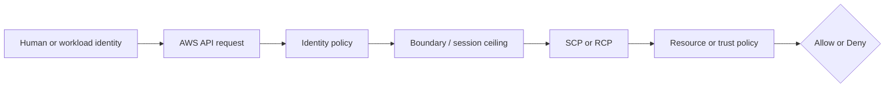

# Week 2 Exercise 8 [Core] — EC2 workload roles versus static credentials

This exercise is classified as **Core** in the Week 2 curriculum.

Complete the [shared Week 2 setup](../week2-setup.md) first. This exercise uses
a disposable lab account and an independent Terraform state key. It follows the
same safety model as Exercises 1 and 2: predict the decision, deploy the
smallest test fixture, run positive and negative tests, capture CloudTrail
evidence, and remove only disposable resources.

## Table of contents

- [Introduction](#introduction).
- [Learning objectives](#learning-objectives).
- [Terraform configuration and ownership](#terraform-configuration-and-ownership).
  - [Policy/resource excerpt](#policyresource-excerpt).
  - [Permissions-boundary excerpt](#permissions-boundary-excerpt).
- [Configure, initialize, and validate](#configure-initialize-and-validate).
- [Execute the experiment](#execute-the-experiment).
  - [Happy path: instance role reads the approved object](#happy-path-instance-role-reads-the-approved-object).
  - [Unhappy path: instance role cannot read the unrelated object](#unhappy-path-instance-role-cannot-read-the-unrelated-object).
- [Investigating in the Console](#investigating-in-the-console).
- [Evidence and security analysis](#evidence-and-security-analysis).
- [Clean up](#clean-up).
- [References](#references).

## Introduction

This exercise focuses on **native workload identity**. Its objective is to use an instance profile and temporary credentials instead of keys. An Allow
in one policy is never the whole authorization decision; applicable SCPs,
boundaries, resource policies, trust policies, session context, and explicit
denies must also be considered.



## Learning objectives

- Explain the policy layer being tested and its limits.
- Predict both an allowed and a denied operation before running it.
- Avoid using management, Log Archive, or Security Tooling accounts.
- Attribute the result using CloudTrail and the effective policy set.
- Document residual risk and a production hardening measure.

## Terraform configuration and ownership

The configuration is in [`terraform/lab/week2/exercise8/main.tf`](../../../../terraform/lab/week2/exercise8/main.tf) and the other Terraform files in that directory. It has an
independent encrypted S3 backend key:

```text
lab/week2/exercise8/terraform.tfstate
```

It uses an IAM Identity Center-backed profile and restricts the AWS provider to
the configured disposable account ID with `allowed_account_ids`. The exercise configuration uses a shell environment file. Copy `.env.example`
to `.env`, replace any placeholders or values you want to customize, and keep
the copied file uncommitted. Never place access keys, tokens, or device codes
in the repository.

From the repository root, use this order before running Terraform:

```bash
source ~/.env/aws-security/terraform/.env
cp terraform/lab/week2/exercise8/.env.example terraform/lab/week2/exercise8/.env
# Edit the copied .env and replace placeholders or desired values.
source terraform/lab/week2/exercise8/.env
```

The global environment must be sourced first because the exercise file refers
to shared values such as `TF_LAB_DEV_ACCOUNT_ID`, `TF_LAB_TEST_ACCOUNT_ID`,
`TF_MANAGEMENT_ACCOUNT_ID`, and `TF_HOME_REGION`.

The exercise state owns `Week2Exercise8Role`, its instance profile, one
no-ingress security group, one disposable EC2 instance, and a versioned S3
bucket containing an approved and a denied test object. Existing Control Tower,
Identity Center, baseline, and `AWSReservedSSO_*` resources remain outside its
ownership boundary. The workload role trusts only the EC2 service; the human
`WorkloadLabAdministrator` deploys the fixture but cannot assume the workload
role directly.

### Policy/resource excerpt

The workload role trusts EC2 and grants access to only one object:

```hcl
assume_role_policy = jsonencode({
  Version = "2012-10-17"
  Statement = [{
    Sid       = "AllowEC2WorkloadIdentity"
    Effect    = "Allow"
    Principal = { Service = "ec2.amazonaws.com" }
    Action    = "sts:AssumeRole"
  }]
})
```

```hcl
{
  Sid      = "ReadOnlyApprovedObject"
  Effect   = "Allow"
  Action   = "s3:GetObject"
  Resource = aws_s3_object.allowed.arn
}
```

#### Policy/resource analysis

The trust policy permits the EC2 service—not the human operator—to obtain a
session through `Week2Exercise8InstanceProfile`. The identity policy allows
`sts:GetCallerIdentity` and `s3:GetObject` only for
`exercise8/allowed.txt`. The boundary permits S3 reads under the lab prefix but
does not grant them; the identity policy narrows effective access to one object.
`exercise8/denied.txt` exists in the same bucket, so its failed read proves
resource-level authorization rather than a missing bucket or network failure.
No static access key is placed in user data or on the instance.

### Permissions-boundary excerpt

The authoritative boundary declaration is
[`workload-lab-role-boundary.json.tftpl`](../../../../terraform/lab/week2/baseline/policies/workload-lab-role-boundary.json.tftpl).
The following excerpt is taken from the original policy JSON template; its
`${partition}`, `${dev_lab_account_id}`, `${test_lab_account_id}`, and
`${lab_bucket_name_prefix}` values are rendered by the baseline Terraform root:

```json
{
  "Version": "2012-10-17",
  "Statement": [
    {
      "Sid": "AllowAssumingBoundedWeekTwoRoles",
      "Effect": "Allow",
      "Action": "sts:AssumeRole",
      "Resource": [
        "arn:${partition}:iam::${dev_lab_account_id}:role/week2/*",
        "arn:${partition}:iam::${test_lab_account_id}:role/week2/*"
      ]
    },
    {
      "Sid": "AllowReadCurrentIdentity",
      "Effect": "Allow",
      "Action": "sts:GetCallerIdentity",
      "Resource": "*"
    },
    {
      "Sid": "AllowWeekTwoLabBucketAccess",
      "Effect": "Allow",
      "Action": [
        "s3:GetBucketLocation",
        "s3:ListBucket",
        "s3:ListBucketVersions",
        "s3:GetObject",
        "s3:GetObjectVersion",
        "s3:PutObject",
        "s3:DeleteObject",
        "s3:DeleteObjectVersion"
      ],
      "Resource": [
        "arn:${partition}:s3:::${lab_bucket_name_prefix}*",
        "arn:${partition}:s3:::${lab_bucket_name_prefix}*/*"
      ]
    }
  ]
}
```

This is a permissions boundary, so it defines a maximum-permissions ceiling;
it does not grant these actions by itself. An identity policy must also allow
an operation, and applicable SCPs, session policies, resource policies, trust
policies, and explicit denies remain additional constraints. The policy is
owned by the baseline Terraform root. Do not edit, import, replace, or destroy
it from this exercise.

#### Boundary analysis

The baseline-owned boundary is attached to `Week2Exercise8Role`. It permits
identity checks and S3 operations under the approved lab prefix but grants
nothing by itself. The role policy independently allows only the approved
object. It excludes IAM administration and unrelated services from the EC2
session even if the role policy were accidentally broadened.


## Configure, initialize, and validate

Deploy the tagged Dev Lab network foundation before planning Exercise 8:

```bash
./tf.sh --phase lab-foundation --dry-run
./tf.sh --phase lab-foundation --apply
```

Exercise 8 also adds narrowly scoped EC2, instance-profile, and `iam:PassRole`
permissions to `WorkloadLabAdministrator`. Preserve the two lab account
assignments and apply that central permission-set update before planning this
root:

```bash
./tf.sh --phase identity-center --dry-run
./tf.sh --phase identity-center --apply
```

Authenticate the configured profile and verify the Dev Lab account. See
[`sso_auth.md`](../../../sso_auth.md) for MFA and browser isolation:

```bash
aws sso logout --profile "$TF_VAR_source_aws_profile"
aws sso login --profile "$TF_VAR_source_aws_profile" --use-device-code --no-browser
aws sts get-caller-identity --profile "$TF_VAR_source_aws_profile"
terraform -chdir=terraform/lab/week2/exercise8 init \
  -backend-config="bucket=$TF_STATE_BUCKET" \
  -backend-config="region=$TF_STATE_REGION" \
  -backend-config="profile=$TF_STATE_PROFILE"
terraform -chdir=terraform/lab/week2/exercise8 validate
terraform -chdir=terraform/lab/week2/exercise8 plan
```

By default Terraform discovers the latest x86_64 Amazon Linux 2023 AMI and an
available default subnet. Set `TF_VAR_ami_id` or `TF_VAR_subnet_id` only when
that discovery is unsuitable. Review the plan for one bounded role and instance
profile, one no-ingress security group, one `t3.micro` instance, and one
approved-prefix bucket with two objects. It must not modify organizational
governance, Control Tower, central Identity Center resources, or unrelated
accounts. Stop for unexplained replacements or deletions.

## Execute the experiment

Apply the reviewed plan and capture the instance ID:

```bash
terraform -chdir=terraform/lab/week2/exercise8 apply
export EXERCISE8_INSTANCE_ID="$(terraform -chdir=terraform/lab/week2/exercise8 output -raw instance_id)"
aws ec2 wait instance-status-ok \
  --profile "$TF_VAR_source_aws_profile" \
  --region "$TF_HOME_REGION" \
  --instance-ids "$EXERCISE8_INSTANCE_ID"
```

The instance user data performs both tests with credentials supplied
automatically by the instance profile. Retrieve console output with a bounded
poll so boot delays cannot cause an infinite loop:

```bash
export EXERCISE8_CONSOLE_OUTPUT=""
for attempt in $(seq 1 30); do
  EXERCISE8_CONSOLE_OUTPUT="$(aws ec2 get-console-output \
    --profile "$TF_VAR_source_aws_profile" \
    --region "$TF_HOME_REGION" \
    --instance-id "$EXERCISE8_INSTANCE_ID" \
    --latest \
    --query Output \
    --output text \
    --no-cli-pager)"
  if printf '%s\n' "$EXERCISE8_CONSOLE_OUTPUT" | grep -q 'EXERCISE8_END'; then
    break
  fi
  sleep 10
done
printf '%s\n' "$EXERCISE8_CONSOLE_OUTPUT"
```

### Happy path: instance role reads the approved object

Look for `IDENTITY`, an ARN containing
`assumed-role/Week2Exercise8Role/`, `HAPPY_PATH`, and:

```text
EC2 instance-profile access succeeded.
```

This proves the EC2 workload received a temporary role session and successfully
called `GetObject` for `exercise8/allowed.txt`.

### Unhappy path: instance role cannot read the unrelated object

Look for `UNHAPPY_PATH`, an S3 `AccessDenied` or `Forbidden` response for
`exercise8/denied.txt`, followed by:

```text
EXPECTED_DENIED_OBJECT_READ_FAILED
```

If `UNEXPECTED_DENIED_OBJECT_READ_SUCCEEDED` appears, stop and inspect the role
policy and boundary. Both objects exist in the same bucket; only the object ARN
in the identity policy differs.

## Investigating in the Console

Use the Dev Lab `WorkloadLabAdministrator` session and verify the account ID and
`TF_HOME_REGION`.

1. Go to **IAM → Roles → Week2Exercise8Role**. Under **Trust relationships**,
   verify `Principal.Service` is `ec2.amazonaws.com`; no human or account
   principal should appear.
2. Under **Permissions**, open inline policy
   `Exercise8ReadOnlyApprovedObject`. Verify `ReadOnlyApprovedObject` permits
   `s3:GetObject` only on the ARN ending in
   `/exercise8/allowed.txt`. Confirm `exercise8/denied.txt` is absent.
3. Under **Permissions boundary**, open `WorkloadLabRoleBoundary` and verify its
   ARN ends with `policy/week2/WorkloadLabRoleBoundary`. It is the maximum
   ceiling, not the one-object grant.
4. Go to **IAM → Instance profiles** and open
   `Week2Exercise8InstanceProfile`. Verify it contains only
   `Week2Exercise8Role`.
5. Go to **EC2 → Instances → Week2Exercise8Instance**. On **Security**, verify
   the attached role/profile and `Week2Exercise8NoIngress` security group with
   no inbound rules. Under **Actions → Monitor and troubleshoot → Get system
   log**, find `EXERCISE8_BEGIN`, the assumed-role ARN, the successful approved
   object text, the denied-object error, and `EXERCISE8_END`.
6. On the instance **Details** tab, verify **IMDSv2** is required. No static
   access key should appear in user data, tags, or instance metadata settings.
7. Go to **S3 → Buckets**, open the bucket returned by the `bucket_name` output,
   and confirm both `exercise8/allowed.txt` and `exercise8/denied.txt` exist.
8. Go to **CloudTrail → Event history** and search for `RunInstances` using the
   instance ID. Inspect `requestParameters.iamInstanceProfile` and the human
   deployment principal. S3 `GetObject` calls are data events; retrieve them
   from the project-owned evidence bucket as described below.
9. Exercise 8 creates no SCP. If results differ, use an approved management
   read session under **AWS Organizations → Dev Lab → Policies → Service control
   policies** and inspect inherited Deny statements for `ec2:RunInstances`,
   `iam:PassRole`, `sts:AssumeRole`, or `s3:GetObject`. Do not modify Control
   Tower policies.

Do not add SSH or inbound rules to make inspection easier; console output and
CloudTrail provide the required evidence.

## Evidence and security analysis

The following subsections collect each configuration artifact separately. Preserve
the command output with the redacted evidence.

### Inspect the workload role trust and boundary

```bash
aws iam get-role \
  --profile "$TF_VAR_source_aws_profile" \
  --role-name Week2Exercise8Role \
  --query 'Role.{Arn:Arn,Trust:AssumeRolePolicyDocument,Boundary:PermissionsBoundary.PermissionsBoundaryArn}' \
  --output json --no-cli-pager
```

Look for a trust principal of `ec2.amazonaws.com` only and the approved
`WorkloadLabRoleBoundary` ARN. Do not accept a human, account-root, or wildcard
principal as equivalent workload trust.

### Inspect the workload role identity policy

```bash
aws iam get-role-policy \
  --profile "$TF_VAR_source_aws_profile" \
  --role-name Week2Exercise8Role \
  --policy-name Exercise8ReadOnlyApprovedObject \
  --query PolicyDocument.Statement \
  --output json --no-cli-pager
```

Look for `s3:GetObject` on the exact `exercise8/allowed.txt` object ARN and no
permission for `exercise8/denied.txt`, bucket-wide access, or write actions.

### Inspect the instance profile

```bash
aws iam get-instance-profile \
  --profile "$TF_VAR_source_aws_profile" \
  --instance-profile-name Week2Exercise8InstanceProfile \
  --output json --no-cli-pager
```

Look for exactly `Week2Exercise8Role` in the profile. The instance profile is
the EC2 container; it is not itself the authorization policy.

### Load the exercise outputs

```bash
export EXERCISE8_INSTANCE_ID="$(terraform -chdir=terraform/lab/week2/exercise8 output -raw instance_id)"
export EXERCISE8_BUCKET_NAME="$(terraform -chdir=terraform/lab/week2/exercise8 output -raw bucket_name)"
printf 'Instance: %s\\nBucket: %s\\n' "$EXERCISE8_INSTANCE_ID" "$EXERCISE8_BUCKET_NAME"
```

Confirm that the identifiers point to the disposable Exercise 8 fixture before
running the remaining queries.

### Inspect the EC2 instance configuration

```bash
aws ec2 describe-instances \
  --profile "$TF_VAR_source_aws_profile" \
  --region "$TF_HOME_REGION" \
  --instance-ids "$EXERCISE8_INSTANCE_ID" \
  --query 'Reservations[].Instances[].{ArnProfile:IamInstanceProfile.Arn,Metadata:MetadataOptions,SecurityGroups:SecurityGroups,Subnet:SubnetId,PublicIp:PublicIpAddress,State:State.Name,Tags:Tags}' \
  --output json --no-cli-pager
```

Look for the expected instance profile, `HttpTokens=required`, the tagged lab
subnet, a temporary public IP, the no-ingress security group, and
`Exercise=8` tags. The public IP is for outbound STS/S3 access only; do not add
an inbound rule.

### Inspect the boot-time workload-identity test

Retrieve the complete boot-time test result:

```bash
aws ec2 get-console-output \
  --profile "$TF_VAR_source_aws_profile" \
  --region "$TF_HOME_REGION" \
  --instance-id "$EXERCISE8_INSTANCE_ID" \
  --latest \
  --query Output \
  --output text \
  --no-cli-pager
```

The same output must contain the assumed-role identity, successful approved
object content, and `EXPECTED_DENIED_OBJECT_READ_FAILED`. This ties both tests
to one workload session without exposing its credentials.

### Inspect the EC2 deployment CloudTrail event

Retrieve the deployment management event:

```bash
aws cloudtrail lookup-events \
  --profile "$TF_VAR_source_aws_profile" \
  --region "$TF_HOME_REGION" \
  --lookup-attributes AttributeKey=EventName,AttributeValue=RunInstances \
  --query "Events[?contains(CloudTrailEvent, '$EXERCISE8_INSTANCE_ID')].[EventTime,EventId,CloudTrailEvent]" \
  --output json --no-cli-pager
```

Look for the instance ID, `Week2Exercise8InstanceProfile`, instance type, subnet,
security group, deployment principal, and no error code.

### Retrieve the S3 data-event evidence

Retrieve the S3 data events from the shared evidence bucket. The detailed
architecture and troubleshooting rationale are in
[`cloud-trail-logs.md`](../../../cloud-trail-logs.md), but run all of the
following commands here.

#### Load the authoritative evidence location

First load the authoritative evidence bucket and organization ID from the
initialized evidence root, then list the stable account-level CloudTrail
prefix. Do not construct the path from the workstation date:

```bash
export EXERCISE8_EVIDENCE_BUCKET="$(terraform -chdir=terraform/lab/evidence output -raw evidence_bucket_name)"
export EXERCISE8_ORGANIZATION_ID="$(terraform -chdir=terraform/lab/evidence output -raw organization_id)"
export EXERCISE8_ACCOUNT_ID="$(aws sts get-caller-identity --profile "$TF_VAR_source_aws_profile" --query Account --output text)"
export EXERCISE8_ACCOUNT_EVIDENCE_PREFIX="AWSLogs/$EXERCISE8_ORGANIZATION_ID/$EXERCISE8_ACCOUNT_ID/CloudTrail/"
aws s3api list-objects-v2 \
  --profile "$TF_VAR_source_aws_profile" \
  --bucket "$EXERCISE8_EVIDENCE_BUCKET" \
  --prefix "$EXERCISE8_ACCOUNT_EVIDENCE_PREFIX" \
  --query 'Contents[].{Key:Key,LastModified:LastModified,Size:Size}' \
  --output table \
  --no-cli-pager
```

#### Select the delivered log directory

Select the directory containing the latest delivered log object:

```bash
export EXERCISE8_LATEST_LOG_KEY="$(aws s3api list-objects-v2 \
  --profile "$TF_VAR_source_aws_profile" \
  --bucket "$EXERCISE8_EVIDENCE_BUCKET" \
  --prefix "$EXERCISE8_ACCOUNT_EVIDENCE_PREFIX" \
  --query 'sort_by(Contents,&LastModified)[-1].Key' \
  --output text \
  --no-cli-pager)"
test -n "$EXERCISE8_LATEST_LOG_KEY"
test "$EXERCISE8_LATEST_LOG_KEY" != "None"
export EXERCISE8_EVIDENCE_PREFIX="${EXERCISE8_LATEST_LOG_KEY%/*}/"
printf 'Selected evidence prefix: %s\n' "$EXERCISE8_EVIDENCE_PREFIX"
```

#### Download the delivered CloudTrail objects

If unrelated activity produced a newer object, choose the Region/date directory
from the preceding table that contains the test timestamps. Download only that
CloudTrail directory:

```bash
export EXERCISE8_EVIDENCE_TMP="$(mktemp -d)"
chmod 700 "$EXERCISE8_EVIDENCE_TMP"
aws s3 cp \
  "s3://$EXERCISE8_EVIDENCE_BUCKET/$EXERCISE8_EVIDENCE_PREFIX" \
  "$EXERCISE8_EVIDENCE_TMP/" \
  --profile "$TF_VAR_source_aws_profile" \
  --recursive \
  --exclude '*' \
  --include '*.json.gz' \
  --no-cli-pager
```

#### Filter the S3 data events

Filter the downloaded records by bucket and exact object keys:

```bash
find "$EXERCISE8_EVIDENCE_TMP" -type f -name '*.json.gz' -print0 |
  xargs -0 gzip -cd |
  jq -c --arg bucket "$EXERCISE8_BUCKET_NAME" '
    .Records[]
    | select(.eventSource == "s3.amazonaws.com"
        and .eventName == "GetObject"
        and .requestParameters.bucketName == $bucket
        and (.requestParameters.key == "exercise8/allowed.txt"
          or .requestParameters.key == "exercise8/denied.txt"))
    | {eventTime,eventID,principal:.userIdentity.arn,key:.requestParameters.key,errorCode,errorMessage}
  '
```

Look for a successful event for `exercise8/allowed.txt` with no `errorCode` and
an `AccessDenied` event for `exercise8/denied.txt`. Both must identify a
`Week2Exercise8Role` session. Delivery is asynchronous; wait and retry the
listing if no object follows the test time.
Remove local evidence copies after preserving approved redacted records:

```bash
find "$EXERCISE8_EVIDENCE_TMP" -type f -delete
find "$EXERCISE8_EVIDENCE_TMP" -depth -type d -empty -delete
unset EXERCISE8_EVIDENCE_TMP EXERCISE8_EVIDENCE_BUCKET EXERCISE8_ORGANIZATION_ID
unset EXERCISE8_ACCOUNT_ID EXERCISE8_ACCOUNT_EVIDENCE_PREFIX
unset EXERCISE8_LATEST_LOG_KEY EXERCISE8_EVIDENCE_PREFIX
```

| Test | Credential source | Role policy resource | Expected outcome | Evidence |
|---|---|---|---|---|
| Approved object | EC2 instance profile | Exact approved object ARN | Success | Console output plus `GetObject` event without error. |
| Denied object | Same temporary role session | ARN absent | `AccessDenied` | Console output plus denied `GetObject` event. |

Explain that instance-profile credentials are temporary, automatically
retrieved and rotated by the EC2 credential provider. The instance role still
requires narrow trust, an identity grant, a boundary, and applicable SCP
permission. No result justifies storing long-lived access keys on the host.

## Clean up

Preserve redacted evidence, then review and execute only the exercise destroy:

```bash
terraform -chdir=terraform/lab/week2/exercise8 plan -destroy
terraform -chdir=terraform/lab/week2/exercise8 destroy
```

Never destroy the Week 2 baseline boundary, Control Tower resources, Identity
Center assignments, or another exercise's state. Confirm the state key is
empty, remove temporary access, and verify `git status` before committing.

## References

- [IAM policy evaluation logic](https://docs.aws.amazon.com/IAM/latest/UserGuide/reference_policies_evaluation-logic.html).
- [IAM permissions boundaries](https://docs.aws.amazon.com/IAM/latest/UserGuide/access_policies_boundaries.html).
- [IAM roles and trust policies](https://docs.aws.amazon.com/IAM/latest/UserGuide/id_roles.html).
- [IAM Identity Center](https://docs.aws.amazon.com/singlesignon/latest/userguide/what-is.html).
- [IAM roles for Amazon EC2](https://docs.aws.amazon.com/AWSEC2/latest/UserGuide/iam-roles-for-amazon-ec2.html).
- [Instance metadata credentials](https://docs.aws.amazon.com/AWSEC2/latest/UserGuide/instance-metadata-security-credentials.html).
- [Configure IMDSv2](https://docs.aws.amazon.com/AWSEC2/latest/UserGuide/configuring-instance-metadata-service.html).
- [AWS CloudTrail event history](https://docs.aws.amazon.com/awscloudtrail/latest/userguide/view-cloudtrail-events.html).
- [AWS STS](https://docs.aws.amazon.com/STS/latest/APIReference/welcome.html).
- [AWS IAM service authorization reference](https://docs.aws.amazon.com/service-authorization/latest/reference/reference_policies_actions-resources-contextkeys.html).
