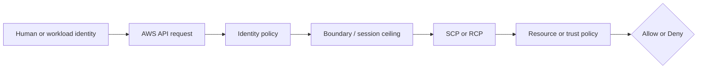

# Week 2 Exercise 9 [Core] — CI/CD federation with OIDC

This exercise is classified as **Core** in the Week 2 curriculum.

Complete the [shared Week 2 setup](../week2-setup.md) first. This exercise uses
a disposable lab account and an independent Terraform state key. It follows the
same safety model as Exercises 1 and 2: predict the decision, deploy the
smallest test fixture, run positive and negative tests, capture CloudTrail
evidence, and remove only disposable resources.

## Table of contents

- [Introduction](#introduction).
- [Learning objectives](#learning-objectives).
- [Terraform configuration and ownership](#terraform-configuration-and-ownership).
  - [Policy/resource excerpt](#policyresource-excerpt).
  - [Permissions-boundary excerpt](#permissions-boundary-excerpt).
- [Configure, initialize, and validate](#configure-initialize-and-validate).
- [GitHub OIDC workflow configuration](#github-oidc-workflow-configuration).
  - [Obtain the Exercise 9 IAM role ARN](#obtain-the-exercise-9-iam-role-arn).
  - [Create the GitHub Actions workflow](#create-the-github-actions-workflow).
  - [Store the IAM role ARN in GitHub](#store-the-iam-role-arn-in-github).
- [Execute the experiment](#execute-the-experiment).
- [Investigating in the Console](#investigating-in-the-console).
- [Evidence and security analysis](#evidence-and-security-analysis).
  - [Load the exercise role identifier](#load-the-exercise-role-identifier).
  - [Inspect the role trust policy](#inspect-the-role-trust-policy).
  - [Inspect the workload identity policy](#inspect-the-workload-identity-policy).
  - [Inspect the permissions boundary, when attached](#inspect-the-permissions-boundary-when-attached).
  - [Retrieve the OIDC success and failure events](#retrieve-the-oidc-success-and-failure-events).
  - [Retrieve the active CloudTrail event from the centralized evidence trail](#retrieve-the-active-cloudtrail-event-from-the-centralized-evidence-trail).
  - [Analyze the result](#analyze-the-result).
- [Clean up](#clean-up).
- [References](#references).

## Introduction

This exercise focuses on **external workload identity**. Its objective is to restrict AssumeRoleWithWebIdentity to an exact project subject. An Allow
in one policy is never the whole authorization decision; applicable SCPs,
boundaries, resource policies, trust policies, session context, and explicit
denies must also be considered.



## Learning objectives

- Explain the policy layer being tested and its limits.
- Predict both an allowed and a denied operation before running it.
- Avoid using management, Log Archive, or Security Tooling accounts.
- Attribute the result using CloudTrail and the effective policy set.
- Document residual risk and a production hardening measure.

## Terraform configuration and ownership

The configuration is in [`terraform/lab/week2/exercise9/main.tf`](../../../../terraform/lab/week2/exercise9/main.tf) and the other Terraform files in that directory. It has an
independent encrypted S3 backend key:

```text
lab/week2/exercise9/terraform.tfstate
```

It uses an IAM Identity Center-backed profile and restricts the AWS provider to
the configured disposable account ID with `allowed_account_ids`. The exercise configuration uses a shell environment file. Copy `.env.example`
to `.env`, replace any placeholders or values you want to customize, and keep
the copied file uncommitted. Never place access keys, tokens, or device codes
in the repository.

From the repository root, use this order before running Terraform:

```bash
source ~/.env/aws-security/terraform/.env
cp terraform/lab/week2/exercise9/.env.example terraform/lab/week2/exercise9/.env
# Edit the copied .env and replace placeholders or desired values.
# - If you use Github, just leave the provided thumbprint as is. Otherwise,
#   substitute the value with the thumbprint for your provider.
# - Likewise for the OIDC URL: if using Github, the current value works. Otherwise,
#   substitute with the appropriate URL for your provider.
# - For TF_VAR_oidc_subject, set the value to your desired repo and ref. Example:
#   export TF_VAR_oidc_subject="repo:yduchesne@1675989/aws-security@1339851610:ref:refs/heads/dev/oidc/main
# - See terraform/lab/week2/exercise9/.env.example for more details on the above variable value.
source terraform/lab/week2/exercise9/.env
```

The global environment must be sourced first because the exercise file refers
to shared values such as `TF_LAB_DEV_ACCOUNT_ID`, `TF_LAB_TEST_ACCOUNT_ID`,
`TF_MANAGEMENT_ACCOUNT_ID`, and `TF_HOME_REGION`.

The exercise state owns only resources under `/week2/exercise9/` and the
explicit fixture resources described by the objective. Existing Control Tower,
Identity Center, baseline, and `AWSReservedSSO_*` resources remain outside its
ownership boundary. The exercise role trusts only the configured OIDC provider
and exact subject; the deploying human uses `WorkloadLabAdministrator` only to
create and inspect the fixture. The Identity Center role suffix is not part of
the OIDC trust.

### Policy/resource excerpt

The generic fixture illustrates the intentionally narrow starting point:

```hcl
resource "aws_iam_role_policy" "exercise" {
  role = aws_iam_role.exercise.id
  name = "Exercise9Policy"
  policy = jsonencode({
    Version = "2012-10-17"
    Statement = [{
      Effect = "Allow"
      Action = ["sts:GetCallerIdentity"]
      Resource = "*"
    }]
  })
}
```

For the exercise-specific policy, inspect [`main.tf`](../../../../terraform/lab/week2/exercise9/main.tf) before applying and record
its principal, actions, resources, conditions, and any explicit denies. A
permissions boundary is a maximum, not a grant; a resource policy or trust
policy is not a substitute for an identity Allow.

#### Policy/resource analysis

This excerpt is the identity policy associated with the exercise role. Its
principal is the role itself, and its only Allow is the harmless
`sts:GetCallerIdentity` action on all resources. It is intended to permit
identity verification, not access to arbitrary workload resources. It does not
trust any principal; trust is defined separately by the role's assume-role
policy. It intentionally contains no explicit Deny, so the absence of an Allow
for other actions produces an implicit deny. The wildcard resource is a weak
point for readability, although this identity-verification action does not
provide a narrower resource scope. Always compare this excerpt with the role
trust policy and the complete declaration in [`main.tf`](../../../../terraform/lab/week2/exercise9/main.tf).

### Permissions-boundary excerpt

The authoritative boundary declaration is
[`workload-lab-role-boundary.json.tftpl`](../../../../terraform/lab/week2/baseline/policies/workload-lab-role-boundary.json.tftpl).
The following excerpt is taken from the original policy JSON template; its
`${partition}`, `${dev_lab_account_id}`, `${test_lab_account_id}`, and
`${lab_bucket_name_prefix}` values are rendered by the baseline Terraform root:

```json
{
  "Version": "2012-10-17",
  "Statement": [
    {
      "Sid": "AllowAssumingBoundedWeekTwoRoles",
      "Effect": "Allow",
      "Action": "sts:AssumeRole",
      "Resource": [
        "arn:${partition}:iam::${dev_lab_account_id}:role/week2/*",
        "arn:${partition}:iam::${test_lab_account_id}:role/week2/*"
      ]
    },
    {
      "Sid": "AllowReadCurrentIdentity",
      "Effect": "Allow",
      "Action": "sts:GetCallerIdentity",
      "Resource": "*"
    },
    {
      "Sid": "AllowWeekTwoLabBucketAccess",
      "Effect": "Allow",
      "Action": [
        "s3:GetBucketLocation",
        "s3:ListBucket",
        "s3:ListBucketVersions",
        "s3:GetObject",
        "s3:GetObjectVersion",
        "s3:PutObject",
        "s3:DeleteObject",
        "s3:DeleteObjectVersion"
      ],
      "Resource": [
        "arn:${partition}:s3:::${lab_bucket_name_prefix}*",
        "arn:${partition}:s3:::${lab_bucket_name_prefix}*/*"
      ]
    }
  ]
}
```

This is a permissions boundary, so it defines a maximum-permissions ceiling;
it does not grant these actions by itself. An identity policy must also allow
an operation, and applicable SCPs, session policies, resource policies, trust
policies, and explicit denies remain additional constraints. The policy is
owned by the baseline Terraform root. Do not edit, import, replace, or destroy
it from this exercise.

#### Boundary analysis

This boundary is associated with any role to which the baseline attaches it.
It allows only the listed `sts:AssumeRole`, identity-verification, and Week 2
S3 operations within the two lab accounts and configured bucket prefix. It
intentionally does not allow arbitrary IAM administration, user or access-key
management, managed-policy creation, or unrestricted access to other services.
Its weak point is that the ceiling still permits the listed role and S3 actions
when a separate identity policy grants them; a boundary cannot prevent an
identity policy from granting an action that the boundary allows. The baseline
owner must therefore protect both the boundary and the policies attached to
bounded roles.


## Configure, initialize, and validate

Authenticate the configured IAM Identity Center profile and verify the account. See [`sso_auth.md`](../../../sso_auth.md) for user enablement, MFA, browser isolation, and CLI login guidance. For the Exercise 1 test users, use the **Create the AWS CLI profiles** section of [`exercise1-instructions.md`](../exercise1/exercise1-instructions.md).

```bash
aws sso login --profile "$TF_VAR_source_aws_profile" --use-device-code --no-browser
aws sts get-caller-identity --profile "$TF_VAR_source_aws_profile"
terraform -chdir=terraform/lab/week2/exercise9 init \
  -backend-config="bucket=$TF_STATE_BUCKET" \
  -backend-config="region=$TF_STATE_REGION" \
  -backend-config="profile=$TF_STATE_PROFILE"
terraform -chdir=terraform/lab/week2/exercise9 validate
terraform -chdir=terraform/lab/week2/exercise9 plan
```

Review the plan before applying. It must not modify organizational governance,
Control Tower resources, Identity Center resources, or unrelated accounts.
Stop for unexplained replacements or deletions.

## GitHub OIDC workflow configuration

Complete the following setup after the validation plan has been reviewed. The
IAM role ARN is not available until the Exercise 9 Terraform root has been
applied.

### Obtain the Exercise 9 IAM role ARN

Apply only the reviewed Exercise 9 plan:

```bash
terraform -chdir=terraform/lab/week2/exercise9 apply
```

Retrieve the authoritative role ARN from Terraform state:

```bash
export EXERCISE9_ROLE_ARN="$(terraform -chdir=terraform/lab/week2/exercise9 output -raw role_arn)"
echo "Exercise 9 role ARN is configured: ${EXERCISE9_ROLE_ARN:+yes}"
```

The value must be an IAM role ARN similar to:

```text
arn:aws:iam::046843662780:role/week2/exercise9/Week2Exercise9Role
```

Do not manually reconstruct the ARN and do not put AWS access keys, OIDC JWTs,
or temporary AWS credentials in the repository.

### Create the GitHub Actions workflow

Create this file in the GitHub repository:

```text
.github/workflows/exercise9-oidc.yml
```

The `on.push.branches` value must match the branch represented by
`TF_VAR_oidc_subject`. For example, if the subject is:

```text
repo:ORG/REPOSITORY:ref:refs/heads/main
```

then the workflow must use:

```yaml
on:
  push:
    branches:
      - main
```

Replace `ORG/REPOSITORY` in the subject with the actual GitHub organization and
repository, and replace `main` with the actual trusted branch. The branch name
is part of the signed `sub` claim; it is not merely a workflow filter.

Copy and adjust this workflow:

```yaml
name: Exercise 9 GitHub OIDC

on:
  push:
    branches:
      - main # Must match refs/heads/<branch> in TF_VAR_oidc_subject.

permissions:
  id-token: write
  contents: read

jobs:
  oidc-positive:
    runs-on: ubuntu-latest

    steps:
      - name: Check out repository
        uses: actions/checkout@v4

      - name: Configure AWS credentials with GitHub OIDC
        uses: aws-actions/configure-aws-credentials@v4
        with:
          role-to-assume: ${{ vars.EXERCISE9_ROLE_ARN }}
          aws-region: us-east-2
          role-session-name: exercise9-github-positive

      - name: Verify the federated identity
        run: aws sts get-caller-identity --no-cli-pager
```

Adjust these values before committing the workflow:

- `main` must match the branch in the configured OIDC subject.
- `us-east-2` must match the Exercise 9 AWS Region.
- `vars.EXERCISE9_ROLE_ARN` must refer to the GitHub Actions variable created
  below.
- The repository and organization must match the exact `sub` claim configured
  in `TF_VAR_oidc_subject`.

The workflow must retain:

```yaml
permissions:
  id-token: write
```

Without `id-token: write`, GitHub will not issue an OIDC token. This permission
only permits token issuance; AWS still evaluates the IAM OIDC provider, role
trust policy, subject, audience, identity policy, boundary, and SCPs.

For a full example, see [this configuration](https://github.com/yduchesne/aws-security/blob/dev/oidc/main/.github/workflows/exercise9-oidc.yml).

### Store the IAM role ARN in GitHub

The role ARN is not a secret, so store it as a GitHub Actions variable rather
than as an AWS credential or OIDC token.

In the GitHub web interface, open:

```text
Repository → Settings → Secrets and variables → Actions → Variables
```

Create a repository variable with:

```text
Name:  EXERCISE9_ROLE_ARN
Value: <the output of terraform output -raw role_arn>
```

Alternatively, with GitHub CLI authenticated to the target repository (replace `ORG` and `REPOSITORY`
according to your setup).

```bash
gh variable set EXERCISE9_ROLE_ARN \
  --repo ORG/REPOSITORY \
  --body "$EXERCISE9_ROLE_ARN"
```

For a protected GitHub Environment, use an environment-scoped variable and
make the workflow job declare that environment:

```bash
gh variable set EXERCISE9_ROLE_ARN \
  --repo ORG/REPOSITORY \
  --env production \
  --body "$EXERCISE9_ROLE_ARN"
```

```yaml
jobs:
  oidc-positive:
    environment: production
```

Use an environment when deployment approvals, protected branches, or reviewers
are part of the control. The environment name itself changes the GitHub OIDC
subject when the subject format uses an environment claim, for example:

```text
repo:ORG/REPOSITORY:environment:production
```

Verify that the repository variable is configured without printing its value in
workflow logs:

```yaml
- name: Verify role variable is configured
  shell: bash
  env:
    EXERCISE9_ROLE_ARN: ${{ vars.EXERCISE9_ROLE_ARN }}
  run: |
    set -euo pipefail
    test -n "$EXERCISE9_ROLE_ARN"
    case "$EXERCISE9_ROLE_ARN" in
      arn:aws:iam::*:role/*) ;;
      *) echo "EXERCISE9_ROLE_ARN is not a valid IAM role ARN" >&2; exit 1 ;;
    esac
    echo "EXERCISE9_ROLE_ARN is configured"
```

## Execute the experiment

The reviewed Terraform plan was applied in the preceding setup section. Confirm
the role ARN before running the workflow tests:

```bash
echo "role_arn: $EXERCISE9_ROLE_ARN"
```

Then, proceed as follows:

1. Push a change to the branch that your workflow is hooked to
   (if your branch doesn't accept direct pushes, create a PR and
   merge it).
2. Got to your GitHub repo > Actions. Check that your workflow completes
   as expected (if not, investigate and fix).

## Investigating in the Console

Use IAM Identity Center access-portal sessions, not IAM user keys. Verify the
account ID in the console account menu before inspecting anything.

1. Open **IAM** and inspect the exercise role under `/week2/exercise9/`.
2. Review its trust relationship, identity policies, tags, and permissions
   boundary where present.
3. Open the relevant resource service and verify the resource ARN, tags,
   ownership controls, or resource policy.
4. In **CloudTrail → Event history**, filter for the API action under test and
   compare the principal, resource, request parameters, and error code.
5. From an approved management-account session, inspect inherited SCPs without
   modifying them.

Console list pages can require permissions outside a deliberately narrow lab
role. An `AccessDenied` from a page is not evidence that the security policy
should be broadened; use a read-only inspection session or the CLI instead.

## Evidence and security analysis

Record the exact expected decision before each test. Explain the result using
this order:

```text
Explicit deny → SCP/RCP → identity policy → boundary/session policy
             → resource/trust policy → conditions → effective result
```

The Terraform fixture creates the role, its OIDC provider, and its identity
policy, but it does not mint an external web-identity token. Complete the token
prerequisites described in **Execute the experiment** before treating an
`AssumeRoleWithWebIdentity` test as valid. Do not substitute an ordinary
`AssumeRole` call: it exercises a different trust action.

### Load the exercise role identifier

```bash
export EXERCISE9_ROLE_ARN="$(terraform -chdir=terraform/lab/week2/exercise9 output -raw role_arn)"
export EXERCISE9_ROLE_NAME="${EXERCISE9_ROLE_ARN##*/}"
echo "role_arn: $EXERCISE9_ROLE_ARN"
```

Confirm that the ARN identifies the disposable Exercise 9 role in the source
account and that the role name is not an existing Control Tower or
`AWSReservedSSO_*` role.

### Inspect the role trust policy

```bash
aws iam get-role \
  --profile "$TF_VAR_source_aws_profile" \
  --role-name "$EXERCISE9_ROLE_NAME" \
  --query 'Role.{Arn:Arn,Trust:AssumeRolePolicyDocument,Boundary:PermissionsBoundary.PermissionsBoundaryArn,Path:Path}' \
  --output json \
  --no-cli-pager
```

For the implemented OIDC version, look for a federated principal naming the
intended OIDC provider, `sts:AssumeRoleWithWebIdentity`, an audience condition
of `sts.amazonaws.com`, and an exact subject condition equal to
`TF_VAR_oidc_subject`. The negative test must differ only in the subject and
must be rejected. The provider and exact claim conditions are the evidence of the OIDC trust
boundary; a human-principal trust is not an equivalent substitute.

### Inspect the workload identity policy

```bash
aws iam get-role-policy \
  --profile "$TF_VAR_source_aws_profile" \
  --role-name "$EXERCISE9_ROLE_NAME" \
  --policy-name Exercise9Policy \
  --query PolicyDocument \
  --output json \
  --no-cli-pager
```

Look for only the deliberate `sts:GetCallerIdentity` Allow. This policy grants
identity verification after assumption; it does not authorize the trust
operation. Do not infer successful federation from this identity policy.

### Inspect the permissions boundary, when attached

```bash
aws iam get-role \
  --profile "$TF_VAR_source_aws_profile" \
  --role-name "$EXERCISE9_ROLE_NAME" \
  --query 'Role.PermissionsBoundary.PermissionsBoundaryArn' \
  --output text \
  --no-cli-pager
```

If a boundary ARN is returned, retrieve its active policy version with an
approved IAM inspection profile. Confirm that the boundary is a ceiling and
not the grant that permits web identity assumption. If the result is `None`,
record that the scaffold has no boundary and do not claim boundary evidence.

### Retrieve the OIDC success and failure events

```bash
aws cloudtrail lookup-events \
  --profile "$TF_VAR_source_aws_profile" \
  --region "$TF_HOME_REGION" \
  --lookup-attributes AttributeKey=EventName,AttributeValue=AssumeRoleWithWebIdentity \
  --query 'Events[].{Time:EventTime,EventId:EventId,Username:Username,Event:CloudTrailEvent}' \
  --output json \
  --no-cli-pager
```

Filter the returned JSON for `EXERCISE9_ROLE_ARN`, the OIDC provider, the
expected subject, and the test time. A successful event must identify the
intended role session and have no error code. The negative event must identify
the same role and provider but show `AccessDenied` or the documented STS
validation error caused by the incorrect subject. An `AssumeRole` event is not
evidence for this exercise.

### Retrieve the active CloudTrail event from the centralized evidence trail

The OIDC federation event is a CloudTrail management event, so the preceding
`lookup-events` command is authoritative for the event history. If the event
is outside the Event History retention window, retrieve the centralized log
using the complete account-prefix, delivered-directory, download, and filter
workflow documented in [`cloud-trail-logs.md`](../../../cloud-trail-logs.md).
This scaffold does not currently create an S3 data-event fixture, so do not
claim an S3 evidence object for Exercise 9.

### Analyze the result

Compare the positive and negative events in a table containing the provider,
audience, subject, role ARN, event ID, error code, and final decision. Explain
that the exact-subject condition is the trust-policy control, while the role
identity policy only controls what an already authenticated role session may
request. Discuss the residual risk of trusting a mutable or overly broad
subject pattern and the production control of pinning repository, workflow, or
branch claims according to the CI/CD provider's documented claims.

## Clean up

Preserve redacted evidence, then review and execute only the exercise destroy:

```bash
terraform -chdir=terraform/lab/week2/exercise9 plan -destroy
terraform -chdir=terraform/lab/week2/exercise9 destroy
```

Never destroy the Week 2 baseline boundary, Control Tower resources, Identity
Center assignments, or another exercise's state. Confirm the state key is
empty, remove temporary access, and verify `git status` before committing.

## References

- [IAM policy evaluation logic](https://docs.aws.amazon.com/IAM/latest/UserGuide/reference_policies_evaluation-logic.html).
- [IAM permissions boundaries](https://docs.aws.amazon.com/IAM/latest/UserGuide/access_policies_boundaries.html).
- [IAM roles and trust policies](https://docs.aws.amazon.com/IAM/latest/UserGuide/id_roles.html).
- [IAM Identity Center](https://docs.aws.amazon.com/singlesignon/latest/userguide/what-is.html).
- [AWS CloudTrail event history](https://docs.aws.amazon.com/awscloudtrail/latest/userguide/view-cloudtrail-events.html).
- [AWS STS](https://docs.aws.amazon.com/STS/latest/APIReference/welcome.html).
- [AWS IAM service authorization reference](https://docs.aws.amazon.com/service-authorization/latest/reference/reference_policies_actions-resources-contextkeys.html).
